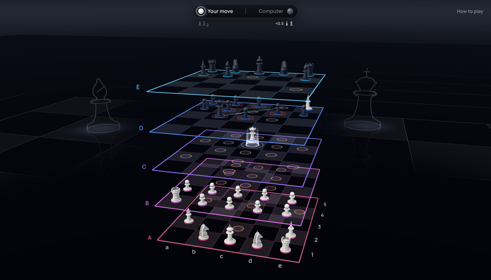

# 3D Chess

Chess in three dimensions, on a 5×5×5 board.

[](https://3dchess.club)

**[Play at 3dchess.club →](https://3dchess.club)**

- **Against a friend:** pick a side and send them the game's link
- **Against the computer:** Easy, Medium or Hard, running in your browser
- **[Tutorial](https://3dchess.club/learn):** a short lesson on each piece's moves

## Rules

- **Board:** levels A–E (bottom to top), files a–e, ranks 1–5
- **Rook:** a straight line, in any of 6 directions
- **Bishop:** a diagonal across two axes at once
- **Unicorn** (new): a diagonal across all three axes
- **Queen:** rook, bishop or unicorn. **King:** one step in any of those directions
- **Knight:** an L (2 + 1) in any plane, jumping
- **Pawn:** one step forward or up. Captures forward-up, forward-sideways or up-sideways. Promotes on the last rank of the top level
- No castling, double first step or en passant
- Checkmate, stalemate, threefold repetition and the fifty-move rule as usual

## Built with

- React, three.js and react-three-fiber
- A small FastAPI WebSocket relay on [Modal](https://modal.com)
- The computer player is an alpha-beta search in a web worker, so it runs in your browser

## Development

```bash
cd client && npm ci && npm run dev            # http://localhost:5173, against the live server
cd client && npm run test && npm run e2e      # unit tests, then Playwright
uv run --project server pytest                # server tests
cd client && node scripts/readme-image.mjs    # re-render docs/preview.jpg
```

- Design, protocol and internals: [ARCHITECTURE.md](ARCHITECTURE.md)
- [MIT License](LICENSE)
