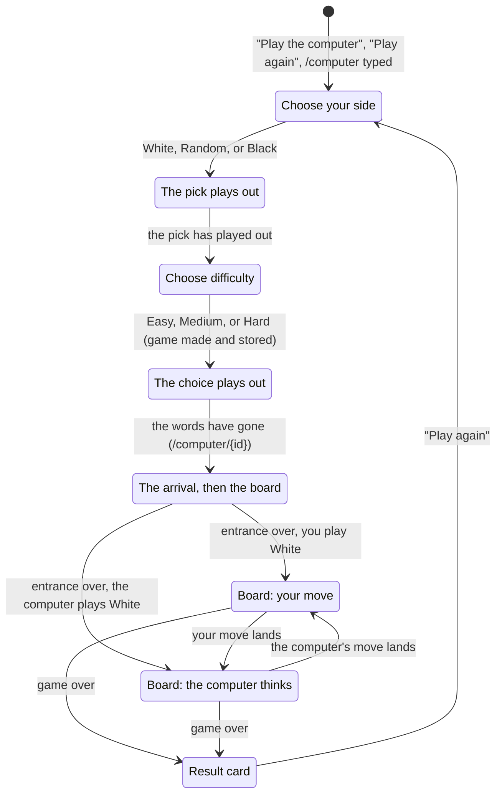

# Playing the computer

## Summary

Playing the computer turns a choice of side and difficulty into a game against a computer player that runs in the player's own browser. It begins on the [home page](../start/the-home-page.md) with "Play the computer", which opens the side choice at `/computer`: the same three kings as for a game against a friend ([creating a game](../start/creating-a-game.md#the-side-choice)), followed on the same page by a second step, "Choose difficulty": Easy, Medium, or Hard. Choosing a difficulty is the request. It makes the game on the spot, in the browser, and the page moves on to the game at `/computer/{id}`, where the computer takes its seat in the lobby's [arrival](../glossary.md#the-product-and-its-screens) and the board's entrance plays. No server is asked, at any point: the browser answers the game page's requests itself, as the server would, and keeps the game in its own storage after every move, so a reload comes back to it, and the game plays without a network once the page has loaded. Everything on the board screen (moves, promotion, check, the draws, the result card, the HUD) works as in a game against a friend; this document owns what differs.

## The simple case

The player clicks "Play the computer" on the home page. The address becomes `/computer` and the lobby opens exactly as the side choice for a friend's game does: "Choose your side" over the porcelain king, the split king, and the charcoal king, with "White", "Random", and "Black" under them.

The player clicks "Black". The chosen king is set down on its square in its ring and column of light, and the other two fade where they stand; the heading stays "Choose your side" for the moment. A third of a second later the page moves to its second step without leaving the address: the heading becomes "Choose difficulty", the side buttons fade away, and the computer's seat across from the player's opens, its outline drawn up from the foot in neon and then breathing, while three tiles rise in one after another under the kings, where the side buttons were. Each tile is the home page's dark glass, with the computer's small robot beside its strength, one bar to three in the tower's colors from the top down (sky, violet, rose), and the name: "Easy", "Medium", "Hard". The tile last played has keyboard focus ("Medium" the first time).

The player clicks "Hard". At once the computer's king fills with its material on the glass, the chosen tile holds a moment while the other two fade, and then the page's words ("← Home", the heading, the tiles) go. As they finish going, the address becomes `/computer/{id}` (replacing `/computer` in the history), and the page opens straight on the arrival: a ring of light spreads across the glass from the computer's king, a single line takes the heading's place, "Computer · Hard", both kings' columns of light come on, and the two lift together. Then the lobby leaves exactly as for a friend's game ([waiting for an opponent](../start/waiting-for-an-opponent.md#the-answer-arrives)) and the board's entrance builds the tower up from level A while the armies form.

The board screen is the ordinary one: the turn pill calls the opponent "Computer" ("Their move" on its turn), and the player's board is [oriented](../foundations/the-view.md#orientation) for Black. White is the computer, so once the entrance is over the computer thinks for a moment, a second or so, and plays its first move, which glides in like any opponent's. The player answers by pressing a piece and a destination ([making a move](../play/making-a-move.md)): the move lands at once, since there is no server to wait for, and the computer thinks again.

## The interaction, event by event

### Begin

The side choice at `/computer` opens with the lobby's entrance, like the side choice for a friend's game, and the side is picked the same way, by a button or a king (see [creating a game](../start/creating-a-game.md#the-side-choice)). Random is decided by the page's coin at the pick, as there. Unlike there, nothing is sent at the pick, the heading stays "Choose your side" after a named pick, and the line at the bottom never speaks of the server.

Once the pick has played out (0.3 seconds after a named pick, or after the coin has come to rest), the second step begins on the same page: "Choose difficulty" and the three tiles. The tile last chosen in this browser has keyboard focus; the first time, "Medium". Choosing a tile (a click, a tap, or Enter or Space) is the request's begin. At that instant the game is made: a new id is drawn, the game (the player's side, the difficulty, no moves) is written to the browser's storage, the player's [stored seat](../foundations/connection-and-seat.md#the-stored-seat) for it is written, and the difficulty is remembered for next time.

### End without sending

Until a difficulty is chosen, nothing is made and nothing is kept: a player who leaves the side choice ("← Home", Back, closing the tab) leaves no trace. A side, once picked, cannot be taken back on the page; leaving and coming back is the only way to pick again.

### Send

Nothing is sent to any server. The request goes to the browser's own stand-in for the server, which answers at once. From the choice of difficulty on, the game exists in this browser.

### While in flight

The choice plays out on the page: the computer's king fills on the glass at once (its seat taken), the chosen tile holds a moment while the others fade, and then "← Home", the heading, and the tiles go. The tiles are disabled from the choice on. When the page's words have finished going, the address changes to `/computer/{id}`; under reduced motion it changes at once.

### The answer arrives

The game's page opens on the game already under way: it holds its seat from its first moment, and the computer sits down at once. When the page was opened from the side choice, still on the lobby's stage, it plays the computer's arrival over it ("Computer · Easy", "Computer · Medium", or "Computer · Hard" in the heading's place), then the handover and the board's entrance from level A, as a friend's game does. Opened any other way (a reload, Back or Forward, the tutorial's "← Game", a bookmark), it opens on the game itself with the short entrance.

The computer does not move until the entrance is over, so its first move as White lands on a board in play.

## The game against the computer

**Your move.** The player moves exactly as against a friend, by pressing or by typing in the move box. The move is answered at once: it lands, glides, and the turn passes, with no wait for an echo. The browser checks the move against the rules before accepting it (unlike the server, which checks only whose turn it is); a correct page never sends an illegal move, so this is never seen.

**The computer's move.** Whenever it is the computer's turn, it thinks, in the background, so the board keeps turning and animating meanwhile, and its move arrives after a pause that feels human, counted from when it started thinking: about half a second for a forced move, under a second for an obvious one (a recapture, or a move far better than any other), quicker in the first eight moves of the game, and otherwise 0.65 to 1.35 times one second (Easy), 1.4 seconds (Medium), or 1.7 seconds (Hard). Its move lands like an opponent's ([the opponent's move](../play/the-opponents-move.md)). Nothing on screen says that it is thinking beyond the turn pill's lit half. Should its thinking fail, it plays a legal move all the same.

**The difficulties.** Easy looks two moves ahead (its own and the reply), misjudges freely, often plays a move other than its best, and overlooks half of the moves that are hard to see on five levels (a knight's jump to another level, or a long move across levels), so it hangs pieces and misses captures. Medium looks a move further, judges better, and overlooks about one such move in five. Hard thinks for up to 1.8 seconds as deep as that goes, sees everything, and varies only among moves about as good as each other. Every difficulty plays its first eight moves a little more freely, so no two games open alike. All three always take a mate when there is one, never walk into one while there is another move, and play by the draws: ahead, the computer presses on rather than drift into one; behind, it takes a repetition when one is offered.

**Resigning and draws.** The [game menu](../play/resigning-and-draws.md) works as against a friend. A resignation is answered at once. The computer never offers a draw. Offered one, it drops any move it was thinking over, weighs the position up (a plain look of up to 0.4 seconds, as Hard sees it, without any level's deliberate mistakes) and answers 0.9 seconds after the offer: it accepts only when it stands clearly worse, by about a minor piece and a half or more by its own reckoning, the same at every difficulty; otherwise, or if it could not weigh the position up, it declines ("Draw declined") and plays on. A move the player makes before the answer cancels the offer. See [resigning and draws](../play/resigning-and-draws.md#against-the-computer).

**The end.** The game ends as any game does ([check and the end of the game](../play/check-and-game-end.md)), or by the player's resignation or a draw the computer accepted; the result card's "Play again" leads back to `/computer`.

**Kept in the browser.** The game (side, difficulty, every move, and a resignation, an agreed draw, or the latest draw offer) is written to the browser's local storage after every move, and nowhere else. A reload, or coming back to its address later, opens the game as it stands, with the computer thinking again if it was its turn. Where the browser refuses storage, the game still plays for as long as the page stays open; a reload loses it. It cannot be opened in another browser or on another device, and clearing the site's data ends it.

**No game here.** An address `/computer/{id}` for a game this browser does not hold shows the lobby's card "No game here" with "Play the computer", which leads to the side choice at `/computer`.

## Modifiers

| Modifier | At the start | Changes while in flight |
| --- | --- | --- |
| Your color | The player picks it, or Random's coin does. The computer takes the other. | Cannot change. |
| Whose turn it is | White moves first: the player, or the computer once the entrance is over. | Each move passes the turn; the computer starts thinking as soon as its turn begins. |
| How you reached the page | From the side choice: the arrival over the lobby, then the board. Any other way to `/computer/{id}`: the board with the short entrance, or "No game here" for a game this browser does not hold. | Not applicable. |
| Connection state | Never shown, never matters: the game page's stand-in for the server is always connected and never drops. The tab's own connection to the server may be down without any effect. | No effect. |
| Game state | A new game is in progress from the start. A reopened game may be over (the result card shows at once) or frozen. | The game can end on either side's move. |
| Shift, Ctrl, or Cmd held | No effect. The tiles are buttons, not links. | No effect. |
| Input device | As against a friend. On the second step Tab reaches the three tiles; the one last played has focus. | No effect; the tiles are disabled once one is chosen. |

Reduced motion: the kings and the tiles appear and go in a fraction of a second, the computer's seat does not breathe, the page moves on to the game the moment a difficulty is chosen, the arrival's beats each take a fraction of a second, and the board's entrance is a plain fade.

## Cancel and interrupt

"Before sending" is the side choice and the difficulty choice; "while in flight" is from the choice of difficulty to the game's first move, and, in play, the computer's thinking.

| Event | Before sending | While in flight |
| --- | --- | --- |
| Escape or Cancel | No effect. There is no Cancel. | No effect. The computer's move cannot be stopped. |
| Pressing elsewhere or turning the view | On the side choice, clicking the glass does nothing and the view cannot be turned. | On the board, the view can be turned while the computer thinks, and pieces can be pressed; none of the player's can be picked up on the computer's turn. |
| Leaving the game page within the app | "← Home" or Back leaves; nothing was made. | Leaving while the choice plays out: the game has already been made and stored, and its address is in no history entry yet; it can be reached only by typing its address. Leaving the board ("How to play", Back, "Play again") stops the computer's thinking; the game waits in storage, and on return the computer thinks afresh. |
| The game ends | Not applicable. | The result card covers the board; the computer stops. |
| The server answers with an error | Not applicable: no server. | The browser's stand-in can refuse a move ("Not your turn", "Illegal move"), which a correct page never sends; the refusal would show in the [error banner](../game-page/error-banner.md). |
| The connection drops | No effect. | No effect: the game never uses the connection. |
| The window loses focus or the tab is hidden | No effect. | The computer still decides its move in a hidden tab; the move lands, and its glide plays when the tab is shown again. |
| Reload or closing the tab | Before a difficulty is chosen: nothing kept. After: the game is kept, and reopening its address resumes it. | The computer's move in progress is lost, but nothing was recorded; on return it thinks again. |
| The opponent acts | The computer is the opponent; it does nothing before the game exists. | Its move lands; see [the opponent's move](../play/the-opponents-move.md). |
| Another tab takes the seat | Not applicable: there is no seat to take. | Two tabs on the same game each play their own copy of it from storage; see the edge cases. |
| A second touch point or a cancelled touch | No effect. | No effect. |

## Interactions with other systems

**Seat and turn.** The player's side is kept with the game; the computer always has the other. Nothing else decides the seat: there is no rejoin, no take-over, and no replaced dialog.

**The game record.** The record is the browser's own copy, written after every move. The server never sees it. The position, the turn, and the end of the game are derived from it exactly as for a game against a friend.

**Connection.** None. The pill never shows "Offline", "Reconnecting…" never appears, and the game plays with no network once the page and its game code have loaded (the code is fetched while the player is on the side choice).

**The opponent.** The computer, named "Computer" on the turn pill. It is always present.

**Other tabs and devices.** The game lives in this browser only. A second tab on the same address loads the game as it was then and plays on its own; whichever tab moves last overwrites the stored game.

**Game over.** As against a friend: the result card, then "Play again" to `/computer`, with the last difficulty focused.

**Stored seat.** Written with the game, though nothing uses it; the game's own copy carries the side.

**Keyboard, touch, and screen size.** The tiles are reached with Tab and pressed with Enter or Space; the last-played difficulty has focus. On a phone on its side the tiles are shorter, the robot beside the name. Everything on the board screen is as against a friend.

## Edge cases

- **Two tabs, one game.** Each tab plays its own copy of the game from storage, and each move a tab makes overwrites the stored game with that tab's copy; reloading either shows whichever tab moved last. Nothing warns the player. See the open questions.
- **Leaving while the choice plays out.** A game chosen and then abandoned before its page opened stays in storage under an address the player never saw.
- **Storage refused.** The game plays for the visit; a reload says "No game here".
- **The difficulty remembered.** The last difficulty chosen is focused next time, in any later visit, until the site's data is cleared.
- **Ids.** A computer game's id is ten lower-case letters and digits, never one a server game could have.
- **The crash screen's sentence** speaks of the server, which a computer game never uses.

## Open questions and verification

- Read from `client/src/screens/lobby/ChooseSide.tsx` (the second step, `pickLevel`), `client/src/screens/ComputerGameScreen.tsx`, `client/src/hooks/useComputerGame.ts`, `client/src/game/computerGame.ts`, `client/src/lib/computerGames.ts`, `client/src/ai/levels.ts` (`LEVELS`, `thinkTime`), `client/src/ai/computer.ts`, `client/src/screens/GameScreen.tsx` (the computer's arrival and caption), `ARCHITECTURE.md` ("Playing the computer"), and `client/src/screens/ComputerGameScreen.test.tsx`, `client/e2e/computer.spec.ts` at `b325641`; not checked in the running app for this refresh.
- The computer's answer to a draw offer (`answerDrawOffer` and `ACCEPTS_DRAW_AT` in `client/src/game/computerGame.ts`, `DRAW_ANSWER_MS` in `client/src/hooks/useComputerGame.ts`, `assessPosition` in `client/src/ai/choose.ts`) is read from code and its tests; how often a player finds it accepting in practice was not tried.
- Two tabs on one computer game overwrite each other's stored copy without warning ([bug triage](../bug-triage.md) B-24). Read from code (`loadComputerGame` once per page, `saveComputerGame` after every move); not tried.
- The strengths described are the code's settings and `ARCHITECTURE.md`'s self-play results (Medium beat Easy 18–0, Hard beat Medium 16–0), not a player's experience.

Drafted against 3D Chess commit `b325641`
