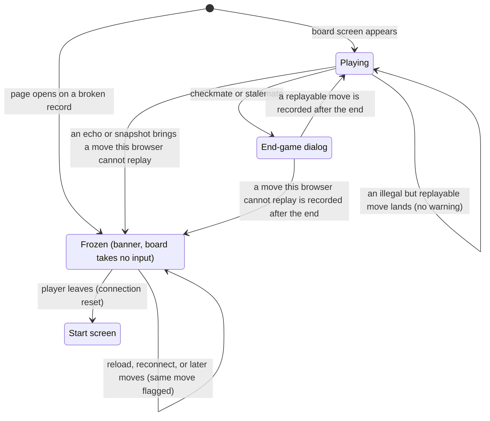

# The broken game record

## Summary

The server records any move that is well formed and made in turn. It does not check that the origin holds a piece, that the move is legal, or that the game is still in progress. The app only ever offers legal moves, so in ordinary play every move in the [move record](../glossary.md#games-and-seats) is one the player's browser can replay. This document describes what a player running the app sees when the record holds a move their browser cannot replay: the board [freezes](../glossary.md#selection-and-board-state) at the last position it could reach, a red banner explains, and the game can neither continue nor be repaired. It also covers the moves the browser replays without any warning even though they are illegal, and the rest of what the server takes on trust: who holds a seat, and whether the game is over. How to produce such a record is out of scope (see the [scope decisions](../README.md#scope-decisions)); what the honest player sees is not.

## The simple case

White and Black are partway through a game. Black's browser is running something other than the app at this commit: a modified client, or a version of the app with different rules. For Black's sixth move it sends a move from a cell where Black has no piece. The server checks only that it is Black's turn, records the move, passes the turn to White, and sends the [echo](../glossary.md#requests) to both players.

On White's board nothing moves. There is no glide, the teal [last-move trace](../glossary.md#selection-and-board-state) stays on White's last move, and the turn indicator still reads "Black to move". A red box appears below the row of panels at the top of the window: "Move 12 in this game's history is not a legal move for this client (likely an app version mismatch). The board is frozen at the position before it." The move list gains Black's move as the second half of row 6, exactly as the server recorded it. Nothing of White's can be selected, the move box's "Move" button stays disabled, and nothing will ever change: the server is waiting for White's move, and White's board does not take input.

White reloads the page. The board comes back at the same position with the same banner. White can turn the view, scroll the move list, and leave for the start screen. There is nothing else to do.

## What the server takes on trust

The server is built for games among friends who all run the app; the repository's top-level README states it under "Scope and trust assumptions": the server validates message shape and turn order, not move legality, and a seat can be claimed with only the game id and a color. Three things follow for the player.

### Moves

For each move the server checks only that it names two cells from `Aa1` to `Ee5`, that any promotion letter is one of Q, R, B, N, or U, that the connection holds a seat in a game with both seats taken, and that it is that seat's turn (see [who enforces the rules](../foundations/game-rules.md#who-enforces-the-rules)). It does not check that the origin holds a piece, that the piece belongs to the mover, that the piece can move that way, that the mover's King is left safe, that no King is captured, or that the game has not already ended. It appends the move, passes the turn, and relays the echo.

Each browser then replays the whole record from the starting position. What it does with a move depends only on whether the move can be applied, not on whether it is legal:

| The move record holds | This browser |
| --- | --- |
| A move from a cell with no piece on it | Cannot replay it. The board freezes before it. |
| A pawn, of either color, moving onto its own color's [promotion square](../glossary.md#moves-and-the-rules) without a promotion letter | Cannot replay it. The board freezes before it. |
| A promotion letter on any other move: a piece other than a pawn, or a pawn landing anywhere but its own color's promotion square | Cannot replay it. The board freezes before it. |
| A move that captures a King, of either color | Cannot replay it: the rules cannot judge a position without both Kings. The board freezes before it. |
| Any other move, legal or not: a Knight landing on a cell no Knight can reach, a Rook passing through pieces, a move of the other side's piece, a capture of one of the mover's own pieces other than its King, a move that leaves the mover's own King in check, a move to the cell it started from | Replays it and shows it like a legal move: the piece [glides](../foundations/the-view.md#motion), the move is listed, and the turn passes. No warning of any kind. |
| A move after checkmate or stalemate | Replays it if it can. Whether the game is over is decided again from the new final position; see [the end of the game](#the-end-of-the-game). |

The banner says the move "is not a legal move for this client", but replay does not check legality at all. Every move it flags is one that cannot occur in a legal game, but most illegal moves are not flagged: an impossible Knight jump, a move while in check that ignores the check, or a piece moved for the wrong side replays without complaint, and the game carries on from whatever position it produces. The only sign may be the position itself, or a King glowing red when it is not its side's turn.

### Seats

A [rejoin](../foundations/connection-and-seat.md#rejoining) needs only the game id and a color; there is no secret. The id is in the share link, which the player has sent to at least one person, and there are only two colors. The app rejoins only with the browser's own [stored seat](../foundations/connection-and-seat.md#the-stored-seat), but a modified client can rejoin either seat of any game whose id it knows, without ever having joined. The [client id](../glossary.md#requests) the app sends with each request does not protect a seat: the server uses it only to recognize a tab's own repeated join and its own stale connection, and a rejoin that asks to [take over](../glossary.md#the-connection), or says nothing about it, gets the seat regardless.

Because the [last connection wins](../foundations/connection-and-seat.md#last-connection-wins), the player who held the seat is disconnected and sees the [replaced dialog](../session/second-tab.md): "This game is open in another tab", "Your seat moved to the newer tab or window. Close this one, or take the game back here." The text assumes the new connection is the player's own, although it may be on someone else's computer. "Play here" takes the seat back, and the other side can take it again the same way, without limit. A player whose own connection happens to drop while someone else holds their seat does not take it back on reconnecting: the server answers that the seat is in use, and the page shows the same dialog. While a modified client holds a player's seat it can move in their name; the player sees those moves after "Play here", in place and indistinguishable from their own. The opponent sees only "Opponent: online". Nothing on the game page shows who holds a seat.

### The end of the game

The server never learns that a game has ended; each browser decides it from the record (see [check and the end of the game](../play/check-and-game-end.md)). After checkmate or stalemate the server still accepts a move from the side whose turn it is, which is the side that was mated or stalemated. The app never sends one, because the end-game dialog covers the board, but a modified client can.

Each browser decides whether the game is over from the last position in the record only. So when a move is recorded after the end, the end-game dialog on the other player's board goes away. If the move could be replayed, play resumes from the new position, and the player can move again on their turn. If it could not, the board freezes at the final position, with the banner and without the dialog. A modified client may, of course, show its own player any result it likes, or none.

### How a record breaks

A player running the app meets a frozen board in one of three ways.

- **A modified client.** Any program that speaks the server's protocol can send any well-formed move on its own turn. It can be the opponent's, or one that has taken a seat as described above.
- **A different version of the app.** The app and the server are deployed separately (the top-level README, "Development": the server from CI, the app through Cloudflare Pages), and a tab keeps running the version it loaded until it is reloaded; reconnecting does not reload the app. Nothing compares versions, between the two players or with the server. If one version changes a rule, a move it allows may be one the other cannot replay. This is what the banner's "(likely an app version mismatch)" refers to. Two players who loaded the same version agree on every move either of them can offer, with the rare exception below.
- **The app itself, rarely.** One path, read from code and not reproduced: *a King left in check.* After an illegal but replayable move leaves the mover's King attacked, the app offers the other player the capture of that King as a [legal destination](../glossary.md#moves-and-the-rules), with a red capture ring on the King, and the move box accepts the same capture typed in. Playing it records a King capture, and the board freezes at that move: the banner names the honest player's own move as the one that "is not a legal move".

  The board cannot be played against a position that is out of date: after every reconnect, reload, or "Play here" it takes no input until the rejoin's [snapshot](../glossary.md#requests) has brought the whole record, so a move made from this browser is always chosen on the position the server holds.

## The interaction, event by event

Here the request is the move that breaks the record, and the answer, from this player's point of view, is its arrival on their board.

### Begin

A move this browser cannot replay reaches the move record. Usually it is sent by the opponent's client on the opponent's turn; rarely it is the player's own, as described in [how a record breaks](#how-a-record-breaks). For the player, the interaction begins when that move reaches their page: as an echo, or inside the snapshot that answers the page's rejoin when it opens or reconnects.

### End without sending

Nothing the player does can stop a bad move from being recorded, and there is nothing to cancel. A bad move that a client builds but never sends changes nothing. The player's own browser never builds one from its own legal moves, except in the rare case above, the King capture.

### Send

The move reaches the server on the sender's turn. The server makes the checks listed under [moves](#moves) and no others, appends the move to the record, passes the turn to the other side, and sends the echo to both players, whichever of them are connected. From this moment the record is broken for good: the server never removes or changes a recorded move, and every later snapshot of the game contains it.

### While in flight

From the player's side the move is in flight only while its echo crosses the network, and nothing shows it. If the player is not connected (reconnecting, [replaced](../glossary.md#events-that-end-or-interrupt-a-request), or away from the game), no echo is sent to them; the move waits in the record and reaches the page in the next snapshot, on a reload, a return through the link or a bookmark, a reconnect, or "Play here". If the bad move is the player's own, the board is [held](../glossary.md#selection-and-board-state) until then, as for any move. On a new connection the board takes no input until the snapshot arrives, so when the bad move comes in the snapshot, the board goes straight from waiting to frozen without taking a single press in between.

### The answer arrives

The browser replays the record, fails at the bad move, and stops there. At once:

- **The position stays at the last move that could be replayed.** Nothing glides and nothing fades. The last-move trace stays on the last replayed move, or is absent if the bad move is the first one. If the bad move arrived in a snapshot together with moves the page had not yet shown, those are applied and the last of them glides in as usual; nothing after them moves.
- **The frozen-board banner appears**: a red box with white, centered text, centered 8 px below the [HUD](../glossary.md#input)'s top row (the seat label, the turn indicator, and "Reconnecting…"), at most 480 px wide or the window's width less 20 px, reading "Move {N} in this game's history is not a legal move for this client (likely an app version mismatch). The board is frozen at the position before it.", where {N} is the bad move's place in the record, counting every move from 1. It has no close button and cannot be dismissed. Like the turn indicator, it ignores the pointer: a press on it reaches the board behind.
- **The board does not take input**, permanently. Any selection is cleared and an open promotion dialog closes; presses on pieces and cells do nothing, and the move box's "Move" button is disabled. A held board is released from waiting, but stays frozen. The view can still be turned, from anywhere, the banner included.
- **The turn indicator names the side to move at the frozen position**, which is the side whose move could not be replayed. The server, which counted that move, is waiting for the other side.
- **The move list lists every recorded move**, including the bad one and any recorded after it, as the server recorded them, and scrolls to the newest.
- **No end-game dialog**, even if the frozen position is checkmate or stalemate. A King attacked in the frozen position still glows red, and the turn indicator adds " — in check" if it is the side to move.
- Everything else goes on as usual: the seat label and its presence line, the error banner, "Reconnecting…", the replaced dialog, and the way back to the start screen.

The page does not crash and does not reach the [crash screen](../foundations/screens-and-navigation.md#the-crash-screen). Every reload, return, or reconnect replays the same record and freezes at the same move with the same number.

**The other board.** A browser running the same version as the player's reaches the same conclusion at the same moment, if it is connected, and shows the same banner with the same number. A browser running a different version, or a modified client, may replay the move and carry on showing the game; whatever it records afterwards is added to the frozen page's move list, never to its board. If both boards are frozen, neither player can move, and the game stays stuck until it expires.

## Modifiers

"While in flight" here is while the move that breaks the record is on its way to this board.

| Modifier | At the start | Changes while in flight |
| --- | --- | --- |
| Your color | No effect on the freeze: the banner, its move number, and the frozen position are the same for both colors. The board keeps each player's [orientation](../foundations/the-view.md#orientation). | Cannot change. |
| Whose turn it is | The frozen board's turn indicator names the side whose move could not be replayed. The server expects the other side, and neither can move through a frozen board. | The bad move normally arrives on the opponent's turn, when the player has nothing selectable, or on the player's own turn while their move holds the board. |
| How you reached the page | Creator, joiner, or returning player: the same. A page that opens on the game (reload, link, bookmark, Back) shows the board already frozen, without a glide. A visitor never sees the board: "Join Game" is refused with "Game full". | Leaving before the move arrives: the page finds it in the snapshot on return and opens frozen. |
| Connection state | Connected: the freeze appears as the echo arrives. Connecting or reconnecting: it appears with the snapshot after the connection opens. Replaced: the tab holding the seat freezes; this one after "Play here". Once frozen, the board stays frozen whatever the connection does. | A drop loses the echo; the snapshot after the reconnect brings the move and the freeze. |
| Game state | In progress or in check: the freeze replaces play. Over: a move recorded after the end takes the end-game dialog away, and the board either plays on or freezes at the final position. Frozen: later moves only lengthen the move list; the banner keeps naming the first bad move. | The freeze is immediate, whatever the state. |
| Shift, Ctrl, or Cmd held | No effect. | No effect. |
| Input device | No effect. The banner has no control, the board takes no input from any device, and the move box's "Move" is disabled. Screen readers announce the banner when it appears. | No effect. |

## Cancel and interrupt

"Before sending" is while the board is frozen and the player has nothing to send; "while in flight" is while the move that breaks the record is on its way to this board.

| Event | Before sending | While in flight |
| --- | --- | --- |
| Escape or Cancel | No effect. The banner cannot be dismissed, and there is no dialog to cancel. | No effect. The move is already recorded. |
| Pressing elsewhere or turning the view | Presses on the board do nothing, including presses through the banner, and the move box sends nothing. The view turns from anywhere. The move list scrolls. | Normally there is nothing to press: the move arrives on the opponent's turn, or while the player's own move holds the board. The freeze lands in the view as it is, even mid-drag. |
| Leaving the game page within the app | The start screen resets the connection; the opponent sees "Opponent: offline". Going Forward or opening the link again shows the same frozen board. | The echo is lost with the reset. On return, the page opens frozen. |
| The game ends | Cannot happen. A frozen board never shows the end-game dialog, whatever is recorded after the bad move. | If the game had already ended, the bad move takes the end-game dialog away and the board freezes at the final position. |
| The server answers with an error | An error, for example a refused rejoin after a reconnect, appears in the [error banner](../game-page/error-banner.md) at the bottom and can be dismissed. The frozen-board banner cannot. | No effect. The server has no refusal for a bad move; see [error messages](error-messages.md). |
| The connection drops | "Reconnecting…" appears; the board stays frozen. After the reconnect, the snapshot brings the same record and the same freeze. | The echo is lost. The move arrives in the snapshot after the reconnect, and the board freezes then. |
| The window loses focus or the tab is hidden | No effect. | The freeze happens in the background; the banner is there when the player returns. There is no notification. |
| Reload or closing the tab | Every reload hits the same move and shows the same frozen board. Closing the tab records nothing. | The page opens frozen on return. |
| The opponent acts | The [presence line](../glossary.md#the-interface) still changes as the opponent comes and goes. Anything the opponent's client records after the bad move is added to the move list, never to the board. | This is how the record usually breaks: the opponent's move freezes the board instead of gliding in. |
| Another tab takes the seat | The replaced dialog covers the frozen board. The other tab replays the same record and freezes at the same move; "Play here" brings back the same frozen board. | The echo goes to the tab that holds the seat, which freezes. This tab finds the move in the snapshot after "Play here". |
| A second touch point or a cancelled touch | No effect; the board takes no input. A second finger can still pinch or pan the view. | No effect. |

## Interactions with other systems

**Seat and turn.** The turn indicator on a frozen board names the side to move at the frozen position, the side whose move could not be replayed, while the server waits for the other side. Seats are unaffected by the freeze. A modified client can take either seat by rejoining; see [seats](#seats).

**The game record.** The bad move is permanent. The server keeps every recorded move until the game expires, and the app has no undo, no takeback, and no way to report or repair a record. Moves recorded after the bad one are kept and listed but never replayed.

**Connection.** The freeze does not depend on the connection: it is worked out from the record, and every reconnect's snapshot brings the same record and the same freeze. The page goes on rejoining and showing presence as usual.

**The opponent.** Frozen at the same move if their browser runs the same version, possibly not otherwise; see [the other board](#the-answer-arrives). Presence keeps working in both directions, so each can see whether the other is still there, and neither can do anything about the game.

**Other tabs and devices.** Every tab and browser running the same version freezes at the same move, so there is nowhere the game can go on. A second tab of the same browser shows the same frozen board and takes the seat as usual. A visitor cannot see the game at all: joining is refused with "Game full".

**Game over.** A frozen board never shows the end-game dialog, even when the position it is frozen at is checkmate or stalemate. A move recorded after a game has ended takes its dialog away; see [the end of the game](#the-end-of-the-game).

**Stored seat.** Kept. The link keeps leading back to the frozen board until the game expires, about 30 days after it was last active.

**Keyboard, touch, and screen size.** The banner has no control, so there is nothing to reach with Tab; it is marked as an alert, so screen readers announce it when it appears (see [accessibility](accessibility.md)). The board takes no input from any device while frozen, and the move box's "Move" stays disabled, so a keyboard player cannot move either. The banner sits below the top row of panels and never overlaps them: up to 480 px wide in a wide window, and nearly the full width of a narrow one, where its long text takes several lines (about 120 px of height at 375 px wide) and covers more of the board; see [screen sizes and touch](screen-sizes-and-touch.md).

## Edge cases

- **The move number counts differently from the move list.** The banner counts every move from 1: Move 1 is White's first, Move 2 Black's first. The move list numbers each White–Black pair, so Move 12 is the second half of row 6 and Move 13 the first half of row 7.
- **The first move is the bad one.** The banner reads "Move 1 …", the board shows the starting position with no last-move trace, and the turn indicator reads "White to move".
- **Moves after the bad one.** The server keeps accepting moves in turn from any client that sends them. Each is listed in the move list; the board does not change and the banner keeps its number.
- **Frozen on a finished position.** If the bad move is recorded after checkmate or stalemate, the page that showed the end-game dialog now shows the final position, uncovered, with the banner and no dialog.
- **The honest player's move is flagged.** After the opponent's client leaves its own King in check, the player's app offers that King as a capture. Playing it freezes the board with the banner naming the player's own move. See [how a record breaks](#how-a-record-breaks).
- **An illegal move that replays.** The game simply carries on from the position it produced, and this browser's rules apply from there: pieces can stand where no legal sequence could put them, such as a pawn behind its starting rank. A King may [glow red](../foundations/the-view.md#markers-and-colors) on its opponent's turn, which never happens in a legal game.
- **A move to the cell it started from** replays as a pass: the piece does not visibly move, the teal trace covers one cell, the move is listed as, for example, "Cc3–Cc3", and the turn passes.
- **A selection or promotion dialog open when the freeze arrives** is cleared or closed, as whenever the board stops taking input. Text typed in the move box stays in its field, but "Move" is disabled and Enter does nothing.
- **Several bad moves.** Only the first one is named. Nothing after it is replayed, so later bad moves change nothing visible except the move list.

## Open questions and verification

- **The banner's wording.** It says "not a legal move", but replay does not check legality, and most illegal moves pass without it. "This client" is a developer's word. "(likely an app version mismatch)" suggests that updating or reloading would help, but it cannot, and when both players run the same version the cause is a modified client or the rare path in [how a record breaks](#how-a-record-breaks). The banner offers no next step, though the only one is to leave, and its move number does not match the move list's row numbers. Worth a copy review.
- **Suspected bug: the app offers a King capture.** After an illegal move leaves a King attacked, `client/src/engine/board.ts:259-280` (legal moves) includes capturing that King, the move box accepts it too because it checks typed moves against the same list (`client/src/game/typedMove.ts:31-33`), and `client/src/game/history.ts:118-121` then freezes on the capture. An honest player can thus break the record themselves and be blamed for it by the banner. Only reachable after a modified or mismatched client has already made an illegal move ([B-18](../bug-triage.md#b-18-the-frozen-board-handling-misleads-wrong-wording-a-wrong-count-and-a-king-capture-offered)). Read from code; not reproduced.
- **By design, but surprising: moves after the end.** `server/modal_app.py:177-195` does not refuse moves once a game is over, and `client/src/game/history.ts:131` decides the result from the final position only, so a move recorded after checkmate takes the end-game dialog away from the other player. No test covers it.
- **No repair.** A frozen game stays frozen until it expires. There is no way for either player, or for the app, to remove the bad move; the only option is to start a new game.
- **Version skew.** Nothing records which version of the app wrote a move, and whether any deployed version has ever had different rules from this commit is not known.
- **The replaced dialog** blames "the newer tab or window" when the seat may have been taken by a modified client on another computer.
- **The banner's place** was measured in headless Chromium: 480 by 92 px, from 86 px down, in a 1280 × 720 window; 355 by 116 px, from 160 px down, in a 375 × 667 window, below the seat label's row in both and overlapping nothing. The layout is the HUD's top layer (`client/src/screens/GameScreen.tsx:389-423`, the banner itself at `:316-332`).
- **Pressing through the banner** is read from the HUD's styles, which let the pointer through everything in the top layer; not tried by hand.
- **Read, not observed.** The replay and the freeze are read from `client/src/game/history.ts`, `client/src/engine/board.ts`, and `client/src/screens/GameScreen.tsx`. `client/src/game/history.test.ts` covers freezing at a move from an empty cell, at a King capture, at a King capture followed by more moves, and at the first move, and shows that the full record is still listed; it also replays illegal but applicable moves without complaint (a Knight jump no Knight can make, and a Queen, a King, and a Rook "teleporting" into a mate that the page would then announce). `client/src/App.test.tsx` covers the banner, "Move 3 in this game's history", the turn indicator at the frozen position, and the move list still showing the bad move. `server/tests/test_local_ws.py` (`test_promotion_is_relayed`) shows the server recording White moving a Black pawn with a promotion. No end-to-end test covers a broken record, and none of this was seen in a running product.

Verified against 3D Chess commit `90142a3`
