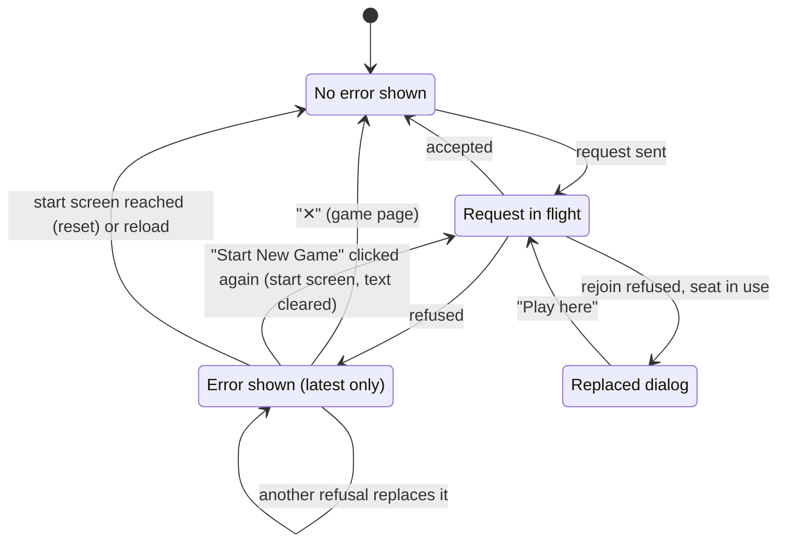

# Error messages

## Summary

Every error text a player can see in 3D Chess comes from one of three places: the server refusing a request, the browser failing to read something the server sent, or the [move box](../glossary.md#the-interface) explaining why a typed move cannot be played. This document catalogues all of them: the thirteen texts from the server and the browser, with the code the server attaches, and the six messages of the move box, each with what causes it, whether the app itself can ever cause it, where it appears, and what else the page does when it arrives. It also lists, in a further table, the texts that are not errors but do the same job of telling the player that something has gone wrong: the frozen-board banner, the crash screen, the connection status lines, the replaced dialog, and the share-link screen's copy failure. Feature documents say which errors they can produce and link here. How the game page's error banner itself behaves (only the latest error, the "✕") is owned by [the error banner](../game-page/error-banner.md).

A refusal changes nothing on the server: no game is created, no seat is taken, no move is recorded. Of the thirteen texts from the server and the browser, a player using the app at this commit meets three in the error banner in ordinary use ("Cannot join", "Game full", and "Cannot rejoin"), one in ordinary use but never as an error, only as the replaced dialog ("This game is open in another tab"), two only in rare cases ("Not your turn" and "Already in a game"), and the other seven practically never: most need a modified client, a stored seat changed outside the app, or a server that does not match this commit. The move box's messages are the player's own typing mistakes and are never sent to the server.

## Where an error appears

An error is shown on whichever page is open when it arrives, in one of three ways.

**On the start screen**, as red text under the "Start New Game" button: "Error: " followed by the server's message. Only an error that arrives after the player's latest click on the button is shown; anything received earlier, including errors from a game page the player just left, is ignored. The error is taken as the answer to the click, so the button returns from "Creating Game..." to "Start New Game" and works again. The text has no dismiss control. It stays until the next click, which clears it, and it stays through a drop, with "Reconnecting to server…" appearing under it. In practice the start screen never shows an error: the only refusal its request can meet is "Already in a game", which a fresh connection cannot get (see [creating a game](../start/creating-a-game.md#the-answer-arrives)).

**On the game page**, in the [error banner](../glossary.md#the-interface): the red box at the bottom center, "Error: " followed by the server's message, with a "✕" button that dismisses it. It appears on every screen of the game page: the share-link screen, the join screen, the joined screen, and the board screen. Only the latest error is shown; dismissing hides every error so far, and a later error shows again. The banner stays through drops and reconnects. On the board screen it sits between the move box and the [move list](../game-page/move-list.md) (on a row of its own above them in a window narrower than 640 pixels), and it is drawn under all three dialogs, which make it inert while they are up. Presses on the banner never reach the board. The one server refusal the game page never puts in the banner is "This game is open in another tab"; it shows the [replaced dialog](../session/second-tab.md) instead.

**Under the move box**, on the board screen: a line of plain text directly under the move box's field, for a typed move the box will not send. It is not prefixed with "Error: ", has no dismiss control, and goes as soon as the player edits the field or plays a move.

In the first two places the message is the server's own English text, shown verbatim. Neither place shows the code, and neither says which request was refused.

The page does not match an error to the request it answers. Any error that arrives while one of the player's moves is in flight releases the [held](../glossary.md#selection-and-board-state) board, and any error that arrives after a click on "Start New Game" re-enables the button. Beyond showing the error, the game page reacts to exactly three kinds:

- **A failed join.** "Cannot join" or "Game full" while the page is on the joined screen and the game has not started on this page sends the page back to the join screen. See [joining a game](../start/joining-a-game.md).
- **A stale stored seat.** "Cannot rejoin" or "No such seat to rejoin" before any snapshot has arrived on this page and before the game has started on it deletes the game's [stored seat](../foundations/connection-and-seat.md#the-stored-seat), and the page shows the join screen. See [reloading and returning](../session/reload-and-return.md).
- **A seat in use.** "This game is open in another tab", answering this connection's rejoin, shows the replaced dialog over the page; the connection stays open but holds no seat. See [a second tab](../session/second-tab.md).

> Technical note: The first two reactions test the code, not the text, and they look at every error the page has received since it was opened or reset, not only the answer to the latest request. "Cannot join" and "Cannot rejoin" share the code `invalid_game`, so each one counts for both reactions wherever the other conditions hold. The third looks only at errors received on the current connection, while it is open and has not been given a seat, so the dialog closes as soon as "Play here" starts a new connection. The edge cases below describe what the player notices.

Errors are forgotten when the page's connection is [reset](../glossary.md#events-that-end-or-interrupt-a-request) (on arriving at the start screen, or on jumping through the browser's history from one game's page to another's) and when the page is reloaded. They belong to one tab: other tabs, and the opponent, never see them.

## The interaction, event by event

The move box's messages never leave the browser and are described in [explained by the move box](#explained-by-the-move-box).

### Begin

A request that the server can refuse is made: a click on "Start New Game" (create), a click on "Join Game" (join), a game page opening or reconnecting with a stored seat (the automatic [rejoin](../foundations/connection-and-seat.md#rejoining)), or a click on a [legal destination](../glossary.md#moves-and-the-rules), a pick in the promotion dialog, or a move typed in the move box and accepted by it (a move). Which refusals are possible is decided by which request it is; see [the catalogue](#the-catalogue).

### End without sending

A request that never leaves the browser is never refused. A [queued](../glossary.md#requests) create, join, or rejoin that is discarded by leaving the page or reloading, a [dropped](../glossary.md#requests) move, and a typed move the move box will not send produce no error from the server; the last produces one of the move box's own messages.

### Send

The server checks each message in a fixed order and answers the first check that fails with an error; later checks are not made.

1. Is it JSON text? If not: "Message is not valid JSON".
2. Is it one of the protocol's messages, with the right fields? If not: "Message does not conform to the protocol schema".
3. Is it a request a client may send? If not: "Clients may not send {type} messages".
4. The request's own checks:
   - **Create:** this connection is not yet in a game, or "Already in a game".
   - **Join:** this connection is not yet in a game, or "Already in a game"; the game exists, or "Cannot join"; the join comes from the tab that already claimed a seat in this game (its [client id](../glossary.md#requests) matches), in which case it gets that seat back, or else the game has a free seat, or "Game full".
   - **Rejoin:** this connection is not yet in a game, or "Already in a game"; the game exists, or "Cannot rejoin"; the named color is a taken seat, or "No such seat to rejoin"; and, for a rejoin that does not [take over](../glossary.md#the-connection), no other tab's live connection holds the seat, or "This game is open in another tab".
   - **Move:** this connection holds a seat in a game that exists, or "Not in a game"; both seats are taken, or "Both players must have joined to move"; it is this seat's turn, or "Not your turn".

A refused request leaves the server exactly as it was. A refused join or rejoin does not tie the connection to the game, so the same connection can go on to create, join, or rejoin. No refusal closes the connection.

### While in flight

The page shows whatever it shows for that request, with no hint that it might be refused: "Creating Game..." on the start screen, the joined screen after "Join Game", the share-link screen while a fresh page's rejoin is on its way, and a held board for a move. On an ordinary connection this lasts a fraction of a second.

### The answer arrives

The error is added to what the page has received and shown as described in [where an error appears](#where-an-error-appears). The page then reacts as listed there: the start screen's button works again, a held board is released, a failed join returns to the join screen, a refused rejoin on a fresh page deletes the stored seat, and a seat in use brings up the replaced dialog. Nothing else changes: not the position, not the turn, not the connection.

## The catalogue

### Refusals from the server

| Message | Code | Answers | Cause | From the app | Where it shows, and what else happens |
| --- | --- | --- | --- | --- | --- |
| "Message is not valid JSON" | `invalid_message` | Anything | A message that is not JSON text. | Never. The app sends only JSON text. | Wherever the request was sent from. Nothing else happens; the connection stays open. |
| "Message does not conform to the protocol schema" | `invalid_message` | Anything | JSON that is not one of the protocol's messages: an unknown type, a missing or extra field, a cell name outside `Aa1`–`Ee5`, a promotion letter other than Q, R, B, N, or U, or a client id that is empty or longer than 64 characters. | Never. | As above. |
| "Clients may not send {type} messages" | `invalid_message` | Anything | A well-formed message of a kind only the server sends. {type} is that kind's protocol name, for example "Clients may not send move_made messages". | Never. | As above. |
| "Already in a game" | `already_in_game` | Create, join, rejoin | This connection has already created, joined, or rejoined a game; a connection is tied to at most one game in its life. | Rarely, in two cases. With browser storage disabled, the creator is shown the join screen and may click "Join Game". Pressing Back during a create's round trip, onto an earlier game's page, sends that page's rejoin on a connection already tied to the new game (see [creating a game](../start/creating-a-game.md#edge-cases)). | Start screen: the red text, and the button works again. Game page after "Join Game": the page stays on the joined screen, "Joined game, waiting for start...", because this refusal does not send it back to the join screen. Game page after a rejoin: only the banner changes, and the stored seat is kept; after Back during a create the earlier game's share-link screen stays until a reload. |
| "Cannot join" | `invalid_game` | Join | No game with this id exists: the link was mistyped or changed to lower case, or the game has [expired](../glossary.md#games-and-seats). | Yes, whenever a visitor clicks "Join Game" on such a link. | Game page: the joined screen goes back to the join screen, with the banner. |
| "Game full" | `game_full` | Join | Both seats are taken, and neither was claimed by this tab. Seats are held for the life of the game, so it makes no difference whether their players are connected. | Yes: a third person with the link; a seated player opening the link in another browser, profile, device, or private window, or after clearing site data; the slower of two visitors clicking "Join Game" at the same moment. A join repeated by the tab that claimed a seat (after its answer was lost in a drop, or after a reload of that tab) is not refused: it gets that seat back. | As "Cannot join". The page offers no way to watch the game, and a seated player on the wrong browser cannot get their seat back through the app. |
| "Cannot rejoin" | `invalid_game` | Rejoin | No game with this id exists, although this browser holds a stored seat for it: the game has expired. | Yes: opening an expired game's link, bookmark, or history entry. | Game page, over the share-link screen shown while the rejoin was in flight. On a fresh page (no snapshot yet, game not started on this page) the stored seat is deleted and the page shows the join screen; "Join Game" there is then refused with "Cannot join". If a snapshot has already arrived or the game has started on this page, the stored seat is kept and the page stays where it is, on a connection that holds no seat, and the board takes no input until a reload. |
| "No such seat to rejoin" | `invalid_rejoin` | Rejoin | The game exists, but nobody has ever taken the color the stored seat names. | Practically never. The app stores only a color the server assigned, and a seat is never given up, so only a stored seat changed outside the app can cause it. | As "Cannot rejoin", including deleting the stored seat. The join screen that follows works: the named color is free, so "Join Game" takes it. |
| "This game is open in another tab" | `seat_in_use` | Rejoin | A rejoin that does not take over names a seat that a live connection from another tab holds. A page's rejoins stop taking over once one of them has been answered, so this is the rejoin after a drop of a page that has already held its seat. A connection from the same tab (its own half-open old connection) is replaced instead, as usual. | Yes: a tab whose connection dropped while the player opened the game in another tab, or clicked "Play here" there, and then comes back. | Never in the error banner. The page shows the replaced dialog, "This game is open in another tab", over whatever it was showing; the connection stays open but holds no seat, and the board takes no input. "Play here" closes the dialog, opens a new connection, and sends a rejoin that takes over. The stored seat is kept. |
| "Not in a game" | `invalid_move` | Move | This connection holds no seat in a game that exists: it never created, joined, or rejoined one, its rejoin was refused, or its game has expired since it took the seat. | Practically never. The board and the move box take input only once the page's current connection has been given a seat, so the app does not send a move from a connection without one. Only a game that expires while a page holds a seat in it could cause it. | Board screen: the held board is released and the move is not shown. |
| "Both players must have joined to move" | `game_not_started` | Move | Only one seat of the game is taken. | Never. The board appears only once both seats are taken, and seats are never given up. | As "Not in a game". |
| "Not your turn" | `wrong_turn` | Move | The move record says it is the other seat's turn. | Rarely: a second click on the same destination within a few tens of milliseconds of the first (a very fast double click), before the page has redrawn, sends the move twice; the second copy is refused. See [making a move](../play/making-a-move.md#edge-cases). | Board screen. The first copy lands as usual; the refused copy is never shown. The banner stays up after the move has landed. |

### Reported by the browser

| Message | Code | Cause | From the app | Where it shows, and what else happens |
| --- | --- | --- | --- | --- |
| "Received a malformed message from the server" | `invalid_message`, assigned by the browser | The server sent something that is not JSON. The browser checks nothing else about what it receives. | Never against a server built from the same commit, which sends only JSON. | Wherever the page is: under the start screen's button, which works again, or in the error banner, where it releases a held move like any error. The unreadable message itself is lost, and nothing asks the server for it again. |

### Explained by the move box

A move typed in the move box is checked in the browser, against the position on this board and the player's own pieces, before anything is sent. A move that passes is sent exactly as a clicked one would be; one that fails is not sent, and one of these messages appears under the field. The field is marked invalid for assistive technology and the line is a status message, so a screen reader reads it politely. The cells in the messages are the ones the player typed, written in the usual form (`ab2` becomes `Ab2`).

| Message | Cause | From the app |
| --- | --- | --- |
| "Type a move as two cells, like Ab2-Ab3." | The text is not two cells (level A–E, file a–e, rank 1–5, in either case) with "-", "–", "x", spaces, or nothing between them, and an optional promotion letter (Q, R, B, N, or U, with or without "=") at the end. | Yes, for any typing slip. |
| "You have no piece on {from}." | The first cell is empty or holds an opponent's piece. | Yes. |
| "The piece on {from} cannot move to {to}." | The second cell is not a legal destination of that piece: the piece cannot move that way, the path is blocked, or the move would leave the player's King attacked. | Yes. |
| "{from}-{to} is not a promotion." | A promotion letter was typed for a legal move that does not promote. The two cells are joined by a hyphen here, not the move list's en dash. | Yes. |
| "Say which piece to promote to: add =Q, =R, =B, =N or =U." | A legal move of a pawn onto a promotion square without a promotion letter. The move box never opens the promotion dialog. | Yes. |
| "A pawn cannot promote to that piece." | A promotion letter that names no piece the pawn can become. | Practically never: every letter the box accepts names one of the five pieces a pawn can become. |

The box checks only when it may send: the player's turn, the board taking input, and the game not over. At any other time its "Move" button is disabled and Enter in the field does nothing, with no message.

### Texts that act like errors

These are not errors and never appear in the error banner, but each tells the player that something is wrong. Each is described in full in the document linked.

| Text | Where and when | What it means | Described in |
| --- | --- | --- | --- |
| "Move {N} in this game's history is not a legal move for this client (likely an app version mismatch). The board is frozen at the position before it." ({N} is the move's place in the record, counting every move from 1) | The frozen-board banner: a red box centered below the top row of the board screen, with no close button. | The move record holds a move this browser cannot replay. The board shows the position before it and never takes input again. | [The broken game record](broken-game-record.md) |
| "Something went wrong", then "The app hit an unexpected error. Your game lives on the server, so reloading is safe — it will restore the current position.", and a "Back to start" link | The crash screen, replacing the whole page at either address. | The page hit an error it could not handle while drawing itself. Its connection is closed, so the opponent sees "Opponent: offline". | [Screens and navigation](../foundations/screens-and-navigation.md#the-crash-screen) |
| "Reconnecting…" | The amber box at the top right of every game page screen. | The connection dropped and the browser is retrying on its own; the board does not take input. | [Connection loss](../session/connection-loss.md) |
| "Connecting to server…" | The gray line under the start screen's button. | The first connection attempt has not opened yet. A click on "Start New Game" is queued. | [Creating a game](../start/creating-a-game.md) |
| "Reconnecting to server…" | The same gray line. | The connection failed or dropped and is being retried. | [Creating a game](../start/creating-a-game.md) and [connection states](../foundations/connection-and-seat.md#connection-states) |
| "This game is open in another tab", then "Your seat moved to the newer tab or window. Close this one, or take the game back here.", and a "Play here" button | The replaced dialog, over the whole game page. | Another tab's connection holds this tab's seat: it took the seat, or this tab found it in use when its connection came back. This tab does not take the seat back by itself. | [A second tab](../session/second-tab.md) |
| "Could not copy; select the link instead" | A gray line beside the share-link screen's "Copy link" button, after a click on it. | The browser refused to copy the link. On success the same line reads "Copied". | [Waiting for an opponent](../start/waiting-for-an-opponent.md) |

### Failures with no message

Some things go wrong without any text at all. They are listed here so that this catalogue is complete; each is described where it happens.

- A create or join whose answer is lost in a drop is [re-sent](../glossary.md#requests) on the next connection. The player sees only a longer wait at "Creating Game..." or "Joined game, waiting for start...". A re-sent create may leave an unused game on the server. See [creating a game](../start/creating-a-game.md) and [joining a game](../start/joining-a-game.md).
- A move sent just as the connection drops is either recorded or lost; the next snapshot shows which, with no message. See [connection loss](../session/connection-loss.md).
- After every reconnect, reload, or "Play here", the board and the move box take no input until the rejoin's snapshot arrives; nothing says so, and the wait is normally too short to notice.
- Enter in the move box, or a click on its disabled "Move" button, when the player may not move (the opponent's turn, a held or frozen board, a finished game) does nothing and says nothing.
- An address inside the app other than `/` or `/game/{id}` shows an empty dark page. See [addresses the app does not know](../foundations/screens-and-navigation.md#addresses-the-app-does-not-know).
- A recorded move that is illegal but that this browser can still replay is shown like any other move. See [the broken game record](broken-game-record.md).
- A game's expiry gives no warning in advance. It shows only as "Cannot rejoin" or "Cannot join" the next time someone opens the link.
- The share-link screen offers "Copy link" only where the browser allows copying from a page, which means an `https` address or `localhost`. On a plain `http` address (for example a computer's address on a home network) the button is simply absent.

## Modifiers

"While in flight" here is while the request that will be refused is on its way.

| Modifier | At the start | Changes while in flight |
| --- | --- | --- |
| Your color | No effect on any error or its text. The move box's messages judge the typed move against the player's own pieces. | Cannot change. |
| Whose turn it is | Only "Not your turn" depends on it, and on the server's count of the move record, not on what the page shows. The move box checks nothing on the opponent's turn: it neither sends nor explains. | The page cannot send a move until its count agrees with the server's (the board waits for each rejoin's snapshot), so "Not your turn" in practice comes only from a move sent twice. |
| How you reached the page | Decides which refusals are possible. The start screen can only create. A visitor's "Join Game" can meet "Cannot join" and "Game full". A player returning with a stored seat sends a rejoin, which can meet "Cannot rejoin". A creator arriving from the start screen sends no rejoin. | Leaving the page before the answer loses it; see "Leaving the game page within the app" below. |
| Connection state | Errors arrive only on an open connection. A queued create, join, or rejoin can be refused as soon as the connection opens. The rejoin after a reconnect can be refused as a seat in use, which brings up the replaced dialog. While replaced, the replaced dialog covers the error banner. | A drop loses the answer, refusal or not; no error is shown. A lost create or join is re-sent on the next connection. |
| Game state | In progress, in check, or frozen: errors are shown the same way. Over: the end-game dialog covers the banner and makes it inert. No error exists for a move after the game is over or for an illegal move. | Not applicable: a refused request changes nothing, so it cannot change the game state. |
| Shift, Ctrl, or Cmd held | No effect. | No effect. |
| Input device | The "✕" can be clicked, tapped, or reached with Tab and pressed with Enter or Space. The start screen's red text and the move box's line have no control. | No effect. |

## Cancel and interrupt

"Before sending" is while an error is on screen and nothing is in flight; "while in flight" is while a request that the server will refuse is on its way.

| Event | Before sending | While in flight |
| --- | --- | --- |
| Escape or Cancel | Escape does not dismiss an error. Only the "✕" does, on the game page; the start screen's text stays until the next click, and the move box's line until the field is edited. | No effect. A request cannot be cancelled, and its refusal arrives regardless. |
| Pressing elsewhere or turning the view | Presses on the board and turning the view leave the error in place. Presses on the banner itself never reach the board. Clicking around the start screen does nothing. | No effect on the refusal. |
| Leaving the game page within the app | Every error is forgotten: the reset clears the page's errors, the start screen shows only answers to its own click, and a game page reached afterwards starts with no error, apart from one the start screen itself received (see the edge cases). | The answer is lost with the reset and never shown anywhere. The refused request changed nothing on the server, so nothing is lost with it. |
| The game ends | The end-game dialog covers the banner, which stays behind it, inert, and can no longer be dismissed. | Not applicable: a refused move changes nothing, so it cannot end the game. |
| The server answers with an error | A new error replaces the one shown, and shows even if every earlier error was dismissed. A seat in use shows the replaced dialog instead. | This document's subject. |
| The connection drops | The error stays on screen through the drop and the reconnect; "Reconnecting…" (game page) or "Reconnecting to server…" (start screen) appears beside it. A rejoin after the reconnect can bring a new error, or the replaced dialog. | The answer is lost. For a move or a rejoin, the next snapshot shows the true state; a create or a join is re-sent on the next connection (see [failures with no message](#failures-with-no-message)). |
| The window loses focus or the tab is hidden | No effect; the error stays. | The error arrives and is shown in the background. Nothing draws attention to it: the page title never changes. |
| Reload or closing the tab | Every error is forgotten. A reload rebuilds the page from the server, and only new refusals are shown. | The answer is lost. Nothing was recorded, because the request was refused. |
| The opponent acts | Nothing the opponent does produces or clears an error. If the opponent joins while an error is showing, the page moves to the board screen with the error still in the banner. A move the opponent makes can make a typed move no longer playable, but the move box judges it only when submitted. | No effect, except the race for the last seat: a visitor who clicks "Join Game" a moment after another gets "Game full". |
| Another tab takes the seat | The replaced dialog covers the banner. After "Play here" the same error is still there, unless it was dismissed. The other tab has its own errors, if any. If this tab was offline when the seat moved, its rejoin on reconnecting is refused as a seat in use and the replaced dialog appears. | The refusal is sent to the connection that made the request. If that connection was closed by the replacement first, the refusal is lost. |
| A second touch point or a cancelled touch | No effect. A cancelled touch on the "✕" does not dismiss. | No effect. |

## Interactions with other systems

**Seat and turn.** Four errors are about seats ("Already in a game", "Game full", "No such seat to rejoin", and "This game is open in another tab") and one about the turn ("Not your turn"). A refusal never gives, takes, or moves a seat, and never changes whose turn it is. The move box's messages are about the position: which pieces are the player's and where they can go.

**The game record.** Nothing refused is recorded. There is no error for an illegal move or for a move after the game has ended, because the server checks neither; see [the broken game record](broken-game-record.md). The move box refuses illegal moves before they are sent, as the board does by offering only legal destinations.

**Connection.** An error arrives on the connection that sent the request and never closes it. Errors stay on the page through drops and reconnects, because the page keeps everything it received across them, and are forgotten when the connection is reset or the page reloads. A drop while a request is in flight loses its answer, whatever the answer was.

**The opponent.** Errors go only to the player whose request was refused. The opponent never sees them, and the player never sees the opponent's.

**Other tabs and devices.** Each tab has its own errors. A seated player who opens the game on another browser or device is a visitor there, and "Join Game" is refused with "Game full". A second tab of the same browser is not refused when it opens: it rejoins and takes the seat, which the first tab shows with the replaced dialog. The first tab is refused only if its own connection drops and comes back while the second holds the seat, and that refusal, too, is shown as the replaced dialog.

**Game over.** No error concerns the end of the game; the server does not know about it. The end-game dialog covers the error banner and makes it inert, and the move box, which is behind the dialog too, can no longer be used.

**Stored seat.** "Cannot rejoin" and "No such seat to rejoin" delete it, under the conditions in [where an error appears](#where-an-error-appears). No other error touches it; "Already in a game" and "This game is open in another tab" on a rejoin leave it in place.

**Keyboard, touch, and screen size.** The "✕" is a button, labeled "Dismiss error" for screen readers, reached with Tab and pressed with Enter or Space; a tap works like a click. Both the banner and the start screen's red text are marked as alerts, so screen readers announce them as they appear, and the move box's line is a status message, read politely; see [accessibility](accessibility.md). The banner sits at the bottom center between the move box and the move list, or on a row of its own above them in a window narrower than 640 pixels, and never covers them. See [screen sizes and touch](screen-sizes-and-touch.md).

## Edge cases

- **Errors are not matched to requests.** Any error releases a held move and any error re-enables the start screen's button, whatever request it answers. With the app, only one request is in flight at a time, so this rarely shows.
- **A second "Join Game" after a refusal.** After "Cannot join" or "Game full", clicking "Join Game" again sends a new join, but the page goes straight back to the join screen before the answer, because the earlier refusal still counts as a failed join. The new refusal then appears in the banner, even if the first was dismissed. If the join were to succeed, the page would move on when the [seat confirmation](../glossary.md#requests) arrived.
- **"Join Game" after "Cannot rejoin".** On a page whose stale stored seat was just deleted, the first click on "Join Game" behaves the same way, because "Cannot rejoin" and "Cannot join" share a code. The joined screen does not stay up, and the banner changes to "Error: Cannot join" when the answer arrives.
- **An error carried from the start screen.** The game page shows every error received since the connection was last reset, and going from the start screen to a new game does not reset it. An error the start screen showed before a later, successful "Start New Game" would therefore appear again in the new game's error banner, or in an earlier game's page reached with Forward. The start screen practically never receives an error from a matching server, so this is read from code only.
- **A board left open on an expired game.** If a rejoin is refused with "Cannot rejoin" after the game has started on the page (a reconnect after a very long outage, or "Play here" in a tab that sat replaced, to a game that expired meanwhile), the stored seat is kept and the page stays on the board screen with the banner, but the board and the move box take no input: the connection holds no seat. Every later reconnect (at least once an hour) is refused with "Cannot rejoin" again, reappearing after a dismissal. A reload ends it: the page then deletes the stored seat and shows the join screen. Whether a game can expire while a page keeps reconnecting to it is not known; see the open questions.
- **The same refusal twice.** A second refusal with the text already showing changes nothing visible, so it looks like no answer at all. See [the error banner](../game-page/error-banner.md#edge-cases).
- **"Already in a game" and the joined screen.** Unlike "Cannot join" and "Game full", this refusal leaves the page on "Joined game, waiting for start..." with the banner. In the storage-disabled case the board still appears when the opponent joins, since the connection already holds the creator's seat, and the banner comes along to the board screen until dismissed.
- **An error from the joined or share-link screen on the board screen.** The banner is the same on every screen of the game page, so an error shown before the game starts is still there when the board appears.
- **The replaced dialog's wording.** It says the seat moved to "the newer tab or window", but it appears whenever any connection rejoins the seat, including one from another device, and also when this tab comes back from a drop to find its seat held by a tab that was opened earlier than its reconnect. See [the broken game record](broken-game-record.md#seats).
- **Typing ahead.** The player can type a move during the opponent's turn; it cannot be submitted until the opponent's move lands, and it is then judged against the new position. If that move took the piece or blocked the path, the move box explains why when it is submitted; the text stays in the field to be corrected.
- **A malformed answer to a create.** If the unreadable message was in fact the new game's id, the game exists on the server, tied to the connection, and a second click on "Start New Game" is refused with "Already in a game". Read from code; it needs a server that sends something other than JSON.

## Open questions and verification

- **Cryptic messages.** Several texts do not tell the player what happened or what to do next:
  - "Cannot rejoin" is what a player sees when their game has expired. It does not mention expiry, and the page then offers "Join Game", which can only fail with "Cannot join".
  - "Cannot join" does not say whether the id is wrong, in the wrong case, or expired.
  - "Game full" is what a seated player sees on another browser, device, or after clearing site data. It does not explain that their seat is held by a browser they are not using, and the app offers no way back.
  - "No such seat to rejoin" and "Already in a game" describe the protocol, not anything the player did.
  - "Not your turn" after a double click reads like a mistake by the player, when in fact the first click's move went through.
  - "Clients may not send {type} messages" shows internal message names. Only a modified client can see it.
  - The frozen-board banner's "(likely an app version mismatch)" suggests a fix, but reloading does not help; see [the broken game record](broken-game-record.md#open-questions-and-verification).
- **Suspected bug: the failed-join reaction looks at the whole log.** `client/src/screens/GameScreen.tsx:159-168` returns the page to the join screen if any earlier error was `invalid_game` or `game_full`, not only the answer to the latest join. A second "Join Game" therefore bounces back before its answer, and a "Cannot rejoin" makes the first "Join Game" bounce too. Harmless while those joins also fail, but a successful join after such a refusal would briefly show the join screen instead of the joined screen ([B-15](../bug-triage.md#b-15-old-errors-keep-acting-success-never-clears-the-banner-and-earlier-refusals-steer-later-joins)).
- **Suspected bug: errors carried across from the start screen.** `client/src/screens/GameScreen.tsx:71-76` and `:157` show errors from the whole log since the last reset, while the start screen shows only answers to its own click. Unreachable with the app and a matching server, as far as the code shows.
- **"Not your turn" from a double click.** The page refuses to send a second move once the first is in flight, but it reads that from its last drawn state (`client/src/screens/GameScreen.tsx:194-199`), so a second click before the page redraws still sends ([B-14](../bug-triage.md#b-14-a-very-fast-double-press-on-a-destination-sends-the-move-twice-and-shows-not-your-turn)). Read from code; not reproduced at this commit.
- **A board left open on an expired game.** The path in the edge cases depends on whether reading a game (a rejoin) counts as activity for expiry, which the repository does not state (see [the connection model](../foundations/connection-and-seat.md#open-questions-and-verification)).
- **"A pawn cannot promote to that piece."** `client/src/game/typedMove.ts:47` produces it only when none of a promotion's moves matches the letter, and every letter the box's pattern accepts (line 16) matches one of the five. It appears unreachable.
- **The move box's hyphen.** "{from}-{to} is not a promotion." (`client/src/game/typedMove.ts:40`) joins the cells with a hyphen, while the move list uses an en dash. Cosmetic.
- **Silence when the move box may not send.** `client/src/screens/MoveInput.tsx:25` ignores a submit when the player may not move, without a message. With the button disabled a pointer user sees why; a keyboard or screen reader user pressing Enter hears nothing. Whether the box should say "Not your turn" itself is a product call.
- **"Copy link" only on secure addresses.** The button is left out where the browser offers no clipboard (`client/src/screens/GameScreen.tsx:517`), which is every plain `http` address other than `localhost`, with nothing in its place. Read from code; not tried on a network address.
- **Read, not observed.** The server texts are quoted from `server/modal_app.py`, and the codes from `server/schema.json`. `server/tests/test_local_ws.py` asserts the code of every refusal, including `seat_in_use`, but the text of only one ("Both players must have joined to move", in the logging test). The start screen's error handling, the join fallback, the stale-seat deletion, the release of a held move on "Not your turn", the seat-in-use dialog, the move box's messages, and the frozen banner are covered by `client/src/App.test.tsx` and `client/src/game/typedMove.test.ts`; the malformed-message error by `client/src/hooks/useGameSocket.test.ts`; the crash screen by `client/src/components/ErrorBoundary.test.tsx`. None of the error texts was seen in a running product for this document.

Verified against 3D Chess commit `90142a3`
