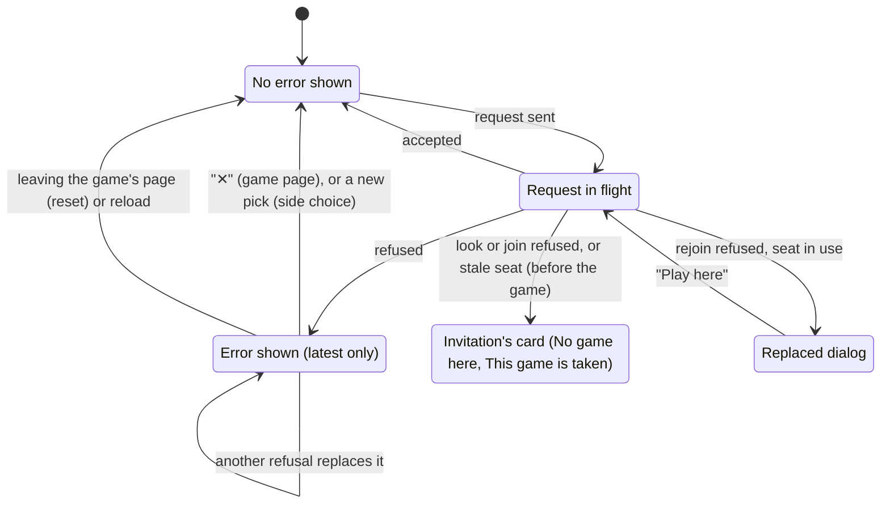

# Error messages

## Summary

Every error text a player can see in 3D Chess comes from one of four places: the server refusing a request, the browser failing to read something the server sent, the browser's own stand-in for the server in a game against the computer, or the [move box](../glossary.md#the-interface) explaining why a typed move cannot be played. This document catalogues all of them, each with what causes it, whether the app itself can ever cause it, where it appears, and what else the page does when it arrives. It also lists the texts that are not errors but do the same job of telling the player that something has gone wrong: the frozen-board banner, the crash screen, the failed loads, the connection lines, the replaced dialog, and the copy failure. Feature documents say which errors they can produce and link here. How the game page's error banner itself behaves (only the latest error, the "✕") is owned by [the error banner](../game-page/error-banner.md).

A refusal changes nothing on the server: no game is created, no seat is taken, no move is recorded. In ordinary use a player meets only a few of these, and most of those not as error text at all: "Cannot join", "No such game", "Cannot rejoin", and "Game full" become the invitation's own words, "No game here" or "This game is taken"; "This game is open in another tab" becomes the replaced dialog. The rest need a rare race, a modified client, a stored seat changed outside the app, or a server that does not match this commit.

## Where an error appears

An error is shown on whichever page is open when it arrives, in one of these ways.

**On the side choice**, as red text in the line at the bottom of the page: "Couldn't start a game: " followed by the server's message. It is a status, read politely by a screen reader. Only an error that arrives after the player's latest pick counts; anything received earlier is ignored. The error puts the kings back and enables the buttons, and the next pick clears it. In practice the side choice never shows an error: the only refusal its request can meet is "Already in a game", which a fresh connection cannot get (see [creating a game](../start/creating-a-game.md#the-answer-arrives)).

**On the invitation to the free seat**, as the invitation's own card, never as error text: a refusal of the look or the join because there is no such game ("No such game", "Cannot join") or because both seats are taken ("Game full") turns the invitation into a card that says "No game here" or "This game is taken", with "Play a friend". So does "Cannot rejoin" on a page whose stale stored seat it deletes. See [joining a game](../start/joining-a-game.md).

**On the game page**, in the [error banner](../glossary.md#the-interface): a glass notice with a thin red rule at its left edge, the message (read as "Error: " and the message by a screen reader), with a "✕" that dismisses it. Before the game starts it stands at the top center, over the lobby, and leaves out the four refusals the invitation says in its own words; on the board screen it stands in the status column under the [turn pill](../game-page/turn-indicator.md), and shows any refusal. Only the latest error is shown; dismissing hides every error so far, and a later error shows again. The banner stays through drops and reconnects, and is drawn under all three dialogs, which make it inert while they are up. The one server refusal the game page never shows as an error is "This game is open in another tab"; it shows the [replaced dialog](../session/second-tab.md) instead.

**Under the move box**, on the board screen: a line of plain text directly under the field, for a typed move the box will not send. It is not prefixed with "Error: ", has no dismiss control, and goes as soon as the player edits the field or plays a move.

The message is the server's own English text, verbatim; the code is never shown, and nothing says which request was refused.

The page does not match an error to the request it answers. Any error that arrives while one of the player's moves is in flight releases the [held](../glossary.md#selection-and-board-state) board. Beyond showing the error, the game page reacts to three kinds:

- **A failed join.** "Cannot join" or "Game full" while the page is on "Joining…" and the game has not started on this page ends the join: the guest's king goes back to its outline and the invitation's card says "No game here" or "This game is taken". See [joining a game](../start/joining-a-game.md).
- **A stale stored seat.** "Cannot rejoin" or "No such seat to rejoin" before any snapshot has arrived on this page and before the game has started on it deletes the game's [stored seat](../foundations/connection-and-seat.md#the-stored-seat). After "Cannot rejoin" the page says "No game here"; after "No such seat to rejoin" it asks which seats are taken and offers the free seat (or says "This game is taken"). See [reloading and returning](../session/reload-and-return.md).
- **A seat in use.** "This game is open in another tab", answering this connection's rejoin, shows the replaced dialog over the page; the connection stays open but holds no seat. See [a second tab](../session/second-tab.md).

> Technical note: These reactions test the code, not the text, and the first two look at every error the page has received since it was opened or reset, not only the answer to the latest request. "No such game", "Cannot join", and "Cannot rejoin" share the code `invalid_game`. The third looks only at errors received on the current connection, while it is open and has not been given a seat, so the dialog closes as soon as "Play here" starts a new connection.

Errors are forgotten when the page's connection is [reset](../glossary.md#events-that-end-or-interrupt-a-request) (on leaving a game's page, or arriving at the home page) and when the page is reloaded. They belong to one tab: other tabs, and the opponent, never see them.

## The interaction, event by event

```mermaid
stateDiagram-v2
    state "No error shown" as clear
    state "Request in flight" as flight
    state "Error shown (latest only)" as shown
    state "Invitation's card (No game here, This game is taken)" as card
    state "Replaced dialog" as replaced
    [*] --> clear
    clear --> flight : request sent
    flight --> clear : accepted
    flight --> shown : refused
    flight --> card : look or join refused, or stale seat (before the game)
    flight --> replaced : rejoin refused, seat in use
    shown --> clear : "✕" (game page), or a new pick (side choice)
    shown --> shown : another refusal replaces it
    shown --> clear : leaving the game's page (reset) or reload
    replaced --> flight : "Play here"
```

The move box's messages never leave the browser and are described in [explained by the move box](#explained-by-the-move-box).

### Begin

A request that the server can refuse is made: a pick on the side choice (create), the invitation's question which seats are taken (look), a click on "Join game" (join), a game page opening or reconnecting with a stored seat (the automatic [rejoin](../foundations/connection-and-seat.md#rejoining)), or a move pressed, picked in the promotion dialog, or typed in the move box and accepted by it. Which refusals are possible is decided by which request it is; see [the catalogue](#the-catalogue).

### End without sending

A request that never leaves the browser is never refused. A [queued](../glossary.md#requests) create, look, join, or rejoin that is discarded by leaving the page or reloading, a [dropped](../glossary.md#requests) move, and a typed move the move box will not send produce no error from the server; the last produces one of the move box's own messages.

### Send

The server checks each message in a fixed order and answers the first check that fails with an error; later checks are not made.

1. Is it JSON text? If not: "Message is not valid JSON".
2. Is it one of the protocol's messages, with the right fields? If not: "Message does not conform to the protocol schema".
3. Is it a request a client may send? If not: "Clients may not send {type} messages".
4. The request's own checks:
   - **Create:** this connection is not yet in a game, or "Already in a game".
   - **Look:** the game exists, or "No such game". A look never ties the connection.
   - **Join:** this connection is not yet in a game, or "Already in a game"; the game exists, or "Cannot join"; the join comes from the tab that already claimed a seat in this game (its [client id](../glossary.md#requests) matches), in which case it gets that seat back, or else the game has a free seat, or "Game full".
   - **Rejoin:** this connection is not yet in a game, or "Already in a game"; the game exists, or "Cannot rejoin"; the named color is a taken seat, or "No such seat to rejoin"; and, for a rejoin that does not [take over](../glossary.md#the-connection), no other tab's live connection holds the seat, or "This game is open in another tab".
   - **Move:** this connection holds a seat in a game that exists, or "Not in a game"; both seats are taken, or "Both players must have joined to move"; it is this seat's turn, or "Not your turn".

A refused request leaves the server exactly as it was, and no refusal closes the connection.

### While in flight

The page shows whatever it shows for that request, with no hint that it might be refused: the pick playing out on the side choice, nothing yet on the invitation, "Joining…" after "Join game", "Returning to your game…" while a fresh page's rejoin is on its way, and a held board for a move. On an ordinary connection this lasts a fraction of a second.

### The answer arrives

The error is added to what the page has received and shown as described in [where an error appears](#where-an-error-appears), and the page reacts as listed there. Nothing else changes: not the position, not the turn, not the connection.

## The catalogue

### Refusals from the server

| Message | Code | Answers | Cause | From the app | Where it shows, and what else happens |
| --- | --- | --- | --- | --- | --- |
| "Message is not valid JSON" | `invalid_message` | Anything | A message that is not JSON text. | Never. | Wherever the request was sent from. Nothing else happens. |
| "Message does not conform to the protocol schema" | `invalid_message` | Anything | JSON that is not one of the protocol's messages: an unknown type, a missing or extra field, a cell name outside `Aa1`–`Ee5`, a promotion letter other than Q, R, B, N, or U, or a client id that is empty or longer than 64 characters. | Never. | As above. |
| "Clients may not send {type} messages" | `invalid_message` | Anything | A well-formed message of a kind only the server sends. | Never. | As above. |
| "Already in a game" | `already_in_game` | Create, join, rejoin | This connection has already created, joined, or rejoined a game. | Rarely, in two cases: with browser storage disabled, the creator is invited to the other seat of their own game and clicks "Join game"; and Back pressed during a create's round trip onto an earlier game's page (see [creating a game](../start/creating-a-game.md#edge-cases)). | Side choice: in red at the bottom, the kings put back. Game page after "Join game": "Joining…" stays, with the banner. After a rejoin: only the banner; the stored seat is kept. |
| "No such game" | `invalid_game` | Look | No game with this id exists: a mistyped or lower-case link, or an [expired](../glossary.md#games-and-seats) game. | Yes, whenever a visitor opens such a link. | The invitation's card, "No game here", with "Play a friend". Never in the banner. |
| "Cannot join" | `invalid_game` | Join | No game with this id exists (it expired since the look, say). | Rarely: the look normally says so first. | "No game here", as above. |
| "Game full" | `game_full` | Join | Both seats are taken, and neither was claimed by this tab. | Rarely: the look normally shows "This game is taken" first; a join refused this way means someone took the seat between the look and the click. A join repeated by the tab that claimed a seat is not refused: it gets that seat back. | The invitation's card, "This game is taken", with "Play a friend"; the guest's king goes back to its outline. Never in the banner before the game. |
| "Cannot rejoin" | `invalid_game` | Rejoin | No game with this id exists, although this browser holds a stored seat for it: the game has expired. | Yes: opening an expired game's link, bookmark, or history entry. | On a fresh page (no snapshot yet, game not started on this page): the stored seat is deleted and the page says "No game here". If a snapshot has already arrived or the game has started on this page: the banner, the stored seat kept, and the board takes no input until a reload. |
| "No such seat to rejoin" | `invalid_rejoin` | Rejoin | The game exists, but nobody has ever taken the color the stored seat names. | Practically never: only a stored seat changed outside the app. | The banner, the stored seat deleted on a fresh page, and the invitation to the free seat (the named color is free, so "Join game" takes it). |
| "This game is open in another tab" | `seat_in_use` | Rejoin | A rejoin that does not take over names a seat that another tab's live connection holds: the rejoin after a drop of a page that has already held its seat. | Yes: a tab whose connection dropped while the player opened the game in another tab, or clicked "Play here" there, and then comes back. | Never in the banner. The replaced dialog over whatever the page was showing; the stored seat is kept. |
| "Not in a game" | `invalid_move` | Move | This connection holds no seat in a game that exists. | Practically never: the board takes input only once the current connection holds the seat. | Board screen: the banner; the held board is released and the move is not shown. |
| "Both players must have joined to move" | `game_not_started` | Move | Only one seat of the game is taken. | Never: the board appears only once both seats are taken. | As "Not in a game". |
| "Not your turn" | `wrong_turn` | Move | The move record says it is the other seat's turn. | Practically never since a fast second press no longer sends the move twice ([bug triage](../bug-triage.md) B-14, fixed). | As "Not in a game". |

### Reported by the browser

| Message | Code | Cause | From the app | Where it shows, and what else happens |
| --- | --- | --- | --- | --- |
| "Received a malformed message from the server" | `invalid_message`, assigned by the browser | The server sent something that is not JSON. | Never against a server built from the same commit. | Wherever the page is: on the side choice, "Couldn't start a game: …" with the kings put back; on the game page, in the banner, where it releases a held move like any error. The unreadable message itself is lost. |

### From the computer's stand-in

In a game against the computer the browser answers the game page's requests itself ([playing the computer](../computer/playing-the-computer.md)). Its refusals use the same codes and show the same way, but a correct page never meets them, apart from the first:

| Message | Cause | Where it shows |
| --- | --- | --- |
| "No such game" | The address names a computer game this browser does not hold. | The card "No game here", with "Play the computer". |
| "Game is full" | A join on a computer game. | Never sent by the page. |
| "The game has not started" | A move before the computer has sat down. | Never: it sits down at once. |
| "Not your turn" | A move on the computer's turn. | The board takes no move then; never seen. |
| "Illegal move" | A move the rules do not allow. The server never checks this; the stand-in does. | Never: the page offers and accepts only legal moves. It would show in the banner. |
| "Not available against the computer" | Any other request. | Never sent by the page. |

### Explained by the move box

A move typed in the move box is checked in the browser, against the position on this board and the player's own pieces, before anything is sent. A move that passes is sent exactly as a pressed one would be; one that fails is not sent, and one of these messages appears under the field. The field is marked invalid for assistive technology and the line is a status message, so a screen reader reads it politely. The cells in the messages are the ones the player typed, written in the usual form (`bb1` becomes `Bb1`).

| Message | Cause | From the app |
| --- | --- | --- |
| "Type a move as two cells, like Bb1-Cb1." | The text is not two cells (level A–E, file a–e, rank 1–5, in either case) with "-", "–", "x", spaces, or nothing between them, and an optional promotion letter (Q, R, B, N, or U, with or without "=") at the end. | Yes, for any typing slip. |
| "You have no piece on {from}." | The first cell is empty or holds an opponent's piece. | Yes. |
| "The piece on {from} cannot move to {to}." | The second cell is not a legal destination of that piece. | Yes. |
| "{from}-{to} is not a promotion." | A promotion letter was typed for a legal move that does not promote. | Yes. |
| "Say which piece to promote to: add =Q, =R, =B, =N or =U." | A legal move of a pawn onto a promotion square without a promotion letter. The move box never opens the promotion dialog. | Yes. |
| "A pawn cannot promote to that piece." | A promotion letter that names no piece the pawn can become. | Practically never: every letter the box accepts names one of the five. |
| "Wait for their move." | A move submitted on the opponent's turn. It is not checked or sent. | Yes. |

The box checks a move only when it may send: the player's turn, the board taking input, and the game not over. On the opponent's turn it says "Wait for their move."; at any other time (a move in flight, a drop, a frozen record, a finished game) Enter and the ↵ button do nothing, with no message.

### Texts that act like errors

These are not errors and never appear in the error banner, but each tells the player that something is wrong. Each is described in full in the document linked.

| Text | Where and when | What it means | Described in |
| --- | --- | --- | --- |
| "Move {N} of this game can't be replayed by this version of the app. The board stays at the position before it." | The frozen-board banner, in the status column under the turn pill, with no close button. | The move record holds a move this browser cannot replay. | [The broken game record](broken-game-record.md) |
| "Something went wrong", "The app hit an unexpected error. Your game lives on the server, so reloading is safe — it will restore the current position.", and "Back to start" | The crash screen, replacing the whole page. | The page hit an error it could not handle while drawing itself. | [Screens and navigation](../foundations/screens-and-navigation.md#the-crash-screen) |
| "Couldn't load the board" with "Retry" | The board screen, in the middle, when the 3D board's code failed to load. The HUD and the move box still work. | A dropped connection, or a deploy that replaced the code. "Retry" asks again; a second failure reloads the page. | [Screens and navigation](../foundations/screens-and-navigation.md#the-crash-screen) |
| "Couldn't load the game" with "Retry" | A computer game's page whose code failed to load. "Retry" reloads the page. | As above. | [Playing the computer](../computer/playing-the-computer.md) |
| "Couldn't load the tutorial." | The tutorial's page, with "← Home". | As above. | [The tutorial](../learn/the-tutorial.md) |
| "Reconnecting…" | A glass line with a small breathing light: under the turn pill on the board screen, at the top right of the game page's other screens. | The connection dropped and the browser is retrying on its own. | [Connection loss](../session/connection-loss.md) |
| "Connecting to server…", "Reconnecting to server…", "Waiting for server…" | The side choice's bottom line (and the invitation's, before the look is answered), only once a wait has lasted 1.5 seconds. | The connection has not opened, is being retried, or the pick's answer is late. | [Creating a game](../start/creating-a-game.md#the-side-choice) |
| "This game is open in another tab", "Your seat moved to the newer tab or window. Close this one, or take the game back here.", and "Play here" | The replaced dialog, over the whole game page. | Another tab's connection holds this tab's seat. | [A second tab](../session/second-tab.md) |
| "Couldn't copy. Select the link." | A small line under the invitation to send's "Copy link", after a click on it. | The browser refused to copy the link. | [Waiting for an opponent](../start/waiting-for-an-opponent.md) |

### Failures with no message

- A create or join whose answer is lost in a drop is [re-sent](../glossary.md#requests) on the next connection. The player sees only a longer wait. A re-sent create may leave an unused game on the server.
- A move sent just as the connection drops is either recorded or lost; the next snapshot shows which, with no message. See [connection loss](../session/connection-loss.md).
- After every reconnect, reload, or "Play here", the board and the move box take no input until the rejoin's snapshot arrives; nothing says so.
- Enter in the move box while the board is held, disconnected, or frozen, or once the game is over, does nothing and says nothing.
- An address inside the app that is not a page shows an empty dark page. See [addresses the app does not know](../foundations/screens-and-navigation.md#addresses-the-app-does-not-know).
- A recorded move that is illegal but that this browser can still replay is shown like any other move. See [the broken game record](broken-game-record.md).
- A game's expiry gives no warning. It shows only as "No game here" the next time someone opens the link.
- "Copy link" is offered only where the browser allows copying from a page (an `https` address or `localhost`); elsewhere the button is simply absent.
- The home page's preview, and the lobby's scene, simply go missing if their code fails to load.

## Modifiers

"While in flight" here is while the request that will be refused is on its way.

| Modifier | At the start | Changes while in flight |
| --- | --- | --- |
| Your color | No effect on any error or its text. The move box's messages judge the typed move against the player's own pieces. | Cannot change. |
| Whose turn it is | Only "Not your turn" depends on it, and on the server's count of the move record. The move box sends nothing on the opponent's turn and says "Wait for their move." instead. | The page cannot send a move until its count agrees with the server's. |
| How you reached the page | Decides which refusals are possible. The side choice can only create. A visitor's look and join can meet "No such game", "Cannot join", and "Game full". A player returning with a stored seat sends a rejoin, which can meet "Cannot rejoin". A creator arriving from the side choice sends no rejoin. A computer game meets only its stand-in. | Leaving the page before the answer loses it. |
| Connection state | Errors arrive only on an open connection. A queued request can be refused as soon as the connection opens. The rejoin after a reconnect can be refused as a seat in use. While replaced, the replaced dialog covers the error banner. | A drop loses the answer, refusal or not; no error is shown. |
| Game state | In progress, in check, or frozen: errors are shown the same way. Over: the result card covers the banner and makes it inert until the card is closed. No error exists for a move after the game is over, because the server does not know it is over. | Not applicable. |
| Shift, Ctrl, or Cmd held | No effect. | No effect. |
| Input device | The "✕" can be clicked, tapped, or reached with Tab and pressed with Enter or Space. The side choice's line and the move box's line have no control. | No effect. |

## Cancel and interrupt

"Before sending" is while an error is on screen and nothing is in flight; "while in flight" is while a request that the server will refuse is on its way.

| Event | Before sending | While in flight |
| --- | --- | --- |
| Escape or Cancel | Escape does not dismiss an error. Only the "✕" does, on the game page; the side choice's line stays until the next pick, and the move box's line until the field is edited. | No effect. A request cannot be cancelled. |
| Pressing elsewhere or turning the view | Presses on the board and turning the view leave the error in place. Presses on the banner itself never reach the board. | No effect on the refusal. |
| Leaving the game page within the app | Every error is forgotten: leaving a game's page resets the connection and its errors; a game page reached afterwards starts with no error, apart from one the side choice received just before (see the edge cases). | The answer is lost with the reset. The refused request changed nothing on the server. |
| The game ends | The result card covers the banner, which stays behind it, inert, until the card is closed. | Not applicable. |
| The server answers with an error | A new error replaces the one shown, and shows even if every earlier error was dismissed. | This document's subject. |
| The connection drops | The error stays on screen through the drop and the reconnect. | The answer is lost. For a move or a rejoin, the next snapshot shows the true state; a create or a join is re-sent on the next connection. |
| The window loses focus or the tab is hidden | No effect; the error stays. | The error arrives and is shown in the background. The page title never changes. |
| Reload or closing the tab | Every error is forgotten. | The answer is lost. |
| The opponent acts | Nothing the opponent does produces or clears an error. If the opponent joins while an error is showing, the page moves to the board screen with the error still in the banner. | No effect, except the race for the last seat: a visitor who clicks "Join game" a moment after another is told "This game is taken". |
| Another tab takes the seat | The replaced dialog covers the banner. After "Play here" the same error is still there, unless it was dismissed. | The refusal is sent to the connection that made the request; if that connection was closed by the replacement first, it is lost. |
| A second touch point or a cancelled touch | No effect. A cancelled touch on the "✕" does not dismiss. | No effect. |

## Interactions with other systems

**Seat and turn.** Five errors are about seats ("Already in a game", "Game full", "Cannot rejoin", "No such seat to rejoin", and "This game is open in another tab") and one about the turn ("Not your turn"). A refusal never gives, takes, or moves a seat, and never changes whose turn it is.

**The game record.** Nothing refused is recorded. There is no error for an illegal move or for a move after the game has ended, because the server checks neither; see [the broken game record](broken-game-record.md) and [check and the end of the game](../play/check-and-game-end.md#edge-cases).

**Connection.** An error arrives on the connection that sent the request and never closes it. Errors stay on the page through drops and reconnects and are forgotten when the connection is reset or the page reloads.

**The opponent.** Errors go only to the player whose request was refused.

**Other tabs and devices.** Each tab has its own errors. A seated player who opens the game on another browser or device is a visitor there, told "This game is taken".

**Game over.** No error concerns the end of the game. The result card covers the error banner and makes it inert until it is closed.

**Stored seat.** "Cannot rejoin" and "No such seat to rejoin" delete it, under the conditions in [where an error appears](#where-an-error-appears). No other error touches it.

**Keyboard, touch, and screen size.** The "✕" is a button labeled "Dismiss error", reached with Tab and pressed with Enter or Space; a tap works like a click. The banner and the invitation's cards are alerts, announced as they appear; the side choice's line and the move box's line are status messages, read politely; see [accessibility](accessibility.md).

## Edge cases

- **Errors are not matched to requests.** Any error releases a held move, whatever request it answers. With the app only one request is in flight at a time, so this rarely shows.
- **Refusals that stick.** The invitation and the failed-join reaction read every refusal the page has received, not only the latest answer: once a page has been told "Game full" or "Cannot join", it keeps saying "This game is taken" or "No game here" for as long as it is open ([B-15](../bug-triage.md#b-15-old-errors-keep-acting-success-never-clears-the-banner-and-earlier-refusals-steer-later-joins)). Harmless while every retry would be refused too.
- **An error carried from the side choice.** The game page shows every error received since the connection was last reset, and going from the side choice to the new game does not reset it, so an error the side choice showed before a later, successful pick would appear again in the new game's banner. Read from code only.
- **A board left open on an expired game.** If a rejoin is refused with "Cannot rejoin" after the game has started on the page, the stored seat is kept and the page stays on the board screen with the banner, but the board takes no input: the connection holds no seat. A reload ends it with "No game here".
- **The same refusal twice.** A second refusal with the text already showing changes nothing visible. See [the error banner](../game-page/error-banner.md#edge-cases).
- **"Already in a game" and "Joining…".** Unlike "Cannot join" and "Game full", this refusal leaves the page on "Joining…" with the banner.
- **The replaced dialog's wording.** It says the seat moved to "the newer tab or window", but it appears whenever any connection rejoins the seat, including one from another device with the same stored seat, and also when this tab comes back from a drop to find its seat held by a tab opened earlier than its reconnect.
- **Typing ahead.** The player can type a move during the opponent's turn; submitting it then only says "Wait for their move.", and once the opponent's move lands it is judged against the new position.

## Open questions and verification

- **Cryptic messages.** "No game here" does not say whether the id is wrong, in the wrong case, or expired; "This game is taken" does not tell a seated player on another browser that their seat is held by a browser they are not using, and the app offers no way back; "No such seat to rejoin" and "Already in a game" describe the protocol, not anything the player did; "Clients may not send {type} messages" shows internal message names (only a modified client can see it).
- **Refusals that stick** ([B-15](../bug-triage.md#b-15-old-errors-keep-acting-success-never-clears-the-banner-and-earlier-refusals-steer-later-joins), still open; a fix is in progress separately): `client/src/game/invitation.ts` and the failed-join effect in `client/src/screens/GameScreen.tsx` read the whole log.
- **"A pawn cannot promote to that piece."** `client/src/game/typedMove.ts` produces it only when none of a promotion's moves matches the letter, and every letter the box accepts matches one of the five. It appears unreachable.
- **The move box's hyphen.** "{from}-{to} is not a promotion." joins the cells with a hyphen, while the move list uses an en dash. Cosmetic.
- **Silence when the move box may not send** (`client/src/screens/MoveCard.tsx`).
- **Read, not observed.** The server texts are quoted from `server/modal_app.py`, the codes from `server/schema.json`, the stand-in's from `client/src/game/computerGame.ts`, the move box's from `client/src/game/typedMove.ts` and `MoveCard.tsx`, at `24c650c`. `server/tests/test_local_ws.py` asserts the code of every refusal; `client/src/App.test.tsx`, `GameScreen.lobby.test.tsx`, `ChooseSide.test.tsx`, `client/src/game/typedMove.test.ts`, `computerGame.test.ts`, and `client/src/hooks/useGameSocket.test.ts` cover the client's handling. None of the error texts was seen in a running product for this refresh.

Drafted against 3D Chess commit `24c650c`
