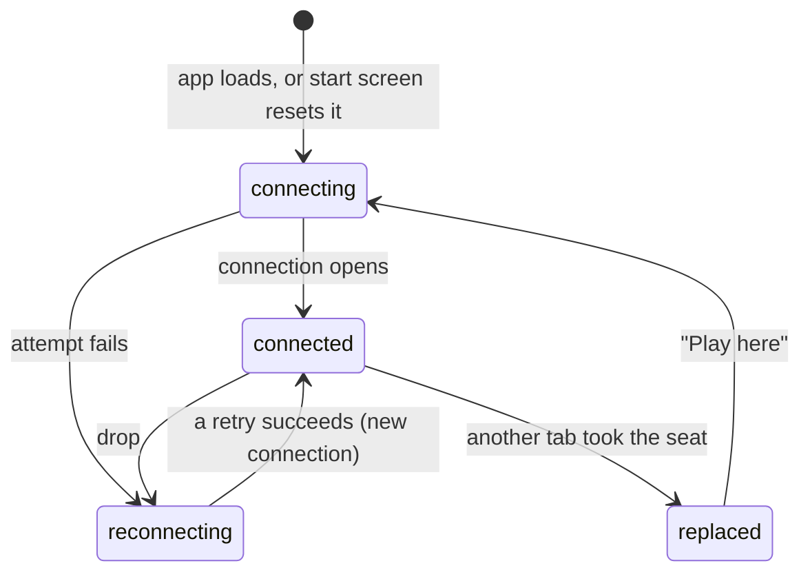

# The connection and seat model

## Summary

Everything a player does in 3D Chess travels over one live connection between the browser tab and the server, and everything the player sees is worked out from what the server has said on it. This document owns that model: what the server keeps about a game, what a seat is and how a browser remembers it, the four connection states and what the player sees in each, what happens to requests made while disconnected, how a new connection takes its seat back, how the opponent's presence is reported, and what happens when two connections claim the same seat. Feature documents link here for these facts rather than restating them.

## What the server keeps

For each [game](../glossary.md#games-and-seats) the server keeps exactly two things: which seats have been taken, and the [move record](../glossary.md#games-and-seats). It keeps no board, no result, no names, no clock, and no record of who is looking. It never learns that a game has ended; checkmate and stalemate exist only in the players' browsers (see [the rules](game-rules.md#who-enforces-the-rules)).

The record survives everything that can happen to connections: drops, reloads, both players leaving, and the server itself restarting. A game is deleted only by [expiry](../glossary.md#games-and-seats), about 30 days after it was last active. After that its link leads to a game the server does not know, and there is no way to recover it.

Separately, and only while the server is running, it remembers which live connection holds which seat. This is what it forgets when a connection closes: the seat stays taken, but nobody is connected to it until a new connection [rejoins](#rejoining).

A connection can be tied to at most one game in its life. Once a connection has created, joined, or rejoined a game, any further create, join, or rejoin on it is refused with "Already in a game". The app never tries, because every new game or new visit starts on a fresh connection (see [returning to the start screen](#returning-to-the-start-screen)).

## Seats

A game has two [seats](../glossary.md#games-and-seats), white and black.

- The creator's seat is taken when the game is created, with its color chosen at random by the server. See [creating a game](../start/creating-a-game.md).
- The joiner takes whichever seat is left. A join on a game with both seats taken is refused with "Game full", whether or not either player is connected. See [joining a game](../start/joining-a-game.md).
- A seat, once taken, is held for the life of the game. There is no leaving a game, no giving up a seat, and no third seat for a spectator.

The server checks nothing about *who* holds a seat: any connection that names a game and one of its taken colors gets that seat. In the app, only a browser with a [stored seat](#the-stored-seat) ever does this, so in practice a seat belongs to the browser that took it.

## The stored seat

The browser remembers the seat it holds in each game as a [stored seat](../glossary.md#games-and-seats) in its local storage, one entry per game id. The stored seat is what makes a game page reopen as a player instead of a visitor.

- **Written** the moment the server assigns a seat: when the new game's id arrives on the start screen, and on the game page when the server confirms a join or announces that the game has started. Writing the same color again changes nothing.
- **Read** every time a game page opens. A stored seat makes the page [rejoin](#rejoining) automatically; no stored seat makes the page show the [join screen](../start/joining-a-game.md).
- **Deleted** in one situation only: the server refuses the rejoin ("No such seat to rejoin" or "Cannot rejoin") before the page has received any snapshot and before the game has started on that page. That means the stored seat is stale, typically because the game expired. The page then falls back to the join screen and shows the refusal in the [error banner](../game-page/error-banner.md).
- **Kept** in every other case, including after the game has ended. A finished game's link reopens the finished game, end-game dialog and all.

The stored seat is shared by every tab and window of the same browser profile, which is why a second tab of the same game takes the seat rather than joining as the opponent (see [a second tab](../session/second-tab.md)). It is not shared with another browser, another profile, or a private window. Clearing the browser's site data forgets every stored seat; opening such a game's link afterwards shows the join screen, and joining is refused with "Game full" because both seats are still taken. The player cannot get the seat back through the app.

If the browser refuses to store anything (storage disabled), writes fail silently and reads find nothing. The current page keeps working as long as its connection lasts, with the exceptions listed in [creating a game](../start/creating-a-game.md#edge-cases), but a reload loses the seat.

## Connection states

The tab opens its connection as soon as the app loads, on the start screen or a game page, and keeps it open while the tab stays on the app. At any moment the connection is in one of four [states](../glossary.md#the-connection):

| State | Meaning | Start screen shows | Game page shows |
| --- | --- | --- | --- |
| connecting | The first attempt after the app loaded or the start screen reset it. | "Connecting to server…" under the button | Nothing extra. The board, if shown, does not take input. |
| connected | The connection is open. | Nothing extra | Nothing extra |
| reconnecting | The connection failed or dropped, and the browser is retrying on its own. | "Reconnecting to server…" under the button | The amber "Reconnecting…" box at the top right. The board does not take input. |
| replaced | The server closed this connection because another tab or window of this browser took the seat. No retry happens. | Cannot occur | The [replaced dialog](../session/second-tab.md) over everything |

The **retry schedule** after a failure or drop is fixed: the browser waits 0.5 s, then 1 s, 2 s, 4 s, and then 8 s between every further attempt, forever. It starts over whenever a connection opens. There is no limit on attempts, no message that the server seems to be down, and no button to retry sooner. A tab left on the game page while the server is unreachable shows "Reconnecting…" indefinitely.

Every drop looks the same to the player, whatever caused it: the network going away, the laptop sleeping, the server restarting or being redeployed, a fault on the server, or the **one-hour limit** (the server ends every connection after at most an hour). The only drop that is not retried is a replacement.

Each connection that opens is new to the server: it does not know which game or seat the tab had. The page therefore [rejoins](#rejoining) after every reconnect, not only after a reload.

## Requests while disconnected

A request made while the connection is not open is treated according to its kind:

- **Create, join, and rejoin** are [queued](../glossary.md#requests): held in the browser and sent, in order, the moment a connection opens. The page shows the request as made ("Creating Game...", "Joined game, waiting for start...") in the meantime.
- **Moves** are never queued. The board does not take input unless the connection is connected, so a move cannot normally be made while disconnected; a move that was somehow still waiting to be sent when a new connection opened is [dropped](../glossary.md#requests). The position may have moved on by then, and the board never showed the move, so dropping it is invisible: the player simply moves again.

A request that was already sent when the connection dropped is not re-sent. Whether the server recorded it is learned only from the next snapshot. For a move this is handled (see [making a move](../play/making-a-move.md)); for a create or a join, the page can be left waiting for an answer that will never come (see [creating a game](../start/creating-a-game.md#open-questions-and-verification) and [joining a game](../start/joining-a-game.md)).

## A move is shown only when the server returns it

The browser never moves a piece on its own authority. When the player plays a move, it is sent and the board is [held](../glossary.md#selection-and-board-state): the piece stays where it was, and the board takes no input, until the server's [echo](../glossary.md#requests) of the move arrives. The echo goes to both players at the same moment, and both boards then show the move with the same [glide](the-view.md#motion). If the server refuses the move, the board is released and the error is shown. If the connection drops first, the board is released as soon as a new connection opens, and the next snapshot shows whether the move was recorded.

This is what keeps the two boards identical: each is replayed from the same record, and neither ever shows a move the server has not accepted.

## Rejoining

A [rejoin](../glossary.md#the-connection) is the request that tells the server "this connection is seat *color* of game *id*". The game page sends it by itself, once per connection, whenever:

- the page has a stored seat for the game in its address, and
- the current connection has not already been given a seat (the creator arriving from the start screen, and the joiner right after joining, already have one).

That covers opening a game page from a link or bookmark, reloading it, and every reconnect after a drop or a "Play here". The rejoin is queued if the connection is not yet open.

The server answers with a [snapshot](../glossary.md#requests): the seat's color, whether both seats are taken, and the entire move record. The page replaces what it knew with the snapshot, so a move is never counted twice, and it shows the result: the board screen if the game has started, otherwise the share-link screen. The server then tells the rejoining player whether the opponent is connected and tells the opponent that the player is back.

What the player sees while the rejoin is in flight depends on what the page already knew:

- **On a fresh page load**, nothing yet says the game has started, so a player with a stored seat sees the [share-link screen](../start/waiting-for-an-opponent.md), "Game created! Share this link with a friend:", until the snapshot arrives. For a creator of an unstarted game this is correct. For a joiner, or any player of a started game, it is a flash of the wrong screen, normally too short to read; while the server is unreachable it stays up, with "Reconnecting…", for as long as the outage lasts.
- **After a mid-game drop**, the page still knows the game had started, so it stays on the board screen, showing the position as it was before the drop. The board takes input again as soon as the connection opens, a moment before the snapshot arrives; a move pressed in that moment is played against the old position, which can go wrong (see [connection loss](../session/connection-loss.md#while-in-flight)). When the snapshot arrives, the board is replaced by the position it describes (with the latest move gliding in if it is one the player had not seen), and any selection is cleared.

If the rejoin is refused, the page shows the error. Before any snapshot and before the game has started on the page, a refusal of "No such seat to rejoin" or "Cannot rejoin" also deletes the stored seat and shows the join screen. See [reloading and returning](../session/reload-and-return.md).

## Last connection wins

If a rejoin names a seat that another live connection already holds, the server gives the seat to the new connection and closes the old one with a signal that means "you were replaced". This is deliberate: a tab that was reloaded often leaves its old connection half-open for a while, and refusing the new one would lock the player out of their own game.

The old tab, on receiving that signal, does not retry. It shows the [replaced dialog](../session/second-tab.md), whose "Play here" button opens a new connection and rejoins, which in turn replaces the other tab. At any moment exactly one tab plays the seat; they never play it at once, and they never fight over it without the player clicking.

The opponent sees none of this except "Opponent: online" being repeated: a connection replaced by the same player's newer one is never reported as the player leaving.

## Presence

[Presence](../glossary.md#the-connection) is whether the opponent has a live connection to the game. The server reports it at these moments:

- When a player joins: the joiner is told whether the creator is connected, and the creator is told that the joiner is online.
- When a player rejoins: the rejoining player is told whether the opponent is connected, and the opponent is told that the player is online.
- When a player's live connection closes (drop, reload, closing the tab, returning to the start screen): the opponent is told that the player is offline. A replaced connection closing does not count.

The board screen shows the latest report about the opponent as "Opponent: online" or "Opponent: offline" under the seat label; see [seat and opponent status](../game-page/seat-and-opponent-status.md). Nothing is shown before the first report. While this player's own connection is down, the last report stays on screen even though it may no longer be true.

Presence is information only. A player may move while the opponent is offline; the move is recorded and the opponent sees it in the snapshot when they return.

## Returning to the start screen

Arriving at the start screen by any route (the end-game dialog's "Start new game", browser Back, or the crash screen's "Back to start") [resets](../glossary.md#events-that-end-or-interrupt-a-request) the connection if anything has been sent or received on it: the page forgets everything the server said, closes the connection, and opens a fresh one. The server sees the player's connection close, so the opponent is told the player is offline. The stored seat is kept, so going Forward, or opening the link again, rejoins the game.

This is what guarantees that a new game starts on a connection with no game tied to it.

## Open questions and verification

- The ~30-day expiry is the storage provider's inactivity rule, quoted from the repository README. Whether reading a game (a rejoin) counts as activity, or only writing to it (a join or a move), is not stated anywhere in the repository; a game that is only ever looked at may expire 30 days after its last move.
- The share-link screen shown to a returning joiner while a rejoin is in flight says "Game created! Share this link with a friend:", which is wrong for a joiner and for any started game. It is normally too brief to notice, except during an outage. May be worth treating as a copy bug.
- Presence keeps showing the last report while this player is reconnecting, so "Opponent: online" can be stale. Read from code.
- A player who clears site data, or switches browsers, cannot recover their seat through the app: the join is refused with "Game full" and there is no other way in. Whether that is acceptable is a product call.
- The window between a reconnect opening and its snapshot arriving, during which the board takes input against the pre-drop position, is read from code and is at most one round trip long. A move pressed in it can be recorded against a position up to two moves old (or any number, after a replacement); see [connection loss](../session/connection-loss.md#open-questions-and-verification). This may be worth treating as a bug.
- The retry schedule, queueing, dropped moves, the replaced state, and last-connection-wins are covered by `client/src/hooks/useGameSocket.test.ts`, `server/tests/test_local_ws.py`, and `client/e2e/session.spec.ts`.

Verified against 3D Chess commit `d94507b`
