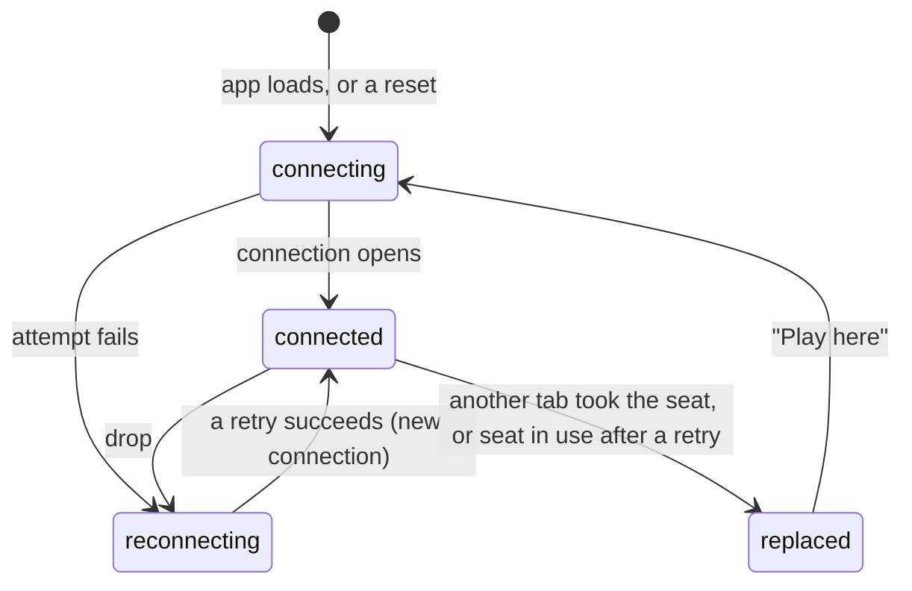

# The connection and seat model

## Summary

Everything a player does in 3D Chess travels over one live connection between the browser tab and the server, and everything the player sees is worked out from what the server has said on it. This document owns that model: what the server keeps about a game, what a seat is and how a browser remembers it, the tab's client id, the four connection states and what the player sees in each, what happens to requests made while disconnected or lost to a drop, how a new connection takes its seat back, how the opponent's presence is reported, and what happens when two connections claim the same seat. Feature documents link here for these facts rather than restating them.

## What the server keeps

For each [game](../glossary.md#games-and-seats) the server keeps three things: which seats have been taken, the [client id](#the-client-id) of the tab that claimed each one, and the [move record](../glossary.md#games-and-seats). It keeps no board, no result, no names, no clock, and no record of who is looking. It never learns that a game has ended; checkmate and stalemate exist only in the players' browsers (see [the rules](game-rules.md#who-enforces-the-rules)).

The record survives everything that can happen to connections: drops, reloads, both players leaving, and the server itself restarting. A game is deleted only by [expiry](../glossary.md#games-and-seats), about 30 days after it was last active. After that its link leads to a game the server does not know, and there is no way to recover it.

Separately, and only while the server is running, it remembers which live connection holds which seat, and which client id that connection announced. This is what it forgets when a connection closes: the seat stays taken, but nobody is connected to it until a new connection [rejoins](#rejoining).

A connection can be tied to at most one game in its life. Once a connection has created, joined, or rejoined a game, any further create, join, or rejoin on it is refused with "Already in a game". A rejoin refused as [seat in use](#last-connection-wins) does not tie the connection to the game. The app never sends a second request on a tied connection, because every new game or new visit starts on a fresh connection (see [returning to the start screen](#returning-to-the-start-screen)).

## Seats

A game has two [seats](../glossary.md#games-and-seats), white and black.

- The creator's seat is taken when the game is created, with its color chosen at random by the server. See [creating a game](../start/creating-a-game.md).
- The joiner takes whichever seat is left. A join on a game with both seats taken is refused with "Game full", whether or not either player is connected, with one exception: a join from the tab that already claimed a seat in this game gets that seat back (see [the client id](#the-client-id)). See [joining a game](../start/joining-a-game.md).
- A seat, once taken, is held for the life of the game. There is no leaving a game, no giving up a seat, and no third seat for a spectator.

The server checks nothing about *who* holds a seat when a connection rejoins: any connection that names a game and one of its taken colors gets that seat (subject to [taking over](#last-connection-wins)). In the app, only a browser with a [stored seat](#the-stored-seat) ever does this, so in practice a seat belongs to the browser that took it.

## The stored seat

The browser remembers the seat it holds in each game as a [stored seat](../glossary.md#games-and-seats) in its local storage, one entry per game id. The stored seat is what makes a game page reopen as a player instead of a visitor.

- **Written** the moment the server assigns a seat: when the new game's id arrives on the start screen, and on the game page when the server confirms a join or announces that the game has started. Writing the same color again changes nothing.
- **Read** every time a game page opens. A stored seat makes the page [rejoin](#rejoining) automatically; no stored seat makes the page show the [join screen](../start/joining-a-game.md).
- **Deleted** in one situation only: the server refuses the rejoin ("No such seat to rejoin" or "Cannot rejoin") before the page has received any snapshot and before the game has started on that page. That means the stored seat is stale, typically because the game expired. The page then falls back to the join screen and shows the refusal in the [error banner](../game-page/error-banner.md). A rejoin refused as seat in use does not delete it.
- **Kept** in every other case, including after the game has ended. A finished game's link reopens the finished game, end-game dialog and all.

The stored seat is shared by every tab and window of the same browser profile, which is why a second tab of the same game takes the seat rather than joining as the opponent (see [a second tab](../session/second-tab.md)). It is not shared with another browser, another profile, or a private window. Clearing the browser's site data forgets every stored seat; opening such a game's link afterwards shows the join screen. In a new tab, joining is then refused with "Game full" because both seats are still taken, and the player cannot get the seat back through the app. Only the tab that claimed the seat, and still has its client id, gets it back by clicking "Join Game".

If the browser refuses to store anything (storage disabled), writes fail silently and reads find nothing. The current page keeps working as long as it stays open, with the exceptions listed in [creating a game](../start/creating-a-game.md#edge-cases), but a reload loses the seat.

## The client id

Each browser tab picks a random [client id](../glossary.md#requests) for itself the first time it creates, joins, or rejoins, and sends it with every one of those requests. The server records, per game, which client id claimed each seat, and remembers the client id of every live connection.

- The id lives as long as the tab: a reload keeps it, and closing the tab loses it. It is kept in the tab's session storage, which is not shared with other tabs, so two tabs of one browser are two clients even though they share the stored seat.
- A tab duplicated with the browser's "Duplicate tab" starts with a copy of the original's session storage, and so with the same client id.
- If the browser refuses session storage, the tab uses an id that lasts only until the page is reloaded.

The client id does two things, and nothing else:

1. **A join can be repeated.** A join from the tab that claimed a seat in the game gets that seat back instead of "Game full". This is what makes a [re-sent](#requests-while-disconnected) join safe, and it also means a joiner who reloads before the answer arrived, and so has no stored seat and sees the join screen again, can click "Join Game" in the same tab and land in their seat. A repeated join is answered like a rejoin: a seat confirmation followed by a snapshot of the whole record, so the page shows the game as it stands, with any moves recorded in the meantime. The opponent is only told the player is online again; nobody is sent a second start notice. If the other seat is still free, the snapshot says the game has not started, and the page waits on the joined screen until the opponent arrives.
2. **An automatic rejoin can tell its own tab from another.** See [last connection wins](#last-connection-wins).

## Connection states

The tab opens its connection as soon as the app loads, on the start screen or a game page, and keeps it open while the tab stays on the app. At any moment the connection is in one of four [states](../glossary.md#the-connection):

| State | Meaning | Start screen shows | Game page shows |
| --- | --- | --- | --- |
| connecting | The first attempt after the app loaded, after a reset, or after "Play here". | "Connecting to server…" under the button | Nothing extra. The board, if shown, does not take input. |
| connected | The connection is open. | Nothing extra | Nothing extra. After every new connection the board takes no input until the rejoin's snapshot arrives. |
| reconnecting | The connection failed or dropped, and the browser is retrying on its own. | "Reconnecting to server…" under the button | The amber "Reconnecting…" box at the top right. The board does not take input. |
| replaced | Another tab or window of this browser holds the seat: either the server closed this connection because the other tab took the seat, or this tab's connection came back after a drop and the server answered that the seat is in use. No retry happens. | Cannot occur | The [replaced dialog](../session/second-tab.md) over everything |

In the second kind of *replaced*, the connection itself stays open but holds no seat; the player sees the same dialog either way.

The **retry schedule** after a failure or drop is fixed: the browser waits 0.5 s, then 1 s, 2 s, 4 s, and then 8 s between every further attempt, forever. It starts over whenever a connection opens. There is no limit on attempts, no message that the server seems to be down, and no button to retry sooner. A tab left on the game page while the server is unreachable shows "Reconnecting…" indefinitely.

Every drop looks the same to the player, whatever caused it: the network going away, the laptop sleeping, the server restarting or being redeployed, a fault on the server, or the **one-hour limit** (the server ends every connection after at most an hour). The only close that is not retried is the [replaced signal](../glossary.md#the-connection).

Each connection that opens is new to the server: it does not know which game or seat the tab had. The page therefore [rejoins](#rejoining) after every reconnect, not only after a reload. Anything still arriving on an old connection after the page has moved on to a new one is ignored.

## Requests while disconnected

A request made while the connection is not open is treated according to its kind:

- **Create, join, and rejoin** are [queued](../glossary.md#requests): held in the browser and sent, in order, the moment a connection opens. The page shows the request as made ("Creating Game...", "Joined game, waiting for start...") in the meantime.
- **Moves** are never queued. The board does not take input unless the connection is connected and the seat is confirmed on it, so a move cannot normally be made while disconnected; a move that was somehow still waiting to be sent when a new connection opened is [dropped](../glossary.md#requests). The position may have moved on by then, and the board never showed the move, so dropping it is invisible: the player simply moves again.

A request that was already sent when the connection dropped, and whose answer never arrived, is handled according to its kind:

- **Create and join** are [re-sent](../glossary.md#requests) on every new connection until they are answered. A create is answered by the new game's id or an error; a join by the seat confirmation, the start of the game, or an error that returns the page to the join screen. A request that was queued and then went out on the next connection is not sent twice. Repeating either is safe: a repeated create may leave a second, unused game on the server, which expires like any other, and a repeated join gets the same seat back through the client id. The page keeps showing "Creating Game..." or "Joined game, waiting for start..." until the answer comes. See [creating a game](../start/creating-a-game.md) and [joining a game](../start/joining-a-game.md).
- **Rejoin** needs no repeat: every new connection sends its own.
- **A move** is not re-sent. Whether the server recorded it is learned from the next snapshot; see [making a move](../play/making-a-move.md).

## A move is shown only when the server returns it

The browser never moves a piece on its own authority. When the player plays a move, it is sent and the board is [held](../glossary.md#selection-and-board-state): the piece stays where it was, and the board takes no input, until the server's [echo](../glossary.md#requests) of the move arrives. The echo goes to both players at the same moment, and both boards then show the move with the same [glide](the-view.md#motion). If the server refuses the move, the board is released and the error is shown. If the connection drops first, the hold ends with that connection, but the board takes input again only once the next connection's snapshot has arrived, and that snapshot shows whether the move was recorded.

This is what keeps the two boards identical: each is replayed from the same record, and neither ever shows a move the server has not accepted.

## Rejoining

A [rejoin](../glossary.md#the-connection) is the request that tells the server "this connection is seat *color* of game *id*". The game page sends it by itself, once per connection, whenever:

- the page has a stored seat for the game in its address, and
- the current connection has not already been given a seat (the creator arriving from the start screen, and the joiner right after joining, already have one).

That covers opening a game page from a link or bookmark, reloading it, arriving at it through history, and every reconnect after a drop or a "Play here". The rejoin is only sent once the connection is open, never queued, so a connection that drops and returns before the answer sends exactly one more. It carries the tab's client id and says whether it may [take over](#last-connection-wins) the seat from another tab: a page's rejoins take over until one of them has been answered (so a page whose first answer is lost to a drop still takes the seat), and so does the one after "Play here"; once the page has held the seat, every rejoin sent automatically after a drop does not.

The server answers with a [snapshot](../glossary.md#requests): the seat's color, whether both seats are taken, and the entire move record. The page replaces what it knew with the snapshot, so a move is never counted twice, and it shows the result: the board screen if the game has started, otherwise the share-link screen. The server then tells the rejoining player whether the opponent is connected and tells the opponent that the player is back.

What the player sees while the rejoin is in flight depends on what the page already knew:

- **On a fresh page load**, nothing yet says the game has started, so a player with a stored seat sees the [share-link screen](../start/waiting-for-an-opponent.md), "Game created! Share this link with a friend:", until the snapshot arrives. For a creator of an unstarted game this is correct. For a joiner, or any player of a started game, it is a flash of the wrong screen, normally too short to read; while the server is unreachable it stays up, with "Reconnecting…", for as long as the outage lasts.
- **After a mid-game drop or "Play here"**, the page still knows the game had started, so it stays on the board screen, showing the position as it was before. The board does not take input from the drop until the snapshot arrives, even though the connection is open for a moment before that; nothing on screen marks that moment. When the snapshot arrives, the board is replaced by the position it describes (with the latest move gliding in if it is one the player had not seen), any selection is cleared, and the board takes input again.

If the rejoin is refused, the page shows the error, except for seat in use, which shows the replaced dialog instead of the error banner. Before any snapshot and before the game has started on the page, a refusal of "No such seat to rejoin" or "Cannot rejoin" also deletes the stored seat and shows the join screen. See [reloading and returning](../session/reload-and-return.md).

## Last connection wins

If a rejoin that may take over names a seat that another live connection already holds, the server gives the seat to the new connection and closes the old one with a signal that means "you were replaced". This is deliberate: a tab that was reloaded often leaves its old connection half-open for a while, and refusing the new one would lock the player out of their own game. Opening the game in a new tab, reloading, and "Play here" all take over, so the tab the player has just chosen always gets the seat.

An automatic rejoin after a drop does not take over. If another tab's live connection holds the seat when it arrives, the server refuses it as **seat in use** ("This game is open in another tab"), leaves the other tab alone, and the reconnected tab shows the replaced dialog instead of the board. This covers the case where the player's tab lost its connection, they opened the game in another tab meanwhile, and then the first tab's connection came back: the tab they moved to keeps playing. If the live connection holding the seat belongs to the same tab (its own old connection, still half-open on the server), the automatic rejoin replaces it as usual.

The replaced tab, whichever way it got there, does not retry. It shows the [replaced dialog](../session/second-tab.md), whose "Play here" button opens a new connection and rejoins with take-over, which in turn replaces the other tab. At any moment exactly one tab plays the seat; they never play it at once, and they never take it from each other without the player clicking or opening the game again.

The opponent sees none of this except "Opponent: online" being repeated: a connection replaced by the same player's newer one is never reported as the player leaving, and a rejoin refused as seat in use reports nothing.

## Presence

[Presence](../glossary.md#the-connection) is whether the opponent has a live connection to the game. The server reports it at these moments:

- When a player joins: the joiner is told whether the creator is connected, and the creator is told that the joiner is online. A repeated join does the same again.
- When a player rejoins: the rejoining player is told whether the opponent is connected, and the opponent is told that the player is online.
- When a player's live connection closes (drop, reload, closing the tab, returning to the start screen): the opponent is told that the player is offline. A replaced connection closing does not count.

The board screen shows the latest report about the opponent as "Opponent: online" or "Opponent: offline" under the seat label; see [seat and opponent status](../game-page/seat-and-opponent-status.md). Nothing is shown before the first report. While this player's own connection is down, the last report stays on screen even though it may no longer be true.

Presence is information only. A player may move while the opponent is offline; the move is recorded and the opponent sees it in the snapshot when they return.

## Returning to the start screen

Arriving at the start screen by any route (the end-game dialog's "Start new game", browser Back, or the crash screen's "Back to start") [resets](../glossary.md#events-that-end-or-interrupt-a-request) the connection if anything has been sent or received on it: the page forgets everything the server said, drops any queued request, closes the connection, and opens a fresh one. Browser Back or Forward straight from one game's page to another's resets it the same way. The server sees the player's connection close, so the opponent is told the player is offline. Nothing is sent until the fresh connection opens, and anything the old connection still delivers is ignored. The stored seat is kept, so going Forward, or opening the link again, rejoins the game.

This is what guarantees that a new game, or another game's page, starts on a connection with no game tied to it.

## Open questions and verification

- The ~30-day expiry is the storage provider's inactivity rule, quoted from the repository README. Whether reading a game (a rejoin) counts as activity, or only writing to it (a join or a move), is not stated anywhere in the repository; a game that is only ever looked at may expire 30 days after its last move.
- The share-link screen shown to a returning joiner while a rejoin is in flight says "Game created! Share this link with a friend:", which is wrong for a joiner and for any started game ([bug-triage B-12](../bug-triage.md)). It is normally too brief to notice, except during an outage.
- Presence keeps showing the last report while this player is reconnecting, so "Opponent: online" can be stale ([bug-triage B-16](../bug-triage.md)). Read from code.
- A player who clears site data, or switches browsers or tabs, cannot recover their seat through the app: the join is refused with "Game full" and there is no other way in. Only the tab that claimed the seat can join back into it. Whether that is acceptable is a product call.
- A creator who loses the stored seat but keeps the tab (for example by clearing only local storage and reloading) and clicks "Join Game" gets their seat back as a repeated join, but the page shows the joined screen ("Joined game, waiting for start...") rather than the share-link screen until the opponent arrives. Read from `server/modal_app.py` and `client/src/game/session.ts`; not tried.
- A duplicated tab shares the original's client id, so an automatic rejoin in either can take the seat from the other without a click. Read from code; not tried.
- A tab shown the replaced dialog because of seat in use keeps its connection open without a seat. If that connection later drops and returns after the other tab has closed, its automatic rejoin gets the seat back and the dialog goes away without a click. Read from code; not tried.
- The retry schedule, queueing, dropped moves, the replaced state, last-connection-wins, seat in use, re-sent joins and creates, and the wait for the snapshot are covered by `client/src/hooks/useGameSocket.test.ts`, `client/src/App.test.tsx`, `server/tests/test_local_ws.py`, and `client/e2e/session.spec.ts`.

Verified against 3D Chess commit `4e18386`
