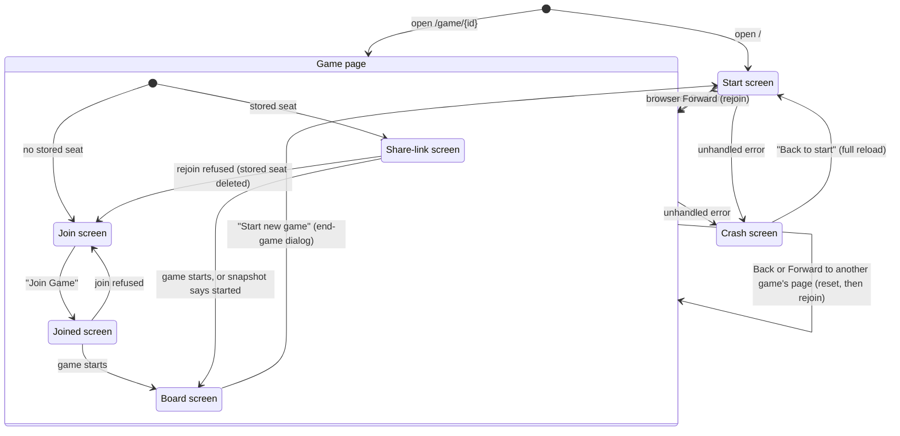

# Screens and navigation

## Summary

3D Chess has two addresses: the [start screen](../glossary.md#the-product-and-its-screens) at `/` and the [game page](../glossary.md#the-product-and-its-screens) at `/game/{id}`. The game page shows one of four screens depending on its [phase](../glossary.md#the-product-and-its-screens) and whether the browser holds a seat, and a crash screen can replace either page. This document owns that map: what each address shows, how the game page decides which screen to show, how the player moves between pages (buttons, browser Back and Forward, typed addresses), what survives each move, and the crash screen. It is a foundation; the features on each screen have their own documents.

## The map

## The start screen

The page at `/`: the title "3D Chess", the "Start New Game" button, and, while the connection is not open, a gray status line. Errors appear in red under the button. The whole screen and its one request are described in [creating a game](../start/creating-a-game.md).

The start screen is where every route out of a game leads, and arriving at it by any route [resets the connection](connection-and-seat.md#returning-to-the-start-screen).

## The game page and its phases

The page at `/game/{id}`. The id in the address is all the page starts with; it does not check its format, so any text after `/game/` opens a game page, and whether such a game exists is learned only when the player joins or the page rejoins.

The page's [phase](../glossary.md#the-product-and-its-screens) is worked out from what the server has said on this page, and from nothing else:

| Phase | When | Screen shown |
| --- | --- | --- |
| Before joining | Nothing says the game has started, and the player has not clicked "Join Game" and has not been confirmed in a seat. | With a [stored seat](connection-and-seat.md#the-stored-seat): the **share-link screen** ("Game created! Share this link with a friend:" and the link). Without one: the **join screen** (a "Join Game" button). |
| Joined | The player clicked "Join Game", or the server confirmed a joined seat, and the game has not started. | The **joined screen**: "Joined game, waiting for start...". |
| Playing | The server announced the game's start, or a snapshot said both seats are taken. | The **board screen**: the 3D board filling the window with the [HUD](../glossary.md#input) over it. |

The first three screens share one look: a dark page with the title "3D Chess" and a single centered element (the share-link screen adds a "Copy link" button where the browser allows copying). The board screen is entirely different: a light gray-blue 3D scene with no title, exactly the size of the window, which never scrolls.

Once the page reaches the playing phase it stays there for as long as the page is open. The board, and the ability to [turn the view](the-view.md#turning-the-view), exist only in the playing phase; before both seats are taken there is nothing to look at.

Overlays appear on top of whichever screen is showing:

- the amber "Reconnecting…" box at the top right, while the connection is reconnecting (every screen);
- the red [error banner](../game-page/error-banner.md) at the bottom center, for the latest server error (every screen);
- the [replaced dialog](../session/second-tab.md), while another tab holds the seat (every screen);
- on the board screen only: the [promotion dialog](../play/promotion.md), the [end-game dialog](../play/check-and-game-end.md), and the [frozen-board banner](../cross-cutting/broken-game-record.md).

The three dialogs work the same way. Each covers the whole window with a darkened backdrop, puts keyboard focus on its first button ("Play here", "Start new game", "Queen"), and makes everything behind it inert: the board, the HUD, or the screen's own content cannot be clicked, reached with Tab, or read by a screen reader until the dialog goes away. (On the share-link, join, and joined screens, the error banner is not part of that content: its "✕" can still be reached with Tab behind the replaced dialog, though not clicked.) Only the promotion dialog can be dismissed without answering it (see [the input model](input-model.md#html-controls-and-the-keyboard)).

The screens themselves are described in [waiting for an opponent](../start/waiting-for-an-opponent.md) (share-link), [joining a game](../start/joining-a-game.md) (join and joined), and the `play/` and `game-page/` documents (board).

## Moving between pages

The app changes pages in three ways of its own, and the browser adds its usual controls:

| Action | From | To | What happens to the game on this page |
| --- | --- | --- | --- |
| The new game's id arrives after "Start New Game" | start screen | the new game page | The page arrives already holding the creator's seat; no rejoin. A new history entry is added. |
| "Start new game" in the end-game dialog | board screen | start screen | The connection is reset: the opponent sees "Opponent: offline". A new history entry is added, so Back returns to the finished game. |
| "Back to start" on the crash screen | crash screen | start screen | A full page load, like typing the address. |
| Browser Back or Forward to the start screen | game page | start screen | The connection is reset, as above. |
| Browser Back or Forward to a game page | start screen | game page | A game page opened fresh: it rejoins with the stored seat, or shows the join screen without one. |
| Browser Back or Forward straight to another game's page | game page | another game page | The connection is reset, as on arriving at the start screen, and the other game's page is opened fresh: nothing of the first game's page (a join in flight, dismissed errors, a move awaiting its echo) carries over. It rejoins with that game's stored seat, or shows the join screen. |
| Typing or pasting a game link, opening a bookmark, following a link | anywhere | game page | A full page load: a new connection, then a rejoin or the join screen. |
| Reload | either page | the same page | A full page load. Everything on the page is rebuilt from the server; see [reloading and returning](../session/reload-and-return.md). |

What survives each of these: the [stored seat](connection-and-seat.md#the-stored-seat) always survives, the server's record of the game always survives, and the tab's [client id](connection-and-seat.md#the-client-id) survives everything but closing the tab. Everything else (the selection, the view's angle and zoom, a dismissed error, an open promotion dialog, text in the move box, a request that was queued or in flight) belongs to the page and is lost.

The page title is "3D Chess — Online Multiplayer" on every page and never changes, so a tab in the background gives no sign that it is the player's turn or that an opponent has joined.

## Addresses the app does not know

Only `/` and `/game/{id}` are pages. Any other address inside the app (for example `/game/` with no id, or `/games`) shows an empty dark page: no title, no message, no link home. The connection is still opened in the background. This looks like an omission; see open questions.

A game id that does not exist, or has expired, opens a normal game page: the join screen for a visitor, whose "Join Game" is then refused with "Cannot join", or, with a stale stored seat, the share-link screen until the rejoin is refused. See [joining a game](../start/joining-a-game.md) and [reloading and returning](../session/reload-and-return.md).

## The crash screen

If the page hits an error it cannot handle while drawing itself, the whole page is replaced by the crash screen: the heading "Something went wrong", the sentence "The app hit an unexpected error. Your game lives on the server, so reloading is safe — it will restore the current position.", and a "Back to start" link.

"Back to start" loads `/` from scratch, like typing the address; it is a link, so it can also be opened in a new tab. Reloading the page instead, as the sentence suggests, reopens the game page and rejoins. Nothing on the crash screen says what went wrong. Replacing the page also closes its connection, so the opponent sees "Opponent: offline" as soon as the crash screen appears.

The crash screen is a last resort. A move record the browser cannot replay does not crash the page; it freezes the board with a banner instead ([the broken game record](../cross-cutting/broken-game-record.md)). Whether a browser that cannot draw 3D at all reaches the crash screen or shows an empty board screen is not known; see [screen sizes and touch](../cross-cutting/screen-sizes-and-touch.md).

## Cancel and interrupt

Navigation has no request of its own, but each interrupt row applies to the page as a whole:

| Event | Before sending | While in flight |
| --- | --- | --- |
| Escape or Cancel | No effect on navigation. | No effect. |
| Pressing elsewhere or turning the view | No effect on navigation. | No effect. |
| Leaving the game page within the app | Resets the connection on arrival at the start screen or at another game's page; see the table above. | Any request in flight is abandoned by the page, and a create or join is no longer re-sent; the server may still record it. See each feature's own table. |
| The game ends | The end-game dialog appears over the board screen; its only way out is "Start new game". | Same. |
| The server answers with an error | Shown on the page that is open when it arrives: in red under the button on the start screen, in the error banner on the game page. | Same. |
| The connection drops | The page stays where it is and shows its reconnecting indicator; the board screen stays up, and its board takes no input until the rejoin's snapshot arrives. | Same. |
| The window loses focus or the tab is hidden | No effect; the page keeps its connection and phase. | No effect. |
| Reload or closing the tab | Everything but the stored seat and the server's record is lost. | Same; the answer to a request in flight is lost. |
| The opponent acts | Can move the game page from the share-link or joined screen to the board screen. | Same. |
| Another tab takes the seat | The replaced dialog appears on whichever game page screen is showing, including when this tab's reconnect finds the seat in use. | Same. |
| A second touch point or a cancelled touch | No effect on navigation. | No effect. |

## Interactions with other systems

**Seat and turn.** The stored seat decides whether a fresh game page shows the share-link screen or the join screen. The turn has no effect on navigation.

**The game record.** Survives every navigation. Each fresh game page rebuilds the position from it.

**Connection.** One connection per tab, opened when the app loads and kept across the in-app move from the start screen to a game page; reset on every arrival at the start screen and on every move from one game's page to another's; replaced by a new one on every full page load.

**The opponent.** Every route that closes this tab's connection (reset, reload, closing, a link away) makes the opponent see "Opponent: offline". Returning to the game makes them see "Opponent: online".

**Other tabs and devices.** Each tab navigates independently. Two tabs on the same game page of the same browser compete for the seat; see [a second tab](../session/second-tab.md).

**Game over.** A finished game's page still opens normally and shows the end-game dialog again as soon as the record is replayed.

**Stored seat.** Written by the start screen and the game page; never removed by navigation.

**Keyboard, touch, and screen size.** Browser Back and Forward work from the keyboard as usual. Each dialog takes keyboard focus when it opens, and everything behind it is out of reach until it goes away. Nothing on the pages changes with window size except layout: the game page's title shrinks below 640 pixels (the start screen's does not), the share link wraps anywhere, and the board screen's HUD stacks into more rows; see [screen sizes and touch](../cross-cutting/screen-sizes-and-touch.md).

## Edge cases

- **Back from a new game.** The start screen is usually the previous history entry of a new game page, so Back from a game the player just created returns to the start screen and resets the connection: the opponent, if seated, sees the creator go offline, and Forward rejoins.
- **Back from the start screen after a finished game.** "Start new game" adds a history entry, so Back from the start screen reopens the finished game, rejoins it, and shows the end-game dialog again.
- **Changing only the id in the address bar.** A full page load of the other game, never a switch within the page.
- **History between two games.** A player who has had two games open in the same tab can go Back or Forward from one game's page straight to the other's. The connection is reset on the way and the target game's page opens fresh, rejoining with its own stored seat; the address and the game shown always match.
- **Back and Forward before the fresh connection opens.** Going Back to the start screen and Forward again while the reset connection is still opening (quickly, or during an outage) sends nothing until it opens, then a single rejoin.
- **A game page with a lower-case id.** Ids are upper case; `/game/k7q2zd` is an unknown game, not the same one.
- **The crash screen reached before the connection opened.** "Back to start" still works; it does not need the connection.

## Open questions and verification

- Unknown addresses show an empty dark page with no way back but the address bar. This may be worth treating as a bug rather than documenting.
- The tab title never reflects the game's state (whose turn, opponent joined, game over). Whether a background indication is wanted is a product call.
- The phase rules, the dialogs' focus, and the inert page behind them are covered by `client/src/App.test.tsx`; the reset on returning to the start screen by `client/e2e/gameOver.spec.ts`; the crash screen by `client/src/components/ErrorBoundary.test.tsx`. Which real failures reach the crash screen is unconfirmed.
- The reset on moving from one game's page straight to another's, and the single rejoin after Back and Forward during an outage ([bug-triage B-10](../bug-triage.md)), are read from `client/src/App.tsx`, `client/src/hooks/useGameSocket.ts`, and `client/src/screens/GameScreen.tsx`. The jump is covered by `client/src/AppNavigation.test.tsx`, which also checks that the new game's page keeps its own stored seat; the single rejoin is not covered by a test.
- The claim that the crash screen closes the page's connection (the crashed page is taken down along with everything it owned) is read from code; not observed.
- Whether a browser without 3D support reaches the crash screen was not tried.

Verified against 3D Chess commit `90142a3`
