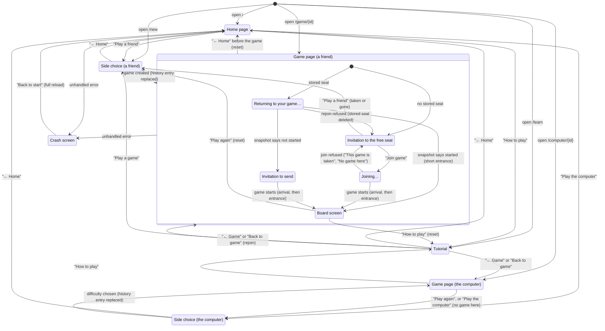

# Screens and navigation

## Summary

3D Chess has seven kinds of address: the [home page](../glossary.md#the-product-and-its-screens) at `/`; the [side choice](../glossary.md#the-product-and-its-screens) for a game against a friend at `/new` and against the computer at `/computer`; a game's page against a friend at `/game/{id}` and against the computer at `/computer/{id}`; and the [tutorial](../glossary.md#the-product-and-its-screens) at `/learn` and `/learn/{lesson}`. Any other address shows ["Nothing here"](#addresses-the-app-does-not-know). The side choices and a game's page before its game starts share one scene, the [lobby](../glossary.md#the-product-and-its-screens), which stays up without reloading as the page moves from one to the other. A game's page shows one of several screens depending on its [phase](../glossary.md#the-product-and-its-screens) and whether the browser holds a seat, and a crash screen can replace any page. This document owns that map: what each address shows, how a game's page decides which screen to show, how the player moves between pages (buttons, browser Back and Forward, typed addresses), what survives each move, and the crash screen. It is a foundation; the features on each screen have their own documents.

## The map

```mermaid
stateDiagram-v2
    state "Home page" as home
    state "Side choice (a friend)" as choose
    state "Side choice (the computer)" as choosec
    state "Game page (a friend)" as game {
        state "Returning to your game…" as returning
        state "Invitation to send" as invite
        state "Invitation to the free seat" as invitation
        state "Joining…" as taking
        state "Board screen" as board
        [*] --> returning : stored seat
        [*] --> invitation : no stored seat
        returning --> invite : snapshot says not started
        returning --> board : snapshot says started (short entrance)
        returning --> invitation : rejoin refused (stored seat deleted)
        invitation --> taking : "Join game"
        taking --> invitation : join refused ("This game is taken", "No game here")
        taking --> board : game starts (arrival, then entrance)
        invite --> board : game starts (arrival, then entrance)
    }
    state "Game page (the computer)" as cgame
    state "Tutorial" as learn
    state "Crash screen" as crash
    [*] --> home : open /
    [*] --> choose : open /new
    [*] --> game : open /game/{id}
    [*] --> cgame : open /computer/{id}
    [*] --> learn : open /learn
    home --> choose : "Play a friend"
    home --> choosec : "Play the computer"
    home --> learn : "How to play"
    choose --> home : "← Home"
    choosec --> home : "← Home"
    choose --> game : game created (history entry replaced)
    choosec --> cgame : difficulty chosen (history entry replaced)
    game --> home : "← Home" before the game (reset)
    board --> choose : "Play again" (reset)
    invitation --> choose : "Play a friend" (taken or gone)
    cgame --> choosec : "Play again", or "Play the computer" (no game here)
    board --> learn : "How to play" (reset)
    cgame --> learn : "How to play"
    learn --> home : "← Home"
    learn --> game : "← Game" or "Back to game" (rejoin)
    learn --> cgame : "← Game" or "Back to game"
    learn --> choose : "Play a game"
    home --> crash : unhandled error
    game --> crash : unhandled error
    crash --> home : "Back to start" (full reload)
```

## The home page

The page at `/`: the [preview](../glossary.md#the-product-and-its-screens) (the glass tower turning slowly in its garden while a sample game plays itself on it) fills the window, and a menu stands beside it: the title "3D Chess", two tiles, "Play a friend" and "Play the computer", and under them a quieter "How to play". These three are the page's only controls, and none sends anything. See [the home page](../start/the-home-page.md).

## The side choices

The page at `/new`: "Choose your side" over three kings on the lobby's glass, with "White", "Random", and "Black" under them, and "← Home" at the top left. A pick creates the game on the server and, once it has played out, replaces `/new` in the browser's history with the new game's page. It is where "Play a friend" on the home page, "Play again" after a game against a friend, an invitation's "Play a friend", and the tutorial's last "Play a game" lead. See [creating a game](../start/creating-a-game.md#the-side-choice).

The page at `/computer` is the same choice for a game against the computer, followed on the same page by "Choose difficulty": Easy, Medium, or Hard. Choosing a difficulty makes the game in the browser and replaces `/computer` in the history with the game's page, `/computer/{id}`. It is where "Play the computer" on the home page, "Play again" after a game against the computer, and "Play the computer" on an unknown computer game's page lead. See [playing the computer](../computer/playing-the-computer.md).

## The tutorial

The page at `/learn` (the first lesson, Setup) and `/learn/{lesson}` for one piece's lesson (`rook`, `bishop`, `unicorn`, `queen`, `king`, `knight`, `pawn`; any other name goes to `/learn`). It sends nothing to the server. Choosing a lesson from the card's row replaces the history entry; the card's next button moves to the next lesson as a new history entry, and after the last lesson leads to the side choice ("Play a game"). Opened from a game's "How to play", it leads back to that game instead ("← Game", "Back to game"). See [the tutorial](../learn/the-tutorial.md).

## A game's page and its phases

The page at `/game/{id}`. The id in the address is all the page starts with; it does not check its format, so any text after `/game/` opens a game page, and whether such a game exists is learned only when the server answers.

The page's [phase](../glossary.md#the-product-and-its-screens) is worked out from what the server has said on this page, and from nothing else:

| Phase | When | Screen shown |
| --- | --- | --- |
| Before joining | Nothing says the game has started, and the player has not clicked "Join game" and has not been confirmed in a seat. | With a [stored seat](connection-and-seat.md#the-stored-seat): "Returning to your game…" until the rejoin is answered, then the **invitation to send** ("Invite a friend" and the link). Without one: the **invitation to the free seat** (nothing until the server answers, then "You're invited to play …" with "Join game", or "This game is taken" or "No game here"). |
| Joined | The player clicked "Join game", or the server confirmed a joined seat, and the game has not started. | The invitation with the seat taken: "Joining…". |
| Playing | The server announced the game's start, or a snapshot said both seats are taken. | The **board screen**: the 3D board filling the window with the [HUD](../glossary.md#the-interface) over it. |

The screens before the game share one look: the lobby's glass and kings in the night garden, with "← Home" at the top left, a heading at the top that carries the story from one step to the next ("Choose your side", "You play Black", "You're invited to play White"), and buttons or a glass card under the kings ("Returning to your game…" alone is a line on a dark page, without the scene). The board screen is the whole tower in the same garden, with no title and no way home, exactly the size of the window, which never scrolls. When the game starts on a page that showed the lobby, the [arrival](../glossary.md#the-product-and-its-screens) plays, the lobby's camera ends on the board's first picture over level A's glass, which stays, and the board's [entrance](the-view.md#the-entrance) builds the tower on up from it; a page that opens on a game already under way goes straight to the board with a short entrance.

A game against the computer at `/computer/{id}` is the same page with the computer standing in for the server and the opponent: its game has always started, so it shows the board screen from the first moment (after the computer's arrival over the side choice when it was just made there). For an id this browser does not hold it shows "No game here" with "Play the computer". See [playing the computer](../computer/playing-the-computer.md).

Once the page reaches the playing phase it stays there for as long as the page is open. The board, and the ability to [turn the view](the-view.md#turning-the-view), exist only in the playing phase; before both seats are taken there is only the lobby, which cannot be turned.

Overlays appear on top of whichever screen is showing:

- the "Reconnecting…" line, while the connection is reconnecting (every screen of a game against a friend; at the top right, or on the board screen under the turn pill);
- the [error banner](../game-page/error-banner.md), for the latest server error (at the top center before the game starts, where "Cannot join" and "Game full" are said by the invitation instead; under the turn pill on the board screen);
- the [replaced dialog](../session/second-tab.md), while another tab holds the seat (every screen of a game against a friend);
- on the board screen only: the [promotion dialog](../play/promotion.md), the [result card](../play/check-and-game-end.md), the [frozen-board banner](../cross-cutting/broken-game-record.md), and "Couldn't load the board" with "Retry" if the 3D board failed to load.

The three dialogs work the same way. Each is a glass card over a veil that covers the whole window, puts keyboard focus on a button ("Play here", "Play again", "Queen"), and makes everything behind it inert: the board, the HUD, or the screen's own content cannot be clicked, reached with Tab, or read by a screen reader until the dialog goes away. (Before the game starts, the error banner is not part of that content: its "✕" can still be reached with Tab behind the replaced dialog, though not clicked.) The promotion dialog can be cancelled and the result card closed; the replaced dialog can only be answered (see [the input model](input-model.md#html-controls-and-the-keyboard)).

The screens themselves are described in [waiting for an opponent](../start/waiting-for-an-opponent.md) (the invitation to send, and the arrival), [joining a game](../start/joining-a-game.md) (the invitation to the free seat), and the `play/` and `game-page/` documents (board).

## Moving between pages

The app changes pages in these ways of its own, and the browser adds its usual controls:

| Action | From | To | What happens to the game on this page |
| --- | --- | --- | --- |
| "Play a friend", "Play the computer", "How to play" | home page | side choice, computer's side choice, tutorial | Nothing is sent. A new history entry is added. |
| The new game's id arrives, and the pick has played out | side choice | the new game's page | The page arrives already holding the creator's seat; no rejoin. The side choice's history entry is replaced, so Back skips it. The lobby's scene carries on across the move. |
| A difficulty is chosen, and the choice has played out | computer's side choice | the computer game's page | The game is made in the browser. The history entry is replaced. The lobby's scene carries on and plays the computer's arrival. |
| "Play again" on the result card (or below the tower) | board screen | the same kind of side choice | Against a friend the connection is reset: the opponent sees the player "Offline" on their turn pill. A new history entry is added, so Back returns to the finished game. |
| "Play a friend" or "Play the computer" on an invitation that is taken or leads nowhere | game page | side choice | The connection is reset (against a friend). A new history entry is added. |
| "← Home" | side choice, or a game page before the game starts | home page | The connection is reset if the page came from a game. A new history entry is added. |
| "How to play" | board screen | tutorial | Against a friend the connection is reset, as on leaving any game's page. A new history entry is added, and the tutorial is handed the game's address. |
| "← Game", or the last "Back to game" | tutorial opened from a game | that game's page | The game's page opens fresh, as on a reload: it rejoins with the stored seat (or reloads the computer game from the browser). A new history entry is added. |
| "← Home", or the last "Play a game" | tutorial opened from the home page | home page, side choice | Nothing is sent. A new history entry is added. |
| "Back to start" on the crash screen | crash screen | home page | A full page load, like typing the address. |
| "Home" on "Nothing here" | an unknown address | home page | Nothing is sent. A new history entry is added. |
| Browser Back or Forward away from a game's page | game page | any other page | Against a friend the connection is reset, as above. |
| Browser Back or Forward to a game page | any other page | game page | A game page opened fresh: it rejoins with the stored seat, or opens the invitation to the free seat without one. A computer game reopens on the game itself, without the arrival. |
| Browser Back or Forward straight to another game's page | game page | another game page | The connection is reset, and the other game's page is opened fresh: nothing of the first game's page (a join in flight, dismissed errors, a move awaiting its echo) carries over. It rejoins with that game's stored seat, or opens the invitation. |
| Typing or pasting a game link, opening a bookmark, following a link | anywhere | game page | A full page load: a new connection, then a rejoin or the invitation. |
| Reload | any page | the same page | A full page load. Everything on the page is rebuilt from the server (or, against the computer, from the browser's own copy); see [reloading and returning](../session/reload-and-return.md). |

What survives each of these: the [stored seat](connection-and-seat.md#the-stored-seat) always survives, the server's record of the game always survives (and a computer game's copy in the browser), and the tab's [client id](connection-and-seat.md#the-client-id) survives everything but closing the tab. Everything else (the selection, the view's angle and zoom, a dismissed error, an open promotion dialog, a closed result card, text in the move box, a request that was queued or in flight, the tutorial's step and moves) belongs to the page and is lost.

The page title is "3D Chess — Online Multiplayer" on every page, with the tower's five levels as the tab's icon, except for the [tab signal](../glossary.md#the-interface): while it is the player's move in a game under way, against a friend or the computer, the title reads "● Your move · 3D Chess" and the icon carries a gold dot, whether or not the tab is in view; and a host whose tab is in the background when the guest arrives sees "● Opponent joined · 3D Chess" until they return to the tab. Both go back to the page's own title and icon when they no longer apply. See [the turn indicator](../game-page/turn-indicator.md#the-tab).

## Addresses the app does not know

Only the addresses above are pages. Any other address inside the app (for example `/game/` with no id, or `/games`) shows the lobby's glass card on the dark night, without a scene: "Nothing here", and one button, "Home", which has keyboard focus and leads to the home page (a new history entry). The connection is still opened in the background. (Until `939b9b4` such an address showed an empty dark page: [bug triage](../bug-triage.md) B-13, fixed.)

A game id that does not exist, or has expired, opens a normal game page, which says "No game here" as soon as the server answers: at once for a visitor, or after the refused rejoin for a stale stored seat. See [joining a game](../start/joining-a-game.md) and [reloading and returning](../session/reload-and-return.md). A computer game's id that this browser does not hold says "No game here" at once.

## The crash screen

If the page hits an error it cannot handle while drawing itself, the whole page is replaced by the crash screen: the heading "Something went wrong", the sentence "The app hit an unexpected error. Your game lives on the server, so reloading is safe — it will restore the current position.", and a "Back to start" link.

"Back to start" loads `/` from scratch, like typing the address; it is a link, so it can also be opened in a new tab. Reloading the page instead, as the sentence suggests, reopens the game page and rejoins. Nothing on the crash screen says what went wrong. Replacing the page also closes its connection, so the opponent sees the player "Offline" on their turn pill as soon as the crash screen appears. (For a game against the computer the sentence is not quite right: the game lives in the browser, not on the server; reloading restores it all the same.)

The crash screen is a last resort. A move record the browser cannot replay does not crash the page; it freezes the board with a banner instead ([the broken game record](../cross-cutting/broken-game-record.md)). A part of the page that fails to load (the 3D scene, the tutorial, a computer game's page) does not crash it either: the home page goes without its preview, the lobby's pages play on without their scene, the board screen says "Couldn't load the board" with "Retry", the tutorial says "Couldn't load the tutorial.", and a computer game's page "Couldn't load the game" with "Retry". Whether a browser that cannot draw 3D at all reaches the crash screen is not known; see [screen sizes and touch](../cross-cutting/screen-sizes-and-touch.md).

## Cancel and interrupt

Navigation has no request of its own, but each interrupt row applies to the page as a whole:

| Event | Before sending | While in flight |
| --- | --- | --- |
| Escape or Cancel | No effect on navigation. | No effect. |
| Pressing elsewhere or turning the view | No effect on navigation. | No effect. |
| Leaving the game page within the app | Resets the connection when leaving a game's page against a friend, and on arriving at the home page; see the table above. | Any request in flight is abandoned by the page, and a create or join is no longer re-sent; the server may still record it. See each feature's own table. |
| The game ends | The result card appears over the board screen; its button, "Play again", leads to the side choice, and it can be closed to stay on the board. | Same. |
| The server answers with an error | Shown on the page that is open when it arrives: in red at the bottom of the side choice ("Couldn't start a game: …"), on the invitation's card ("This game is taken", "No game here") or in the error banner on the game page. | Same. |
| The connection drops | The page stays where it is and shows its reconnecting indicator; the board screen stays up, and its board takes no input until the rejoin's snapshot arrives. | Same. |
| The window loses focus or the tab is hidden | No effect; the page keeps its connection and phase. | No effect. |
| Reload or closing the tab | Everything but the stored seat, the server's record, and a computer game's copy is lost. | Same; the answer to a request in flight is lost. |
| The opponent acts | Can move the game page from the invitation to the board screen, through the arrival. | Same. |
| Another tab takes the seat | The replaced dialog appears on whichever game page screen is showing, including when this tab's reconnect finds the seat in use. | Same. |
| A second touch point or a cancelled touch | No effect on navigation. | No effect. |

## Interactions with other systems

**Seat and turn.** The stored seat decides whether a fresh game page rejoins (and shows the invitation to send or the board) or opens the invitation to the free seat. The turn has no effect on navigation.

**The game record.** Survives every navigation. Each fresh game page rebuilds the position from it.

**Connection.** One connection per tab, opened when the app loads and kept across the in-app moves from the home page to the side choice and on to the new game's page; reset on every arrival at the home page, on leaving a game's page against a friend, and on every move from one game's page to another's; replaced by a new one on every full page load. Pages that never use it (the home page, the tutorial, a computer game) still keep it open.

**The opponent.** Every route that closes this tab's connection (reset, reload, closing, a link away) makes the opponent see "Offline". Returning to the game makes them see the player online again.

**Other tabs and devices.** Each tab navigates independently. Two tabs on the same game page of the same browser compete for the seat; see [a second tab](../session/second-tab.md). Two tabs on the same computer game each play their own copy of it; see [playing the computer](../computer/playing-the-computer.md).

**Game over.** A finished game's page still opens normally and shows the result card again as soon as the record is replayed.

**Stored seat.** Written by the side choices and the game page; never removed by navigation.

**Keyboard, touch, and screen size.** Browser Back and Forward work from the keyboard as usual. Each dialog takes keyboard focus when it opens, and everything behind it is out of reach until it goes away. Nothing on the pages changes with window size except layout; see [screen sizes and touch](../cross-cutting/screen-sizes-and-touch.md).

## Edge cases

- **Back from a new game.** The side choice replaced its own history entry with the new game's page, so Back from a game the player just created skips it and returns to the page before (usually the home page), resetting the connection: the opponent, if seated, sees the creator go offline, and Forward rejoins.
- **Back from the side choice after a finished game.** "Play again" adds a history entry, so Back from the side choice reopens the finished game, rejoins it, and shows the result card again.
- **Back from the tutorial to a game.** Back (rather than "← Game") returns to the game's page the same way, rejoining it; "← Game" adds a new history entry instead.
- **Changing only the id in the address bar.** A full page load of the other game, never a switch within the page.
- **History between two games.** A player who has had two games open in the same tab can go Back or Forward from one game's page straight to the other's. The connection is reset on the way and the target game's page opens fresh, rejoining with its own stored seat; the address and the game shown always match.
- **Back and Forward before the fresh connection opens.** Going Back to the home page and Forward again while the reset connection is still opening sends nothing until it opens, then a single rejoin.
- **A game page with a lower-case id.** Server game ids are upper case; `/game/k7q2zd` is an unknown game, not the same one. A computer game's id is lower case and lives only under `/computer/`.
- **The crash screen reached before the connection opened.** "Back to start" still works; it does not need the connection.

## Open questions and verification

- Unknown addresses show "Nothing here" with "Home" since `939b9b4` (`client/src/screens/NotFound.tsx`, the catch-all route in `App.tsx`; [bug triage](../bug-triage.md) B-13, fixed). Read from code and `client/src/AppNavigation.test.tsx`, not tried.
- The tab signal (`client/src/hooks/useTabSignal.ts`) says only that it is the player's move, or that a guest has arrived; an opponent's draw offer, the opponent leaving, or the end of the game leave the title as it is. Whether more is wanted is a product call.
- The routes, the resets, and the history entries are read from `client/src/App.tsx`, `client/src/screens/StartScreen.tsx`, `client/src/screens/lobby/ChooseSide.tsx`, `client/src/screens/GameScreen.tsx`, `client/src/screens/GameView.tsx`, `client/src/screens/EndGameModal.tsx`, and `client/src/screens/learn/` at `b325641`, and covered by `client/src/App.test.tsx` and `client/src/AppNavigation.test.tsx`; not checked in the running app.
- The crash screen's sentence speaks of the server even for a game against the computer. Minor.
- Which real failures reach the crash screen is unconfirmed. Whether a browser without 3D support reaches it was not tried.

Drafted against 3D Chess commit `b325641`
