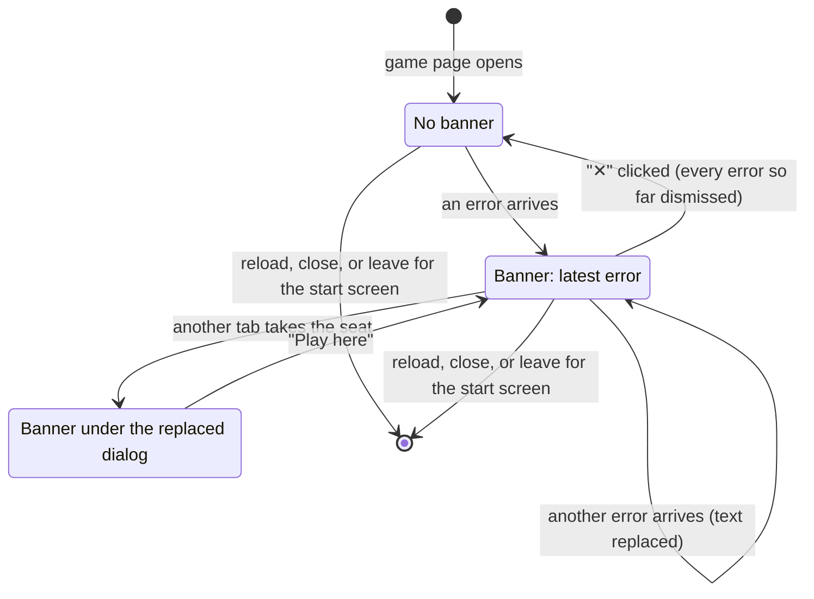

# The error banner

## Summary

The error banner is how the game page tells the player that the server refused something: a red box at the bottom center of the window reading "Error: " followed by the server's message, with a "✕" button that dismisses it. It appears on every screen of the [game page](../glossary.md#the-product-and-its-screens) (the share-link, join, joined, and board screens) and shows only the latest error. It has no request of its own and never sends anything: it appears when a refusal arrives, stays until the player clicks "✕", and comes back with the next error. Nothing else hides it, not even the next request succeeding, and a reload or a trip to the start screen forgets every error. The [start screen](../start/creating-a-game.md#the-answer-arrives) does not use the banner; it shows its own errors as red text under its button.

## The simple case

A third person opens a game's [share link](../glossary.md#games-and-seats) after both seats are taken. The join screen shows "Join Game", and they click it. For a moment the page reads "Joined game, waiting for start...", then the join screen comes back, and a red box appears at the bottom center of the window: "Error: Game full", with a bold white "✕" at its right end.

The box stays. No timer hides it, and clicking elsewhere does nothing to it. The player clicks "✕" and it disappears. If they click "Join Game" again, the server refuses again and the box comes back with the same text.

A seated player with a correct client meets the banner rarely: when a stored seat points at a game that has expired, or in the few races described in the linked documents. Every message and its cause is listed in [error messages](../cross-cutting/error-messages.md).

## The interaction, event by event

The error banner has no request of its own. It is changed by the answers to other requests (every refusal of a request made on this page), and by one local interaction, the click on "✕", which sends nothing. Below, Begin describes an error arriving and End without sending describes the dismissal; Send and While in flight say what the banner does not do; The answer arrives says which requests' answers reach it.

### Begin

The banner begins when an error arrives on this page: the server's refusal of one of the page's requests, or the browser's own report that an answer could not be read. At that instant the banner appears at the bottom center of the window, over whichever game-page screen is showing, with "Error: " followed by the message and "✕" at the right. If a banner is already up, only its text changes, to the newest error; nothing flashes or moves. If the player had dismissed earlier errors, the new one brings the banner back.

Nothing else is decided at that instant. No timer starts, keyboard focus stays where it was, and the banner does not say which request was refused or what to do next. What the refusal does to the rest of the page (the join screen coming back, a stored seat being deleted, the board being released) is the refused request's own doing, described in its own document; the banner only reports it.

The player's part is a click on "✕", or Tab to it and Enter or Space. A click on the red box anywhere else does nothing, and never reaches the board behind it.

### End without sending

Clicking "✕" hides the banner. It dismisses every error that has arrived on this page so far, not just the one showing: an earlier error that a later one replaced before the player saw it is dismissed with it, and none of them comes back. Nothing is sent and nothing is stored in the browser; the page only remembers, for as long as it stays open, which errors have been dismissed. The next error that arrives shows the banner again, even if its text is the same as the one just dismissed.

If the player never clicks "✕", the banner stays for as long as the page is open. Nothing else dismisses it: not Escape, not a press on the board, not a later request succeeding, not the game starting, not a reconnect, not the game ending.

### Send

Nothing is ever sent. The banner has no request of its own: dismissing it tells the server nothing, and the server never learns whether the player saw an error.

### While in flight

The banner has nothing in flight. While one of the player's requests is in flight, a banner that is already up stays up with its old text: an error about an earlier request can sit on screen while a new request is on its way, and nothing tells the two apart until the new answer arrives.

### The answer arrives

Every refusal of a request made on the game page ends up in the banner; an acceptance does nothing to it. The requests, and the refusals a player with a correct client can meet, are:

- **Join** ("Join Game" on the join screen): "Cannot join" when the game does not exist or has expired, "Game full" when both seats are taken. The page also returns to the join screen. See [joining a game](../start/joining-a-game.md).
- **Rejoin** (sent by the page itself whenever it has a [stored seat](../foundations/connection-and-seat.md#the-stored-seat)): "Cannot rejoin" when the game does not exist, "No such seat to rejoin" when the game exists but that color holds no seat in it. Before any snapshot has arrived, either one also deletes the stored seat and brings up the join screen. See [rejoining](../foundations/connection-and-seat.md#rejoining) and [reloading and returning](../session/reload-and-return.md).
- **Move**: "Not your turn", in the rare race after a reconnect described in [making a move](../play/making-a-move.md#edge-cases); and "Not in a game", for every move made after the page's rejoin was refused once the game had started on the page (the game had expired), because the connection then holds no seat. See [connection loss](../session/connection-loss.md#the-answer-arrives) and [a second tab](../session/second-tab.md#the-answer-arrives). The board is released and the move is not shown.

"Already in a game" and "Received a malformed message from the server" can also appear, in the rare cases listed under the edge cases; the full catalogue is in [error messages](../cross-cutting/error-messages.md).

A request that succeeds does not hide the banner. After "Not your turn", the next move landing leaves the banner up; after a refused rejoin, a successful join leaves it up through the joined screen and onto the board screen. The player has to click "✕".

## Modifiers

| Modifier | At the start | Changes while in flight |
| --- | --- | --- |
| Your color | No effect. The banner is the same for both colors. | No effect. |
| Whose turn it is | No effect. "Not your turn" is the only error about the turn, and it stays up after the turn comes round. | No effect; a move landing does not hide the banner. |
| How you reached the page | Every fresh game page starts with no banner, however it was reached. Which errors can appear depends on the route: a visitor clicking "Join Game" can get "Cannot join" or "Game full"; a page with a stored seat can get "Cannot rejoin" or "No such seat to rejoin" from its automatic rejoin; a creator or joiner playing on the board screen can get "Not your turn". The one exception is a game page reached from the start screen within the app, which can show an error that screen had received; see the edge cases. | Not applicable. |
| Connection state | The banner does not depend on it. It stays up, with its text, while connecting or reconnecting, alongside the "Reconnecting…" box at the top right. Replaced: the [replaced dialog](../session/second-tab.md) is drawn over the banner, which stays behind it, darkened; "✕" cannot be clicked, though Tab still reaches it. | A drop or a reconnect neither shows nor hides it; after "Play here" it is still up. |
| Game state | In progress, in check, or frozen: as described. The [frozen-board banner](../cross-cutting/broken-game-record.md) is a separate red box near the top that cannot be dismissed; "✕" does nothing to it. Over: the error banner is drawn above the [end-game dialog](../play/check-and-game-end.md), and "✕" still works. | The game ending, or the record freezing, does not hide it. |
| Shift, Ctrl, or Cmd held | No effect on the click. "✕" is a button, not a link. | No effect. |
| Input device | Mouse: click "✕". Touch: tap it; it is a small target. Keyboard: Tab reaches "✕", which screen readers name "Dismiss error", and Enter or Space dismisses. Escape does not. | No effect. |

For the error banner, "at the start" means when an error arrives and the banner appears; "changes while in flight" means the modifier changing while the banner is up and not yet dismissed.

## Cancel and interrupt

| Event | Before sending | While in flight |
| --- | --- | --- |
| Escape or Cancel | Escape does not dismiss the banner; only "✕" does. The [promotion dialog](../play/promotion.md)'s "Cancel", Escape, and backdrop close that dialog and leave the banner as it is. | No effect. A request in flight cannot be cancelled, and a refusal of it still arrives. |
| Pressing elsewhere or turning the view | Neither dismisses the banner. A press on the banner itself, outside "✕", does nothing and never reaches the board or the view. | Same. |
| Leaving the game page within the app | Arriving at the start screen [resets the connection](../foundations/connection-and-seat.md#returning-to-the-start-screen) and forgets every error and every dismissal. Coming back to the game (Forward, the link) opens with no banner. | The answer is never seen on this page; a refusal of the request in flight is lost with the reset. |
| The game ends | The banner stays up, drawn above the end-game dialog, and "✕" still works. | Same. The move whose echo ends the game was accepted, so it brings no error. |
| The server answers with an error | The new error replaces the text. If the banner had been dismissed, it comes back. | The refusal appears in the banner, replacing any error already showing. |
| The connection drops | No effect: the banner keeps its text through the drop and the reconnect, alongside "Reconnecting…". See [connection loss](../session/connection-loss.md). | An answer that had not arrived is lost, so no error appears for it. What happens to the request itself is in its own document. |
| The window loses focus or the tab is hidden | No effect. An error that arrives in a hidden tab is up when the player comes back; there is no sound, and the tab's title does not change. | Same. |
| Reload or closing the tab | Every error and dismissal is forgotten; the page reopens with no banner, even if what caused the error still holds. The automatic rejoin after a reload can bring the same error back. | The answer is lost; if the request was refused, the player never sees why. |
| The opponent acts | No effect. The opponent's moves, joining, leaving, and returning never show or hide an error here, and the server sends a refusal only to the player whose request it refused. | Same. |
| Another tab takes the seat | The replaced dialog covers the banner, so "✕" cannot be clicked (Tab still reaches it, and Enter or Space dismisses). After "Play here" the banner is still up. The newer tab has its own errors and starts with no banner; errors are never shared between tabs. | This tab's connection is closed, so an answer that had not arrived is lost. |
| A second touch point or a cancelled touch | A touch cancelled before it lifts does not click "✕". A second finger has no effect on the banner. | No effect. |

For the error banner, "before sending" means while the banner is up and not dismissed (dismissing it sends nothing); "while in flight" means while one of the player's requests (a join, a rejoin, or a move) is in flight, and says what becomes of the error it might produce. Apart from a new error, which replaces it, and a reload or a return to the start screen, which forget it, no interrupt changes the banner.

## Interactions with other systems

**Seat and turn.** Most errors a correct client can meet are about seats: "Cannot join" and "Game full" refuse a join, "Cannot rejoin" and "No such seat to rejoin" refuse a rejoin, and "Already in a game" refuses either on a connection that already holds a seat. "Not in a game" refuses a move from a connection that holds no seat, and "Not your turn" is the only one about the turn. The banner reports them and changes neither the seat nor the turn.

**The game record.** A refused request records nothing on the server. The banner is the only trace of it, and that trace lives only in this page.

**Connection.** Errors arrive over the connection as answers to this page's requests; "Received a malformed message from the server" is the browser's own report of a message it could not read. The banner is kept through drops, reconnects, and "Play here", because the page keeps everything the server has said until it is reloaded or leaves for the start screen. An answer lost with a dropped connection produces no error.

**The opponent.** The opponent never sees this player's errors, and nothing the opponent does shows or hides this player's banner.

**Other tabs and devices.** Each tab has its own errors and its own dismissals; dismissing in one tab does nothing in another. A tab that is replaced keeps its banner behind the replaced dialog.

**Game over.** The game ending produces no error and does not hide the banner. The banner is drawn above the end-game dialog and can still be dismissed there; besides "Start new game", "✕" is the only control the dialog leaves within reach.

**Stored seat.** A refused rejoin before any snapshot deletes the stored seat and brings up the join screen; the banner is the only explanation the player gets. Neither errors nor dismissals are stored in the browser.

**Keyboard, touch, and screen size.** The banner is announced to screen readers as an alert when it appears, but keyboard focus does not move to it; "✕" is reached with Tab and is named "Dismiss error". There is no keyboard shortcut and Escape does nothing. "✕" is only as large as the character itself, with no padding around it, which makes it a small target for a finger, and the pointer does not change to a hand over it. The banner is at most about half the window wide, so on a phone-sized window any message longer than a few words wraps onto two or more lines. On the board screen it covers the bottom center of the board, and on a narrow window it can overlap the [move list](move-list.md), drawn on top of it. See [accessibility](../cross-cutting/accessibility.md) and [screen sizes and touch](../cross-cutting/screen-sizes-and-touch.md).

## Edge cases

- **Only the latest error is visible.** Two errors in quick succession show only the second; the first can never be read.
- **The same error twice.** If an error arrives with the same text as the one already showing, nothing visibly changes, so a repeated refusal looks like no answer at all.
- **A stale error.** Because success never hides it, the banner can describe a problem that is long over: "Not your turn" above a game that has moved on, or "No such seat to rejoin" on the board screen of a game the player has since joined. It stays until "✕".
- **Carried across screens.** The banner belongs to the game page, not to one screen of it: an error shown on the share-link, join, or joined screen stays up when the board screen appears.
- **Dismissing hides errors never seen.** "✕" dismisses every error so far, including any that a later one replaced before the player could read it.
- **A covered part of the board.** A press on the banner never reaches the board, so a piece or legal destination drawn behind it cannot be pressed until the banner is dismissed or the view is turned; see [the input model](../foundations/input-model.md#what-takes-a-press).
- **Over the promotion dialog.** The banner is drawn above the promotion dialog's backdrop, so "✕" can be clicked while the dialog is open without cancelling the promotion. In browsers that give a clicked button keyboard focus, the click takes focus out of the dialog, after which Escape no longer cancels it (see [promotion](../play/promotion.md#end-without-sending)).
- **An error from the start screen.** An error the start screen received after its reset but before the game was created (in practice only "Received a malformed message from the server" on a first attempt, followed by a successful one) appears in the banner as soon as the next game page opens within the app (the new game's page, or an earlier one reached with Forward), although the start screen had already shown and cleared it.
- **"Already in a game".** Appears only in rare cases: a creator whose browser will not store the seat, and Back pressed within the round trip of a create (both in [creating a game](../start/creating-a-game.md#edge-cases)); and a return to a game page with Back or Forward before the start screen's fresh connection has opened, which sends the rejoin twice and gets the second one refused over an otherwise normal game (see [waiting for an opponent](../start/waiting-for-an-opponent.md#edge-cases) and [reloading and returning](../session/reload-and-return.md#edge-cases)).
- **Right-click on the banner.** The browser's own context menu opens, as on any web page; it is suppressed only over the board.
- **No history.** There is no list of past errors and no way to see a dismissed one again.

## Open questions and verification

- Nothing but "✕" hides the banner: the next successful move, a successful join, the game starting, and a reconnect all leave a stale error up (`client/src/screens/GameScreen.tsx:113`, where the banner is shown whenever more errors have arrived than have been dismissed). Whether errors should clear on success, or after a time, is a product call.
- An error whose text matches the one already showing changes nothing on screen, and a screen reader may not announce it again because the alert's text does not change. Read from code; not tried.
- The game page counts every error its connection has received since the last reset, while the start screen counts only errors after its own click (`client/src/screens/StartScreen.tsx:22`). The page starts with nothing dismissed (`client/src/screens/GameScreen.tsx:31`), so an error the start screen already showed and cleared reappears on the new game's page. Low impact, since a fresh connection can hardly produce one, but it looks like a small bug.
- Clicking "✕" while the promotion dialog is open takes keyboard focus out of the dialog in browsers that focus a clicked button (Chrome and Firefox on Windows and Linux; Safari does not), so Escape stops cancelling the promotion. Read from code; not tried.
- The banner's width is limited to about half the window, because it is placed from the window's center line; long messages wrap early on narrow windows. The size of the "✕" target and the plain arrow pointer over it are read from the styles, not measured.
- Whether screen readers announce a change of text in a banner that is already showing, as they do when it first appears, was not tried.
- No test clicks "Dismiss error". The banner's appearance is covered by `client/src/App.test.tsx` ("Not your turn", "Cannot join", "No such seat to rejoin"); dismissal, the reappearance of a later error, and the banner's survival across a reconnect are read from `client/src/screens/GameScreen.tsx`, `client/src/game/session.ts`, and `client/src/hooks/useGameSocket.ts` (the page's record of what the server said is kept across reconnects and cleared only on returning to the start screen). The end-to-end suite does not exercise the banner.

Verified against 3D Chess commit `d94507b`
