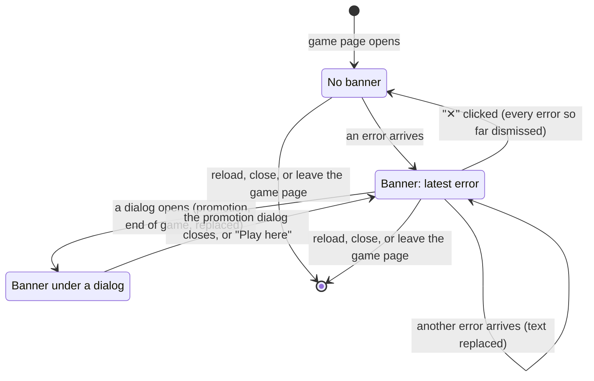

# The error banner

## Summary

The error banner is how the game page tells the player that the server refused something: a glass notice with a thin red rule at its left edge, carrying the server's message (a screen reader hears "Error: " first), with a "✕" button that dismisses it. On the board screen it stands under the [turn pill](turn-indicator.md); on the lobby's screens of the game page (the invitations and "Joining…"), at the top center. It shows only the latest error. It has no request of its own and never sends anything: it appears when a refusal arrives, stays until the player clicks "✕", and comes back with the next error. Nothing else hides it, not even the next request succeeding, and a reload or leaving the game page forgets every error. Some messages never reach it: before the game starts, the refusals that the invitation says in its own words ("Cannot join", "Cannot rejoin", and "No such game" become "No game here"; "Game full" becomes "This game is taken"); the server's refusal of an automatic rejoin because another tab holds the seat, which brings up the [replaced dialog](../session/second-tab.md) instead; and the [move box](../glossary.md#the-interface)'s own explanations of a typed move it cannot play, which appear under the move box. The [side choice](../start/creating-a-game.md#the-answer-arrives) does not use the banner; it shows its own errors as red text at its bottom.

## The simple case

A player opens a game's link in a browser that remembers a seat in that game, but the server no longer has that color seated in it (the record was changed under it, say). The page shows "Returning to your game…" and rejoins by itself; the server refuses. A glass notice with a red rule at its left edge appears at the top center of the window: "No such seat to rejoin", with a small "✕" at its right end. Under it the page forgets the stored seat and offers the free seat like any visitor's invitation (or says "This game is taken").

The box stays. No timer hides it, and clicking elsewhere does nothing to it. The player clicks "✕" and it disappears.

A player with a correct client meets the banner rarely: in the few races and stale states described in the linked documents. Every message and its cause is listed in [error messages](../cross-cutting/error-messages.md).

## The interaction, event by event

The error banner has no request of its own. It is changed by the answers to other requests (almost every refusal of a request made on this page), and by one local interaction, the click on "✕", which sends nothing. Below, Begin describes an error arriving and End without sending describes the dismissal; Send and While in flight say what the banner does not do; The answer arrives says which requests' answers reach it.

```mermaid
stateDiagram-v2
    state "No banner" as none
    state "Banner: latest error" as shown
    state "Banner under a dialog" as covered
    [*] --> none : game page opens
    none --> shown : an error arrives
    shown --> shown : another error arrives (text replaced)
    shown --> none : "✕" clicked (every error so far dismissed)
    shown --> covered : a dialog opens (promotion, end of game, replaced)
    covered --> shown : the promotion dialog closes, or "Play here"
    none --> [*] : reload, close, or leave the game page
    shown --> [*] : reload, close, or leave the game page
```

### Begin

The banner begins when an error arrives on this page: the server's refusal of one of the page's requests, or the browser's own report that an answer could not be read. At that instant the banner appears, over whichever game-page screen is showing, with the message and "✕" at the right. If a banner is already up, only its text changes, to the newest error; nothing flashes or moves. If the player had dismissed earlier errors, the new one brings the banner back.

On the board screen the banner is in the [HUD](../glossary.md#the-interface)'s status column, under the turn pill (and under "Reconnecting…" when that shows), as wide as its message needs up to 440 pixels; in a window 480 pixels tall or less the column stands at the top left. On the lobby's screens (the invitations and "Joining…") it sits at the top center, 12 pixels down, at most 440 pixels wide. It never overlaps another part of the HUD.

Nothing else is decided at that instant. No timer starts, keyboard focus stays where it was, and the banner does not say which request was refused or what to do next. What the refusal does to the rest of the page (the invitation to the free seat coming back, a stored seat being deleted, the board being released) is the refused request's own doing, described in its own document; the banner only reports it.

The player's part is a click on "✕", or Tab to it and Enter or Space. A click on the banner anywhere else does nothing, and never reaches the board behind it.

### End without sending

Clicking "✕" hides the banner. It dismisses every error that has arrived on this page so far, not just the one showing: an earlier error that a later one replaced before the player saw it is dismissed with it, and none of them comes back. Nothing is sent and nothing is stored in the browser; the page only remembers, for as long as it stays open, which errors have been dismissed. The next error that arrives shows the banner again, even if its text is the same as the one just dismissed.

If the player never clicks "✕", the banner stays for as long as the page is open. Nothing else dismisses it: not Escape, not a press on the board, not a later request succeeding, not the game starting, not a reconnect, not the game ending.

### Send

Nothing is ever sent. The banner has no request of its own: dismissing it tells the server nothing, and the server never learns whether the player saw an error.

### While in flight

The banner has nothing in flight. While one of the player's requests is in flight, a banner that is already up stays up with its old text: an error about an earlier request can sit on screen while a new request is on its way, and nothing tells the two apart until the new answer arrives.

### The answer arrives

Every refusal of a request made on the game page ends up in the banner, with one exception below; an acceptance does nothing to it. The requests, and the refusals a player with a correct client can meet, are:

- **Look and join** (the invitation's question, and "Join game"): "No such game" or "Cannot join" when the game does not exist or has expired, "Game full" when both seats are taken. Before the game starts these are not shown in the banner: the invitation's card says "No game here" or "This game is taken" instead. See [joining a game](../start/joining-a-game.md).
- **Rejoin** (sent by the page itself whenever it has a [stored seat](../foundations/connection-and-seat.md#the-stored-seat)): "Cannot rejoin" when the game does not exist, "No such seat to rejoin" when the game exists but that color holds no seat in it. Before any snapshot has arrived, either one also deletes the stored seat and brings up the invitation to the free seat ("Cannot rejoin" is then said as "No game here", and only "No such seat to rejoin" shows in the banner); after that, the page stays where it is, the banner shows either one, and the board takes no input until a reload. See [rejoining](../foundations/connection-and-seat.md#rejoining) and [reloading and returning](../session/reload-and-return.md).
- **Move**: "Not your turn" and the other move refusals are not expected from a correct client, which sends a move once however fast the clicks or taps (see [making a move](../play/making-a-move.md#edge-cases)). If one arrives, the board is released and the move is not shown.

The exception is the refusal of an automatic rejoin because another tab of this browser holds the seat ("This game is open in another tab", [seat in use](../glossary.md#the-connection)). It is never shown in the banner; the page shows the replaced dialog instead.

"Already in a game" and "Received a malformed message from the server" can also appear, in the rare cases listed under the edge cases; the full catalogue is in [error messages](../cross-cutting/error-messages.md). A move typed in the move box that cannot be played is not sent, so it produces no error here: the move box explains it in a line of its own.

A request that succeeds does not hide the banner. After "Not your turn", the next move landing leaves the banner up; after a refused rejoin, a successful join leaves it up through the "Joining…" invitation and onto the board screen. The player has to click "✕". In a game against the computer the browser's own stand-in answers instead of the server, and refuses only what a correct page never sends ("Not your turn", "Illegal move").

## Modifiers

| Modifier | At the start | Changes while in flight |
| --- | --- | --- |
| Your color | No effect. The banner is the same for both colors. | No effect. |
| Whose turn it is | No effect. "Not your turn" is the only error about the turn, and it stays up after the turn comes round. | No effect; a move landing does not hide the banner. |
| How you reached the page | Every fresh game page starts with no banner, however it was reached. Which errors can appear depends on the route: a visitor clicking "Join game" can get "Cannot join" or "Game full"; a page with a stored seat can get "Cannot rejoin" or "No such seat to rejoin" from its automatic rejoin; a creator or joiner playing on the board screen can get "Not your turn". The one exception is a new game's page reached from the side choice, which can show an error the side choice had received; see the edge cases. | Not applicable. |
| Connection state | The banner does not depend on it. It stays up, with its text, while connecting or reconnecting, alongside the "Reconnecting…" line (under the pill on the board screen, at the top right before the game). Replaced: the replaced dialog is drawn over the banner, which stays behind it, darkened and inert, on every screen of the game page: "✕" can be neither clicked nor reached with Tab. | A drop or a reconnect neither shows nor hides it; after "Play here" it is still up. |
| Game state | In progress, in check, or frozen: as described. The [frozen-board banner](../cross-cutting/broken-game-record.md) is a separate notice under it, in the same column, that cannot be dismissed; "✕" does nothing to it. Over: the [result card](../play/check-and-game-end.md) covers the error banner, which stays behind it, darkened and inert, until the card is closed. | The game ending, or the record freezing, does not hide it. |
| Shift, Ctrl, or Cmd held | No effect on the click. "✕" is a button, not a link. | No effect. |
| Input device | Mouse: click "✕". Touch: tap it; it is a small target. Keyboard: on the board screen "✕" comes before the move box's field in the Tab order, so while an error shows it is the first Tab stop; screen readers name it "Dismiss error", and Enter or Space dismisses. Escape does not. | No effect. |

For the error banner, "at the start" means when an error arrives and the banner appears; "changes while in flight" means the modifier changing while the banner is up and not yet dismissed.

## Cancel and interrupt

| Event | Before sending | While in flight |
| --- | --- | --- |
| Escape or Cancel | Escape does not dismiss the banner; only "✕" does. While the [promotion dialog](../play/promotion.md) is open, the banner is behind it and out of reach; its "Cancel", Escape, and backdrop close that dialog and leave the banner as it was. | No effect. A request in flight cannot be cancelled, and a refusal of it still arrives. |
| Pressing elsewhere or turning the view | Neither dismisses the banner. A press on the banner itself, outside "✕", does nothing and never reaches the board or the view. Typing in the move box does not touch it. | Same. |
| Leaving the game page within the app | Leaving the game's page (for the home page, a side choice, the tutorial, or another game's page) [resets the connection](../foundations/connection-and-seat.md#leaving-a-games-page) and forgets every error and every dismissal. Coming back to the game (Back, Forward, the link) opens with no banner. | The answer is never seen on this page; a refusal of the request in flight is lost with the reset. |
| The game ends | The result card covers the banner, which stays behind it, inert, until the card is closed. | Same. The move whose echo ends the game was accepted, so it brings no error. |
| The server answers with an error | The new error replaces the text. If the banner had been dismissed, it comes back. A refusal because another tab holds the seat does not; it brings up the replaced dialog. | The refusal appears in the banner, replacing any error already showing. |
| The connection drops | No effect: the banner keeps its text through the drop and the reconnect, alongside "Reconnecting…". See [connection loss](../session/connection-loss.md). | An answer that had not arrived is lost, so no error appears for it. What happens to the request itself is in its own document. |
| The window loses focus or the tab is hidden | No effect. An error that arrives in a hidden tab is up when the player comes back; there is no sound, and the tab's title does not change. | Same. |
| Reload or closing the tab | Every error and dismissal is forgotten; the page reopens with no banner, even if what caused the error still holds. The automatic rejoin after a reload can bring the same error back. | The answer is lost; if the request was refused, the player never sees why. |
| The opponent acts | No effect. The opponent's moves, joining, leaving, and returning never show or hide an error here, and the server sends a refusal only to the player whose request it refused. | Same. |
| Another tab takes the seat | The replaced dialog covers the banner, and "✕" can be neither clicked nor reached with Tab until the dialog goes. After "Play here" the banner is still up. The newer tab has its own errors and starts with no banner; errors are never shared between tabs. | This tab's connection is closed, so an answer that had not arrived is lost. |
| A second touch point or a cancelled touch | A touch cancelled before it lifts does not click "✕". A second finger has no effect on the banner. | No effect. |

For the error banner, "before sending" means while the banner is up and not dismissed (dismissing it sends nothing); "while in flight" means while one of the player's requests (a join, a rejoin, or a move) is in flight, and says what becomes of the error it might produce. Apart from a new error, which replaces it, a dialog, which covers it, and a reload or a trip away from the game page, which forget it, no interrupt changes the banner.

## Interactions with other systems

**Seat and turn.** Most errors a correct client can meet are about seats: "Cannot join" and "Game full" refuse a join, "Cannot rejoin" and "No such seat to rejoin" refuse a rejoin, and "Already in a game" refuses either on a connection that already holds a seat. "Not your turn" is the only one about the turn. The seat-in-use refusal is about seats too, but it is answered with the replaced dialog, not the banner. The banner reports refusals and changes neither the seat nor the turn.

**The game record.** A refused request records nothing on the server. The banner is the only trace of it, and that trace lives only in this page.

**Connection.** Errors arrive over the connection as answers to this page's requests; "Received a malformed message from the server" is the browser's own report of a message it could not read. The banner is kept through drops, reconnects, and "Play here", because the page keeps everything the server has said until it is reloaded or leaves the game page. An answer lost with a dropped connection produces no error.

**The opponent.** The opponent never sees this player's errors, and nothing the opponent does shows or hides this player's banner.

**Other tabs and devices.** Each tab has its own errors and its own dismissals; dismissing in one tab does nothing in another. A tab that is replaced keeps its banner behind the replaced dialog.

**Game over.** The game ending produces no error and does not hide the banner, but the result card covers it and makes it inert, so an error still showing at the end stays up, darkened, until the player closes the card.

**Stored seat.** A refused rejoin before any snapshot deletes the stored seat and brings up the invitation to the free seat; the banner is the only explanation the player gets. Neither errors nor dismissals are stored in the browser.

**Keyboard, touch, and screen size.** The banner is announced to screen readers as an alert when it appears, but keyboard focus does not move to it; "✕" is reached with Tab and is named "Dismiss error". There is no keyboard shortcut and Escape does nothing. While any dialog is up, the banner is inert: not reachable and not read. "✕" is a 28-pixel square, small for a finger. On the board screen the banner sits under the turn pill, up to 440 pixels wide, so only a long message wraps; in a window 480 pixels tall or less, at the top left. It never covers another part of the HUD. See [accessibility](../cross-cutting/accessibility.md) and [screen sizes and touch](../cross-cutting/screen-sizes-and-touch.md).

## Edge cases

- **Only the latest error is visible.** Two errors in quick succession show only the second; the first can never be read.
- **The same error twice.** If an error arrives with the same text as the one already showing, nothing visibly changes, so a repeated refusal looks like no answer at all.
- **A stale error.** Because success never hides it, the banner can describe a problem that is long over: "Not your turn" above a game that has moved on, or "No such seat to rejoin" on the board screen of a game the player has since joined. It stays until "✕".
- **Carried across screens.** The banner belongs to the game page, not to one screen of it: an error shown on the lobby's screens stays up when the board screen appears.
- **Dismissing hides errors never seen.** "✕" dismisses every error so far, including any that a later one replaced before the player could read it.
- **A covered part of the board.** A press on the banner never reaches the board, so a piece or legal destination drawn behind it cannot be pressed until the banner is dismissed, the view is turned, or the move is typed in the move box; see [the input model](../foundations/input-model.md#what-takes-a-press).
- **Behind the result card.** An error still showing when the game ends cannot be dismissed while the card is up: the card covers it and makes it inert. Closing the card makes it reachable again.
- **A refused rejoin on the board screen.** "Cannot rejoin" after the game has started on the page (the game expired during a long outage, or while the tab sat replaced) leaves the board on screen with the banner, and the board takes no input: the connection holds no seat. Only a reload ends it, by deleting the stored seat.
- **An error from the side choice.** An error the side choice received before the game was created (in practice only "Received a malformed message from the server" on a first pick, followed by a successful one) appears in the banner as soon as the new game's page opens, although the side choice had already shown and cleared it.
- **"Already in a game".** Appears only in rare cases: a creator whose browser will not store the seat, and Back pressed within the round trip of a create (both in [creating a game](../start/creating-a-game.md#edge-cases)).
- **Right-click on the banner.** The browser's own context menu opens, as on any web page; it is suppressed only over the board.
- **No history.** There is no list of past errors and no way to see a dismissed one again.

## Open questions and verification

- Nothing but "✕" hides the banner: the next successful move, a successful join, the game starting, and a reconnect all leave a stale error up (`client/src/screens/GameScreen.tsx`, `latestError`: the banner is shown whenever more errors have arrived than have been dismissed). Whether errors should clear on success, or after a time, is a product call ([B-15](../bug-triage.md#b-15-old-errors-keep-acting-success-never-clears-the-banner-and-earlier-refusals-steer-later-joins), still open; a fix is in progress separately).
- An error still showing when the game ends can no longer be dismissed while the result card is up, because the card makes everything behind it inert; closing the card makes it reachable again. Read from `client/src/screens/GameView.tsx`; not tried.
- An error whose text matches the one already showing changes nothing on screen, and a screen reader may not announce it again because the alert's text does not change. Read from code; not tried.
- The game page counts every error its connection has received since the last reset, while the side choice counts only errors after its own pick (`ChooseSide.tsx`, `requestIndex`), so an error the side choice already showed and cleared reappears on the new game's page. Low impact, but it looks like a small bug.
- The seat-in-use refusal is left out of the banner (`GameScreen.tsx`, `errors` filters `seat_in_use`) and answered with the replaced dialog; before the game, "No such game", "Cannot join", "Cannot rejoin", and "Game full" are left out (`GameScreen.tsx`, the `lobby-errors` condition on `invalid_game` and `game_full`). Covered by `client/src/App.test.tsx` and `GameScreen.lobby.test.tsx`.
- The banner's place on the board screen was checked in headless Chromium at `f7bff4d`, at 1280 × 720, 1920 × 1080, 390 × 844, and 844 × 390, from both seats. Its place over the lobby (top center) is read from `client/src/index.css` at `24c650c`, not checked.
- No test clicks "Dismiss error". Dismissal, the reappearance of a later error, and the banner's survival across a reconnect are read from `client/src/screens/GameScreen.tsx`, `client/src/game/session.ts`, and `client/src/hooks/useGameSocket.ts`.

Drafted against 3D Chess commit `24c650c`
