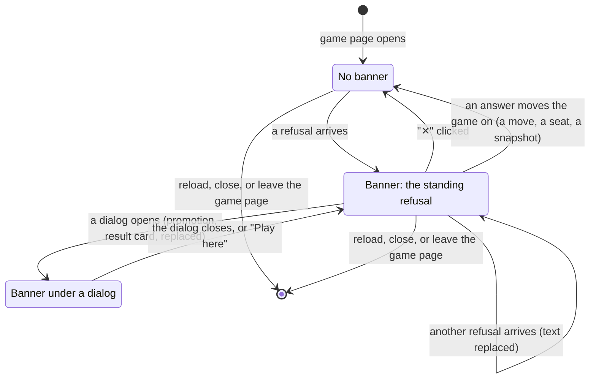

# The error banner

## Summary

The error banner is how the game page tells the player that the server refused something: a glass notice with a thin red rule at its left edge, carrying the server's message (a screen reader hears "Error: " first), with a "✕" button that dismisses it. On the board screen it stands under the [turn pill](turn-indicator.md); on the lobby's screens of the game page (the invitations and "Joining…"), at the top center. It shows the latest refusal of a request made on this page, and only for as long as that refusal still stands: the next answer that shows the game moving on (a move landing, a seat taken, a snapshot, the invitation's answer) ends it, as does a click on "✕". It has no request of its own and never sends anything. Some messages never reach it: before the game starts, the refusals that the invitation says in its own words ("Cannot join", "Cannot rejoin", and "No such game" become "No game here"; "Game full" becomes "This game is taken"); the server's refusal of an automatic rejoin because another tab holds the seat, which brings up the [replaced dialog](../session/second-tab.md) instead; and the [move box](../glossary.md#the-interface)'s own explanations of a typed move it cannot play, which appear under the move box. The [side choice](../start/creating-a-game.md#the-answer-arrives) does not use the banner; it shows its own errors as red text at its bottom, and they are not carried onto the new game's page.

## The simple case

The opponent has offered a draw, and "Draw offered" hangs under the player's flag with "Accept" and "Decline". The player decides to accept, but in the same instant the opponent, tired of waiting, plays a move, and the offer lapses. The click on "Accept" reaches the server after the move, and the server refuses it. A glass notice with a red rule at its left edge appears under the turn pill: "No draw offer to answer", with a small "✕" at its right end. The game goes on.

The notice stays while the player thinks. No timer hides it, and pressing elsewhere does nothing to it. When the player's own move lands, the notice goes by itself: the game has moved on, so the refusal no longer stands. Had the player clicked "✕" first, it would have gone then.

A player with a correct client meets the banner rarely: in the few races and stale states described in the linked documents. Every message and its cause is listed in [error messages](../cross-cutting/error-messages.md).

## The interaction, event by event

The error banner has no request of its own. It is changed by the answers to other requests (a refusal of a request made on this page shows it; an answer that moves the game on ends it), and by one local interaction, the click on "✕", which sends nothing. Below, Begin describes an error arriving and End without sending describes the dismissal and the other ways it ends; Send and While in flight say what the banner does not do; The answer arrives says which requests' answers reach it.

```mermaid
stateDiagram-v2
    state "No banner" as none
    state "Banner: the standing refusal" as shown
    state "Banner under a dialog" as covered
    [*] --> none : game page opens
    none --> shown : a refusal arrives
    shown --> shown : another refusal arrives (text replaced)
    shown --> none : "✕" clicked
    shown --> none : an answer moves the game on (a move, a seat, a snapshot)
    shown --> covered : a dialog opens (promotion, result card, replaced)
    covered --> shown : the dialog closes, or "Play here"
    none --> [*] : reload, close, or leave the game page
    shown --> [*] : reload, close, or leave the game page
```

### Begin

The banner begins when a refusal arrives on this page: the server's refusal of one of the page's requests, or the browser's own report that an answer could not be read. At that instant the banner appears, over whichever game-page screen is showing, with the message and "✕" at the right. If a banner is already up, only its text changes, to the newest error; nothing flashes or moves. Only refusals of requests made on this page count: an error the side choice received before the game was created is not carried onto the game's page.

On the board screen the banner is in the [HUD](../glossary.md#the-interface)'s status column, under the turn pill (and under "Reconnecting…" when that shows), as wide as its message needs up to 440 pixels; in a window 480 pixels tall or less the column stands at the top left. On the lobby's screens (the invitations and "Joining…") it sits at the top center, 12 pixels down, at most 440 pixels wide. It never overlaps another part of the HUD.

Nothing else is decided at that instant. No timer starts, keyboard focus stays where it was, and the banner does not say which request was refused or what to do next. What the refusal does to the rest of the page (the invitation to the free seat coming back, a stored seat being deleted, the board being released) is the refused request's own doing, described in its own document; the banner only reports it.

The player's part is a click on "✕", or Tab to it and Enter or Space. A click on the banner anywhere else does nothing, and never reaches the board behind it.

### End without sending

The banner ends in two ways, neither of which sends anything:

- **"✕".** Clicking it hides the banner. Nothing is sent and nothing is stored in the browser; the page only remembers, for as long as it stays open, that this error was dismissed. The next refusal that arrives shows the banner again, even if its text is the same.
- **The game moving on.** The refusal stands only until the next answer that shows the page's requests going through or the game going on: a move landing (the player's or the opponent's), a game created, a seat taken, the game starting, a snapshot after a rejoin, or the invitation's answer about the seats. Any of these ends it, and the banner goes without a click. Presence changes, draw offers and their refusals, and the end of the game by a resignation or agreement do not end it.

Nothing else dismisses it: not Escape, not a press on the board, not a timer.

### Send

Nothing is ever sent. The banner has no request of its own: dismissing it tells the server nothing, and the server never learns whether the player saw an error.

### While in flight

The banner has nothing in flight. While one of the player's requests is in flight, a banner that is already up stays up with its old text until an answer arrives: a refusal replaces its text; an answer that moves the game on ends it.

### The answer arrives

Every refusal of a request made on the game page ends up in the banner, with the exceptions below. The requests, and the refusals a player with a correct client can meet, are:

- **Look and join** (the invitation's question, and "Join game"): "No such game" or "Cannot join" when the game does not exist or has expired, "Game full" when both seats are taken. Before the game starts these are not shown in the banner: the invitation's card says "No game here" or "This game is taken" instead. See [joining a game](../start/joining-a-game.md).
- **Rejoin** (sent by the page itself whenever it has a [stored seat](../foundations/connection-and-seat.md#the-stored-seat)): "Cannot rejoin" when the game does not exist, "No such seat to rejoin" when the game exists but that color holds no seat in it. Before any snapshot has arrived, either one also deletes the stored seat and the page asks which seats are taken: "Cannot rejoin" is said as "No game here", and "No such seat to rejoin" shows in the banner only until the invitation's answer arrives, a moment later. After a snapshot, the page stays where it is, the banner shows either one, and the board takes no input until a reload; nothing ends that banner but "✕". See [rejoining](../foundations/connection-and-seat.md#rejoining) and [reloading and returning](../session/reload-and-return.md).
- **Move**: "Not your turn" and the other move refusals are not expected from a correct client, which sends a move once however fast the clicks or taps (see [making a move](../play/making-a-move.md#edge-cases)). If one arrives, the board is released and the move is not shown; the next move to land ends the banner.
- **Resigning and draws**: "The game is over" when a request crosses the opponent's resignation or acceptance (it then stands under the result card's veil), "A draw was already offered this move" when both players offer at once, "No draw offer to answer" when an answer crosses a move. See [resigning and draws](../play/resigning-and-draws.md).

The refusal of an automatic rejoin because another tab of this browser holds the seat ("This game is open in another tab", [seat in use](../glossary.md#the-connection)) is never shown in the banner; the page shows the replaced dialog instead.

"Already in a game" and "Received a malformed message from the server" can also appear, in the rare cases listed under the edge cases; the full catalogue is in [error messages](../cross-cutting/error-messages.md). A move typed in the move box that cannot be played is not sent, so it produces no error here: the move box explains it in a line of its own. In a game against the computer the browser's own stand-in answers instead of the server, and refuses only what a correct page never sends.

## Modifiers

| Modifier | At the start | Changes while in flight |
| --- | --- | --- |
| Your color | No effect. The banner is the same for both colors. | No effect. |
| Whose turn it is | No effect on what shows. A move landing, on either turn, ends a standing refusal. | The turn passing with a move ends the banner. |
| How you reached the page | Every fresh game page starts with no banner, however it was reached, including a new game's page reached from the side choice. Which errors can appear depends on the route: a visitor clicking "Join game" can get "Cannot join", "Game full", or "Already in a game"; a page with a stored seat can get "Cannot rejoin" or "No such seat to rejoin" from its automatic rejoin; a player on the board screen can get the move and draw refusals. | Not applicable. |
| Connection state | The banner stays up, with its text, while connecting or reconnecting, alongside the "Reconnecting…" line (under the pill on the board screen, at the top right before the game). The snapshot that answers the rejoin after a reconnect ends it. Replaced: the replaced dialog is drawn over the banner, which stays behind it, darkened and inert, on every screen of the game page: "✕" can be neither clicked nor reached with Tab. | A drop does not hide it; the rejoin's snapshot does. After "Play here" the snapshot ends it too. |
| Game state | In progress, in check, or frozen: as described. The [frozen-board banner](../cross-cutting/broken-game-record.md) is a separate notice under it, in the same column, that cannot be dismissed; "✕" does nothing to it. Over: the [result card](../play/check-and-game-end.md) covers the error banner, which stays behind it, darkened and inert, until the card is closed. | The game ending by a move ends the banner (the move is an answer); a resignation or agreement does not. |
| Shift, Ctrl, or Cmd held | No effect on the click. "✕" is a button, not a link. | No effect. |
| Input device | Mouse: click "✕". Touch: tap it; it is a small target. Keyboard: on the board screen "✕" comes before the move box's field in the Tab order, so while an error shows it is the first Tab stop; screen readers name it "Dismiss error", and Enter or Space dismisses. Escape does not. | No effect. |

For the error banner, "at the start" means when an error arrives and the banner appears; "changes while in flight" means the modifier changing while the banner is up and not yet dismissed.

## Cancel and interrupt

| Event | Before sending | While in flight |
| --- | --- | --- |
| Escape or Cancel | Escape does not dismiss the banner; only "✕" does. While the [promotion dialog](../play/promotion.md) is open, the banner is behind it and out of reach; its "Cancel", Escape, and backdrop close that dialog and leave the banner as it was. Escape in the game menu closes the menu and leaves the banner. | No effect. A request in flight cannot be cancelled, and a refusal of it still arrives. |
| Pressing elsewhere or turning the view | Neither dismisses the banner. A press on the banner itself, outside "✕", does nothing and never reaches the board or the view. Typing in the move box does not touch it. | Same. |
| Leaving the game page within the app | Leaving the game's page (for the home page, a side choice, the tutorial, or another game's page) [resets the connection](../foundations/connection-and-seat.md#leaving-a-games-page) and forgets every error and every dismissal. Coming back to the game (Back, Forward, the link) opens with no banner. | The answer is never seen on this page; a refusal of the request in flight is lost with the reset. |
| The game ends | By a move: the move ends the banner. By a resignation or agreement: the banner stays, under the result card, inert until the card is closed. | Same. |
| The server answers with an error | The new error replaces the text. If the banner had been dismissed, it comes back. A refusal because another tab holds the seat does not; it brings up the replaced dialog. | The refusal appears in the banner, replacing any error already showing. |
| The connection drops | The banner keeps its text through the drop; the snapshot that answers the rejoin ends it. See [connection loss](../session/connection-loss.md). | An answer that had not arrived is lost, so no error appears for it. What happens to the request itself is in its own document. |
| The window loses focus or the tab is hidden | No effect. An error that arrives in a hidden tab is up when the player comes back; there is no sound, and the tab's title does not change for it. | Same. |
| Reload or closing the tab | Every error and dismissal is forgotten; the page reopens with no banner, even if what caused the error still holds. The automatic rejoin after a reload can bring the same error back. | The answer is lost; if the request was refused, the player never sees why. |
| The opponent acts | The opponent's move ends the banner. Their joining, leaving, returning, offering, or resigning does not, and the server sends a refusal only to the player whose request it refused. | Same. |
| Another tab takes the seat | The replaced dialog covers the banner, and "✕" can be neither clicked nor reached with Tab until the dialog goes. After "Play here" the snapshot ends it. The newer tab has its own errors and starts with no banner; errors are never shared between tabs. | This tab's connection is closed, so an answer that had not arrived is lost. |
| A second touch point or a cancelled touch | A touch cancelled before it lifts does not click "✕". A second finger has no effect on the banner. | No effect. |

For the error banner, "before sending" means while the banner is up and not dismissed (dismissing it sends nothing); "while in flight" means while one of the player's requests (a join, a rejoin, a move, a resignation, an offer, or an answer) is in flight, and says what becomes of the error it might produce.

## Interactions with other systems

**Seat and turn.** Most errors a correct client can meet are about seats: "Cannot join" and "Game full" refuse a join, "Cannot rejoin" and "No such seat to rejoin" refuse a rejoin, and "Already in a game" refuses either on a connection that already holds a seat. "Not your turn" is the only one about the turn. The seat-in-use refusal is about seats too, but it is answered with the replaced dialog, not the banner. The banner reports refusals and changes neither the seat nor the turn.

**The game record.** A refused request records nothing on the server. The banner is the only trace of it, and that trace lives only in this page, until the game moves on.

**Connection.** Errors arrive over the connection as answers to this page's requests; "Received a malformed message from the server" is the browser's own report of a message it could not read. The banner survives a drop, and is ended by the snapshot that answers the rejoin. An answer lost with a dropped connection produces no error.

**The opponent.** The opponent never sees this player's errors. The opponent's move ends this player's standing refusal; nothing else the opponent does shows or hides it.

**Other tabs and devices.** Each tab has its own errors and its own dismissals; dismissing in one tab does nothing in another. A tab that is replaced keeps its banner behind the replaced dialog.

**Game over.** A game ended by a move ends the banner with that move. A game ended by a resignation or agreement does not; the result card covers the banner and makes it inert, so it stays up, darkened, until the player closes the card.

**Stored seat.** A refused rejoin before any snapshot deletes the stored seat and brings up the invitation to the free seat; the banner shows "No such seat to rejoin" until the invitation's answer arrives, and "Cannot rejoin" is said only as "No game here". Neither errors nor dismissals are stored in the browser.

**Keyboard, touch, and screen size.** The banner is announced to screen readers as an alert when it appears, but keyboard focus does not move to it; "✕" is reached with Tab and is named "Dismiss error". There is no keyboard shortcut and Escape does nothing. While any dialog is up, the banner is inert: not reachable and not read. "✕" is a 28-pixel square, small for a finger. On the board screen the banner sits under the turn pill, up to 440 pixels wide, so only a long message wraps; in a window 480 pixels tall or less, at the top left. It never covers another part of the HUD. See [accessibility](../cross-cutting/accessibility.md) and [screen sizes and touch](../cross-cutting/screen-sizes-and-touch.md).

## Edge cases

- **Only the latest error is visible.** Two errors in quick succession show only the second; the first can never be read.
- **The same error twice.** If an error arrives with the same text as the one already showing, nothing visibly changes, so a repeated refusal looks like no answer at all.
- **A refusal that cannot be read.** "No such seat to rejoin" on a fresh page is followed at once by the invitation's answer, which ends it: on an ordinary connection it shows for a fraction of a second.
- **A banner that stays.** "Cannot rejoin" after the game has started on the page (the game expired during a long outage, or while the tab sat replaced) leaves the board on screen with the banner, and the board takes no input: the connection holds no seat, so no answer will end it. Only "✕" hides it and only a reload ends the state, by deleting the stored seat.
- **"Already in a game".** Appears only in rare cases: a creator whose browser will not store the seat and who clicks "Join game" (the banner stays over "Joining…"), and Back pressed within the round trip of a create (both in [creating a game](../start/creating-a-game.md#edge-cases)).
- **A covered part of the board.** A press on the banner never reaches the board, so a piece or legal destination drawn behind it cannot be pressed until the banner goes, the view is turned, or the move is typed in the move box; see [the input model](../foundations/input-model.md#what-takes-a-press).
- **Behind the result card.** An error still showing when the game ends by a resignation or agreement cannot be dismissed while the card is up: the card covers it and makes it inert. Closing the card makes it reachable again.
- **Right-click on the banner.** The browser's own context menu opens, as on any web page; it is suppressed only over the board.
- **No history.** There is no list of past errors and no way to see a dismissed one again.

## Open questions and verification

- The standing refusal (`selectStandingError` in `client/src/game/session.ts`: the latest error after the page's start, unless a later `game_created`, `game_joined`, `game_start`, `game_state`, `game_info`, or `move_made` overtakes it; `seat_in_use` passed over) and the dismissal (`dismissedAt` in `client/src/screens/GameScreen.tsx`) are read from code and `client/src/game/session.test.ts` and `client/src/screens/GameScreen.errors.test.tsx` at `b325641`, not tried in the running app. They replace, since `939b9b4`, a banner that only "✕" could hide and that carried the side choice's errors ([bug triage](../bug-triage.md) B-15, fixed).
- Draw offers, their refusals, presence, and a resignation or agreement do not end a standing refusal; only an answer in the list above does. Whether a "No draw offer to answer" should also end when the next offer is made is a design detail.
- An error whose text matches the one already showing changes nothing on screen, and a screen reader may not announce it again because the alert's text does not change. Read from code; not tried.
- Before the game, "No such game", "Cannot join", "Cannot rejoin", and "Game full" are left out of the banner (`GameScreen.tsx`, the `lobby-errors` condition on `invalid_game` and `game_full`). Covered by `client/src/App.test.tsx` and `GameScreen.lobby.test.tsx`.
- The banner's place on the board screen was checked in headless Chromium at `f7bff4d`, at 1280 × 720, 1920 × 1080, 390 × 844, and 844 × 390, from both seats. Its place over the lobby (top center) is read from `client/src/index.css` at `b325641`, not checked.

Drafted against 3D Chess commit `b325641`
