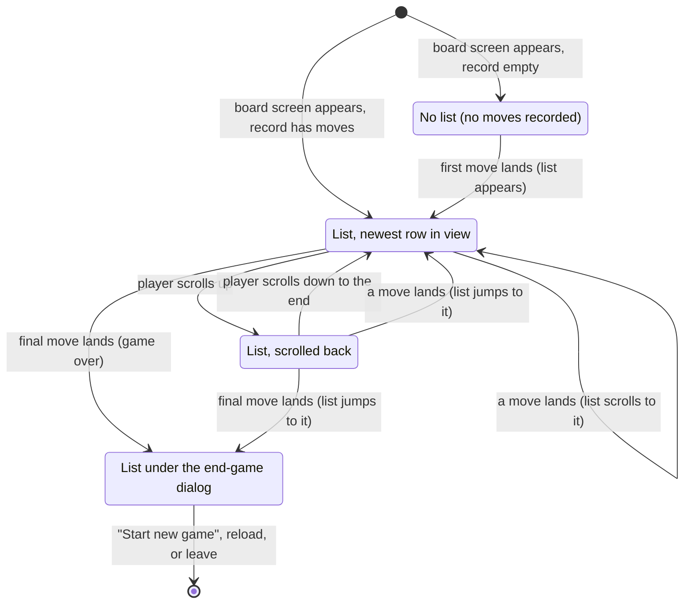

# The move list

## Summary

The move list is the one place the game's [move record](../glossary.md#games-and-seats) appears as text: a dark panel at the bottom right of the [board screen](../glossary.md#the-product-and-its-screens) that lists every recorded move, one numbered row per White–Black pair, in [cell notation](../glossary.md#the-board) (`1. Ab2–Ab3 Ed4–Ed3`). It is part of the [HUD](../glossary.md#input) and has no controls: the player can read it and scroll it, and nothing else. It changes only when a move lands on this board (its [echo](../glossary.md#requests), or a snapshot containing it, arrives), never when a move is sent, and it always shows the whole record exactly as the server holds it, including a move this browser cannot replay. It has no request of its own and never sends anything.

## The simple case

The game starts and the board screen appears. There is no move list yet: the bottom right of the window shows only the board.

White plays pawn `Ab2` to `Ab3`. As the pawn lands on both boards, a small translucent dark panel with rounded corners appears at the bottom right, in white monospace text: `1. Ab2–Ab3`, the row number slightly dimmer than the move. Black answers `Ed4–Ed3`; as it lands, the same row becomes `1. Ab2–Ab3 Ed4–Ed3` and the panel widens to the left to fit. White's next move starts row 2 under it.

The panel grows upward one row at a time until it is 40% of the window's height or 320 pixels tall, whichever is less, then scrolls, keeping the newest row in view at the bottom. The player can scroll back with the wheel or the scrollbar to read the opening; the next move that lands, by either player, scrolls the list straight back to the newest row.

Every row reads the same on both players' screens. Nothing in the list says which moves were the player's, which were captures, or whether a King is in check, and the board has no labels to match the cells against: a player who wants to find `Ed3` on the board has to count along the levels, files, and ranks (see [the rules](../foundations/game-rules.md#the-board) and [the view](../foundations/the-view.md#orientation)). The notation is also what the [move box](../glossary.md#the-interface) at the bottom left accepts, en dash included, so a move can be typed in the same form the list shows it.

## The interaction, event by event

The move list has no request of its own. Its content is changed only by other requests' answers: the player's own move ([making a move](../play/making-a-move.md) and [promotion](../play/promotion.md)), whether clicked on the board or typed in the move box, the opponent's move ([the opponent's move](../play/the-opponents-move.md)), and the snapshot that answers every [rejoin](../foundations/connection-and-seat.md#rejoining). The one thing the player can do with the list is scroll it, which is local and sends nothing. Below, Begin and End without sending describe the scroll; Send, While in flight, and The answer arrives describe how moves reach the list.

### Begin

The player scrolls the list: the wheel over it, a drag on its scrollbar (in browsers that show one), or a swipe on it with a finger. The list scrolls only once it has reached its height limit; until then all rows fit, and the wheel over the list does nothing at all: the list does not move, the page never scrolls, and the view is not zoomed. At the moment the scroll begins nothing is decided and nothing is sent.

The wheel over the list scrolls the list, never the view. A press on the list never reaches the board, so it cannot select, clear, or play anything, and a drag that starts on the list does not turn the view (it selects the list's text instead, as on any web page). A drag that started on the board, by contrast, keeps turning the view while the pointer crosses the list. The list is one of only three HUD panels that take the pointer, with the move box and the error banner; the rest of the HUD lets presses through to the board.

> Technical note: The camera controls and the board's own pointer handling both listen on the element that wraps the 3D canvas (the 3D library connects its events to that wrapper, and the camera controls default to the same element). The move list is drawn beside that element, not inside it, so a wheel turn or a press on the list never reaches either of them. Only a drag already in progress follows the pointer over the list, because once a drag has begun the camera controls listen to the whole page for movement and release.

Clicking a row does nothing. The rows are not links or buttons: there is no way to step back through the game, highlight a move on the board, or see an earlier position.

### End without sending

The scroll stops where the player leaves it. Nothing is sent and nothing is recorded, in the browser or on the server; the list never sends anything in any phase. The scroll position is kept until the next move lands (which scrolls to the newest row), or until the board screen is rebuilt by a reload or a return to the game (which starts at the newest row). A reconnect that brings no new move leaves the list where the player scrolled it.

### Send

Nothing is ever sent. The list is filled only by the answers to other requests, described next. In particular, sending a move, from the board or the move box, adds nothing to it.

### While in flight

While the player's own move is in flight (the board is [held](../glossary.md#selection-and-board-state)), the list does not show it: there is no pending row, no grayed entry, no sign that a move is on its way. The list shows the record as the server last reported it, and it can still be scrolled. The same is true of the opponent's move while it crosses the network: nothing changes until it lands.

### The answer arrives

**An echo.** When a move's echo arrives, the move is added to the list at the same moment the piece begins its [glide](../foundations/the-view.md#motion): a new numbered row if White moved, the second half of the last row if Black moved. The first move of the game makes the list appear. Whatever the player had scrolled to, the list scrolls to the newest row. A move is written as its origin cell, an en dash, and its destination cell (`Ab2–Ab3`); a promotion adds "=" and the letter of the chosen piece, Q, R, B, N, or U (`Da4–Ea5=U`; see [promotion](../play/promotion.md#the-answer-arrives)). A capture looks like any other move, and nothing marks check or checkmate.

**A snapshot.** The snapshot that answers a rejoin carries the whole record, and the list is rebuilt from it, never counting a move twice. On a fresh page (a reload, a link, a return), the list appears at once with every move, scrolled to the newest row. After a reconnect or "Play here", moves the list did not yet have are added and the list scrolls to the newest; if the snapshot brings nothing new, the list stays as it was, scroll position included.

**An error.** A refused move never enters the list; the list is unchanged. The refusal appears in the [error banner](error-banner.md). A typed move that the move box itself refuses is never sent and never reaches the list either.

**A frozen record.** When the record holds a move this browser cannot replay, the board stops at the position before it and the [frozen-board banner](../cross-cutting/broken-game-record.md) explains, but the list still shows the whole record: the unplayable move, and any move recorded after it. The list is the only place such a move can be seen. See [the broken game record](../cross-cutting/broken-game-record.md).

## Modifiers

| Modifier | At the start | Changes while in flight |
| --- | --- | --- |
| Your color | No effect. Both players see the same list, White's move first in every row, whichever color they play. Nothing marks the player's own moves. | Cannot change. |
| Whose turn it is | No effect on how the list looks. The only hint is the last row: in a game that is not frozen, a row with one move means Black is to move. | The list changes only when a move lands, which is also when the turn changes. |
| How you reached the page | A creator or joiner who watches the game start sees no list until the first move lands. A player returning with a [stored seat](../foundations/connection-and-seat.md#the-stored-seat) (reload, link, Back or Forward) sees the full list at once, scrolled to the newest row. A visitor without a stored seat sees it only after joining, like any joiner; one who is refused a seat never reaches the board screen. | Not applicable. |
| Connection state | Connected: as described. Reconnecting: the list keeps the record as it was at the drop and can still be scrolled; nothing is added until the connection returns and the snapshot arrives. Connecting occurs on the board screen only after "Play here", with the same effect. Replaced: the [replaced dialog](../session/second-tab.md) covers the list, which cannot then be scrolled or reached. | A snapshot after the connection returns brings the list up to date; see "The connection drops" below. |
| Game state | In progress or in check: as described; check is not marked. Over: the [end-game dialog](../play/check-and-game-end.md) covers the list, which stays visible, darkened, but cannot be scrolled, reached with the keyboard, or read by a screen reader. Frozen: the list shows the whole record, including moves the board cannot show. | The move that ends the game or freezes the record enters the list like any other. |
| Shift, Ctrl, or Cmd held | No effect on scrolling. Ctrl with the wheel over the list is the browser's own page zoom, as on any web page; over the board, the view takes the wheel instead. | No effect. |
| Input device | Mouse: the wheel or the scrollbar scrolls the list. Touch: a swipe on the list scrolls it and never turns the view. Keyboard: the app gives the list no focus and no keys; see the open questions. | No effect. |

For the move list, "at the start" means when the board screen appears and the list is first drawn from the record; "changes while in flight" means the modifier changing while the list is on screen, including while a move is in flight and while the player has scrolled back.

## Cancel and interrupt

| Event | Before sending | While in flight |
| --- | --- | --- |
| Escape or Cancel | No effect on the list. Escape is ignored. While the [promotion dialog](../play/promotion.md) is open it covers the list, which is out of reach; "Cancel" uncovers it as it was. | No effect. A sent move cannot be taken back, and the list never showed it. |
| Pressing elsewhere or turning the view | Presses, drags, and wheel turns on the board leave the list alone: they neither scroll it nor change it. A press on the list never reaches the board, and the wheel over it never reaches the view. A drag that began on the board keeps turning the view while the pointer crosses the list. Typing in the move box does not touch it. | Same. The move enters the list only when it lands. |
| Leaving the game page within the app | The list and its scroll position are discarded with the board screen. Returning to the game rebuilds the list from the snapshot, scrolled to the newest row. A jump through the browser's history to another game's page shows that game's own list. | If the server received the move, the list shows it on return, as part of the snapshot. |
| The game ends | The final move is added and scrolled into view as the end-game dialog appears. The list stays visible, darkened, behind the dialog, and can no longer be scrolled or reached. | This move's echo can end the game; it enters the list at the moment the dialog appears. |
| The server answers with an error | No effect on the list. The error banner has a place of its own at the bottom center (or, in a narrow window, on a row above the list) and never covers it. | The refused move never enters the list. |
| The connection drops | The list keeps the record as it was at the drop and can still be scrolled. The snapshot after the reconnect rebuilds it without repeating any move: new moves are added and the list scrolls to the newest; with none, it stays where the player left it. See [connection loss](../session/connection-loss.md). | The move is not in the list. The snapshot adds it if the server recorded it. |
| The window loses focus or the tab is hidden | No effect. Moves that land while the tab is hidden are in the list, scrolled to the newest, when the player returns. | No effect; the echo is handled in the background. |
| Reload or closing the tab | The list and its scroll position are lost. After a reload the list is rebuilt from the snapshot with every move, scrolled to the newest row. | The move is in the rebuilt list if the server recorded it. |
| The opponent acts | The opponent's move lands in the list exactly like the player's own, and scrolls the list to the newest row even if the player had scrolled back to read. Presence changes ("Opponent: offline") do nothing to it. | The opponent cannot move until the player's move has landed; their move then arrives as usual. |
| Another tab takes the seat | The replaced dialog covers the list, which stops changing: this tab no longer receives moves. The same happens when this tab's connection returns after a drop and finds the seat held by the other tab. After "Play here", the snapshot adds every move made meanwhile and scrolls to the newest. | The move appears in this tab's list if its echo arrived before the replacement; otherwise with the snapshot after "Play here", if the server recorded it. |
| A second touch point or a cancelled touch | A touch on the list scrolls it and never reaches the board, so a second finger landing on the list does not join a gesture on the board. A cancelled touch stops the scroll where it is. | No effect. |

The move list never sends anything. Here "before sending" means the list as the player reads or scrolls it, and "while in flight" means while one of the player's own moves is in flight and not yet in the list. After every interrupt the list shows the record as this page last received it; nothing the player does to the list survives the board screen being rebuilt.

## Interactions with other systems

**Seat and turn.** The list is the same for both seats and does not depend on the turn. It never marks the player's own moves or whose turn it is, beyond the half-filled last row when Black is to move.

**The game record.** The list is the record, in full and in order, exactly as the server holds it; it is written from the record itself, not from the position on the board. It never shows a move the server has not recorded and never leaves out one it has, including a move this browser cannot replay. There is no result line: a finished game's list simply ends with the final move.

**Connection.** Moves reach the list only over the connection, as echoes or in a snapshot. While disconnected it shows the record as of the drop; the snapshot after reconnecting brings it up to date without duplicating anything.

**The opponent.** The opponent's moves enter the list the same way as the player's own. Both players' lists are identical once the same moves have landed. Presence has no effect.

**Other tabs and devices.** Each tab builds its own list from its own connection. A replaced tab's list stops changing until "Play here", then catches up from the snapshot.

**Game over.** The list ends at the final move, which is scrolled into view as the end-game dialog appears over it. Behind the dialog it can be seen, darkened, but not scrolled or reached in any way, so a long game's opening cannot be read after mate. Reloading shows the same list, scrolled to the end, under the dialog again.

**Stored seat.** No role, except that a stored seat is what brings a returning player back to the board screen, and so to the list.

**Keyboard, touch, and screen size.** The app makes nothing in the list focusable or clickable. Its accessible name is "Move history", and moves that are added are not announced to screen readers (the [turn indicator](turn-indicator.md), which changes at the same moment, is); see [accessibility](../cross-cutting/accessibility.md). On a touch screen a swipe on the list scrolls it. The list is at most 40% of the window's height and never more than 320 pixels, so in a 720-pixel window about twelve rows (twenty-four moves) fit before it scrolls, in a window 800 pixels or taller about thirteen, and on a phone on its side (375 pixels tall) about six. In a window narrower than 640 pixels it takes the right half of the bottom row, beside the move box and below the error banner, and is at most that half's width; it never overlaps another panel. See [screen sizes and touch](../cross-cutting/screen-sizes-and-touch.md).

## Edge cases

- **The list covers part of the board.** A press on the list never reaches the board, so a piece or legal destination drawn behind it cannot be pressed until the view is turned, or the move typed in the move box; see [the input model](../foundations/input-model.md#what-takes-a-press). The list grows as the game goes on, so the covered corner grows too.
- **The rows do not line up.** The two moves in a row are separated by two spaces in the app's text, but the page collapses them into one, so the second column is not a column. Row numbers from 10 on are a character wider, which shifts every move in those rows to the right, and a promotion's "=U" pushes the Black move in its row two characters further.
- **The panel changes width.** It is as wide as its longest row, and it is anchored at the right, so it widens to the left when the first Black move lands, again at row 10, and for a row with a promotion.
- **A long row in a narrow window.** Below 640 pixels the list is at most half the window wide (about 173 pixels at 375), which just holds a row numbered 10 or more; a row that is longer still, such as one with a promotion, is expected to wrap onto a second line. Not measured with a promotion.
- **Scrolling back is undone by the next move.** A player reading the opening while the game goes on is sent back to the newest row every time a move lands, by either player.
- **Counting moves.** The list numbers pairs of moves, while the frozen-board banner counts single moves: "Move 3 in this game's history is not a legal move for this client" refers to White's move in row 2.
- **Cells without labels.** The notation is the same for both players, but Black sees the board mirrored (file a on the right, level E nearest), so the same cell name points to a different part of the screen for each player; see [the view](../foundations/the-view.md#orientation).
- **Right-click on the list.** The browser's own context menu opens, because the list is outside the area where the view suppresses it. Over the board it never opens.
- **Selecting text.** The list's text can be selected and copied like any text on a web page; a drag that starts on the list selects rather than turning the view. A move copied from the list can be pasted into the move box.
- **Before the board screen.** The share-link, join, and joined screens never show the list, even when a returning player's game already has moves; it appears with the board.

## Open questions and verification

- The two spaces between a row's White and Black moves (`client/src/screens/MoveList.tsx:59`) collapse into one on the page, because the list does not preserve spaces. With a monospace font, the second column was presumably meant to line up. This looks like a small bug ([B-19](../bug-triage.md#b-19-small-copy-and-rendering-slips)). The unit test ("GameScreen lists played moves in wire notation" in `client/src/App.test.tsx`) checks each move separately and would not notice.
- The list scrolls to the newest row whenever the number of moves changes (`client/src/screens/MoveList.tsx:22-25`), even when the player has scrolled back on purpose. Whether it should respect a player who is reading is a product call.
- The list cannot be clicked to review an earlier position, and behind the end-game dialog it cannot be scrolled, so a finished game's opening cannot be read in the app ([B-20](../bug-triage.md#b-20-the-end-of-a-game-offers-nothing-but-leaving-no-review-no-rematch-no-resignation-no-abandonment)). See [check and the end of the game](../play/check-and-game-end.md#open-questions-and-verification). A product call.
- The wheel over the list scrolls the list and never zooms the view. Verified in the code, not by hand: `@react-three/drei` 10.0.7 connects the camera controls to the 3D library's event element, which `@react-three/fiber` 9.1.2's canvas component sets to its own wrapper element (the one marked `r3f-canvas`); in `client/src/screens/GameScreen.tsx` the list is in the HUD, a sibling of that wrapper, not inside it, and it opts back into pointer events that the rest of its layer ignores. The same holds for presses, which the end-to-end helpers treat as swallowed by the HUD (`client/e2e/helpers/board.ts`).
- Recent versions of Chrome and Firefox let Tab reach a scroll area that has no focusable content, so once the list scrolls, the keyboard may be able to focus it and scroll it with the arrow keys. Behind a dialog it is inert and cannot be reached. Not tried.
- The height limit is `min(40vh, 320px)` (`client/src/screens/MoveList.tsx:43`). How many rows fit at a given window height is computed from the list's styles (13-pixel text at a line height of 1.7, and 8 pixels of padding above and below), not measured beyond a 20-move game, which was 237 pixels tall in both a 1280 × 720 and a 375 × 667 window. Whether a browser that draws a classic (space-taking) scrollbar narrows the rows enough to wrap a Black move onto its own line was not checked.
- Ctrl with the wheel, and a trackpad pinch, over the list are expected to zoom the whole page rather than the view, and a two-finger pinch on the list on a phone likely zooms the page too. Read from which element handles the gestures; not tried.
- The list's content is covered by `client/src/App.test.tsx` (wire notation, and the full record when frozen) and by `client/e2e/session.spec.ts` (after a reload and after "Play here") and `client/e2e/promotion.spec.ts` ("=U"). Hiding the list before the first move, the height limit, and the automatic scroll have no test.

Verified against 3D Chess commit `4e18386`
