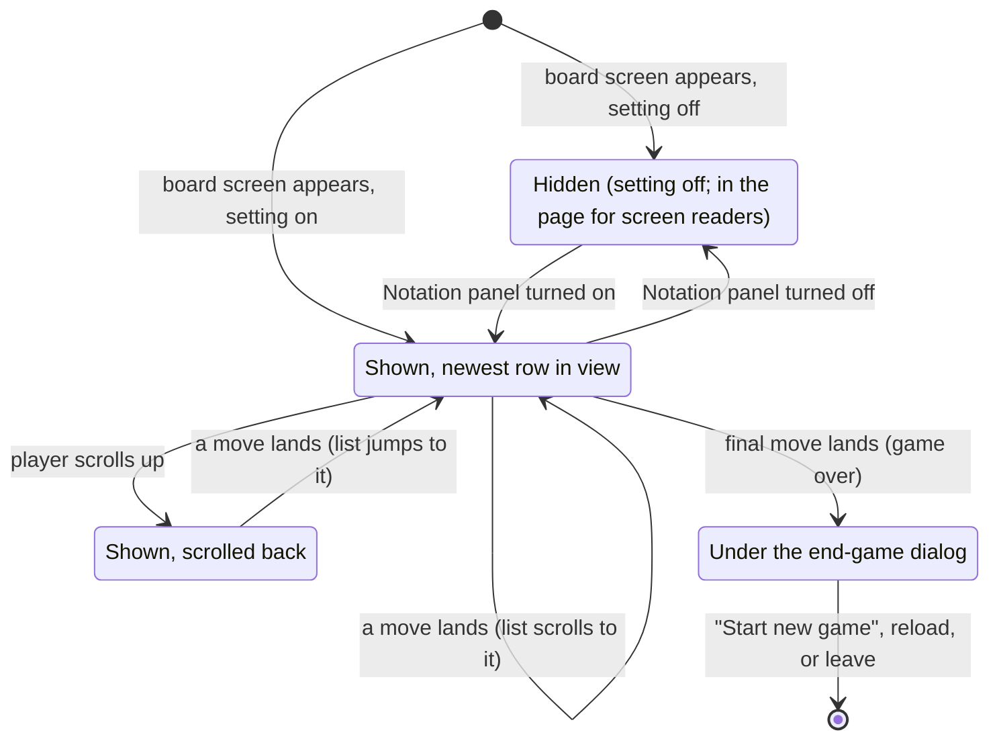

# The move list

## Summary

The move list is the one place the game's [move record](../glossary.md#games-and-seats) appears as text: every recorded move, one numbered row per White–Black pair, in [cell notation](../glossary.md#the-board) (`1  Ab2–De5  Ed4–Ba1`). It lives in the [move card](../glossary.md#the-interface) at the bottom left of the [board screen](../glossary.md#the-product-and-its-screens), and is on screen only while the **Notation panel** setting is on (the settings panel's first group, "Play"); with the setting off, the board screen shows no history at all. Either way the list is in the page for screen readers, who can read the whole game at any time, and every move is also announced as it lands (the [move announcement](../glossary.md#the-interface)). The list changes only when a move lands on this board (its [echo](../glossary.md#requests), or a snapshot containing it, arrives), never when a move is sent, and it always shows the whole record exactly as the server holds it, including a move this browser cannot replay. It has no request of its own and never sends anything; the player can read it and scroll it.

## The simple case

A player who wants the history opens the settings gear at the top right and turns on the **Notation panel**. A glass card appears at the bottom left: in a wide window on a device with a mouse, a top line naming the cell under the pointer ("Dd5  Black pawn"); then, once a move has been played, a porcelain and a charcoal stone heading two columns; and at the foot, the [move box](../glossary.md#the-interface). The setting is kept in this browser, so the card is there in every game from then on, until it is turned off.

White plays `Ab2` to `De5`. As the unicorn lands on both boards, row `1  Ab2–De5` appears in the card, the move in full ink and the row number fainter. Black answers `Ed4–Ba1`; as it lands, it fills the row's second column and becomes the brightest entry, while White's move dims a little. White's next move starts row 2 under it.

The list grows upward one row at a time until it is about six rows tall (132 pixels), then scrolls, keeping the newest row in view at the bottom. The player can scroll back with the wheel, a finger, or the scrollbar to read the opening; the next move that lands, by either player, scrolls the list straight back to the newest row.

Every row reads the same on both players' screens. Nothing in the list says which moves were the player's, which were captures, or whether a King is in check. The notation is also what the move box accepts, en dash included, and the cell line at the top of the card names any cell the pointer rests on, so a player can learn the names by pointing.

## The interaction, event by event

The move list has no request of its own. Its content is changed only by other requests' answers: the player's own move ([making a move](../play/making-a-move.md) and [promotion](../play/promotion.md)), whether clicked on the board or typed in the move box, the opponent's move ([the opponent's move](../play/the-opponents-move.md)), and the snapshot that answers every [rejoin](../foundations/connection-and-seat.md#rejoining). What the player can do is scroll it, and show or hide it with the setting; both are local and send nothing.

```mermaid
stateDiagram-v2
    state "Hidden (setting off; in the page for screen readers)" as hidden
    state "Shown, newest row in view" as newest
    state "Shown, scrolled back" as back
    state "Under the end-game dialog" as over
    [*] --> hidden : board screen appears, setting off
    [*] --> newest : board screen appears, setting on
    hidden --> newest : Notation panel turned on
    newest --> hidden : Notation panel turned off
    newest --> newest : a move lands (list scrolls to it)
    newest --> back : player scrolls up
    back --> newest : a move lands (list jumps to it)
    newest --> over : final move lands (game over)
    over --> [*] : "Start new game", reload, or leave
```

### Begin

The list exists from the moment the board screen appears, holding every move in the record the page received (a reloading player sees the whole game at once). While the Notation panel is on it is drawn in the move card; while it is off it is drawn nowhere, and a screen reader finds it as a list named "Move history". Before the first move the card shows only its cell line and the move box, with no column heads.

Turning the setting on or off takes effect at once, in this game and every later one in this browser, and never reaches the opponent. Scrolling with the wheel, a one-finger drag, or the scrollbar is the only other thing the player can do; it stays inside the list and never turns the view.

### End without sending

Scrolling and switching the setting send nothing and record nothing on the server. A scrolled-back list stays where the player left it until the next move lands.

### Send

Nothing is ever sent from the list. When the player sends a move (by pressing the board, picking a promotion, or typing in the move box), the list does not change: the move is not listed until it lands.

### While in flight

The list shows the record as it stood before the move: the player's own move in flight is not in it, and neither is the opponent's until its echo arrives.

### The answer arrives

- **An echo.** The move is added as the last entry, brightest, and the list scrolls to it. A screen reader hears the move announcement, whether or not the list is shown.
- **A snapshot.** After every rejoin the list is rebuilt from the snapshot, so moves made while the page was disconnected appear together, and nothing is ever listed twice.
- **An error.** Nothing changes.
- **A move this browser cannot replay.** It is listed like any other, with every move after it: the list shows the record, not the position. See [the broken game record](../cross-cutting/broken-game-record.md).

## Modifiers

| Modifier | At the start | Changes while in flight |
| --- | --- | --- |
| Your color | No effect: the columns are White's and Black's, headed by their stones, the same for both players. | Cannot change. |
| Whose turn it is | No effect on the list. | No effect: a move is listed when it lands. |
| How you reached the page | Creator and joiner: an empty list. Returning with a stored seat: the whole record, from the snapshot. A visitor without a stored seat sees the join screen and no list. | Not applicable. |
| Connection state | Connected: as described. Reconnecting, connecting, or replaced: the list keeps its last content and is brought up to date by the next snapshot. | A drop while a move is in flight: the move is listed after the snapshot if the server recorded it. |
| Game state | In progress or in check: as described. Over: the final move is listed and the end-game dialog covers the card. Frozen: every recorded move is listed, including the one this browser cannot replay. | The player's own move can end the game; it is listed as it lands, behind the dialog. |
| Shift, Ctrl, or Cmd held | No effect. | No effect. |
| Input device | Mouse: the wheel scrolls the list, never the view; its text can be selected. Touch: a one-finger drag scrolls it. Keyboard: the list itself is not a tab stop; a screen reader reads it as a list. | No effect. |

## Cancel and interrupt

| Event | Before sending | While in flight |
| --- | --- | --- |
| Escape or Cancel | No effect on the list. | No effect. |
| Pressing elsewhere or turning the view | Presses on the board and drags of the view leave the list as it is; a scroll inside the list stays in it. | Same. |
| Leaving the game page within the app | The list goes with the board screen; returning rebuilds it from the snapshot. | Same, with the move listed if the server recorded it. |
| The game ends | The final move is listed; the end-game dialog covers the card. | Same. |
| The server answers with an error | No effect. | No effect: a refused move is never listed. |
| The connection drops | The list keeps its content; the snapshot after the reconnect brings it up to date. | Same. |
| The window loses focus or the tab is hidden | No effect; moves that land meanwhile are listed. | Same. |
| Reload or closing the tab | After a reload the whole record is listed again; the setting is remembered. | Same. |
| The opponent acts | Their moves are listed as they land. Presence does not touch the list. | Same. |
| Another tab takes the seat | The list stays behind the replaced dialog and falls behind; "Play here" brings it up to date. | Same. |
| A second touch point or a cancelled touch | A pinch on the card does not zoom the view. | No effect. |

## Interactions with other systems

**Seat and turn.** None: the list is the same for both players and says nothing about whose move it is.

**The game record.** The list is the record, as the server holds it, in the order it was played.

**Connection.** Only as current as the last echo or snapshot to reach the page.

**The opponent.** Their moves appear as they land.

**Other tabs and devices.** Every tab shows the same list once it is up to date; the setting is shared by every tab of this browser and is not carried to other browsers.

**Game over.** The last move is listed; the end-game dialog covers the card.

**Stored seat.** None.

**Keyboard, touch, and screen size.** The list is in the page for screen readers whether or not it is shown; see [accessibility](../cross-cutting/accessibility.md). The card sits at the bottom left, clear of the board, in a wide window; in a window no wider than 13:9 (a phone or tablet upright, a squarish window) it spans the bottom and the view is framed to leave that band clear; on a phone on its side it moves to the bottom right and narrows; on a phone, and on any device without hover, the cell line is left out (there is no pointer to rest). See [screen sizes and touch](../cross-cutting/screen-sizes-and-touch.md).

## Edge cases

- **Hidden by default.** A player who never opens the settings never sees the history; the board's last-move line shows the latest move, and the rest is not on screen.
- **One setting for the whole card.** The list cannot be collapsed on its own: the Notation panel shows the list, the cell line, and the move box together.
- **Hyphen in, en dash out.** The move box accepts a hyphen, and the list shows an en dash.
- **Long games.** The list scrolls after about six rows; nothing is ever dropped from it.

## Open questions and verification

- Whether screen readers keep the list's semantics while it is visually hidden (it is clipped, not removed) was not tried with a screen reader.
- Covered by tests: `client/src/App.test.tsx` (the list in wire notation, hidden or shown by the setting, and complete when the record is frozen) and `client/e2e/session.spec.ts` (the moves after a reload).

Verified against 3D Chess commit `f7bff4d`
