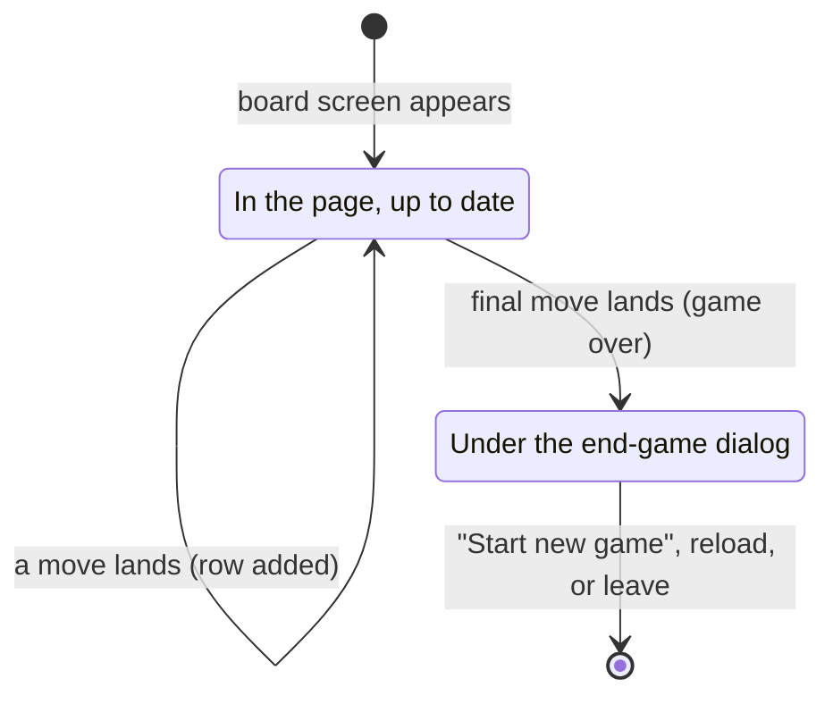

# The move list

## Summary

The move list is the one place the game's [move record](../glossary.md#games-and-seats) appears as text: every recorded move, one numbered row per White–Black pair, in [cell notation](../glossary.md#the-board) (`1. Ab2–De5 Ed4–Ba1`). It lives in the [move card](../glossary.md#the-interface) and is never drawn on screen: it is in the page for screen readers only, as a list named "Move history", and the board screen shows no history at all. A screen reader can read the whole game at any time, and every move is also announced as it lands (the [move announcement](../glossary.md#the-interface)). The list changes only when a move lands on this board (its [echo](../glossary.md#requests), or a snapshot containing it, arrives), never when a move is sent, and it always holds the whole record exactly as the server holds it, including a move this browser cannot replay. It has no request of its own and never sends anything, and a sighted player has nothing to do with it: the move card's one visible part is the [move box](../glossary.md#the-interface).

## The simple case

A screen-reader player reaches the list by browsing the page. White plays `Ab2` to `De5`; as the unicorn lands on both boards, row `1. Ab2–De5` is in the list, and the announcement says the move aloud. Black answers `Ed4–Ba1`; it fills the row's second entry. White's next move starts row 2 under it.

Every row reads the same on both players' screens. Nothing in the list says which moves were the player's, which were captures, or whether a King is in check. The notation is also what the move box accepts, en dash included.

A player who wants to see the history has no on-screen list to open. The board's last-move line shows the latest move and nothing else does.

## The interaction, event by event

The move list has no request of its own. Its content is changed only by other requests' answers: the player's own move ([making a move](../play/making-a-move.md) and [promotion](../play/promotion.md)), whether pressed on the board or typed in the move box, the opponent's move ([the opponent's move](../play/the-opponents-move.md)), and the snapshot that answers every [rejoin](../foundations/connection-and-seat.md#rejoining). There is nothing the player can do to it.

```mermaid
stateDiagram-v2
    state "In the page, up to date" as current
    state "Under the end-game dialog" as over
    [*] --> current : board screen appears
    current --> current : a move lands (row added)
    current --> over : final move lands (game over)
    over --> [*] : "Start new game", reload, or leave
```

### Begin

The list exists from the moment the board screen appears, holding every move in the record the page received (a reloading player finds the whole game at once). It is drawn nowhere; a screen reader finds it as a list named "Move history". Before the first move it is empty.

### End without sending

Nothing the player does reaches the list, so nothing is sent or recorded.

### Send

Nothing is ever sent from the list. When the player sends a move (by pressing the board, picking a promotion, or typing in the move box), the list does not change: the move is not listed until it lands.

### While in flight

The list shows the record as it stood before the move: the player's own move in flight is not in it, and neither is the opponent's until its echo arrives.

### The answer arrives

- **An echo.** The move is added as the last entry. A screen reader hears the move announcement.
- **A snapshot.** After every rejoin the list is rebuilt from the snapshot, so moves made while the page was disconnected appear together, and nothing is ever listed twice.
- **An error.** Nothing changes.
- **A move this browser cannot replay.** It is listed like any other, with every move after it: the list shows the record, not the position. See [the broken game record](../cross-cutting/broken-game-record.md).

## Modifiers

| Modifier | At the start | Changes while in flight |
| --- | --- | --- |
| Your color | No effect: the entries are White's and Black's, the same for both players. | Cannot change. |
| Whose turn it is | No effect on the list. | No effect: a move is listed when it lands. |
| How you reached the page | Creator and joiner: an empty list. Returning with a stored seat: the whole record, from the snapshot. A visitor without a stored seat sees the join screen and no list. | Not applicable. |
| Connection state | Connected: as described. Reconnecting, connecting, or replaced: the list keeps its last content and is brought up to date by the next snapshot. | A drop while a move is in flight: the move is listed after the snapshot if the server recorded it. |
| Game state | In progress or in check: as described. Over: the final move is listed and the end-game dialog covers the page. Frozen: every recorded move is listed, including the one this browser cannot replay. | The player's own move can end the game; it is listed as it lands, behind the dialog. |
| Shift, Ctrl, or Cmd held | No effect. | No effect. |
| Input device | Mouse and touch: no effect, the list is not drawn. Keyboard: the list itself is not a tab stop; a screen reader reads it as a list. | No effect. |

## Cancel and interrupt

| Event | Before sending | While in flight |
| --- | --- | --- |
| Escape or Cancel | No effect on the list. (Escape in the move box puts the box away.) | No effect. |
| Pressing elsewhere or turning the view | No effect. | Same. |
| Leaving the game page within the app | The list goes with the board screen; returning rebuilds it from the snapshot. | Same, with the move listed if the server recorded it. |
| The game ends | The final move is listed. | Same. |
| The server answers with an error | No effect. | No effect: a refused move is never listed. |
| The connection drops | The list keeps its content; the snapshot after the reconnect brings it up to date. | Same. |
| The window loses focus or the tab is hidden | No effect; moves that land meanwhile are listed. | Same. |
| Reload or closing the tab | After a reload the whole record is listed again. | Same. |
| The opponent acts | Their moves are listed as they land. Presence does not touch the list. | Same. |
| Another tab takes the seat | The list stays behind the replaced dialog and falls behind; "Play here" brings it up to date. | Same. |
| A second touch point or a cancelled touch | No effect. | No effect. |

## Interactions with other systems

**Seat and turn.** None: the list is the same for both players and says nothing about whose move it is.

**The game record.** The list is the record, as the server holds it, in the order it was played.

**Connection.** Only as current as the last echo or snapshot to reach the page.

**The opponent.** Their moves appear as they land.

**Other tabs and devices.** Every tab holds the same list once it is up to date.

**Game over.** The last move is listed.

**Stored seat.** None.

**Keyboard, touch, and screen size.** The list is in the page for screen readers at every window size; see [accessibility](../cross-cutting/accessibility.md). The move card it belongs to is out of sight, and only its move box shows, while the box has keyboard focus: at the bottom left in a wide window, across the bottom in a window no wider than 13:9 (a phone or tablet upright, a squarish window), at the bottom right on a phone on its side. See [screen sizes and touch](../cross-cutting/screen-sizes-and-touch.md).

## Edge cases

- **No history on screen.** A sighted player never sees the moves so far; the board's last-move line shows the latest move, and the rest is not on screen.
- **Hyphen in, en dash out.** The move box accepts a hyphen, and the list uses an en dash.
- **Long games.** Nothing is ever dropped from the list.

## Open questions and verification

- Whether screen readers keep the list's semantics while it is visually hidden (it is clipped, not removed) was not tried with a screen reader.
- The list in wire notation, complete when the record is frozen, is covered by `client/src/App.test.tsx`; the moves after a reload by `client/e2e/session.spec.ts`. The rewrite for the removal of the Notation panel was made from the code, not re-verified by hand.

Verified against 3D Chess commit `f7bff4d`
