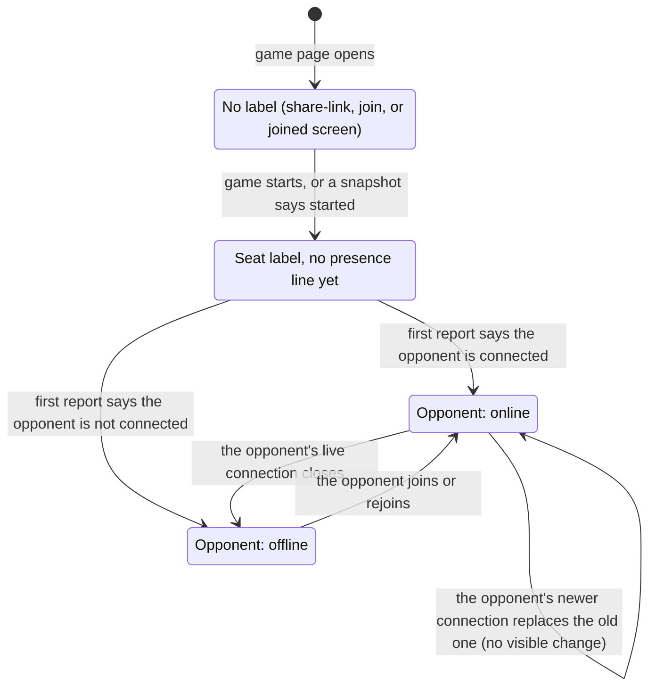

# Seat and opponent status

## Summary

The [seat label](../glossary.md#the-interface) is the dark, translucent box at the top left of the [board screen](../glossary.md#the-product-and-its-screens). It tells the player which color this browser plays, "You are playing as white." or "You are playing as black.", and, in smaller text under that once the server has reported it, whether the opponent currently has a live connection to the game: "Opponent: online" or "Opponent: offline". It is the only place the page names the player's color in words, and the only thing the page ever says about the opponent besides their moves. The panel is display only: nothing on it can be clicked, it ignores the pointer (a press on it reaches the board behind), it sends nothing, and it exists only on the board screen. The presence line reports connections, not people. The model behind it (when the server reports [presence](../glossary.md#the-connection), and why a replaced connection never counts as leaving) is owned by [the connection and seat model](../foundations/connection-and-seat.md#presence); this document describes what the player sees of it.

## The simple case

The creator is on the share-link screen; the joiner opens the link and clicks "Join Game". Both pages change to the board screen at the same moment. At the top left of one, a dark box reads "You are playing as white."; on the other, "You are playing as black.". For the creator, this is the first time the page has said which color they got. Under the sentence, in smaller and slightly faded text, a second line reads "Opponent: online". As far as the eye can tell, it appears together with the label.

Partway through the game the opponent closes their tab. A moment later the line changes to "Opponent: offline", and a screen reader says so. Nothing else changes: the board, the turn indicator, and the move list stay as they were, and if it is the player's turn they can still move. When the opponent opens the link again and their board comes back, the line changes back to "Opponent: online".

## The interaction, event by event

The panel has no request of its own: nothing on it can be clicked and it sends nothing. It changes only when a message from the server arrives, as described below.

While this player's own page holds no seat on its connection (reconnecting, waiting for a rejoin's answer, or [replaced](../glossary.md#events-that-end-or-interrupt-a-request)), the panel stays in whichever of these states it was in, whether or not that is still true.

### The seat label appears

The label appears the instant the game page reaches the [playing phase](../foundations/screens-and-navigation.md#the-game-page-and-its-phases), together with the board: when the server announces that the game has started (the creator and the joiner, live), or when a rejoin's [snapshot](../glossary.md#requests) says both seats are taken (a reload, a return through the link, a reconnect). The color is the one the server names in that message, which is always the seat this browser holds. It is written in lower case with a closing period, in white text on a 70% black box with slightly rounded corners.

Where it sits depends on the window's width (see [the HUD](../glossary.md#input)). In a window 640 pixels wide or more, it is the left-hand panel of the top row, 10 pixels from the top and left edges, with the [turn indicator](turn-indicator.md) centered beside it. In a narrower window the turn indicator takes the top row on its own, and the label moves to the left half of the second row, about 60 pixels from the top, sharing that row with the "Reconnecting…" box on the right. It is then at most half the window wide, so on a phone "You are playing as white." wraps onto two lines. The panels never overlap at any width.

Once shown, the label does not change or move for as long as the page is open, unless the window is resized across the 640-pixel line, when it moves between the two places above. It stays fixed while the view is orbited, zoomed, or panned, and its color cannot change, because a [seat](../foundations/connection-and-seat.md#seats) is held for the life of the game.

The share-link, join, and joined screens show no label and no presence line, even though the page may already know the color: the creator's answer to "Start New Game", the joiner's seat confirmation, and the [stored seat](../foundations/connection-and-seat.md#the-stored-seat) all carry it. A creator therefore learns their color only when the board appears (see [creating a game](../start/creating-a-game.md)).

### The presence line appears

Until the first report about the opponent arrives, the label has only its first line; there is no "Opponent: …" placeholder. The server sends that first report straight after the message that makes the board appear:

- **Joining.** The creator is told that the joiner is online; the joiner is told whether the creator is connected at that moment.
- **Rejoining.** Right after the snapshot, the rejoining player is told whether the opponent is connected.

In practice the line appears with the label, one message later. It is smaller (13-pixel) text at slightly reduced opacity, a few pixels under the first line, and reads "Opponent: online" or "Opponent: offline". It is marked as a status message, so screen readers announce its later changes politely, without interrupting.

A joiner whose creator has already closed the share-link page sees "Opponent: offline" from the start, and can make the first move if they hold White. The creator's page, when it returns, rejoins and goes straight to the board screen (see [waiting for an opponent](../start/waiting-for-an-opponent.md)).

### The opponent leaves and returns

From then on, the line shows the latest report about the opponent:

- **"Opponent: offline"** once the server notices that the opponent's live connection has closed: they closed the tab or window, reloaded, went back to the start screen (browser Back, or "Start new game" after the game ended), jumped through their browser history to another game's page, reached the crash screen, or lost their connection.
- **"Opponent: online"** when the opponent's page rejoins: after a reload, on opening the link again, after a reconnect, on browser Forward, or on "Play here".

An opponent's reload therefore usually shows as a flicker: "Opponent: offline" for as long as their page takes to reload and rejoin, then "Opponent: online". If the opponent's new connection reaches the server before the old one is noticed closing, the new one takes the seat ([last connection wins](../foundations/connection-and-seat.md#last-connection-wins)), the old one's closing is not reported, and the line never changes. The same holds when the opponent opens the game in a second tab of their browser, or clicks "Play here" in a replaced one: a connection replaced by the same player's newer one never reports the player offline, so the player receives "online" again, which looks like no change at all.

How quickly "offline" follows a lost connection depends on how quickly the server notices. A closed tab is noticed at once. A network that simply goes away (a dropped Wi-Fi link, a laptop going to sleep) can leave the server believing the connection is still open for a while; if the opponent's browser reconnects before the server notices, the opponent is never reported offline at all.

### This player's own connection drops

While this player's connection is down ("Reconnecting…" at the top right), no reports can arrive, and the line keeps showing the last one, which may no longer be true. The label itself is unaffected. When a connection opens again, the page [rejoins](../foundations/connection-and-seat.md#rejoining); the snapshot is followed at once by a fresh report, which replaces the old one. Anything the opponent did in between, such as leaving and coming back, is never shown: the line goes straight to the current state.

If the rejoin finds the seat held by another tab of this browser (the player went on playing there while this tab was offline), the server refuses it and this tab shows the [replaced dialog](../session/second-tab.md) instead; no fresh report comes, and the line stays at its old value behind the dialog.

> Technical note: The line shows the latest presence report this page has received, on any of its connections. Nothing clears it when the connection drops, which is why a stale value stays up during an outage, and why a report received before the game started can show for an instant as the board appears (see the edge cases).

### Leaving and coming back

Leaving for the start screen, or jumping through the browser's history straight to another game's page, [resets](../foundations/connection-and-seat.md#returning-to-the-start-screen) the connection, and the page forgets everything it knew, the label and the last report included. Coming back (browser Back or Forward, the link, a bookmark) opens a fresh game page: the share-link screen shows for a moment, then the snapshot brings back the board with the label, and the fresh report follows it.

## Modifiers

| Modifier | At the start | Changes while in flight |
| --- | --- | --- |
| Your color | Decides the label's text: "You are playing as white." or "You are playing as black.". The presence line reads the same for both colors and does not name the opponent's color. | Cannot change: the seat is held for the life of the game. |
| Whose turn it is | No effect. The label never says whose turn it is; the player compares its color with the [turn indicator](turn-indicator.md). | No effect. |
| How you reached the page | Creator: the label appears when the joiner joins, and is the first place the color is shown; "Opponent: online" follows at once. Joiner: the label appears a moment after "Joined game, waiting for start..."; the line reads "Opponent: online" or "Opponent: offline" depending on whether the creator's page is connected. Returning with a stored seat: the label appears when the snapshot arrives, the line right after it. A visitor without a stored seat sees the join screen and no label; a seated player using another browser is such a visitor. | Not applicable: how the page was reached does not change while it is open. |
| Connection state | Connected: as described. Connecting (after "Play here") or reconnecting: the label stays, and the line keeps its last value, which may be stale. Replaced (the seat was taken by another tab, or found in use by it after a reconnect): both stay at their last values behind the [replaced dialog](../session/second-tab.md). | While the page's rejoin is in flight after a reconnect, the line still shows the value from before the drop; the fresh value arrives right after the snapshot. A drop while a move is in flight changes nothing on the panel. |
| Game state | In progress or in check: no effect; the label says nothing about check. Over: the [end-game dialog](../play/check-and-game-end.md)'s darkened backdrop covers the label, which stays faintly visible and keeps updating behind it but cannot be reached or read by a screen reader. Frozen: no effect on the label; the [frozen-board banner](../cross-cutting/broken-game-record.md) sits below the top row and never covers it. | The player's own move can end the game when its echo lands; the dialog then covers the label. |
| Shift, Ctrl, or Cmd held | No effect. | No effect. |
| Input device | Mouse: the label ignores the pointer, so a press, a drag, a wheel turn, or a right-click on it acts on the board or the view behind it exactly as if the label were not there; its text cannot be selected with the mouse. Touch: a finger on the label is a finger on the board. Keyboard: the label cannot be focused and has nothing to do; changes of the presence line are announced to screen readers. | No effect. |

For this panel, "At the start" means when the board screen appears, and "Changes while in flight" means while one of this player's own requests is in flight: a move (the board [held](../glossary.md#selection-and-board-state)) or the rejoin the page sends by itself whenever a new connection opens.

## Cancel and interrupt

| Event | Before sending | While in flight |
| --- | --- | --- |
| Escape or Cancel | No effect. The label cannot be dismissed or hidden. | No effect. |
| Pressing elsewhere or turning the view | Presses on the board and drags of the view leave the panel unchanged; it stays in its corner while the view turns. A press, drag, or wheel turn that starts on the label passes through it to the board behind, as for the turn indicator (see [what takes a press](../foundations/input-model.md#what-takes-a-press)). | Same. |
| Leaving the game page within the app | The label goes with the board screen, and the connection resets on arrival at the start screen (or at another game's page), so the opponent's line changes to "Opponent: offline". Coming back shows the label again when the snapshot arrives and the line right after it; the opponent's line returns to "Opponent: online". | Same. A move in flight may still be recorded; see [making a move](../play/making-a-move.md). |
| The game ends | The end-game dialog covers the label. Presence keeps updating behind the backdrop: when the opponent clicks "Start new game", the line changes to "Opponent: offline", the only sign that they have left the finished game. Behind the dialog the line is inert, so the change is not announced. | Same, when the player's own move ends the game. |
| The server answers with an error | No effect; the error appears in the [error banner](error-banner.md) at the bottom of the page. | No effect on the label. If the page's rejoin is refused, no report follows and the line keeps its old value; a rejoin refused because another tab holds the seat brings up the replaced dialog. |
| The connection drops | The label stays. The line keeps its last value while "Reconnecting…" shows, and is replaced by a fresh report right after the snapshot. The opponent sees "Opponent: offline" once the server notices the drop, then "Opponent: online" after the rejoin, or no change if the rejoin replaced a connection the server had not yet noticed was gone. See [connection loss](../session/connection-loss.md). | Same. |
| The window loses focus or the tab is hidden | No effect. Reports keep arriving in a background tab, so the line is current when the player looks again. The opponent keeps seeing "Opponent: online" for a player whose tab is hidden or whose window is minimized, because the connection stays open. | Same. |
| Reload or closing the tab | Reload: the share-link screen shows for a moment, then the label and the line come back with the snapshot; the opponent sees "Opponent: offline" and then "Opponent: online", or no change. Closing: the opponent sees "Opponent: offline"; the seat stays held. See [reloading and returning](../session/reload-and-return.md). | Same. |
| The opponent acts | Joining makes the board appear with the label, and the line reads "Opponent: online". Leaving turns it to "Opponent: offline", and returning to "Opponent: online". Opening a second tab or clicking "Play here" shows no change. Moves never touch the panel. | Same. |
| Another tab takes the seat | This tab's label and line stay at their last values behind the replaced dialog and go stale. The new tab shows the same color and its own fresh report. The opponent's line does not change. The same holds when this tab's connection returns after a drop and finds the seat held by the other tab. After "Play here" in this tab, its line is refreshed by the new rejoin. | Same. |
| A second touch point or a cancelled touch | No effect on the panel. A finger on the label is a finger on the board. | No effect. |

For this panel, "Before sending" describes it while nothing of this player's is in flight, and "While in flight" while one of this player's own requests is: a move, or the page's automatic rejoin after a new connection opens.

## Interactions with other systems

**Seat and turn.** The label names the seat's color as the server confirmed it on this page; it never names whose turn it is. To know whether it is their turn, the player compares it with the [turn indicator](turn-indicator.md), which capitalizes the color ("White to move") where the label does not ("white").

**The game record.** No interaction. The label and presence are not part of the [move record](../glossary.md#games-and-seats), the server keeps no history of who was online, and nothing about presence survives the page.

**Connection.** Presence is reported by the server from the connections it currently holds, so the line is only as current as this player's own connection: it is stale while reconnecting or replaced, and refreshed after every rejoin. The label needs no connection once shown.

**The opponent.** The presence line is all the page says about the opponent besides their moves, and it says only whether the opponent's browser holds an open connection, not whether anyone is at the keyboard. An opponent with the game in a background tab, or who has walked away, shows "Opponent: online". Presence is information only: a player may move while the opponent is offline, and the opponent sees the move when they return (see [the opponent's move](../play/the-opponents-move.md)).

**Other tabs and devices.** Two tabs of this browser on the same game show the same color, but only the one holding the seat receives reports; see [a second tab](../session/second-tab.md). The opponent's second tab is invisible here. The opponent cannot reach the game from another browser at all: without a stored seat they see the join screen, and joining is refused with "Game full".

**Game over.** The end-game dialog covers the panel. Presence reporting does not change after the game ends; the opponent clicking "Start new game" shows as "Opponent: offline".

**Stored seat.** The label is not read from the stored seat; it shows the color the server confirmed on this page, which is the color the stored seat asked for in the rejoin. A browser that loses its stored seat for a game cannot see that game's board or label again (see [the stored seat](../foundations/connection-and-seat.md#the-stored-seat)).

**Keyboard, touch, and screen size.** The label cannot be focused. The presence line is a status message, so a screen reader announces "Opponent: offline" and "Opponent: online" as they change; see [accessibility](../cross-cutting/accessibility.md). On a touch screen, a finger that lands on the label presses the board or turns the view as it would anywhere else. The label's place depends on the window's width, top left beside the turn indicator from 640 pixels up and on the second row below that; it never overlaps another panel (see [screen sizes and touch](../cross-cutting/screen-sizes-and-touch.md)).

## Edge cases

- **Lower case and a period.** The label names the color in lower case and ends with a period ("You are playing as black."), while the turn indicator capitalizes it and has no period ("Black to move"). The player compares the two constantly; the mismatch is cosmetic.
- **The creator's color arrives with the board.** Nothing before the board says which color the creator got. A creator who got Black meets "You are playing as black." and "White to move" at the same instant, and starts by waiting.
- **An instant of "offline" as the board appears.** A creator whose share-link page rejoined before the opponent arrived (after a reload, or a reconnect while waiting) was told then that the opponent was not connected. When the join arrives, the board appears showing that old report, "Opponent: offline", for the instant before the join's own "Opponent: online" arrives. The same can happen after any rejoin, for the instant between the snapshot and the fresh report. Normally too short to see.
- **The opponent reloads.** "Opponent: offline", then "Opponent: online" once their page is back; or no change at all if their new connection won the race against the old one's closing.
- **The server restarts.** Both connections drop at once and both lines keep saying "Opponent: online" under "Reconnecting…". Whoever rejoins first is told the opponent is offline, since the other has not rejoined yet, and sees "Opponent: online" again a moment later when they do.
- **The one-hour limit.** The server ends each connection after at most an hour, and the browser reconnects within about half a second. The opponent may see a brief "Opponent: offline" then "Opponent: online" at that moment, at a different time for each player.
- **An opponent who never comes back.** "Opponent: offline" stays indefinitely. It does not end or pause the game and offers no way to claim it; the player can still move on their turn.
- **Online is not present; offline is not absent.** An opponent looking at another tab, sitting behind the end-game dialog, or away from the keyboard shows "Opponent: online". An opponent whose only open tab is a replaced one (they took the seat in a second tab and then closed that tab) shows "Opponent: offline", although the game is on their screen.
- **No names.** The opponent is only "Opponent"; nothing identifies who holds the other seat.
- **Presses pass through.** The label, like the turn indicator, ignores the pointer, so a piece or cell drawn behind it can be pressed through it. Its text cannot be selected with the mouse, and a right-click on it opens no menu, because the board beneath takes the click.
- **Behind the dialogs.** The promotion dialog, the end-game dialog, and the replaced dialog each darken the whole window, the label included; it stays legible through the backdrop but cannot be reached, and screen readers do not see it while the dialog is up.
- **A narrow window.** Below 640 pixels wide the label drops to the second row, under the turn indicator, and wraps within half the window's width: in a 375-pixel window it is about 175 pixels wide and 90 high, from about 60 pixels down. The "Reconnecting…" box, when shown, sits beside it on the right. Resizing across 640 pixels moves it at once.

## Open questions and verification

- The presence line shows a stale value while this player is reconnecting or replaced, with nothing marking it as possibly out of date (`client/src/game/session.ts:57-64` reads the latest report in the whole page log; `client/src/screens/GameScreen.tsx:405-413` shows it regardless of the connection state). Whether the line should be hidden or marked unknown while disconnected is a product call ([B-16](../bug-triage.md#b-16-the-presence-line-goes-stale-while-the-player-is-disconnected)); see also [the connection model](../foundations/connection-and-seat.md#open-questions-and-verification).
- A report received before the game started (the server sends one after every rejoin, `server/modal_app.py:447`, including a rejoin of an unstarted game) stays in the log and is what the board shows for the instant before the join's own report arrives. Read from code, not observed. Probably harmless, but a report from before the start arguably should not count.
- How long a lost network (as opposed to a closed tab) takes to show as "Opponent: offline" depends on when the server detects the dead connection. Not measured.
- The reload flicker, and its absence when the new connection reaches the server first, are read from `_remove_player`'s identity check and `_notify_opponent_presence` in `server/modal_app.py:238-274` and from `test_rejoin_replaces_lingering_socket`; the flicker was not watched in a browser.
- Whether the one-hour limit produces an offline report depends on whether the server's cleanup runs when the hosting platform ends a connection at its time limit. Not observed.
- The presence line is a status region that is added to the page together with its first text (`client/src/screens/GameScreen.tsx:405-413`, `role="status"`). Several screen readers announce only changes to a region that already exists, so the first report may go unannounced while later changes are read. Not tried with a screen reader.
- That the label lets presses through is read from the HUD's styles (the top layer ignores the pointer and the label does not opt back in, `client/src/screens/GameScreen.tsx:389-423`) and was checked in headless Chromium, where the point under the label's corner belongs to the canvas. The label's place and size (10 to 229 pixels across and 10 to 78 down in a 1280 × 720 window; 10 to 184 across and 60 to 152 down at 375 × 667) were measured the same way, with Chromium's default font.
- The rest was read from `client/src/screens/GameScreen.tsx`, `client/src/game/session.ts`, and `server/modal_app.py` (`_notify_opponent_presence`, `_send_opponent_presence`, `_remove_player`). Covered by tests: `client/src/App.test.tsx` ("GameScreen shows whether the opponent is connected, from the latest presence message": no line before the first report, the latest report wins, a report about the player's own color is ignored; "GameScreen restores a started game from game_state" for the label text), `client/src/game/session.test.ts` (`selectOpponentOnline`), `server/tests/test_local_ws.py` (`test_presence_follows_connections`, `test_rejoin_replaces_lingering_socket`), and `client/e2e/session.spec.ts` ("each player sees whether the opponent is connected": both read "Opponent: online", then "Opponent: offline" after the opponent's browser closes; the label after a reload and in a second tab).

Verified against 3D Chess commit `c571311`
