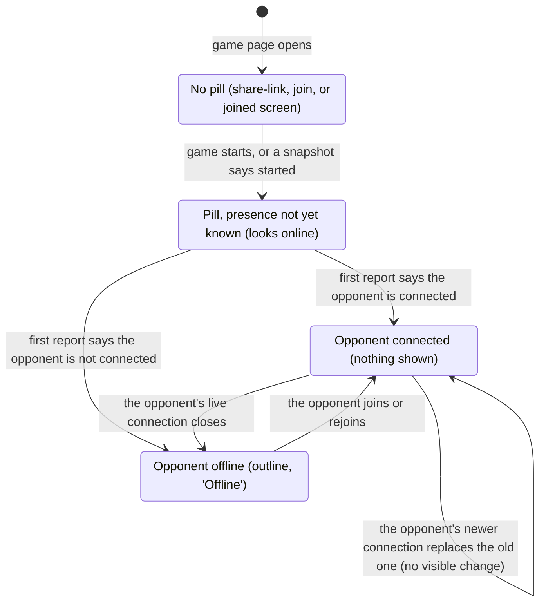

# Seat and opponent status

## Summary

The [turn pill](../glossary.md#the-interface) at the top center of the [board screen](../glossary.md#the-product-and-its-screens) also says which color this browser plays and whether the opponent is connected. Its left half is always the player: a small [stone](../glossary.md#the-interface) in their army's material, porcelain for White or charcoal for Black, beside "You" (or "Your move" on their turn). Its right half is the opponent, with the other stone. That stone is the only place the page shows the player's color, and a screen reader reaching the pill hears it in words: "You play White." The opponent's [presence](../glossary.md#the-connection) is shown only when it matters: while the opponent has no live connection to the game, their stone becomes an outline and their half reads "Offline". While they are connected nothing marks it. Screen readers are told of every change, both ways. Like the rest of the pill this is display only: nothing on it can be clicked, a press on it reaches the board behind, it sends nothing, and it exists only on the board screen. Presence reports connections, not people. The model behind it (when the server reports presence, and why a replaced connection never counts as leaving) is owned by [the connection and seat model](../foundations/connection-and-seat.md#presence); this document describes what the player sees of it. Whose move it is, and check, are in [the turn indicator](turn-indicator.md).

## The simple case

The creator is on the share-link screen; the joiner opens the link and clicks "Join Game". Both pages change to the board screen at the same moment, each with the pill at the top. The creator who got White sees a porcelain stone at the left end of the pill, lit, beside "Your move"; at the right end, the charcoal stone and "Opponent". The joiner sees the mirror image: their own charcoal stone at the left beside "You", and the lit porcelain stone at the right. For the creator this is the first time the page has shown which color they got. Nothing says the opponent is online: that is the normal state.

Partway through the game the opponent closes their tab. A moment later the charcoal stone on the player's pill turns into a thin outline and "Opponent" becomes "Offline", and a screen reader says "Your opponent is offline." Nothing else changes: the board and the turn stay as they were, and if it is the player's turn they can still move. When the opponent opens the link again and their board comes back, the stone fills in, the word returns to "Opponent" (or "Their move"), and a screen reader says "Your opponent is online."

## The interaction, event by event

The panel has no request of its own: nothing on it can be clicked and it sends nothing. It changes only when a message from the server arrives, as described below.

```mermaid
stateDiagram-v2
    state "No pill (share-link, join, or joined screen)" as none
    state "Pill, presence not yet known (looks online)" as label
    state "Opponent connected (nothing shown)" as online
    state "Opponent offline (outline, 'Offline')" as offline
    [*] --> none : game page opens
    none --> label : game starts, or a snapshot says started
    label --> online : first report says the opponent is connected
    label --> offline : first report says the opponent is not connected
    online --> offline : the opponent's live connection closes
    offline --> online : the opponent joins or rejoins
    online --> online : the opponent's newer connection replaces the old one (no visible change)
```

While this player's own page holds no seat on its connection (reconnecting, waiting for a rejoin's answer, or [replaced](../glossary.md#events-that-end-or-interrupt-a-request)), the opponent's half stays in whichever of these states it was in, whether or not that is still true.

### The seat appears

The pill appears the instant the game page reaches the [playing phase](../foundations/screens-and-navigation.md#the-game-page-and-its-phases), together with the board: when the server announces that the game has started (the creator and the joiner, live), or when a rejoin's [snapshot](../glossary.md#requests) says both seats are taken (a reload, a return through the link, a reconnect). The color is the one the server names in that message, which is always the seat this browser holds.

The player's stone is always at the left end of the pill and the opponent's at the right, whichever color the player holds. Once shown, the stones do not change for as long as the page is open, because a [seat](../foundations/connection-and-seat.md#seats) is held for the life of the game. The pill stays fixed while the view is turned or zoomed. Where it sits at each window size is described in [the turn indicator](turn-indicator.md#begin).

The share-link, join, and joined screens show no pill, even though the page may already know the color: the creator's answer to "Start a game", the joiner's seat confirmation, and the [stored seat](../foundations/connection-and-seat.md#the-stored-seat) all carry it. A creator therefore learns their color only when the board appears (see [creating a game](../start/creating-a-game.md)).

### Presence becomes known

Until the first report about the opponent arrives, the opponent's half looks as it does while they are connected. The server sends that first report straight after the message that makes the board appear:

- **Joining.** The creator is told that the joiner is online; the joiner is told whether the creator is connected at that moment.
- **Rejoining.** Right after the snapshot, the rejoining player is told whether the opponent is connected.

A joiner whose creator has already closed the share-link page therefore sees the outline and "Offline" from the start, and can make the first move if they hold White. The creator's page, when it returns, rejoins and goes straight to the board screen (see [waiting for an opponent](../start/waiting-for-an-opponent.md)).

For screen readers, presence is a status message that is in the page from the moment the board is, so its first report is announced as well as every later one: "Your opponent is online." or "Your opponent is offline."

### The opponent leaves and returns

From then on, the opponent's half shows the latest report about them:

- **Offline** once the server notices that the opponent's live connection has closed: they closed the tab or window, reloaded, went back to the start screen (browser Back, or "Start new game" after the game ended), jumped through their browser history to another game's page, reached the crash screen, or lost their connection. Their stone becomes an outline and their word "Offline", on either player's turn; whose move it is still shows as the light round the outline.
- **Connected** when the opponent's page rejoins: after a reload, on opening the link again, after a reconnect, on browser Forward, or on "Play here". The stone fills in and the word returns to "Opponent" or "Their move".

An opponent's reload therefore usually shows as a brief outline: "Offline" for as long as their page takes to reload and rejoin. If the opponent's new connection reaches the server before the old one is noticed closing, the new one takes the seat ([last connection wins](../foundations/connection-and-seat.md#last-connection-wins)), the old one's closing is not reported, and nothing changes. The same holds when the opponent opens the game in a second tab of their browser, or clicks "Play here" in a replaced one: a connection replaced by the same player's newer one never reports the player offline.

How quickly "Offline" follows a lost connection depends on how quickly the server notices. A closed tab is noticed at once. A network that simply goes away (a dropped Wi-Fi link, a laptop going to sleep) can leave the server believing the connection is still open for a while; if the opponent's browser reconnects before the server notices, the opponent is never reported offline at all.

### This player's own connection drops

While this player's connection is down ("Reconnecting…" under the pill, which dims), no reports can arrive, and the opponent's half keeps showing the last one, which may no longer be true. The player's own stone is unaffected. When a connection opens again, the page [rejoins](../foundations/connection-and-seat.md#rejoining); the snapshot is followed at once by a fresh report, which replaces the old one. Anything the opponent did in between, such as leaving and coming back, is never shown: the pill goes straight to the current state.

If the rejoin finds the seat held by another tab of this browser (the player went on playing there while this tab was offline), the server refuses it and this tab shows the [replaced dialog](../session/second-tab.md) instead; no fresh report comes, and the pill stays at its old state behind the dialog.

> Technical note: The pill shows the latest presence report this page has received, on any of its connections. Nothing clears it when the connection drops, which is why a stale state stays up during an outage, and why a report received before the game started can show for an instant as the board appears (see the edge cases).

### Leaving and coming back

Leaving for the start screen, or jumping through the browser's history straight to another game's page, [resets](../foundations/connection-and-seat.md#leaving-a-games-page) the connection, and the page forgets everything it knew, the seat and the last report included. Coming back (browser Back or Forward, the link, a bookmark) opens a fresh game page: the share-link screen shows for a moment, then the snapshot brings back the board with the pill, and the fresh report follows it.

## Modifiers

| Modifier | At the start | Changes while in flight |
| --- | --- | --- |
| Your color | Decides the stone at the left end of the pill, porcelain for White and charcoal for Black, and what a screen reader hears ("You play White."). The opponent's half shows the other stone and never names a color. | Cannot change: the seat is held for the life of the game. |
| Whose turn it is | Decides which half is lit (see [the turn indicator](turn-indicator.md)), not which stone is whose. An offline opponent's half reads "Offline" on either turn. | No effect on the seat or presence. |
| How you reached the page | Creator: the pill appears when the joiner joins, and is the first place the color is shown; nothing marks the joiner, who is online. Joiner: the pill appears a moment after "Joined game, waiting for start..."; the opponent's half shows "Offline" if the creator's page is not connected. Returning with a stored seat: the pill appears when the snapshot arrives, and presence right after it. A visitor without a stored seat sees the join screen and no pill; a seated player using another browser is such a visitor. | Not applicable: how the page was reached does not change while it is open. |
| Connection state | Connected: as described. Reconnecting: the pill dims and the opponent's half keeps its last state, which may be stale. Connecting (after "Play here"): the same, at full brightness. Replaced (the seat was taken by another tab, or found in use by it after a reconnect): the pill stays at its last state behind the [replaced dialog](../session/second-tab.md). | While the page's rejoin is in flight after a reconnect, the opponent's half still shows the state from before the drop; the fresh report arrives right after the snapshot. A drop while a move is in flight changes nothing about the seat. |
| Game state | In progress or in check: no effect on the seat or presence. Over: the pill gives the result, and presence stops showing on it; the [end-game dialog](../play/check-and-game-end.md) covers the page, and presence reports still arrive (screen readers do not hear them behind the dialog). Frozen: no effect; the [frozen-board banner](../cross-cutting/broken-game-record.md) sits under the pill and never covers it. | The player's own move can end the game when its echo lands. |
| Shift, Ctrl, or Cmd held | No effect. | No effect. |
| Input device | Mouse: the pill ignores the pointer, so a press, a drag, a wheel turn, or a right-click on it acts on the board or the view behind it exactly as if it were not there. Touch: a finger on the pill is a finger on the board. Keyboard: the pill cannot be focused; screen readers read its description when they reach it and are told of presence changes. | No effect. |

For this panel, "At the start" means when the board screen appears, and "Changes while in flight" means while one of this player's own requests is in flight: a move (the board [held](../glossary.md#selection-and-board-state)) or the rejoin the page sends by itself whenever a new connection opens.

## Cancel and interrupt

| Event | Before sending | While in flight |
| --- | --- | --- |
| Escape or Cancel | No effect. The pill cannot be dismissed or hidden. | No effect. |
| Pressing elsewhere or turning the view | Presses on the board and drags of the view leave the pill unchanged; it stays at the top while the view turns. A press, drag, or wheel turn that starts on the pill passes through it to the board behind (see [what takes a press](../foundations/input-model.md#what-takes-a-press)). | Same. |
| Leaving the game page within the app | The pill goes with the board screen, and the connection resets on arrival at the start screen (or at another game's page), so the opponent sees this player "Offline". Coming back shows the pill again when the snapshot arrives and presence right after it; the opponent sees this player connected again. | Same. A move in flight may still be recorded; see [making a move](../play/making-a-move.md). |
| The game ends | The pill gives the result and the end-game dialog covers the page. Presence keeps updating: when the opponent clicks "Start new game" they go offline, which a screen reader does not hear behind the dialog. | Same, when the player's own move ends the game. |
| The server answers with an error | No effect; the error appears in the [error banner](error-banner.md) under the pill. | No effect on the seat. If the page's rejoin is refused, no report follows and presence keeps its old state; a rejoin refused because another tab holds the seat brings up the replaced dialog. |
| The connection drops | The seat stays. Presence keeps its last state while "Reconnecting…" shows, and is replaced by a fresh report right after the snapshot. The opponent sees this player "Offline" once the server notices the drop, then connected after the rejoin, or no change if the rejoin replaced a connection the server had not yet noticed was gone. See [connection loss](../session/connection-loss.md). | Same. |
| The window loses focus or the tab is hidden | No effect. Reports keep arriving in a background tab, so the pill is current when the player looks again. The opponent keeps seeing this player connected while their tab is hidden or their window minimized, because the connection stays open. | Same. |
| Reload or closing the tab | Reload: the share-link screen shows for a moment, then the pill comes back with the snapshot, and presence right after it; the opponent sees this player briefly "Offline", or no change. Closing: the opponent sees "Offline"; the seat stays held. See [reloading and returning](../session/reload-and-return.md). | Same. |
| The opponent acts | Joining makes the board appear with the pill. Leaving shows the outline and "Offline", and returning fills the stone in again. Opening a second tab or clicking "Play here" shows no change. Moves never change the seat or presence. | Same. |
| Another tab takes the seat | This tab's pill stays at its last state behind the replaced dialog and goes stale. The new tab shows the same color and its own fresh presence. The opponent sees no change. The same holds when this tab's connection returns after a drop and finds the seat held by the other tab. After "Play here" in this tab, presence is refreshed by the new rejoin. | Same. |
| A second touch point or a cancelled touch | No effect on the pill. A finger on it is a finger on the board. | No effect. |

For this panel, "Before sending" describes it while nothing of this player's is in flight, and "While in flight" while one of this player's own requests is: a move, or the page's automatic rejoin after a new connection opens.

## Interactions with other systems

**Seat and turn.** The player's stone stands at the left end of the pill for the whole game; the light that says whose move it is passes between it and the opponent's stone. The two never contradict each other: the player's half is lit exactly when their pieces can be selected.

**The game record.** No interaction. The seat and presence are not part of the [move record](../glossary.md#games-and-seats), the server keeps no history of who was online, and nothing about presence survives the page.

**Connection.** Presence is reported by the server from the connections it currently holds, so it is only as current as this player's own connection: stale while reconnecting or replaced, and refreshed after every rejoin. The seat needs no connection once shown.

**The opponent.** Presence is all the page says about the opponent besides their moves, and it says only whether the opponent's browser holds an open connection, not whether anyone is at the keyboard. An opponent with the game in a background tab, or who has walked away, looks connected. Presence is information only: a player may move while the opponent is offline, and the opponent sees the move when they return (see [the opponent's move](../play/the-opponents-move.md)).

**Other tabs and devices.** Two tabs of this browser on the same game show the same color, but only the one holding the seat receives reports; see [a second tab](../session/second-tab.md). The opponent's second tab is invisible here. The opponent cannot reach the game from another browser at all: without a stored seat they see the join screen, and joining is refused with "Game full".

**Game over.** The pill gives the result instead of the halves, so presence no longer shows on it; reports still arrive.

**Stored seat.** The stone is not read from the stored seat; it shows the color the server confirmed on this page, which is the color the stored seat asked for in the rejoin. A browser that loses its stored seat for a game cannot see that game's board again (see [the stored seat](../foundations/connection-and-seat.md#the-stored-seat)).

**Keyboard, touch, and screen size.** The pill cannot be focused. A screen reader reads "You play White." (or Black) with the turn when it reaches the pill, and presence changes are announced as they happen; see [accessibility](../cross-cutting/accessibility.md). On a touch screen, a finger that lands on the pill presses the board or turns the view as it would anywhere else. The stones keep their places at every window size (see [screen sizes and touch](../cross-cutting/screen-sizes-and-touch.md)).

## Edge cases

- **No words for the color.** The page never writes "White" or "Black" for the player's own color on screen; the stone says it. Screen readers get the word.
- **The creator's color arrives with the board.** Nothing before the board says which color the creator got. A creator who got Black meets their charcoal stone and the opponent's lit porcelain one at the same instant, and starts by waiting.
- **An instant of "Offline" as the board appears.** A creator whose share-link page rejoined before the opponent arrived (after a reload, or a reconnect while waiting) was told then that the opponent was not connected. When the join arrives, the board appears showing that old report for the instant before the join's own report arrives. The same can happen after any rejoin, for the instant between the snapshot and the fresh report. Normally too short to see.
- **The opponent reloads.** A brief outline and "Offline", then connected again once their page is back; or no change at all if their new connection won the race against the old one's closing.
- **The server restarts.** Both connections drop at once and both pills dim under "Reconnecting…" without marking the opponent offline. Whoever rejoins first is told the opponent is offline, since the other has not rejoined yet, and sees them connected again a moment later when they do.
- **The one-hour limit.** The server ends each connection after at most an hour, and the browser reconnects within about half a second. The opponent may see a brief "Offline" at that moment, at a different time for each player.
- **An opponent who never comes back.** "Offline" stays indefinitely. It does not end or pause the game and offers no way to claim it; the player can still move on their turn.
- **Online is not present; offline is not absent.** An opponent looking at another tab, sitting behind the end-game dialog, or away from the keyboard looks connected. An opponent whose only open tab is a replaced one (they took the seat in a second tab and then closed that tab) shows "Offline", although the game is on their screen.
- **No names.** The opponent is only "Opponent"; nothing identifies who holds the other seat.
- **Behind the dialogs.** The promotion dialog, the end-game dialog, and the replaced dialog each veil the whole window, the pill included; it stays visible through the veil but cannot be reached, and screen readers do not see it while the dialog is up.

## Open questions and verification

- The pill shows a stale presence while this player is reconnecting or replaced, with nothing marking it as possibly out of date beyond the dimmed pill while reconnecting ([B-16](../bug-triage.md#b-16-the-presence-line-goes-stale-while-the-player-is-disconnected)).
- A report received before the game started stays in the log and is what the board shows for the instant before the join's own report arrives. Read from code, not observed.
- How long a lost network (as opposed to a closed tab) takes to show as "Offline" depends on when the server detects the dead connection. Not measured.
- The presence announcement is a status region present from the moment the board is, so its first report should be announced; not tried with a screen reader.
- Covered by tests: `client/src/App.test.tsx` (nothing shown before the first report or while connected, the outline and "Offline" when not, the latest report wins, a report about the player's own color is ignored, the seat in the pill after a snapshot), `client/src/game/session.test.ts` (`selectOpponentOnline`), `server/tests/test_local_ws.py` (`test_presence_follows_connections`, `test_rejoin_replaces_lingering_socket`), and `client/e2e/session.spec.ts` (both players see each other connected, then offline after the opponent's browser closes; the seat after a reload and in a second tab).

Verified against 3D Chess commit `f7bff4d`
