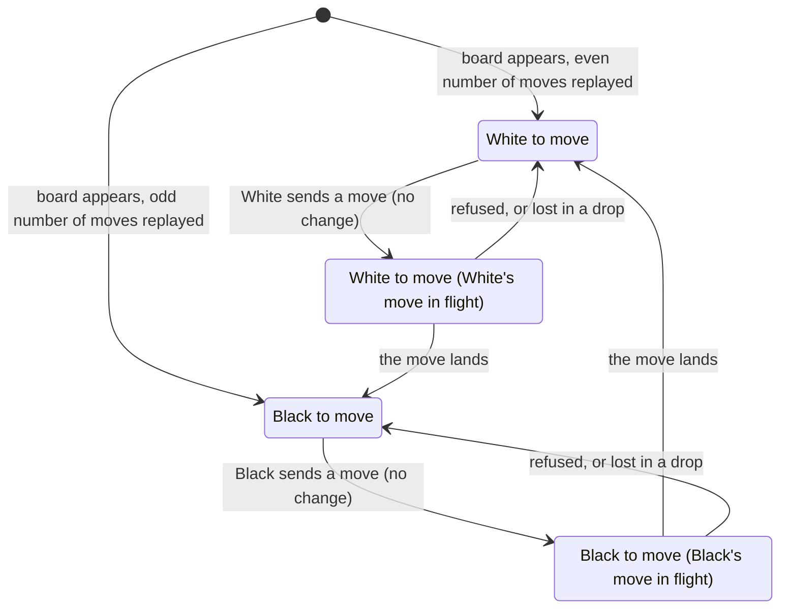

# The turn indicator

## Summary

The [turn indicator](../glossary.md#the-interface) is the light box at the top center of the [board screen](../glossary.md#the-product-and-its-screens) that names the [side to move](../glossary.md#moves-and-the-rules): "White to move" or "Black to move". Each browser works it out from the [move record](../glossary.md#games-and-seats) alone: an even number of moves means White, an odd number Black. Both players therefore see the same words at the same time, and neither is told "your turn": the player has to compare the color with their [seat label](seat-and-opponent-status.md). The indicator changes only when a move lands on this board, never when the player sends one. It has no text for check, for the end of the game, or for a frozen record, and it lets presses pass through it to the board. It exists only on the board screen and is display only: nothing on it can be clicked and it sends nothing.

## The simple case

The game starts, and both boards appear with "White to move" in a light box at the top center, in dark semibold text. The player holding White selects a pawn and presses a legal destination. The markers vanish, but the indicator still reads "White to move" while the move travels to the server and back. Then the pawn glides to its new cell on both boards at once, and at the start of that glide both indicators change to "Black to move".

The Black player, whose seat label reads "You are playing as black.", now sees their own color named and knows it is their turn. When their move lands, both indicators return to "White to move".

## The interaction, event by event

The indicator has no request of its own; what changes it is a move, the player's own or the opponent's. The five phases below follow one move and say what the indicator does in each.

Once the game is over or the record is [frozen](../glossary.md#selection-and-board-state), no further transition happens: the indicator keeps the text it had after the last move this browser could replay.

### Begin

The indicator appears with the board screen, at the same instant, and its text is worked out at once from the record the page holds: it counts the moves this browser has replayed, and names White after an even number and Black after an odd one. A new game therefore starts at "White to move" on both boards, whichever player holds White. A player returning to a game in progress (a reload, the link, browser Forward) sees the side to move in the record's latest position straight away, with no animation.

For a move, Begin is the player's own turn: the indicator names the player's color, and the player selects a piece as described in [making a move](../play/making-a-move.md#begin). Selecting and changing the selection change nothing on the indicator. It is exactly the rule the board itself uses: the player's pieces can be selected only while the indicator names the player's color (and [the board takes input](../foundations/input-model.md#when-the-board-takes-input)).

### End without sending

Nothing the player does without sending changes the indicator: selecting, clearing a selection, opening and cancelling the [promotion dialog](../play/promotion.md), and turning the view all leave it as it is. The opponent's selections and cancelled promotions never reach this board at all.

### Send

When the player presses a legal destination (or picks a piece in the promotion dialog), the move leaves the browser and the board becomes [held](../glossary.md#selection-and-board-state). The indicator does not change. It goes on naming the player's color, because the browser never counts a move the server has not returned (see [a move is shown only when the server returns it](../foundations/connection-and-seat.md#a-move-is-shown-only-when-the-server-returns-it)). No text says that a move is on its way.

### While in flight

The indicator keeps naming the mover. For the player's own move, it reads the player's color while the board takes no input, so "White to move" is on screen for White at a moment when White cannot move. For the opponent's move, it reads the opponent's color until the echo arrives. In both cases the server has already recorded the move and counts the turn as passed; the indicator catches up when the move lands. On an ordinary connection the gap is a fraction of a second.

### The answer arrives

- **The echo.** The browser replays the record with the new move and the indicator changes to the other color at once, at the start of the [glide](../foundations/the-view.md#motion) rather than after it. Both boards receive the same echo, so both indicators change at the same moment.
- **An error.** The server refused the move. The indicator stays as it was, which is correct: it is still the player's turn. See [making a move](../play/making-a-move.md#the-answer-arrives).
- **No answer (the connection dropped).** The indicator stays as it was until the connection returns and the rejoin's [snapshot](../glossary.md#requests) arrives. The snapshot replaces the record, and the indicator is worked out again from its full count: the other color if the server recorded the move, the same color if not. A snapshot that brings several moves at once goes straight to the right text, with no stops in between.
- **A move that ends the game.** The indicator changes as for any move, to the side that now has no legal move, and then never changes again. For a checkmated Black it reads "Black to move" behind the [end-game dialog](../play/check-and-game-end.md#checkmate-and-stalemate).
- **A move this browser cannot replay.** The indicator does not change, and no later move changes it either. It keeps naming the side to move in the last position this browser could replay; see the edge cases and [the broken game record](../cross-cutting/broken-game-record.md).

> Technical note: The indicator counts the moves this browser replayed, not the moves in the record. The two differ only when the record is frozen, which is why a frozen board can name a different side than the server and the move list's number of moves would.

## Modifiers

| Modifier | At the start | Changes while in flight |
| --- | --- | --- |
| Your color | No effect on the text: both players see the same words at the same time. The player's color decides only what the words mean for them, and the indicator never says "your turn"; the player compares it with the seat label. | Cannot change. |
| Whose turn it is | This is what the indicator shows: "White to move" or "Black to move". On the player's turn it names the player's color; on the opponent's turn, the opponent's. | It changes only when a move lands, not when it is sent: while the player's own move is in flight it still names the player. |
| How you reached the page | Creator and joiner: "White to move" when the board first appears; a creator who got Black starts by reading the opponent's color. Returning with a stored seat: worked out from the snapshot when the board appears, including every move made while the player was away. A visitor without a stored seat sees the join screen and no indicator. | Not applicable: how the page was reached does not change while it is open. |
| Connection state | Connected: as described. Connecting (after "Play here"), reconnecting, or replaced: the indicator keeps its last text, which goes stale if a move is made meanwhile. Nothing on it shows that the board is not taking input, so it can read "White to move" to White while presses do nothing; the "Reconnecting…" box or the replaced dialog is the only sign. | A drop while the player's move is in flight: unchanged until the snapshot after reconnecting, which changes it if the server recorded the move. |
| Game state | In progress: as described. In check: no text for check; the King's red glow is the only sign (see [check](../play/check-and-game-end.md#check)). Over: names the checkmated or stalemated side "to move", behind the end-game dialog. Frozen: names the side to move at the frozen position and stops changing. | The player's own move can end the game; its echo changes the indicator to the opponent's color, which then stays. |
| Shift, Ctrl, or Cmd held | No effect. | No effect. |
| Input device | Mouse: presses, drags, and wheel turns over the indicator pass through to the board beneath, and the board's own rule that the context menu never opens applies there too; its text cannot be selected. Touch: a tap on it is a press on the board beneath. Keyboard: it cannot be focused, and its changes are not announced to screen readers. | No effect. |

For this panel, "At the start" means when the board screen appears (and any moment no move is in flight), and "Changes while in flight" means while a move, usually the player's own, is between being sent and landing.

## Cancel and interrupt

| Event | Before sending | While in flight |
| --- | --- | --- |
| Escape or Cancel | No effect. The indicator cannot be dismissed. Cancelling the promotion dialog leaves it unchanged. | No effect. A sent move cannot be taken back, and the indicator waits for it to land. |
| Pressing elsewhere or turning the view | Presses and drags that start on the indicator pass through to the board as if it were not there: they can select a piece, clear the selection, or play a move (see [what takes a press](../foundations/input-model.md#what-takes-a-press)). Turning the view does not move the indicator. | Presses through it do nothing, since the board is held; drags through it turn the view. |
| Leaving the game page within the app | The indicator goes with the board screen. Returning shows it again, worked out from the snapshot, including any move the opponent made meanwhile. | Same. If the server recorded the move, the returning page names the opponent's color. |
| The game ends | The move that ends it changes the indicator to the side with no legal move, and it stays there behind the end-game dialog, for example "Black to move" for a checkmated Black. | Same, when the player's own move delivers checkmate or stalemate. |
| The server answers with an error | No effect. | Unchanged: the board is released and the indicator still names the player, whose turn it still is. |
| The connection drops | The indicator keeps its last text while "Reconnecting…" shows. A move the opponent makes meanwhile arrives only with the snapshot, and the indicator changes then. See [connection loss](../session/connection-loss.md). | Unchanged until the snapshot, which changes it if the move was recorded. |
| The window loses focus or the tab is hidden | No effect. An echo that arrives in a background tab changes the indicator at once, even though the board is not drawn; on returning to the tab the player finds the new text already there while the piece glides in. | Same. |
| Reload or closing the tab | After a reload the indicator is worked out afresh from the snapshot. Closing records nothing. | The answer is lost with the page. After a reload the indicator names the opponent if the server recorded the move. |
| The opponent acts | The opponent's move landing changes the indicator to the player's color. Their joining, leaving, or returning does not touch it. | The opponent can move only once the player's move has been recorded, so their reply always arrives after this move's echo: the indicator changes to the opponent's color first, then back. Presence changes do not touch it. |
| Another tab takes the seat | This tab's indicator keeps its last text behind the [replaced dialog](../session/second-tab.md) and goes stale as moves are played in the other tab. After "Play here" it is worked out afresh from the snapshot. | The echo goes to the tab that now holds the seat; this tab catches up after "Play here". |
| A second touch point or a cancelled touch | A finger on the indicator is a press on the board beneath, resolved as in [the input model](../foundations/input-model.md#a-press-acts-at-once). | No effect; the board is held. |

For this panel, "Before sending" is any time the player has no move in flight (their own turn, with or without a selection, and the opponent's turn), and "While in flight" is while the player's own move is in flight and the board is held.

## Interactions with other systems

**Seat and turn.** The indicator names the side to move and nothing else; it is the same on both boards and does not know which seat the viewer holds. Read together with the seat label it answers "is it my turn?", and it always agrees with which of the player's pieces the board lets them select. The server counts moves the same way to enforce turns, so once a move has landed the indicator and the server agree, except when the record is frozen.

**The game record.** Worked out from the move record every time it changes, by counting the moves this browser could replay. It is not stored anywhere and not sent anywhere.

**Connection.** The indicator needs no connection to be shown, but it is only as current as the last move to reach this page: stale while reconnecting or replaced, corrected by the snapshot after every rejoin.

**The opponent.** The opponent's moves change it, and nothing else about the opponent does: presence has no effect, and the opponent's move in flight shows only when it lands. See [the opponent's move](../play/the-opponents-move.md).

**Other tabs and devices.** Every tab showing the game shows the same text once it is up to date. A replaced tab falls behind until "Play here".

**Game over.** The indicator does not announce the result. After checkmate or stalemate it names the side that cannot move, "to move", behind the end-game dialog; the result is in the dialog's heading.

**Stored seat.** No role. The indicator depends only on the record, not on which seat this browser holds.

**Keyboard, touch, and screen size.** The indicator cannot be focused and is not a live region, so a screen reader is not told when the turn changes; see [accessibility](../cross-cutting/accessibility.md). On a touch screen a tap on it presses the board beneath. Its box is about 200 pixels wide and stays centered: in a window narrower than about 400 pixels it wraps onto two lines, and in one narrower than about 650 pixels (somewhat less with a narrower system font) the seat label, drawn above it, covers its left part; below roughly 550 pixels the "Reconnecting…" box also covers its right part. See [screen sizes and touch](../cross-cutting/screen-sizes-and-touch.md).

## Edge cases

- **The text changes as the glide starts.** The indicator names the new side at the moment the echo arrives, while the piece is still travelling.
- **No "your turn".** "White to move" reads the same to both players. A player who forgets their color must look at the seat label.
- **Capitalized color.** The indicator writes "White" and "Black" with a capital and no period; the seat label writes "white" and "black" in lower case with a period.
- **Held, but still named.** While the player's own move is in flight, "White to move" (for White) stays up although the board ignores every press. Nothing on the indicator distinguishes this from the ordinary turn.
- **A stale position after reconnecting.** Between a new connection opening and the rejoin's snapshot arriving, the indicator reflects the position from before the drop. If the player's last move had in fact been recorded, it still names the player, and a move sent in that window is refused with "Error: Not your turn"; the snapshot then changes the indicator. See [making a move](../play/making-a-move.md#edge-cases).
- **Check has no words.** A player in check sees their own color named as usual; only the King's red glow says more.
- **After the game.** Behind the end-game dialog's darkened backdrop the indicator still reads, for example, "Black to move" for a checkmated Black, as though Black could still play. The dialog's heading is the only statement of the result.
- **A frozen record.** The indicator names the side to move in the last position this browser could replay, which is the side whose recorded move could not be replayed. The server, which counts every recorded move, considers it the other side's turn, and the [move list](move-list.md) lists every recorded move, the unplayable one included, so the indicator disagrees with both. The indicator does not change again, whatever arrives.
- **Several moves at once.** A snapshot that brings more than one new move (for example after "Play here" in a tab that fell behind) moves the indicator straight to the side to move at the end, and an even number of new moves leaves it unchanged.
- **Presses pass through.** Unlike the seat label, the move list, and the banners, the indicator never blocks the board: a cell drawn behind it can be pressed through it.
- **Not before the board.** The share-link, join, and joined screens have no indicator; before both seats are taken there is no turn to show.
- **Under everything else.** The indicator is drawn beneath every other panel and dialog on the page: the seat label, the move list, the banners, and the three dialogs all cover it where they overlap.

## Open questions and verification

- The indicator never says "your turn"; the player has to combine it with the seat label. Whether a player-relative wording is wanted is a product call.
- After checkmate or stalemate the indicator still names the side that cannot move "to move" (`client/src/game/history.ts:148` sets the turn from the move count whether or not the game is over; `client/src/screens/GameScreen.tsx:312` always shows it). It is behind the end-game dialog, so the harm is small, but the text is wrong for a finished game. Worth treating as a minor bug.
- When the record is frozen, the indicator counts replayed moves (`client/src/game/history.ts:148`, `appliedMoveCount`) while the server counts recorded ones (`server/modal_app.py:184-186`), so the indicator names the side the server will not let move. Read from code and `client/src/App.test.tsx` ("GameScreen freezes before a recorded king capture instead of crashing": three moves recorded, "White to move" shown). See [the broken game record](../cross-cutting/broken-game-record.md).
- Turn changes are not announced to assistive technology (`client/src/three/TurnIndicator.tsx:23-27` has no live-region role). See [accessibility](../cross-cutting/accessibility.md).
- The narrow-window measurements (wrapping below about 400 pixels, the seat label covering it below about 656 pixels, the "Reconnecting…" box below about 554 pixels) come from laying out the HUD's styles (`client/src/three/TurnIndicator.tsx:7-21`, `client/src/screens/GameScreen.tsx:193-210` and `289-299`) in Chromium with a stand-in font, not from the running app. The indicator's low stacking order (`zIndex: 10`, line 18) is what puts the seat label on top of it. On a phone in portrait this likely hides part of the indicator and looks like a bug.
- That the indicator updates in a hidden tab before the glide is seen is read from how the page handles messages in the background and how the 3D scene pauses drawing; not observed.
- Covered by tests: `client/src/game/history.test.ts` (the turn after zero, one, and two moves; after a checkmate, "black"; at a frozen record, the side at the last replayable position), `client/src/App.test.tsx` ("Black to move" after one replayed move, "White to move" when frozen, no double counting after a reconnect snapshot), and the Playwright specs `client/e2e/playMove.spec.ts`, `session.spec.ts`, and `promotion.spec.ts`, whose game helper waits for both players' indicators to change as its proof that a move went through the server. Presses passing through the indicator were not tried by hand.

Verified against 3D Chess commit `d94507b`
