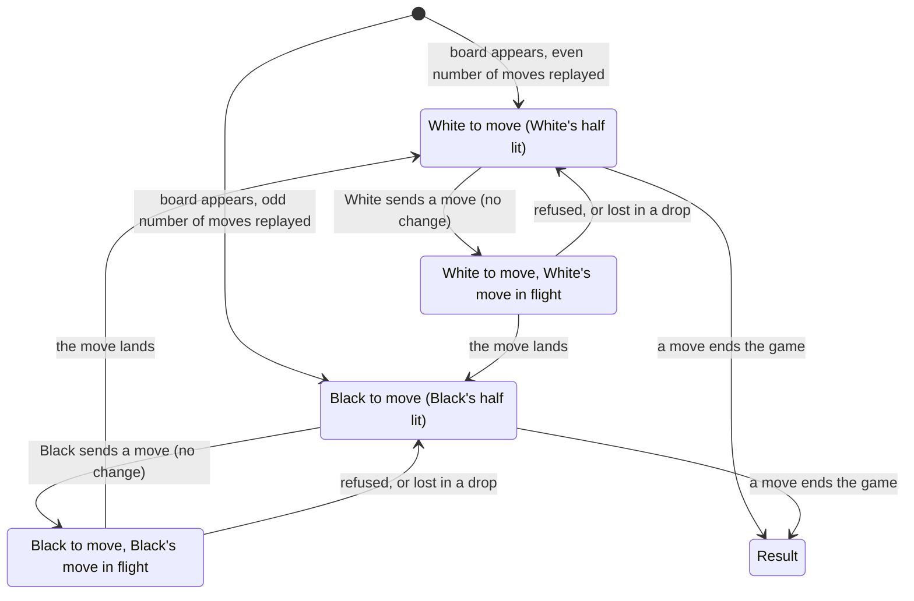

# The turn indicator

## Summary

The turn indicator is the [turn pill](../glossary.md#the-interface): the glass pill at the top center of the [board screen](../glossary.md#the-product-and-its-screens) that says whose move it is, from the player's side. Its left half is the player, its right half the opponent, each with a small [stone](../glossary.md#the-interface) in its army's material (porcelain for White, charcoal for Black). The half of the [side to move](../glossary.md#moves-and-the-rules) is lit: its words are brighter and a thin ring of light circles its stone. On the player's turn the left half reads "Your move" and the right "Opponent"; on the opponent's turn the left reads "You" and the right "Their move". When the side to move is in check and the game is not over, its ring turns red and a red "CHECK" badge stands beside its stone. Once the game is over the pill gives the result instead: "Checkmate · you win", "Checkmate · you lose", or "Stalemate · draw". Each browser works the pill out from the [move record](../glossary.md#games-and-seats) alone (an even number of moves means White, an odd number Black), so both players see the light on the same side at the same time. The pill changes only when a move lands on this board, never when the player sends one. It is display only: nothing on it can be clicked, it lets presses pass through it to the board, and it sends nothing. Which color the player holds, and whether the opponent is connected, are shown on the same pill and described in [seat and opponent status](seat-and-opponent-status.md). Under the pill hang the pieces each side has taken, described [below](#the-pieces-each-side-has-taken).

## The simple case

The game starts, and both boards appear with the pill at the top. The player holding White sees their porcelain stone ringed with light and "Your move" beside it; at the far end, the charcoal stone and "Opponent", dimmer. The player holding Black sees the same pill mirrored: their charcoal stone and "You" at the left, dim, and "Their move" beside a lit porcelain stone at the right.

White selects a pawn and clicks a legal destination. The markers vanish, but the pill still lights White's half while the move travels to the server and back. Then the pawn glides to its new cell on both boards at once, and at the start of that glide the light passes across both pills: White's now reads "You" and "Their move", with the charcoal stone lit; Black's reads "Your move" beside its own lit stone. A screen reader hears the move and "Your move." or "Black to move." (see [accessibility](../cross-cutting/accessibility.md)).

Later a move of Black's attacks White's King: as it lands, White's King is marked in red on the board, and on both pills White's stone is ringed in red with "CHECK" beside it, until a move that ends the check lands.

### The pieces each side has taken

Until the first capture nothing hangs under the pill. When White's unicorn takes a pawn, a small charcoal pawn appears under White's stone on White's pill, and on Black's pill under the opponent's stone at the right, as the unicorn starts its glide; beside it, on the side that took it, a bright "+1". Each player's own haul hangs under their half, beginning under their stone: a small silhouette for each kind of piece they have taken, in the opponent's material (so a White player collects charcoal pieces), the queen first, then rooks, bishops, unicorns, knights, and pawns, with how many beside each kind when there is more than one ("2" beside a rook). The opponent's haul hangs under the right half the same way, mirrored: from under their stone inward, in the player's own material. The silhouettes are the promotion dialog's.

The "+N" stands at the inner end of the haul of the side ahead on material, counting a queen as 9, a rook as 5, a bishop, unicorn, or knight as 3, and a pawn as 1, over the pieces still on the board, so a promotion counts too: a pawn that became a queen is worth a queen. A piece that was promoted and then taken shows as what it had become. Level material shows no number, and a side that is ahead without having taken anything (only by promoting) shows its "+N" alone.

The row is 18 pixels tall, 4 pixels under the pill, and never wider than it; everything taken from both sides, all ten pawns, and a lead still fit in a 360-pixel phone. The view is framed below it from the first move, whether or not anything has been taken (the band kept at the top of the window is 82 pixels rather than the pill's 56), so a capture never moves or shrinks the tower. In a window 480 pixels tall or less (a phone on its side), where the pill stands at the top left beside the tower, the two hauls stand one above the other under it, the player's first, and the view is framed as before. They dim with the pill while the page is reconnecting, and stay under the result once the game is over. Nothing on them can be clicked; presses pass through to the board.

A screen reader reaches each haul after the pill, as a sentence: "You have taken a unicorn and 2 pawns; you are 1 ahead." and "Your opponent has taken a bishop and a pawn." They are not announced as they change: the [move announcement](../glossary.md#the-interface) already says what each move took.

## The interaction, event by event

The pill has no request of its own; what changes it is a move, the player's own or the opponent's. The five phases below follow one move and say what the pill does in each.

```mermaid
stateDiagram-v2
    state "White to move (White's half lit)" as white
    state "White to move, White's move in flight" as wflight
    state "Black to move (Black's half lit)" as black
    state "Black to move, Black's move in flight" as bflight
    state "Result" as over
    [*] --> white : board appears, even number of moves replayed
    [*] --> black : board appears, odd number of moves replayed
    white --> wflight : White sends a move (no change)
    wflight --> black : the move lands
    wflight --> white : refused, or lost in a drop
    black --> bflight : Black sends a move (no change)
    bflight --> white : the move lands
    bflight --> black : refused, or lost in a drop
    white --> over : a move ends the game
    black --> over : a move ends the game
```

Each lit state may carry the red ring and "CHECK" when the side it names is in check. Once the record is [frozen](../glossary.md#selection-and-board-state), no further transition happens: the pill keeps what it showed after the last move this browser could replay.

### Begin

The pill appears with the board screen, at the same instant, worked out at once from the record the page holds: it counts the moves this browser has replayed, lights White's side after an even number and Black's after an odd one, and adds the red ring and "CHECK" if that side's King is attacked in the resulting position. A new game therefore starts with White's side lit on both boards, whichever player holds White. A player returning to a game in progress (a reload, the link, browser Back or Forward) sees the side to move in the record's latest position straight away, with no animation.

It sits 12 pixels from the top of the window, centered, 300 pixels wide and 40 high, and keeps that width whatever its words say, so it never jumps as the turn passes. In a window 520 pixels wide or less (a phone held upright) it stretches across the top row from 12 pixels in at the left to the settings gear at the right. In check the checked half takes the room its badge needs and the hairline between the halves moves over a little; nothing is cut off or wraps, down to a 360-pixel window.

For a move, Begin is the player's own turn: their half is lit, and they select a piece as described in [making a move](../play/making-a-move.md#begin), or type in the [move box](../glossary.md#the-interface). Selecting, changing the selection, and typing change nothing on the pill. It is exactly the rule the board itself uses: the player's pieces can be selected only while their own half is lit (and [the board takes input](../foundations/input-model.md#when-the-board-takes-input)).

### End without sending

Nothing the player does without sending changes the pill: selecting, clearing a selection, opening and cancelling the [promotion dialog](../play/promotion.md), typing a move the move box refuses, and turning the view all leave it as it is. The opponent's selections and cancelled promotions never reach this board at all.

### Send

When the player clicks a legal destination, picks a piece in the promotion dialog, or submits a move in the move box, the move leaves the browser and the board becomes [held](../glossary.md#selection-and-board-state). The pill does not change. It goes on lighting the player's half, because the browser never counts a move the server has not returned (see [a move is shown only when the server returns it](../foundations/connection-and-seat.md#a-move-is-shown-only-when-the-server-returns-it)). Nothing says that a move is on its way.

### While in flight

The pill keeps lighting the mover. For the player's own move, "Your move" stays lit while the board takes no input. For the opponent's move, "Their move" stays lit until the echo arrives. In both cases the server has already recorded the move and counts the turn as passed; the pill catches up when the move lands. On an ordinary connection the gap is a fraction of a second.

### The answer arrives

- **The echo.** The browser replays the record with the new move and the light passes to the other half at once, at the start of the [glide](../foundations/the-view.md#motion) rather than after it: over 200 ms the ring fades out of one stone and into the other, and the words change, with the red ring and "CHECK" if the move gives check. Both boards receive the same echo, so both pills change at the same moment. A screen reader hears the [move announcement](../glossary.md#the-interface).
- **An error.** The server refused the move. The pill stays as it was, which is correct: it is still the player's turn. See [making a move](../play/making-a-move.md#the-answer-arrives).
- **No answer (the connection dropped).** The pill dims to less than half its brightness while "Reconnecting…" shows under it, since what it says may be out of date. When the rejoin's [snapshot](../glossary.md#requests) arrives it brightens again, worked out from the snapshot's full count: the other side lit if the server recorded the move, the same side if not. A snapshot that brings several moves at once goes straight to the right state, with no stops in between.
- **A move that ends the game.** The pill gives the result in one line: the winner's stone lit and "Checkmate · you win" or "Checkmate · you lose", or the player's stone and "Stalemate · draw". It never changes again. The captured pieces stay under it. The [end-game dialog](../play/check-and-game-end.md#checkmate-and-stalemate) follows once the board has played the mate out.
- **A move this browser cannot replay.** The pill does not change, and no later move changes it either. It keeps lighting the side to move in the last position this browser could replay; see the edge cases and [the broken game record](../cross-cutting/broken-game-record.md).

> Technical note: The pill counts the moves this browser replayed, not the moves in the record. The two differ only when the record is frozen, which is why a frozen board can light a different side than the server and the move list's number of moves would.

## Modifiers

| Modifier | At the start | Changes while in flight |
| --- | --- | --- |
| Your color | Decides which stone stands in the left half: the player's own. The light is on the same side of the game for both players, so on the player's turn it is on the left of their pill and on the right of the opponent's. | Cannot change. |
| Whose turn it is | This is what the pill shows: the player's half lit with "Your move", or the opponent's with "Their move". | It changes only when a move lands, not when it is sent: while the player's own move is in flight their half stays lit. |
| How you reached the page | Creator and joiner: White's side lit when the board first appears; a creator who got Black starts with the opponent's half lit. Returning with a stored seat: worked out from the snapshot when the board appears, including every move made while the player was away. A visitor without a stored seat sees the join screen and no pill. | Not applicable: how the page was reached does not change while it is open. |
| Connection state | Connected: as described. Reconnecting: the pill dims under "Reconnecting…" and keeps its last state. Waiting for a rejoin's snapshot, connecting (after "Play here"), or replaced: it keeps its last state at full brightness, which goes stale if a move is made meanwhile; the short wait for a snapshot has no sign, and the replaced dialog covers the rest. | A drop while the player's move is in flight: dimmed and unchanged until the snapshot, which moves the light if the server recorded the move. |
| Game state | In progress: as described. In check: the checked side's stone ringed in red, with "CHECK" beside it (see [check](../play/check-and-game-end.md#check)). Over: the result, in one line. Frozen: the side to move at the frozen position, with the red ring and "CHECK" if that position has its King attacked, and it stops changing. | The player's own move can end the game; its echo turns the pill into the result. |
| Shift, Ctrl, or Cmd held | No effect. | No effect. |
| Input device | Mouse: presses, drags, wheel turns, and right-clicks over the pill pass through to the board beneath, where the context menu never opens; its text cannot be selected. Touch: a finger on it is a finger on the board beneath. Keyboard: it cannot be focused; a screen reader reaching it reads "You play White. Your move." (or "Black to move", "in check", or the result), and hears each change through the move announcement. | No effect. |

For this panel, "At the start" means when the board screen appears (and any moment no move is in flight), and "Changes while in flight" means while a move, usually the player's own, is between being sent and landing.

## Cancel and interrupt

| Event | Before sending | While in flight |
| --- | --- | --- |
| Escape or Cancel | No effect. The pill cannot be dismissed. Cancelling the promotion dialog leaves it unchanged. | No effect. A sent move cannot be taken back, and the pill waits for it to land. |
| Pressing elsewhere or turning the view | Presses and drags that start on the pill pass through to the board as if it were not there: a press can select a piece, clear the selection, or play a move, and a drag turns the view (see [what takes a press](../foundations/input-model.md#what-takes-a-press)). Turning the view does not move the pill. | Presses through it do nothing, since the board is held; drags through it turn the view. |
| Leaving the game page within the app | The pill goes with the board screen. Returning shows it again, worked out from the snapshot, including any move the opponent made meanwhile. A jump through the browser's history to another game's page shows that game's pill, worked out from its own snapshot. | Same. If the server recorded the move, the returning page lights the opponent's half. |
| The game ends | The move that ends it turns the pill into the result, which stays behind the end-game dialog. | Same, when the player's own move delivers checkmate or stalemate. |
| The server answers with an error | No effect. | Unchanged: the board is released and the player's half is still lit, since it is still their turn. |
| The connection drops | The pill dims and keeps its last state while "Reconnecting…" shows under it. A move the opponent makes meanwhile arrives only with the snapshot, and the light moves then. See [connection loss](../session/connection-loss.md). | Dimmed and unchanged until the snapshot, which moves the light if the move was recorded. |
| The window loses focus or the tab is hidden | No effect. An echo that arrives in a background tab changes the pill at once, even though the board is not drawn; on returning the player finds the light already moved while the piece glides in. | Same. |
| Reload or closing the tab | After a reload the pill is worked out afresh from the snapshot. Closing records nothing. | The answer is lost with the page. After a reload the opponent's half is lit if the server recorded the move. |
| The opponent acts | The opponent's move landing lights the player's half, with the red ring and "CHECK" if it gives check. Their leaving turns their stone to an outline and their word to "Offline" ([seat and opponent status](seat-and-opponent-status.md)); their joining or returning brings them back. | The opponent can move only once the player's move has been recorded, so their reply always arrives after this move's echo: the light passes to the opponent first, then back. |
| Another tab takes the seat | This tab's pill keeps its last state behind the [replaced dialog](../session/second-tab.md) and goes stale as moves are played in the other tab; behind the dialog it is inert. After "Play here" it is worked out afresh from the snapshot. | The echo goes to the tab that now holds the seat; this tab catches up after "Play here". |
| A second touch point or a cancelled touch | A finger on the pill is a finger on the board beneath. A second finger turns the gesture into a pinch or pan, which never acts on the board ([the input model](../foundations/input-model.md#a-press-acts-on-release)). | No effect; the board is held. |

For this panel, "Before sending" is any time the player has no move in flight (their own turn, with or without a selection, and the opponent's turn), and "While in flight" is while the player's own move is in flight and the board is held.

## Interactions with other systems

**Seat and turn.** The pill answers "is it my move?" by itself: the player's own half is always the left one, and it is lit exactly when the board lets them select their pieces. The server counts moves the same way to enforce turns, so once a move has landed the pill and the server agree, except when the record is frozen.

**The game record.** Worked out from the move record every time it changes, by counting the moves this browser could replay and checking the resulting position for check and for the end of the game. It is not stored anywhere and not sent anywhere.

**Connection.** The pill needs no connection to be shown, but it is only as current as the last move to reach this page: dimmed while reconnecting, stale while waiting for a snapshot or replaced, and corrected by the snapshot after every rejoin.

**The opponent.** Their moves move the light; their presence changes their half's word and stone (see [seat and opponent status](seat-and-opponent-status.md)); nothing else about them reaches the pill. The opponent's move in flight shows only when it lands. See [the opponent's move](../play/the-opponents-move.md).

**Other tabs and devices.** Every tab showing the game shows the same state once it is up to date. A replaced tab falls behind until "Play here".

**Game over.** The pill states the result from the player's side, and the end-game dialog repeats it.

**Stored seat.** The pill shows the color the server confirmed on this page, which is the one the stored seat asked for; the light itself depends only on the record.

**Keyboard, touch, and screen size.** The pill cannot be focused, but it carries a description for screen readers, and every change it shows is also said by the move announcement; the captured pieces are read as sentences after it; see [accessibility](../cross-cutting/accessibility.md). On a touch screen a finger on it is a finger on the board beneath. It stays at the top center, filling the row beside the gear on a phone held upright, with the captured pieces under it, and nothing covers it at any width; neither it nor the captured pieces ever cover a piece or a label of the tower. See [screen sizes and touch](../cross-cutting/screen-sizes-and-touch.md).

## Edge cases

- **The light moves as the glide starts.** The pill changes the moment the echo arrives, while the piece is still travelling.
- **Held, but still lit.** While the player's own move is in flight, "Your move" stays lit although the board ignores every press. Nothing on the pill distinguishes this from the ordinary turn.
- **A stale position after reconnecting.** Between a new connection opening and the rejoin's snapshot arriving, the pill is back to full brightness but reflects the position from before the drop, and may light the player although the server has already recorded their move. The board and the move box take no input until the snapshot, so nothing can be sent against that stale position; the snapshot then corrects the pill. See [connection loss](../session/connection-loss.md).
- **Check, not for the loser.** The red ring and "CHECK" show for as long as the side to move is in check and the game goes on. When the check is mate, the pill gives the result instead.
- **A frozen record.** The pill lights the side to move in the last position this browser could replay, which is the side whose recorded move could not be replayed, with the red ring and "CHECK" if that position has check. The server, which counts every recorded move, considers it the other side's turn, and the [move list](move-list.md) lists every recorded move, the unplayable one included, so the pill disagrees with both. It does not change again, whatever arrives.
- **Several moves at once.** A snapshot that brings more than one new move (for example after "Play here" in a tab that fell behind) moves the light straight to the side to move at the end, and an even number of new moves leaves it where it was. A screen reader hears only the last move's announcement.
- **Presses pass through.** The pill never blocks the board: a cell drawn behind it can be pressed through it.
- **Not before the board.** The share-link, join, and joined screens have no pill; before both seats are taken there is no turn to show.
- **Behind the dialogs.** The promotion dialog, the end-game dialog, and the replaced dialog each veil the whole window, the pill included, and while one is up the pill is inert.
- **Reduced motion.** With the system's "reduce motion" setting, the light moves without its 200 ms fade.
- **Captured pieces at a frozen record.** They count the captures up to the last move this browser could replay, like the pill.
- **Captured pieces after a snapshot.** A reload, a return, or a snapshot after a drop shows everything taken so far at once, worked out from the whole record.

## Open questions and verification

- When the record is frozen, the pill counts replayed moves (`client/src/game/history.ts`, `appliedMoveCount`) while the server counts recorded ones (`server/modal_app.py`), so the pill lights the side the server will not let move. See [the broken game record](../cross-cutting/broken-game-record.md).
- The pill's description for screen readers and the move announcement were read from the code and checked in unit tests; neither was tried with a screen reader.
- The pill's place and size were measured in headless Chromium at 1280 × 720, 1920 × 1080, 390 × 844, and 844 × 390, from both seats, including check at 390 pixels wide.
- The captured pieces were measured in headless Chromium at 21 window sizes from 360 × 640 to 3440 × 1440, from both seats, from the opening to a game stripped to the kings (every kind of piece taken from both sides, all ten pawns, a lead), in check and at the result, with the Notation panel on and off: they stay within the pill's width (at the left beside the tower in a short window) and never cover a piece or a label of the tower. They were not tried with a screen reader.
- Covered by tests: `client/src/game/material.test.ts` (what each side has taken, grouped, the lead, promotions, the sentences), `client/src/screens/CapturedPieces.test.tsx` (which haul goes where, in which material, the counts and the lead, and that nothing is live), and `client/e2e/hudFit.spec.ts` (the fit and the tower kept clear at eight sizes).
- Covered by tests: `client/src/game/history.test.ts` (the turn after zero, one, and two moves; after a checkmate; at a frozen record), `client/src/game/announce.test.ts` (the announcement), `client/src/App.test.tsx` (the pill's side, check, the result, and the dimmed pill while reconnecting), and the Playwright specs in `client/e2e/`, whose game helper waits for both players' pills to change as its proof that a move went through the server.

Verified against 3D Chess commit `f7bff4d`
