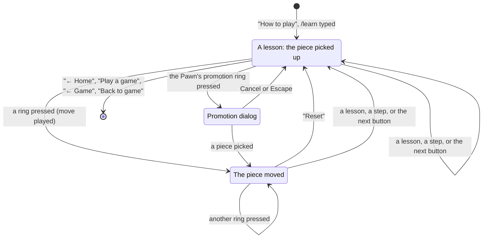

# The tutorial

## Summary

The tutorial, "How to play", teaches the armies and how each piece moves on the tower, for a player who already knows chess. It lives at `/learn` and `/learn/{lesson}`, and is opened from the [home page](../start/the-home-page.md)'s "How to play" or from the same button at the top right of a game's [board screen](../glossary.md#the-product-and-its-screens). It is eight lessons on the real tower and rules: Setup (the armies as a game starts), then one lesson per piece, Rook, Bishop, Unicorn, Queen, King, Knight, and Pawn, the Pawn's in four steps. Each piece's lesson stands the piece alone in the middle of the board, picked up, every square it can reach ringed in gold; pressing a ring plays the move, and the piece is picked up again where it lands. It teaches through the board, with a sentence or two of words per step. Nothing is sent to the server and nothing is kept. Opened from a game, its way out leads back to that game.

## The simple case

The player clicks "How to play" on the home page. The address becomes `/learn`. The tower stands in its garden, seen from White's side as a game opens, with both armies on it, and a glass card holds the lesson: along its top, a row of eight small buttons, one per lesson (the levels for Setup, then each piece's silhouette); under them the lesson's name, "Setup"; a row of each side's pieces counted (one King, one Queen, two each of Rooks, Bishops, Knights, and Unicorns, ten Pawns); and the words: "Each side has 20 pieces, including two unicorns (a new piece in 3D chess) and ten pawns instead of eight. White starts at the bottom, Black at the top." At the card's foot is the next button, "Rook →". "← Home" stands at the top left. In Setup the board is only to look at: nothing is picked up and a press does nothing, but the view can be turned and zoomed as in a game.

The player clicks "Rook →". The address becomes `/learn/rook`. The board is cleared but for one white Rook on `Cc3`, the middle of the board, picked up in its column of light, with a gold circle on each of the squares it can reach. The card shows "Rook", a little cube with the Rook's lines drawn from its middle to the middle of each face, captioned "6 lines", and the words "Rooks move in a straight line, in any of 6 directions: left, right, forwards, backwards, up or down." The foot says "12 moves · tap a ring". The player presses a ring two levels up: the Rook glides there, the mint last-move line marks the move, and the Rook is picked up again where it landed, with its new rings; the count follows it, the hint goes, and "Reset" appears beside the next button, which puts the Rook back on `Cc3`.

The next button runs through every lesson in turn, Bishop ("12 lines"), Unicorn (badged "New"; "8 lines"), Queen ("26 lines"), King ("26 squares", with the quieter note "There's no castling."), and Knight ("24 jumps"), each the same way, and then the Pawn's four steps, and after the last step, "Play a game →", which opens the side choice for a game against a friend.

## The lessons

| Lesson | The board | The words |
| --- | --- | --- |
| Setup | Both armies as a game starts; nothing picked up. | Each side's pieces counted in a row, and "Each side has 20 pieces, including two unicorns (a new piece in 3D chess) and ten pawns instead of eight. White starts at the bottom, Black at the top." |
| Rook | A white Rook on `Cc3`, picked up. | "Rooks move in a straight line, in any of 6 directions: left, right, forwards, backwards, up or down." The cube: "6 lines". |
| Bishop | A white Bishop on `Cc3`. | "Bishops move diagonally, two directions at once, like forwards and left, or up and right." "12 lines". |
| Unicorn ("New") | A white Unicorn on `Cc3`. | "Unicorns move diagonally, three directions at once, like forwards, right and up." "8 lines". |
| Queen | A white Queen on `Cc3`. | "Queens move like a rook, a bishop or a unicorn, along any of their 26 lines." "26 lines". |
| King | A white King on `Cc3`. | "Kings move like a queen, but only by one square." Note: "There's no castling." "26 squares". |
| Knight | A white Knight on `Cc3`. | "Knights jump in an L: two squares in one direction, then one square at a right angle." "24 jumps". |
| Pawn: Move | A white Pawn on `Cc3`. | "White pawns move one square forwards or up." Note: "They cannot move two squares, even on the starting move." "Forwards or up". |
| Pawn: Black | A black Pawn on `Cc3`, the board still seen from White's side. | "Black pawns mirror White's. They move the opposite way, down instead of up." "Mirrored". |
| Pawn: Capture | A white Pawn on `Cc3` with a black piece on each of its five capture squares. | "White pawns capture one square diagonally, like a bishop, but never backwards or down." "5 captures". |
| Pawn: Promote | A white Pawn on `Dc5`, on the far rank a level short of the top. | "White pawns promote when they reach E5, on Black's side." A figure of White's promotion row and Black's. Note: "Black pawns promote at A1, on White's side." Its one move, up to `Ec5`, opens the real [promotion dialog](../play/promotion.md). |

In the Pawn's lesson the card names the step beside the lesson's name ("Move", "Black", "Capture", "Promote") and shows a dot for each step at its right, the current one a longer bar; pressing a dot goes to that step. The steps share one address, `/learn/pawn`.

The lessons have no Kings except the King's own, so the rules of check never limit a piece: every move the piece has is ringed. A piece captures as it moves, as in chess, so pressing a ring on an opponent's piece (only in the Pawn's Capture step) takes it, with the capture's animation. The piece keeps the move after every move; the turn never passes. Pressing an opponent's piece makes it shake its head. The lesson's piece can be put down by pressing it (or any empty square) and picked up again by pressing it.

## The interaction, event by event

### Begin

The tutorial opens on Setup at `/learn`, or on a lesson at its own address; any other lesson name in the address goes to `/learn`. The words and the card show at once; the board appears as soon as the 3D scene has loaded (and if it cannot load, the lessons' words still read, without the board or the count). Each lesson, each step, and each "Reset" starts from the lesson's own position, with nothing played.

A press on a ring is the begin of a move, exactly as on the game's board ([the input model](../foundations/input-model.md)).

### End without sending

Everything in the tutorial ends without sending. A move played on the tutorial's board changes only that board: the server is never told, and nothing is stored in the browser. Leaving a lesson, changing step, or pressing "Reset" throws the moves away.

### Send

Nothing is sent. A move lands on the tutorial's board the moment its ring is pressed: the piece glides, the last-move line moves, and the piece is picked up again where it lands.

### While in flight

Nothing is in flight. While the piece glides, the next press can already pick up its new rings once it has landed.

### The answer arrives

There is no answer. The count of moves in the card's foot ("12 moves") always counts the squares the piece can reach from where it now stands.

## Moving through the tutorial

| Control | Where | What it does |
| --- | --- | --- |
| The lesson buttons | The card's top row | Opens that lesson at its address, replacing the current page in the history (so Back does not step through the lessons chosen this way). |
| The step dots | Beside the Pawn lesson's name | Goes to that step, on the same address. |
| The next button | The card's foot, at the right | Names what comes next: the next step ("Black →"), the next lesson ("Bishop →"), and after the Pawn's last step "Play a game →" (to the side choice at `/new`) or, opened from a game, "Back to game →". A new lesson is a new history entry. |
| "Reset" | The card's foot, once a move has been played | Puts the lesson's position back as it began. |
| "← Home" | The top left | Back to the home page. Opened from a game it reads "← Game" and leads back to that game. |

**Opened from a game.** "How to play" stands at the top right of every board screen ("?" in a window under 720 pixels wide). Clicking it opens the tutorial on Setup with the game's address handed to it, which it carries from lesson to lesson: "← Home" becomes "← Game", and the last button "Back to game". Both lead back to the game's page, which opens as on a reload: a game against a friend rejoins with its stored seat (leaving it for the tutorial [reset the connection](../foundations/connection-and-seat.md#leaving-a-games-page), so the opponent saw the player go "Offline" meanwhile), and a game against the computer reopens from the browser's copy. Nothing about the game changes while the player is in the tutorial, except that the opponent can move.

## Modifiers

| Modifier | At the start | Changes while in flight |
| --- | --- | --- |
| Your color | Not applicable: the board is always seen from White's side, and the lesson's piece is the one that moves (the black Pawn in the Pawn's Black step). | Not applicable. |
| Whose turn it is | The lesson's piece always has the move. | No effect: the turn never passes. |
| How you reached the page | From the home page or a typed address: "← Home" and "Play a game". From a game's "How to play": "← Game" and "Back to game". | Not applicable. |
| Connection state | Never shown, never matters. | Not applicable. |
| Game state | Not applicable; there is no game, no check, and no end. | Not applicable. |
| Shift, Ctrl, or Cmd held | No effect. | Not applicable. |
| Input device | Pointer and touch play rings as on the game's board; tap assist helps a finger. The keyboard reaches "← Home", the lesson buttons, the step dots, "Reset", and the next button, but cannot play a move: there is no move box in the tutorial. | Not applicable. |

Reduced motion: no glide (the piece simply moves), and the marks of play hold still, as on the game's board.

## Cancel and interrupt

There is no request; "before sending" is a lesson as it stands, and "while in flight" is a glide in progress.

| Event | Before sending | While in flight |
| --- | --- | --- |
| Escape or Cancel | Escape or "Cancel" in the Pawn's promotion dialog closes it without moving. Elsewhere no effect. | No effect. |
| Pressing elsewhere or turning the view | A press on an empty square, or on nothing, puts the piece down (pressing it picks it up again); the view turns and zooms as on the game's board. | The glide finishes. |
| Leaving the game page within the app | Any control or Back leaves; the moves played are lost. | Same. |
| The game ends | Not applicable. | Not applicable. |
| The server answers with an error | Not applicable. | Not applicable. |
| The connection drops | No effect. | No effect. |
| The window loses focus or the tab is hidden | No effect; the scene pauses while hidden. | The glide resumes when the tab is shown. |
| Reload or closing the tab | A reload opens the same lesson afresh, at its first step, with nothing played. Opened from a game, the reloaded tutorial usually still leads back to it (the browser keeps the handed-over address with the history entry). | Same. |
| The opponent acts | Not applicable; in a game left for the tutorial, the opponent may move meanwhile, and the move is there on return. | Not applicable. |
| Another tab takes the seat | Not applicable. | Not applicable. |
| A second touch point or a cancelled touch | As on the game's board: a second finger zooms, a cancelled touch does nothing. | Same. |

## Interactions with other systems

**Seat and turn.** None: the tutorial seats no one.

**The game record.** None. The tutorial's moves are never recorded.

**Connection.** None. Leaving a game against a friend for the tutorial resets the connection; coming back rejoins.

**The opponent.** None in the tutorial; an opponent left in a game sees the player "Offline" until they return.

**Other tabs and devices.** Each tab's tutorial is its own.

**Game over.** None in the tutorial. The result card's "Play again" does not lead here; "How to play" stays at the top right of a finished game's board.

**Stored seat.** Not read and not written.

**Keyboard, touch, and screen size.** The card keeps one height per layout so the tower does not jump between lessons: beside the tower, at the left, in a wide window (and in a short one, a phone on its side), or along the bottom otherwise, where on a phone 380 pixels wide or less the words take the card's whole width without the figure. The tower is framed in the room the card and "← Home" leave. On a touch screen "Reset" and the next button take a fingertip's 44 pixels. A screen reader hears the board as "The 3D board, White's side nearest, with the lesson's pieces.", the count as it changes, and the next button as "Next: Rook". See [screen sizes and touch](../cross-cutting/screen-sizes-and-touch.md).

## Edge cases

- **The tutorial fails to load.** The page says "Couldn't load the tutorial." with "← Home".
- **The board fails to load.** The card still teaches in words, without the count.
- **No keyboard play.** A player without a pointer can read every lesson but cannot play a move on the tutorial's board.
- **Promotion.** In the Pawn's Promote step, the move up to `Ec5` opens the same promotion dialog as in a game; the piece chosen then stands on `Ec5`, picked up, with its own moves ringed.
- **Back after lessons.** Lessons reached with the next button are history entries; Back steps back through them. Lessons chosen from the card's row are not.

## Open questions and verification

- Read from `client/src/screens/learn/` (`LearnScreen.tsx`, `LearnCanvas.tsx`, `LearnRoute.tsx`, `learnBack.ts`, `learnLayout.ts`, `Directions.tsx`), `client/src/game/lessons.ts`, `client/src/screens/GameView.tsx` (`HowToPlay`), `ARCHITECTURE.md` ("The tutorial"), `LearnScreen.test.tsx`, and `client/e2e/learn.spec.ts` at `24c650c`; not checked in the running app.
- The tutorial cannot be played from the keyboard (no move box). Whether it should is a product call.
- Whether a reload of a tutorial opened from a game keeps "← Game" depends on the browser restoring the history entry's state; read from how the router keeps it, not tried.

Drafted against 3D Chess commit `24c650c`
