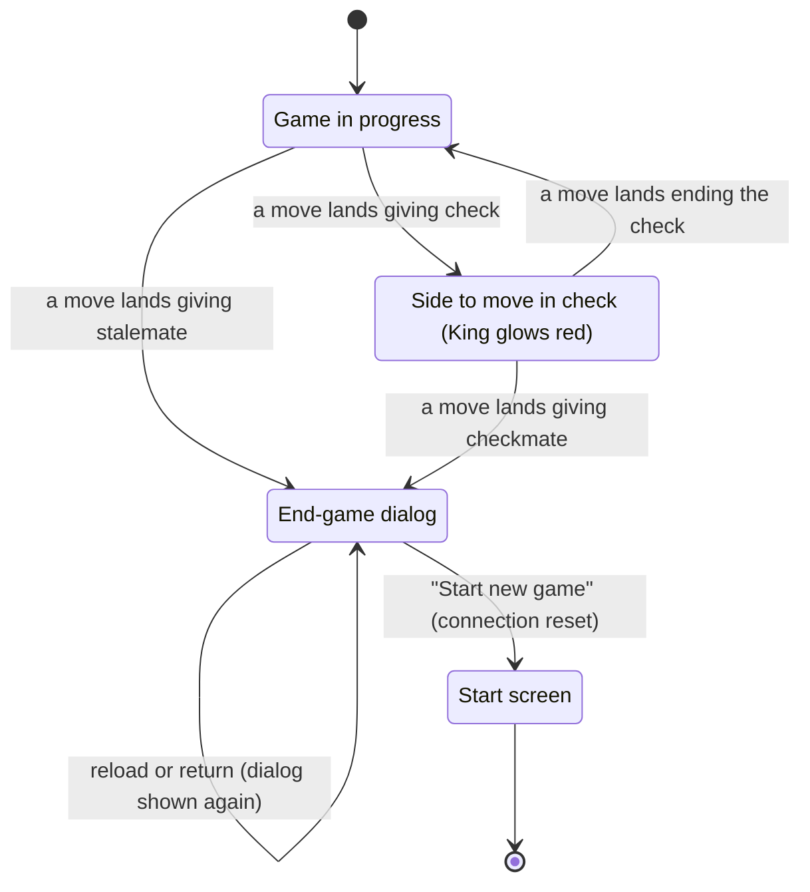

# Check and the end of the game

## Summary

This document covers the two ways the position itself speaks to the player: **check**, shown only as a red glow on the King, and the **end of the game**, shown as a dialog that covers the board and offers a single way out. A game ends only by [checkmate or stalemate](../foundations/game-rules.md#check-checkmate-and-stalemate), decided independently by each player's browser as soon as the move that causes it lands; the server never learns that a game is over. The [end-game dialog](../glossary.md#the-interface) announces the result to both players in the same words and offers "Start new game", which takes the player to the start screen. This document owns a King in check, checkmate and stalemate, the dialog, and that button.

## The simple case

The opponent moves a Queen into line with the player's King. As the Queen lands, the player's King turns red. Nothing else announces it: no text, no sound. When the player selects a piece, only moves that get the King out of check are marked; pieces that cannot help show no destinations. The player moves the King aside, and when that move lands, the red glow goes out.

Later the player delivers mate. As their final move glides in, both boards darken behind a white dialog that reads, for a White winner, "White wins by checkmate!", with a "Start new game" button below. The loser sees the same words. The final position stays visible behind the darkened backdrop but cannot be touched or turned. The player clicks "Start new game" and lands on the start screen, where they can create a new game and send a new link; the opponent is told the player is offline.

## The interaction, event by event

### Begin

Every time a move lands (an [echo](../glossary.md#requests) or a snapshot changes the [move record](../glossary.md#games-and-seats)), each browser replays the record and asks two questions about the new position: is either King attacked, and does the side to move have any legal move?

#### Check

A King that is attacked [glows red](../foundations/the-view.md#markers-and-colors). In a real game only the side to move can be in check, so the glow is always on the King of the player whose turn it is. It appears on both boards the moment the checking move lands, and goes out the moment a move that ends the check lands. If the player selects their King while in check, its glow stays red, not the amber of a selection.

While in check, the player's selectable pieces offer only moves that leave the King unattacked: the King's escapes, captures of the checking piece, and moves that block the line. A piece that can do none of these can be selected but shows no destinations. Nothing says "check" in words, and the turn indicator does not change; the red King is the only sign.

#### Checkmate and stalemate

If the side to move has no legal move, the game is over: checkmate if their King is attacked, stalemate if not. Each browser reaches this conclusion by itself, from the same record, at the moment the final move lands, and shows the end-game dialog at once, while the final move's glide is still playing behind it.

The dialog covers the whole window with a translucent dark backdrop and a white panel. The heading is one of three texts, the same on both boards:

| Result | Heading |
| --- | --- |
| White delivered checkmate | "White wins by checkmate!" |
| Black delivered checkmate | "Black wins by checkmate!" |
| Stalemate | "Draw by stalemate!" |

Below it is a single button, "Start new game". The dialog does not say "You win" or "You lose", does not show the number of moves, and has no close button: Escape and a click on the backdrop do nothing.

The dialog is not shown when the board is [frozen](../cross-cutting/broken-game-record.md): a position the browser could not fully replay is not treated as final.

### End without sending

Check ends without anything sent by the player: a move that ends it lands and the glow goes out.

The end-game dialog does not end by itself. It stays for as long as the page is open, and comes back whenever the game is opened again: a reload, a return through the link or a bookmark, or browser Back from the start screen all replay the record, reach the same final position, and show the dialog again at once, without the final glide. The player's [stored seat](../foundations/connection-and-seat.md#the-stored-seat) is never removed for a finished game, so its link always leads back to the result.

Closing the tab or navigating away from the dialog records nothing; the server has no notion of the game being over, so there is nothing to record.

### Send

Clicking "Start new game" is the dialog's only action. It sends no request about the game. It moves the page to the start screen as a new history entry, and arriving there [resets the connection](../foundations/connection-and-seat.md#returning-to-the-start-screen): the page forgets the game and closes its connection, and the server, seeing the connection close, tells the opponent "Opponent: offline". That is all the opponent learns.

### While in flight

Nothing is in flight: the move to the start screen is immediate. The start screen shows "Connecting to server…" for the moment it takes the fresh connection to open.

### The answer arrives

The player is on the [start screen](../start/creating-a-game.md), with a fresh connection and nothing from the old game carried over. "Start New Game" there creates a brand-new game, with a new id, a new random seat, and a new link to send; there is no rematch that keeps the same opponent or swaps colors. The opponent is not invited or told; each player leaves the finished game on their own.

The finished game remains on the server unchanged until it expires, about 30 days after it was last active.

## Modifiers

| Modifier | At the start | Changes while in flight |
| --- | --- | --- |
| Your color | Decides whose King can glow on the player's turn and which heading means a win for the player; the heading itself names a color, not "you". | Cannot change. |
| Whose turn it is | Check and game over are always about the side to move after the landing move. | Not applicable. |
| How you reached the page | Arriving at a finished game by any route shows the dialog immediately, without the final glide. A player who was away when the mating move was played never sees it glide. | Not applicable. |
| Connection state | Check and the dialog are worked out in the browser and appear whatever the connection state. "Start new game" works while disconnected too. | Not applicable. |
| Game state | This document's subject. A frozen record shows neither the dialog nor, beyond the frozen position, any check. | Not applicable. |
| Shift, Ctrl, or Cmd held | No effect on "Start new game"; it is a button, not a link, and cannot be opened in a new tab. | Not applicable. |
| Input device | "Start new game" works by click, tap, or keyboard (Tab to it, then Enter or Space); focus is not moved to it when the dialog appears. Check is shown only as a color. | Not applicable. |

## Cancel and interrupt

"Before sending" is while check is shown or the end-game dialog is up; "while in flight" does not occur, because "Start new game" is immediate.

| Event | Before sending | While in flight |
| --- | --- | --- |
| Escape or Cancel | No effect on check. The dialog cannot be dismissed: Escape and a click on the backdrop do nothing. | Not applicable. |
| Pressing elsewhere or turning the view | In check, presses work as in [making a move](making-a-move.md). Under the dialog, the board, the view, the seat label, and the move list cannot be reached. | Not applicable. |
| Leaving the game page within the app | The page leaves the finished game; the connection resets on arriving at the start screen. Going Forward or reopening the link shows the dialog again. | Not applicable. |
| The game ends | This document's subject. | Not applicable. |
| The server answers with an error | An error banner, if one arrives, is drawn above the dialog and can be dismissed. | Not applicable. |
| The connection drops | Check and the dialog stay. Under the dialog, "Reconnecting…" appears above it, and the page rejoins when the connection returns; the snapshot changes nothing. | Not applicable. |
| The window loses focus or the tab is hidden | No effect. A game that ends while the tab is hidden shows the dialog when the player returns. | Not applicable. |
| Reload or closing the tab | Check reappears on reload if still in force. The dialog reappears on reload; closing the tab records nothing. | Not applicable. |
| The opponent acts | In check, the opponent cannot move until the player does. After the game ends, the opponent's presence changes are hidden behind the dialog; the opponent cannot play any further move through the app. | Not applicable. |
| Another tab takes the seat | The replaced dialog appears on top of the end-game dialog. After "Play here", the end-game dialog is still there. | Not applicable. |
| A second touch point or a cancelled touch | No effect. | Not applicable. |

## Interactions with other systems

**Seat and turn.** Check is always on the side to move. The heading names the winning color, and each player has to know their own color (from the seat label, now behind the backdrop) to read it as a win or a loss.

**The game record.** Nothing is recorded when a game ends. The record simply stops growing; the result is recomputed from it every time the game is opened.

**Connection.** Neither check nor the result needs the server: both are worked out in the browser. The server could in principle keep accepting moves after mate, but the app never sends one.

**The opponent.** Sees the same glow and the same dialog at the same moment, from the same echo. Learns only that the player went offline when they click "Start new game".

**Other tabs and devices.** Every tab or device that opens the finished game shows the dialog.

**Game over.** This document's subject. There is no other way for a game to end: no resignation, no draw offer, no timeout, no draw by repetition or material.

**Stored seat.** Kept after the game ends, so the link keeps working for the player until the game expires.

**Keyboard, touch, and screen size.** The dialog's button is reachable by Tab, but focus is not placed on it, and nothing else on the page can be reached behind the dialog. Check is conveyed only by a red color; see [accessibility](../cross-cutting/accessibility.md). The dialog is at least 300 px wide and fits a phone screen.

## Edge cases

- **The final position cannot be studied.** The dialog cannot be closed, so the final position can only be seen darkened, from the angle the player last left the view, and the move list cannot be scrolled. Reloading shows the dialog again.
- **The turn indicator after the game.** Behind the backdrop it still reads, for example, "Black to move" for a checkmated Black.
- **Both players each start over.** "Start new game" does not create a game; the player still has to click "Start New Game" on the start screen and send a new link.
- **Back after starting over.** Browser Back from the start screen returns to the finished game, rejoins it (the opponent sees the player online again), and shows the dialog.
- **Stalemate by the player's own move.** The player whose move stalemates the opponent sees "Draw by stalemate!" at once, like the opponent.
- **Two Kings alone.** Not a draw: the game continues, and can only end by the players leaving. See [the rules](../foundations/game-rules.md#what-standard-chess-has-that-this-game-does-not).

## Open questions and verification

- The dialog cannot be dismissed, so a player cannot review the final position or the move list. Whether that is intended is a product call; a "view board" option or a dismissible dialog would change it.
- The headings name colors rather than saying "You win" or "You lose". Deliberate or not, it is the same text for both players.
- Focus is not moved into the dialog when it opens. Read from code; see [accessibility](../cross-cutting/accessibility.md).
- The mate line and both players' "Start new game" are exercised by `client/e2e/gameOver.spec.ts`; check detection and the glow by `client/src/engine/board.test.ts` and `client/src/three/Board.test.tsx`; stalemate detection by the engine tests only. The stalemate heading was not seen in a real game.

Verified against 3D Chess commit `d94507b`
