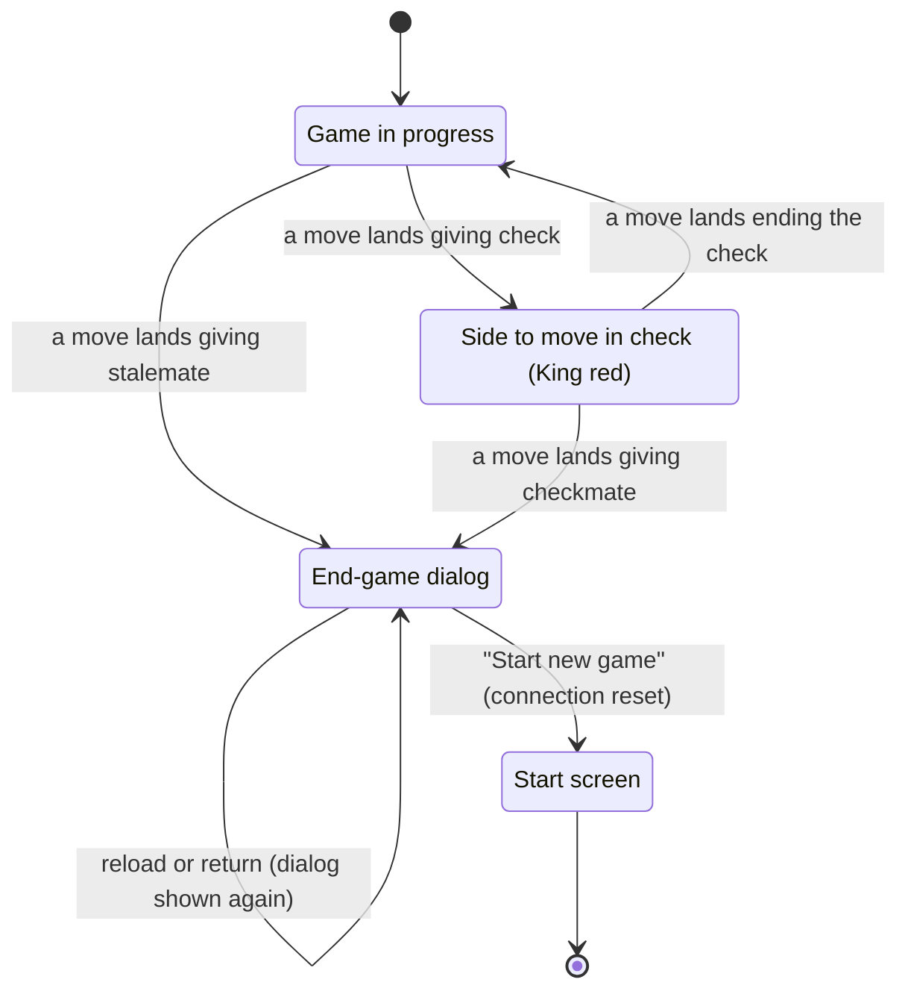

# Check and the end of the game

## Summary

This document covers the two ways the position itself speaks to the player: **check**, shown by the King turning red on the board and by a "CHECK" badge on the turn pill, and the **end of the game**, shown as a dialog that covers the board and offers a single way out. A game ends only by [checkmate or stalemate](../foundations/game-rules.md#check-checkmate-and-stalemate), decided independently by each player's browser as soon as the move that causes it lands; the server never learns that a game is over. The [end-game dialog](../glossary.md#the-interface) announces the result to each player from their own side ("You win", "You lose", or "Draw") and offers "Start new game", which takes the player to the start screen. This document owns a King in check, checkmate and stalemate, the dialog, and that button.

## The simple case

The opponent moves a Queen into line with the player's King. As the Queen lands, the player's King turns red from cross to foot, a red plate of light with eight points strikes on the glass under him, and dark blades rise round him; the turn pill shows "CHECK" beside the player's stone. Nothing else announces it: no sound, no dialog. When the player selects a piece, only moves that get the King out of check are marked; pieces that cannot help show no destinations. The player moves the King aside, and when that move lands, the red and the "CHECK" badge go.

Later the player delivers mate. Their final move glides in, the opponent's King topples, and a pulse of light spreads across his level; both turn pills read the result from their own side, "Checkmate · you win" for the player and "Checkmate · you lose" for the opponent. A moment later a glass card appears over the veiled board: the two stones with the winner's lit, "You win" (the opponent's says "You lose"), "by checkmate" under it, and a "Start new game" button, which has keyboard focus. The final position stays visible behind the veil but cannot be touched or turned. The player clicks "Start new game" and lands on the start screen, where they can create a new game and send a new link; the opponent is told the player is offline.

## The interaction, event by event

```mermaid
stateDiagram-v2
    state "Game in progress" as playing
    state "Side to move in check (King red)" as check
    state "End-game dialog" as over
    state "Start screen" as start
    [*] --> playing
    playing --> check : a move lands giving check
    check --> playing : a move lands ending the check
    playing --> over : a move lands giving stalemate
    check --> over : a move lands giving checkmate
    over --> over : reload or return (dialog shown again)
    over --> start : "Start new game" (connection reset)
    start --> [*]
```

### Begin

Every time a move lands (an [echo](../glossary.md#requests) or a snapshot changes the [move record](../glossary.md#games-and-seats)), each browser replays the record and asks two questions about the new position: is either King attacked, and does the side to move have any legal move?

#### Check

A King that is attacked [turns red](../foundations/the-view.md#markers-and-colors), cross and all, lit from below by a red eight-pointed plate of light on the glass round his foot, with dark obsidian blades edged in red standing round him (their style, or none, is a setting). The plate strikes as check arrives (it lands a little large, flashes, and sends one wave out) and then breathes slowly. In a real game only the side to move can be in check, so the red is always on the King of the player whose turn it is. It appears on both boards the moment the checking move lands, and goes the moment a move that ends the check lands. If the player selects their King while in check, he rises into the column of light and stays red.

At the same moment the [turn pill](../game-page/turn-indicator.md) rings the checked side's stone in red with a red "CHECK" badge beside it, on both boards, and the [move announcement](../glossary.md#the-interface) says "Check." after the move. The badge goes when the check ends, and is not shown once the game is over.

While in check, the player's selectable pieces offer only moves that leave the King unattacked: the King's escapes, captures of the checking piece, and moves that block the line. A piece that can do none of these can be selected but shows no destinations, and a move typed in the [move box](making-a-move.md#begin) that does not end the check is refused under the box. The red King, the badge on the turn pill, and the announcement are the only signs; there is no sound or dialog.

#### Checkmate and stalemate

If the side to move has no legal move, the game is over: checkmate if their King is attacked, stalemate if not. Each browser reaches this conclusion by itself, from the same record, at the moment the final move lands, and lets the end play out on the board first. At checkmate the mated King topples onto his side (0.9 s), one pulse of light spreads from his foot across his own level only, at an even speed (so it takes longer from a corner than from the middle; the "Checkmate pulse" setting sets the speed), and the garden's colossal pieces brighten for a breath. The end-game dialog appears as the King strikes the floor (about half a second into his fall, about a second after the mating move arrives), while his settling bounce and the pulse finish behind it; the wait follows the animation itself, so on a slow device the dialog never covers the fall early, and if the board stops drawing altogether the dialog appears after 12 s. At stalemate nothing plays out: the dialog follows 0.6 s after the final move arrives, as soon as its glide (0.46 s) has landed. When the game was already over as the board appeared (a reload, a return, a snapshot after a drop), the King is simply drawn lying down and the dialog appears at once.

As the game ends, the [turn pill](../game-page/turn-indicator.md) gives the result from each player's side instead of the turn: "Checkmate · you win", "Checkmate · you lose", or "Stalemate · draw". The dialog that follows is a glass card over a veil across the whole window. Everything behind it, the board and the whole HUD, is made inert: it cannot be clicked, focused, or read by assistive technology. The card shows the two stones, porcelain and charcoal, with the winner's lit (neither at stalemate), a heading said to the player, and how the game ended under it:

| Result | Heading | Under it |
| --- | --- | --- |
| The player delivered checkmate | "You win" | "by checkmate" |
| The player was checkmated | "You lose" | "by checkmate" |
| Stalemate | "Draw" | "by stalemate" |

Below them is a single button, "Start new game". The button takes keyboard focus as the dialog opens, so Enter or Space activates it at once. Screen readers announce a dialog named by its heading and described by the line under it. The card keeps a 16 px margin from the window's edges. The dialog does not show the number of moves, and has no close button: Escape and a click on the veil do nothing.

The dialog is not shown when the board is [frozen](../cross-cutting/broken-game-record.md): a position the browser could not fully replay is not treated as final.

### End without sending

Check ends without anything sent by the player: a move that ends it lands, the King's red, the plate, and the blades go, and the turn pill drops "CHECK".

The end-game dialog does not end by itself. It stays for as long as the page is open, and comes back whenever the game is opened again: a reload, a return through the link or a bookmark, or browser Back from the start screen all replay the record, reach the same final position, and show the dialog again at once, without the final glide. The player's [stored seat](../foundations/connection-and-seat.md#the-stored-seat) is never removed for a finished game, so its link always leads back to the result.

Closing the tab or navigating away from the dialog records nothing; the server has no notion of the game being over, so there is nothing to record.

### Send

Clicking "Start new game" is the dialog's only action. It sends no request about the game. It moves the page to the start screen as a new history entry, and arriving there [resets the connection](../foundations/connection-and-seat.md#returning-to-the-start-screen): the page forgets the game and closes its connection, and the server, seeing the connection close, tells the opponent, whose turn pill then shows the player's stone as an outline with "Offline". That is all the opponent learns.

### While in flight

Nothing is in flight: the move to the start screen is immediate. The start screen shows "Connecting to server…" for the moment it takes the fresh connection to open.

### The answer arrives

The player is on the [start screen](../start/creating-a-game.md), with a fresh connection and nothing from the old game carried over. "Start New Game" there creates a brand-new game, with a new id, a new random seat, and a new link to send; there is no rematch that keeps the same opponent or swaps colors. The opponent is not invited or told; each player leaves the finished game on their own.

The finished game remains on the server unchanged until it expires, about 30 days after it was last active.

## Modifiers

| Modifier | At the start | Changes while in flight |
| --- | --- | --- |
| Your color | Decides whose King can turn red on the player's turn and which heading the player sees: "You win" or "You lose" is said from the player's side. | Cannot change. |
| Whose turn it is | Check and game over are always about the side to move after the landing move. | Not applicable. |
| How you reached the page | Arriving at a finished game by any route shows the dialog immediately, without the final glide. A player who was away when the mating move was played never sees it glide. | Not applicable. |
| Connection state | Check and the dialog are worked out in the browser and appear whatever the connection state. "Start new game" works while disconnected too. | Not applicable. |
| Game state | This document's subject. A frozen record shows neither the dialog nor, beyond the frozen position, any check. | Not applicable. |
| Shift, Ctrl, or Cmd held | No effect on "Start new game"; it is a button, not a link, and cannot be opened in a new tab. | Not applicable. |
| Input device | "Start new game" works by click, tap, or keyboard: it has focus when the dialog appears, so Enter or Space activates it. Check is shown by color and blades on the board, by the "CHECK" badge on the turn pill, and in words by the move announcement. | Not applicable. |

## Cancel and interrupt

"Before sending" is while check is shown or the end-game dialog is up; "while in flight" does not occur, because "Start new game" is immediate.

| Event | Before sending | While in flight |
| --- | --- | --- |
| Escape or Cancel | No effect on check. The dialog cannot be dismissed: Escape and a click on the veil do nothing. | Not applicable. |
| Pressing elsewhere or turning the view | In check, presses work as in [making a move](making-a-move.md). Under the dialog, the board, the view, and the whole HUD (the turn pill, the gear, the move card, the error banner) cannot be reached, by pointer or by Tab. | Not applicable. |
| Leaving the game page within the app | The page leaves the finished game; the connection resets on arriving at the start screen. Going Forward or reopening the link shows the dialog again. | Not applicable. |
| The game ends | This document's subject. | Not applicable. |
| The server answers with an error | An error banner, if one arrives, shows under the veil and cannot be dismissed while the dialog is up. | Not applicable. |
| The connection drops | Check and the dialog stay. "Reconnecting…" appears under the veil, and the page rejoins when the connection returns; the snapshot changes nothing. If another tab has taken the seat meanwhile, the replaced dialog appears instead. | Not applicable. |
| The window loses focus or the tab is hidden | No effect. A game that ends while the tab is hidden shows the dialog when the player returns. | Not applicable. |
| Reload or closing the tab | Check reappears on reload if still in force. The dialog reappears on reload; closing the tab records nothing. | Not applicable. |
| The opponent acts | In check, the opponent cannot move until the player does. After the game ends, the opponent's presence changes are hidden behind the dialog; the opponent cannot play any further move through the app. | Not applicable. |
| Another tab takes the seat | The replaced dialog appears on top of the end-game dialog, with focus on "Play here". After "Play here", the end-game dialog is still there. | Not applicable. |
| A second touch point or a cancelled touch | No effect. | Not applicable. |

## Interactions with other systems

**Seat and turn.** Check is always on the side to move. The result is said to each player from their own side, so neither has to know their color to read it as a win or a loss.

**The game record.** Nothing is recorded when a game ends. The record simply stops growing; the result is recomputed from it every time the game is opened.

**Connection.** Neither check nor the result needs the server: both are worked out in the browser. The server could in principle keep accepting moves after mate, but the app never sends one.

**The opponent.** Sees the same red King and the same end at the same moment, from the same echo. Learns only that the player went offline when they click "Start new game".

**Other tabs and devices.** Every tab or device that opens the finished game shows the dialog.

**Game over.** This document's subject. There is no other way for a game to end: no resignation, no draw offer, no timeout, no draw by repetition or material.

**Stored seat.** Kept after the game ends, so the link keeps working for the player until the game expires.

**Keyboard, touch, and screen size.** The dialog's button has focus when the dialog opens. Behind the dialog, everything is inert: the board, the view, and every HUD panel, including the error banner's "✕", cannot be reached by pointer or by Tab. Check is conveyed by the King's red color, by the "CHECK" badge on the turn pill, and by "Check." in the move announcement; see [accessibility](../cross-cutting/accessibility.md). The card keeps a 16 px margin and fits a phone screen.

## Edge cases

- **The final position cannot be studied.** The dialog cannot be closed, so the final position can only be seen under the veil, from the angle the player last left the view, and the move list cannot be scrolled. Reloading shows the dialog again.
- **The turn pill after the game.** Under the veil it reads the result from the player's side ("Checkmate · you lose" for a mated player), without the "CHECK" badge, although the mated King is still red.
- **Enter after the last move.** Focus moves to "Start new game" as the dialog appears, so a key press meant for something else (a second Enter in the move card's field after typing the mating move, for example) can take the player straight to the start screen.
- **The replaced dialog over the result.** If another tab takes the seat while the end-game dialog is up, the replaced dialog covers it, and the end-game dialog is made inert with everything else: "Play here" is the only thing Tab reaches.
- **Both players each start over.** "Start new game" does not create a game; the player still has to click "Start New Game" on the start screen and send a new link.
- **Back after starting over.** Browser Back from the start screen returns to the finished game, rejoins it (the opponent sees the player online again), and shows the dialog.
- **Stalemate by the player's own move.** The player whose move stalemates the opponent sees "Draw" with "by stalemate" when the dialog appears, like the opponent.
- **Two Kings alone.** Not a draw: the game continues, and can only end by the players leaving. See [the rules](../foundations/game-rules.md#what-standard-chess-has-that-this-game-does-not).

## Open questions and verification

- The dialog cannot be dismissed, so a player cannot review the final position or the move list. Whether that is intended is a product call; a "view board" option or a dismissible dialog would change it.
- The replaced dialog now makes the end-game dialog inert too (`client/src/screens/GameScreen.tsx`, the end-game dialog is wrapped in `inert` while replaced), so the edge case "Tab behind the replaced dialog" below no longer holds as written. Read from code at `bb16fed`; not tried.
- Whether a stray Enter can reach "Start new game" right after the mating move is typed depends on the echo's timing; read from code (`client/src/screens/EndGameModal.tsx:50-51`), not tried.
- The mate line and both players' "Start new game" are exercised by `client/e2e/gameOver.spec.ts`; check detection and the red King by `client/src/engine/board.test.ts` and `client/src/three/Board.test.tsx`; the turn pill's check and result by `client/src/App.test.tsx`; stalemate detection by the engine tests only. The stalemate heading was not seen in a real game.

- The end playing out before the dialog (the King's topple, the pulse on his level, the dialog waiting for the topple and a beat, and 0.6 s at stalemate) is read from `client/src/screens/GameScreen.tsx` and `client/src/three/scene/fx.tsx` at `bb16fed`, and the red King in check was seen in screenshots of the running app; neither was re-verified by hand. The turn pill, the dialog, and the rest of this document's HUD wording were brought up to the new HUD from `client/src/screens/` and [the turn indicator](../game-page/turn-indicator.md), not checked in the running app. This document needs re-verification.

Verified against 3D Chess commit `4e18386`
