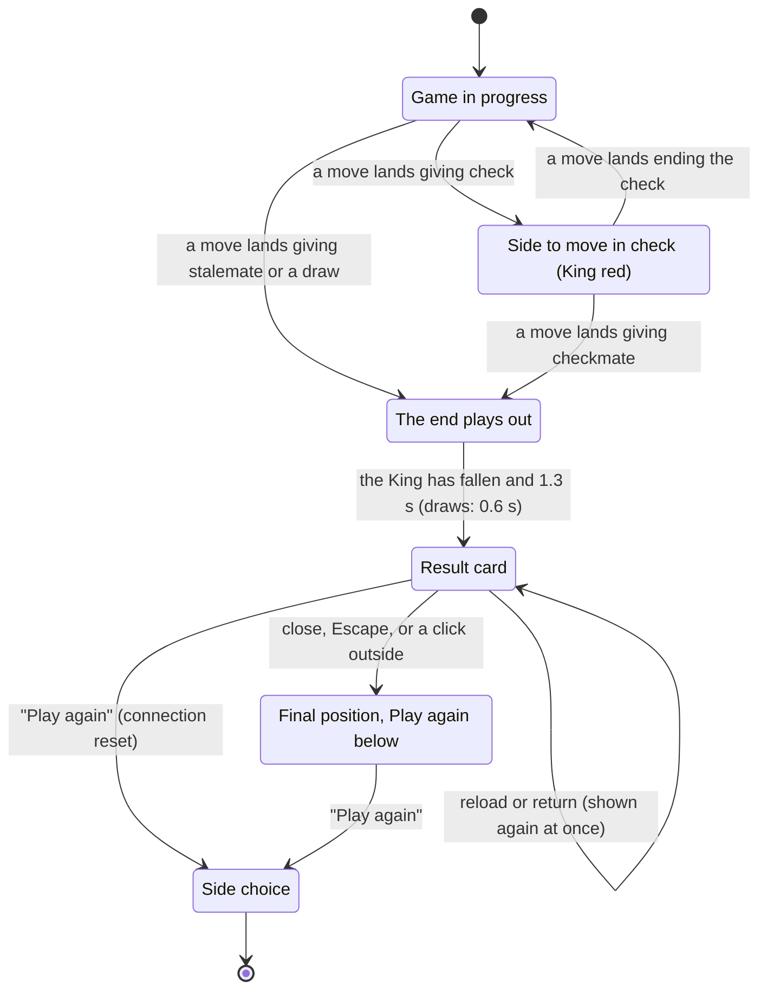

# Check and the end of the game

## Summary

This document covers the two ways the position itself speaks to the player: **check**, shown on the board alone by the King rocking on his foot and turning red among dark blades, and the **end of the game**, shown as a result card over the board. A game ends by [checkmate, stalemate, a threefold repetition, or the fifty-move rule](../foundations/game-rules.md#check-checkmate-and-stalemate), decided independently by each player's browser as soon as the move that causes it lands; the server never learns that a game is over. At checkmate the end plays out first (the King is knocked over and the winners cheer). The [result card](../glossary.md#the-interface) then says the result to each player from their own side ("You win", "You lose", or "Draw", with how) and offers "Play again", which leads to the side choice for another game of the same kind; it can also be closed, to study the final position. This document owns a King in check, the four endings, the result card, and "Play again".

## The simple case

The opponent moves a Queen into line with the player's King. As the Queen lands, the player's King rocks on his foot and turns red from cross to foot, lit from below by a crown of red light on the glass, and four clusters of dark obsidian blades with red edges strike up through the glass round him. Nothing else announces it on screen: no sound, no dialog, nothing on the turn pill; a screen reader hears "Check." after the move. When the player selects a piece, only moves that get the King out of check are marked; pieces that cannot help show no destinations. The player moves the King aside, and when that move lands, the red and the blades go.

Later the player delivers mate. Their final move glides in, and as it arrives it knocks the opponent's King back onto the rim of his base, away from the mating piece: he tips fast at first, slows almost to a stop at the edge of his balance, hangs there a moment, and falls. As he strikes the glass a pulse of light spreads across his level, the blades sink into the glass, and a moment later the player's whole army hops in a wave running out from him. Both turn pills read the result from their own side, "Checkmate · you win" for the player and "Checkmate · you lose" for the opponent. About 1.3 seconds after the King strikes the glass, a glass card appears over the veiled board: a small close button, the two stones with the winner's lit, "You win" (the opponent's says "You lose"), "by checkmate" under it, and "Play again", which has keyboard focus.

The player closes the card (its close button, Escape, or a click outside it) to look at the final position: the board can be turned and zoomed again, the pill still gives the result, and "Play again" waits on its own below the tower. The player clicks it and lands on the side choice, where they can pick a side for a new game and send a new link; the opponent is told the player is offline.

## The interaction, event by event

```mermaid
stateDiagram-v2
    state "Game in progress" as playing
    state "Side to move in check (King red)" as check
    state "The end plays out" as ending
    state "Result card" as card
    state "Final position, Play again below" as studied
    state "Side choice" as start
    [*] --> playing
    playing --> check : a move lands giving check
    check --> playing : a move lands ending the check
    playing --> ending : a move lands giving stalemate or a draw
    check --> ending : a move lands giving checkmate
    ending --> card : the King has fallen and 1.3 s (draws: 0.6 s)
    card --> studied : close, Escape, or a click outside
    card --> card : reload or return (shown again at once)
    card --> start : "Play again" (connection reset)
    studied --> start : "Play again"
    start --> [*]
```

### Begin

Every time a move lands (an [echo](../glossary.md#requests) or a snapshot changes the [move record](../glossary.md#games-and-seats)), each browser replays the record and asks of the new position: is either King attacked, does the side to move have any legal move, has this position stood three times, and have a hundred moves passed without a capture or a pawn move?

#### Check

A King that is attacked [turns red](../foundations/the-view.md#markers-and-colors), cross and all, lit from below, among four clusters of obsidian blades with keen red edges broken up through the glass round his foot. As the checking move lands he rocks on his foot and the blades strike in; then they glint slowly. In a real game only the side to move can be in check, so the red is always on the King of the player whose turn it is. It appears on both boards the moment the checking move lands, and goes the moment a move that ends the check lands. If the player selects their King while in check, he rises into the column of light and stays red.

The [turn pill](../game-page/turn-indicator.md) does not mark check. The [move announcement](../glossary.md#the-interface) says "Check." after the move, and the pill's screen-reader description adds "in check".

While in check, the player's selectable pieces offer only moves that leave the King unattacked: the King's escapes, captures of the checking piece, and moves that block the line. A piece that can do none of these can be selected but shows no destinations, and a move typed in the [move box](making-a-move.md#begin) that does not end the check is refused under the box.

#### The four endings

- **Checkmate:** the side to move is in check and has no legal move. The other side wins.
- **Stalemate:** the side to move is not in check and has no legal move. A draw.
- **Repetition:** the position (the same pieces on the same cells, the same side to move) stands for the third time. A draw.
- **The fifty-move rule:** a hundred moves in all have been played with no capture and no pawn move. A draw.

A mate wins even on the move that would also complete a repetition or the fifty moves. Each browser reaches its conclusion by itself, from the same record, at the moment the final move lands, and lets the end play out on the board first:

- **At checkmate** the mating piece's arrival knocks the King over (the knock lands a moment before the piece comes to rest); he passes his tipping point about half a second later and strikes the glass about 1.1 seconds after the knock, with a small bounce. As he strikes, the pulse of light spreads across his own level only, at an even speed (so it takes longer from a corner than from the middle), the blades sink into the glass, and 0.37 seconds later the winning army hops in a wave travelling out from him. On White's side of the garden the far tower's lit window goes dark. The result card follows 1.3 seconds after the strike, about 3 seconds after the mating move arrived. The wait follows the animation itself, so on a slow device the card never covers the fall early; if the board stops drawing altogether the card appears after 12 seconds.
- **At a draw** nothing plays out: the card follows 0.6 seconds after the final move arrives.
- **Already over.** When the game was already over as the board appeared (a reload, a return, a snapshot after a drop), the King is simply drawn lying down and the card appears at once.

As the game ends, the [turn pill](../game-page/turn-indicator.md) gives the result from each player's side instead of the turn, with one stone lit (the winner's, or at a draw the player's own): "Checkmate · you win", "Checkmate · you lose", "Stalemate · draw", "Repetition · draw", or "50-move rule · draw".

The card is a glass card over a veil across the whole window. Everything behind it, the board and the whole HUD, is made inert: it cannot be clicked, focused, or read by assistive technology. The card shows a close button at its top right, the two stones, porcelain and charcoal, with the winner's lit (neither at a draw), a heading said to the player, and how the game ended under it:

| Result | Heading | Under it |
| --- | --- | --- |
| The player delivered checkmate | "You win" | "by checkmate" |
| The player was checkmated | "You lose" | "by checkmate" |
| Stalemate | "Draw" | "by stalemate" |
| Repetition | "Draw" | "by repetition" |
| Fifty moves | "Draw" | "by the 50-move rule" |

Below them is one button, "Play again", a pale pill of starlight in a turning rim of the level colors, which takes keyboard focus as the card opens, so Enter or Space activates it at once. Screen readers announce a dialog named by its heading and described by the line under it.

The card is not shown when the board is [frozen](../cross-cutting/broken-game-record.md): a position the browser could not fully replay is not treated as final.

### End without sending

Check ends without anything sent by the player: a move that ends it lands, and the King's red and the blades go.

The result card ends without sending in one way: **closing it**, with its close button, Escape, or a click on the veil outside it. The veil lifts, the board and the HUD can be reached again, the view can be turned and zoomed to study the final position, and "Play again" stands on its own at the bottom center of the window, below the tower. The pill keeps the result. Nothing is recorded. The card does not come back while the page stays open, except after a reconnect, whose snapshot replays the game and brings it back.

A closed card comes back whenever the game is opened again: a reload, a return through the link or a bookmark, or browser Back from the side choice all replay the record, reach the same final position, and show the card again at once, without the final glide. The player's [stored seat](../foundations/connection-and-seat.md#the-stored-seat) is never removed for a finished game, so its link always leads back to the result.

Closing the tab or navigating away records nothing; the server has no notion of the game being over, so there is nothing to record.

### Send

Clicking "Play again", on the card or below the tower, sends no request about the game. It moves the page to the side choice of the same kind, `/new` after a game against a friend or `/computer` after one against the computer, as a new history entry. Against a friend, leaving the game's page [resets the connection](../foundations/connection-and-seat.md#leaving-a-games-page): the page forgets the game and closes its connection, and the server, seeing the connection close, tells the opponent, whose turn pill then shows the player's stone as an outline with "Offline". That is all the opponent learns.

### While in flight

Nothing is in flight: the move to the side choice is immediate.

### The answer arrives

The player is on the side choice, "Choose your side", with a fresh connection and nothing from the old game carried over. A pick there creates a brand-new game ([creating a game](../start/creating-a-game.md), or [playing the computer](../computer/playing-the-computer.md) with the last difficulty focused). There is no rematch that keeps the same opponent or swaps colors: against a friend, a new link has to be sent; the opponent is not invited or told, and each player leaves the finished game on their own.

The finished game remains on the server unchanged until it expires, about 30 days after it was last active (a computer game stays in the browser's storage).

## Modifiers

| Modifier | At the start | Changes while in flight |
| --- | --- | --- |
| Your color | Decides whose King can turn red on the player's turn and which heading the player sees: "You win" or "You lose" is said from the player's side. | Cannot change. |
| Whose turn it is | Check and the game's end are always about the side to move after the landing move. | Not applicable. |
| How you reached the page | Arriving at a finished game by any route shows the card immediately, without the final glide or the King's fall. A player who was away when the mating move was played never sees it play out. | Not applicable. |
| Connection state | Check and the card are worked out in the browser and appear whatever the connection state. "Play again" works while disconnected too. | Not applicable. |
| Game state | This document's subject. A frozen record shows neither the card nor, beyond the frozen position, any check. | Not applicable. |
| Shift, Ctrl, or Cmd held | No effect on "Play again"; it is a button, not a link, and cannot be opened in a new tab. | Not applicable. |
| Input device | "Play again" works by click, tap, or keyboard: it has focus when the card appears, so Enter or Space activates it; Tab reaches the close button too, and Escape closes the card. Check is shown by color and blades on the board, and in words by the move announcement. | Not applicable. |

Reduced motion: the King is not knocked over but simply shown fallen, nothing rocks or hops, the blades hold still, and the card follows once the King is down.

## Cancel and interrupt

"Before sending" is while check is shown, the end plays out, or the result card is up or closed; "while in flight" does not occur, because "Play again" is immediate.

| Event | Before sending | While in flight |
| --- | --- | --- |
| Escape or Cancel | No effect on check. Escape closes the result card, as do its close button and a click on the veil. | Not applicable. |
| Pressing elsewhere or turning the view | In check, presses work as in [making a move](making-a-move.md). While the end plays out, before the card, the view can still be turned. Under the card, the board, the view, and the whole HUD cannot be reached; once it is closed, they can again (see the edge cases for what a press on the board then does). | Not applicable. |
| Leaving the game page within the app | The page leaves the finished game; against a friend the connection resets. Going Back or reopening the link shows the card again. | Not applicable. |
| The game ends | This document's subject. | Not applicable. |
| The server answers with an error | An error banner, if one arrives, shows under the veil and cannot be dismissed while the card is up. | Not applicable. |
| The connection drops | Check and the card stay. "Reconnecting…" appears under the veil, and the page rejoins when the connection returns; the snapshot changes nothing. If another tab has taken the seat meanwhile, the replaced dialog appears instead. | Not applicable. |
| The window loses focus or the tab is hidden | No effect on check. A mate that lands while the tab is hidden plays out when the player returns (the scene is not drawn meanwhile), and the card follows it. | Not applicable. |
| Reload or closing the tab | Check reappears on reload if still in force. The card reappears on reload, even if it had been closed; closing the tab records nothing. | Not applicable. |
| The opponent acts | In check, the opponent cannot move until the player does. After a checkmate or stalemate the opponent has no move to make; after a draw by repetition or the fifty moves, see the edge cases. | Not applicable. |
| Another tab takes the seat | The replaced dialog appears on top of the result card, and the card is made inert with everything else, so "Play here" is the only thing Tab reaches. After "Play here", the card is still there. | Not applicable. |
| A second touch point or a cancelled touch | No effect. | Not applicable. |

## Interactions with other systems

**Seat and turn.** Check is always on the side to move. The result is said to each player from their own side, so neither has to know their color to read it as a win or a loss.

**The game record.** Nothing is recorded when a game ends. The record simply stops growing (but see the edge cases); the result is recomputed from it every time the game is opened.

**Connection.** Neither check nor the result needs the server: both are worked out in the browser. The server would accept further moves after the end, since it does not know of it.

**The opponent.** Sees the same red King and the same end at the same moment, from the same echo. Learns only that the player went offline when they leave the game's page. Against the computer, the computer stops thinking once the game is over.

**Other tabs and devices.** Every tab or device that opens the finished game shows the card.

**Game over.** This document's subject. There is no other way for a game to end: no resignation, no draw offer, no timeout, no draw by material.

**Stored seat.** Kept after the game ends, so the link keeps working for the player until the game expires.

**Keyboard, touch, and screen size.** The card's "Play again" has focus when it opens; Escape closes it. Behind the card, everything is inert: the board, the view, and every HUD panel, including the error banner's "✕", cannot be reached by pointer or by Tab. Check is conveyed by the King's red color and blades, and by "Check." in the move announcement; see [accessibility](../cross-cutting/accessibility.md). The card keeps a margin from the window's edges and fits a phone screen.

## Edge cases

- **A drawn game can go on.** The board does not stop taking presses when the game ends. After checkmate or stalemate this changes nothing, since the side to move has no legal move (its pieces can be picked up but show no destinations). After a draw by repetition or the fifty-move rule, the side to move still has legal moves: once that player closes the card, they can press a piece and a destination, the move is sent and recorded, and both boards replay it; the position after it is usually no longer drawn, so the result goes away and the game carries on. The move box refuses moves after the end (it answers "Wait for their move.", even to the player whose turn the final position gives), but the board does not. Against the computer, the computer then answers. See [bug triage](../bug-triage.md) B-25.
- **The turn pill after the game.** It reads the result from the player's side ("Checkmate · you lose" for a mated player); the mated King lies fallen.
- **Enter after the last move.** Focus moves to "Play again" as the card appears, so a key press meant for something else (a second Enter in the move box after typing the mating move, for example) can take the player straight to the side choice.
- **Both players each start over.** "Play again" does not create a game; the player still has to pick a side and send a new link.
- **Back after starting over.** Browser Back from the side choice (or from the new game's page, which replaced the side choice in the history) returns to the finished game, rejoins it (the opponent sees the player online again), and shows the card.
- **Stalemate by the player's own move.** The player whose move stalemates the opponent sees "Draw" with "by stalemate", like the opponent.
- **A repetition the player did not notice.** The draw happens on the move that makes the third occurrence, without warning, whichever side made it; nobody claims it.
- **Two Kings alone.** Not a draw at once: the game continues until the fifty-move rule or a repetition draws it. See [the rules](../foundations/game-rules.md#what-standard-chess-has-that-this-game-does-not).

## Open questions and verification

- A drawn game can be played on after its card is closed ([bug triage](../bug-triage.md) B-25). Read from `client/src/screens/GameView.tsx` (the board's `disabled` does not include the game's end), `client/src/three/Board.tsx`, `client/src/screens/GameScreen.tsx` (`handleMove`), and `client/src/game/computerGame.ts` (the computer's stand-in accepts a move after the end); not tried in the running app.
- Whether a stray Enter can reach "Play again" right after the mating move is typed depends on the echo's timing; read from code (`client/src/screens/EndGameModal.tsx`, `autoFocus`), not tried.
- The end playing out (the knock, the tipping point at about 0.53 s and the strike at about 1.1 s after it, computed from `KNOCK_FALL` in `client/src/three/pieceMotion.tsx`; the pulse, the wave 370 ms after the strike, the card 1.3 s after it: `client/src/lib/mate.ts`; 0.6 s at a draw and the 12 s fallback: `client/src/screens/useEndCard.ts`) and the card (`client/src/screens/EndGameModal.tsx`, `GameView.tsx`) are read from the code at `24c650c`; not checked in the running app. The mate line and the result on both pages are exercised by `client/e2e/gameOver.spec.ts`; check detection by `client/src/engine/board.test.ts`; the draws by `client/src/engine/draws.test.ts` and `client/src/game/history.test.ts`; the card's close and "Play again" by `client/src/screens/GameScreen.endModal.test.tsx`.

Drafted against 3D Chess commit `24c650c`
