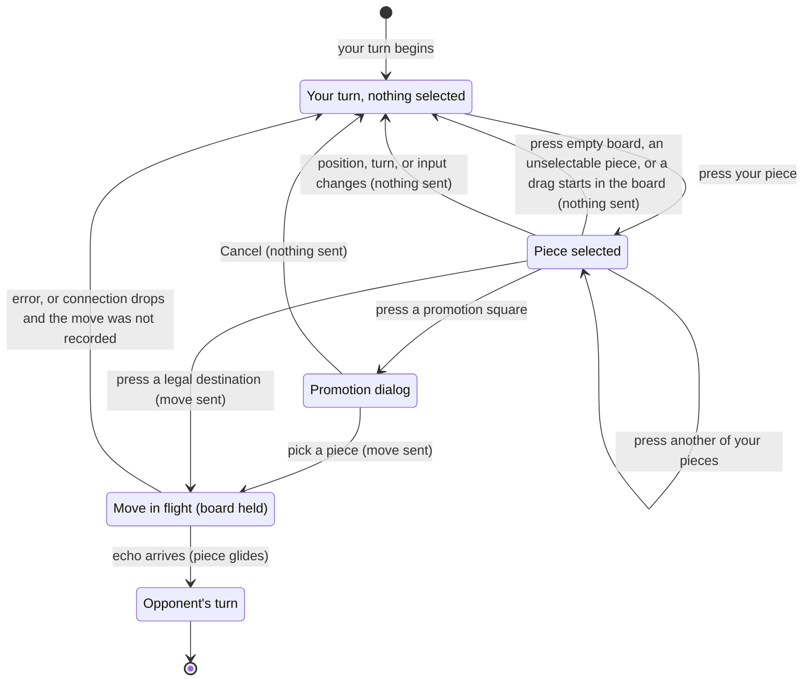

# Making a move

## Summary

Making a move is how a player plays: press one of their own pieces to select it, see where it can go, and press one of those cells. The move is sent to the server at once, the board holds still until the server returns it, and then the piece glides to its new cell on both players' boards at the same moment. It lives on the [board screen](../glossary.md#the-product-and-its-screens) and uses nothing but presses on the 3D board: there is no dragging of pieces, no confirmation step, and no undo. It is available only on the player's own turn, and only while [the board takes input](../foundations/input-model.md#when-the-board-takes-input); a signal that it is available is the turn indicator naming the player's own color.

This document owns the player's own turn: nothing selected, a piece selected, pressing a destination, the move in flight, and its echo arriving. Promotion has [its own document](promotion.md); what the opponent's turn looks like is in [the opponent's move](the-opponents-move.md).

## The simple case

It is the player's turn: they are White and the turn indicator reads "White to move". They press one of their pawns. A gold ring appears on the floor of its cell and the pawn glows faintly amber. Each cell it can move to gets a faint amber tint, with an amber dot in the middle of an empty cell or a red ring around an opponent's piece it can capture.

The player presses one of the dots. The markers vanish at once. For a moment, usually too short to notice, nothing else changes. Then the pawn glides to the new cell, lifted slightly on the way; a captured piece shrinks and fades under it. The two cells of the move turn teal, the turn indicator changes to "Black to move", and the move appears at the bottom of the move list. The opponent sees exactly the same glide at the same moment.

The board now belongs to the opponent's turn: none of the player's pieces can be selected until the opponent's move arrives.

## The interaction, event by event

### Begin

The player's turn begins when the opponent's move lands on this board (or, for White, when the game starts). From then on, a [press](../glossary.md#input) on one of the player's own pieces selects it, as long as the board takes input. The press is resolved by [what takes a press](../foundations/input-model.md#what-takes-a-press): the first piece or legal destination on the line from the camera through the pointer.

At the instant of selection the browser works out every [legal move](../glossary.md#moves-and-the-rules) of that piece in the current position, leaving out any that would leave the player's own King attacked, and draws the [markers](../foundations/the-view.md#markers-and-colors): the gold selection ring and faint amber glow on the piece, and for each legal destination a faint amber fill plus either a dot (empty cell) or a red capture ring (opponent's piece). A promotion square is marked once. The markers belong to this position; they are never updated in place, only cleared.

A piece with no legal move can still be selected: it gets its ring and glow and no destinations. That is how a player learns that a piece is blocked or pinned, or, in check, that it cannot help.

Pressing another of the player's own pieces moves the selection to it, with its own markers. Pressing the selected piece again keeps it selected. Selecting is private: nothing is sent, and the opponent sees nothing.

### End without sending

A selection ends without a move in any of these ways. In every case nothing is sent, nothing is recorded, and the player is back to having nothing selected:

- **A press on an empty part of the board.** Any press whose line enters a cell that is not a legal destination before reaching a piece or destination clears the selection, and so does a press that passes through the board and meets nothing. That includes a press on an opponent's piece that cannot be captured, and on any piece while it is not selectable.
- **A drag that starts in the board.** The press that begins it clears the selection first; see [the input model](../foundations/input-model.md#a-press-acts-at-once). A drag that starts on the background outside the cube, or on the selected piece itself, keeps the selection, and so does zooming with the wheel.
- **The position, the turn, or the board's input changes.** A new position from the server (a snapshot after a reconnect, even one with the same moves), the turn changing, or the board stopping taking input (a drop, a replacement, a frozen record) clears the selection automatically.
- **A promotion square is pressed** and the promotion dialog is then cancelled. The selection was cleared when the square was pressed and does not come back; see [promotion](promotion.md).

A press on the background outside the cube does not clear the selection. Escape does not clear it either.

### Send

Pressing a legal destination sends the move. The destination is whichever legal destination is first on the line from the camera through the pointer; for a capture, pressing the opponent's piece itself counts, because the piece stands inside its highlighted cell. A promotion square does not send; it opens the [promotion dialog](promotion.md), which sends when a piece is picked.

At that instant:

- the move (origin, destination, and promotion piece if any) leaves the browser;
- the selection and every marker disappear;
- the board becomes [held](../glossary.md#selection-and-board-state): it takes no input until the answer arrives;
- the piece does **not** move. The browser never moves a piece until the server returns the move; see [the connection model](../foundations/connection-and-seat.md#a-move-is-shown-only-when-the-server-returns-it).

The server, on receiving it, checks that this connection holds a seat in a game whose two seats are both taken, and that it is that seat's turn. It does not check that the move is legal; the browser only ever offers legal ones. It then appends the move to the [move record](../glossary.md#games-and-seats) and sends the [echo](../glossary.md#requests) to both players, whichever of them are connected. From the moment the server records it, the move is permanent.

### While in flight

The board is held. Presses on pieces and cells do nothing: nothing can be selected, and pressing another destination sends nothing. The hold takes effect a few tens of milliseconds after the press, though: a second press on the same destination inside that moment (a very fast double-click) sends the move again, and the server refuses the copy with "Error: Not your turn" in the error banner. An ordinary double-click is slower than that and sends one move. The view can still be turned. The turn indicator still names the player, the piece still stands on its origin, and the move list is unchanged. Nothing on screen says that a move is on its way: no spinner, no dimming, no text. On an ordinary connection the wait is a fraction of a second; on a slow one, the board simply does not respond until the echo comes.

### The answer arrives

**The echo.** The browser replays the record with the new move and draws the new position:

- the piece [glides](../foundations/the-view.md#motion) from its origin to its destination in 300 ms, and a captured piece fades out under it;
- the teal [last-move trace](../glossary.md#selection-and-board-state) moves to the move's two cells;
- the turn indicator changes to the opponent's color;
- the move is added to the [move list](../game-page/move-list.md): a new numbered row if White moved, the second half of the last row if Black moved;
- if the move puts the opponent in check, the opponent's King [glows red](check-and-game-end.md); if it is checkmate or stalemate, the [end-game dialog](check-and-game-end.md) appears over the board;
- the board takes input again, but it is now the opponent's turn, so there is nothing to select. What the player sees next is in [the opponent's move](the-opponents-move.md).

The opponent's board shows the same glide at the same moment, from the same echo.

**An error.** The server refused the move. The board is released, the move is not shown, and the [error banner](../game-page/error-banner.md) shows "Error: " and the server's message. The position is unchanged and nothing is selected; the player selects again. A correct client should never be refused, but "Not your turn" is possible in the rare case described in the edge cases. The possible messages are in [error messages](../cross-cutting/error-messages.md).

**No answer (the connection dropped).** The board stops taking input as the connection drops, and is released when a new connection opens, because the move was either recorded or lost and waiting any longer would not help. The page then rejoins, and the snapshot settles it: if the server recorded the move, the piece glides in (the move is new to this board) and it is the opponent's turn; if not, the position is unchanged and it is still the player's turn. See [connection loss](../session/connection-loss.md).

## Modifiers

| Modifier | At the start | Changes while in flight |
| --- | --- | --- |
| Your color | Decides which pieces can be selected and how the board is [oriented](../foundations/the-view.md#orientation). White moves first. | Cannot change. |
| Whose turn it is | Only on the player's turn can a piece be selected. On the opponent's turn a press on the player's own piece does nothing except clear (there is nothing to clear). | The turn changes only when this move's echo arrives. |
| How you reached the page | No difference once the board screen shows: creator, joiner, and returning player make moves the same way. A reload or return never restores a selection. | Not applicable. |
| Connection state | Connected: as described. Connecting, reconnecting, or replaced: the board does not take input, so nothing can be selected; the view still turns. | A drop releases the board once a new connection opens; see "The connection drops" below. |
| Game state | In progress: as described. In check: only moves that end the check are offered, and pieces that cannot help show no destinations. Over: the end-game dialog covers the board. Frozen: the board does not take input. | Only this move's own echo can end the game or put the opponent in check. |
| Shift, Ctrl, or Cmd held | No effect on the press. They change only whether a drag that follows orbits or pans. | No effect. |
| Input device | Mouse: every button presses, so a right or middle press selects or plays a move too. Touch: a tap is a press. Keyboard: pieces cannot be selected or moved at all. | No effect; the board is held. |

The variants that matter are decided at the press: whose turn it is and whether the board takes input. Nothing the player holds or changes afterwards alters a move once it is sent.

## Cancel and interrupt

"Before sending" is while a piece is selected; "while in flight" is while the board is held.

| Event | Before sending | While in flight |
| --- | --- | --- |
| Escape or Cancel | No effect. Escape does not clear a selection, and there is no Cancel control. | No effect. A sent move cannot be taken back. |
| Pressing elsewhere or turning the view | Resolved by [what takes a press](../foundations/input-model.md#what-takes-a-press): another own piece moves the selection, an empty cell or unselectable piece clears it, a legal destination sends, the background outside the cube does nothing. A drag starting in the board clears the selection (or sends, if it starts on a destination); the wheel does not. | Presses on the board do nothing. The view can be turned freely. |
| Leaving the game page within the app | The selection is lost; nothing was sent. | The move is already on its way; if the server received it, it is recorded and the opponent sees it land. This page resets its connection and never sees the echo; returning to the game shows the move in place, without a glide. |
| The game ends | Cannot happen: the game ends only when a move lands, and none can land during the player's own turn. | This move's echo can end the game; the end-game dialog appears as the piece glides. |
| The server answers with an error | Not applicable: nothing sent. | The board is released, the error banner shows the message, nothing is selected, and the position is unchanged. |
| The connection drops | The selection is cleared as the board stops taking input; "Reconnecting…" appears. | The board is released when a new connection opens; the snapshot shows whether the move was recorded (it glides in) or not (still the player's turn). |
| The window loses focus or the tab is hidden | No effect; the selection stays. | No effect on the move. The echo is handled in the background; the glide plays when the player returns to the tab. |
| Reload or closing the tab | The selection is lost; nothing recorded. | The answer is lost. The move is recorded if the server received it; after a reload the snapshot shows it in place, without a glide. |
| The opponent acts | The opponent cannot move during the player's turn. Their presence changing ("Opponent: offline") does not touch the selection. | Same. A move made while the opponent is offline is recorded; they see it when they return. |
| Another tab takes the seat | The selection is cleared and the replaced dialog appears. | The echo goes to the tab that now holds the seat, not this one. This tab learns of the move from the snapshot after "Play here". |
| A second touch point or a cancelled touch | A second finger is a new press and can clear the selection, move it, or play a move. A cancelled touch has already done what its press did. | No effect; the board is held. |

After an interrupt before sending, the player is always back to having nothing selected (or a different piece selected), with nothing sent. After an interrupt in flight, the move's fate is the server's: the player learns it from the echo or the next snapshot.

## Interactions with other systems

**Seat and turn.** Only the player's own color, and only on the player's turn. The server enforces the turn as well, so a move from the wrong seat or out of turn is refused.

**The game record.** Each move is appended to the record the moment the server receives it and can never be removed. There is no undo, no takeback, and no confirmation step; the press on a destination is final.

**Connection.** A move is sent only on an open connection and never queued. A move that is sent just as the connection drops is either recorded or lost; the next snapshot says which. See [connection loss](../session/connection-loss.md).

**The opponent.** The opponent sees nothing of the selection or the markers. They see the move land at the same moment the player does, from the same echo. A player may move while the opponent is offline.

**Other tabs and devices.** Only the tab that holds the seat can move. A replaced tab shows its dialog and cannot select anything.

**Game over.** A move can deliver checkmate or stalemate; the end-game dialog appears on both boards as the move lands. Nothing can be moved after that.

**Stored seat.** No role in making a move, beyond deciding which color the page plays after a reload.

**Keyboard, touch, and screen size.** Moves cannot be made from the keyboard. On a touch screen a tap selects and a tap plays; a finger that starts a view drag has already pressed. In a small window the cells, and so the targets, are smaller. See [accessibility](../cross-cutting/accessibility.md) and [screen sizes and touch](../cross-cutting/screen-sizes-and-touch.md).

## Edge cases

- **A hidden destination.** A destination behind one of the player's own pieces cannot be pressed from that angle: the press selects the piece in front. Behind an opponent's piece, the press does nothing but clear the selection. The player has to turn the view, starting the drag outside the cube to keep the selection, or select again afterwards.
- **A drag that plays a move.** A drag meant to turn the view that starts on a highlighted cell plays that move, because the press acts before the drag begins. With a Queen or Rook selected, highlighted cells can cover much of the board.
- **Capturing.** Pressing the opponent's piece in a highlighted cell captures it. The capture ring sits at the piece's foot, but any part of the highlighted cell takes the press.
- **In check.** The King glows red; selecting it shows its escapes, and its glow stays red rather than amber. Pieces that cannot block or capture the checking piece show no destinations.
- **A stale position after reconnecting.** Between a new connection opening and the rejoin's snapshot arriving (at most one round trip), the board takes input against the position it showed before the drop. If the player's previous move had in fact been recorded, a move sent in that window is refused with "Error: Not your turn" and the snapshot shows the recorded move. If the opponent had also already answered it, the move is accepted, although it was chosen two moves ago, and it may be illegal in the real position or even unplayable, which [freezes](../cross-cutting/broken-game-record.md) both boards. See [connection loss](../session/connection-loss.md#while-in-flight).
- **The same position, a new board.** A snapshot identical to what the board already showed still clears the selection.
- **A press on the turn indicator.** It lets presses through to the board. The seat label and the move list do not: a destination behind them cannot be pressed until the view is turned.
- **A very fast double press.** Two presses on a destination within a few tens of milliseconds both send the move; the first is recorded and the second is refused with "Error: Not your turn". The game is unaffected, but the error banner appears. Confirmed in the scripted pass at gaps of 0 and 20 ms; at 50 ms and more only one move was sent.
- **Every mouse button presses.** A right press that starts a pan, or a middle press that starts a zoom, selects or plays a move just like a left press.

## Open questions and verification

- The press-acts-at-once behavior means a drag to turn the view can play a move or lose the selection; see [the input model](../foundations/input-model.md#open-questions-and-verification). This may be worth treating as a bug rather than documenting.
- A second press within a few tens of milliseconds of the first sends the move twice; the copy is refused with "Not your turn" (`client/src/screens/GameScreen.tsx:150-155` checks the hold from the last render, which has not happened yet). Harmless to the game but shows an error; low priority.
- There is no visible sign that a move is in flight. On a slow connection the board silently ignores presses until the echo arrives. Whether an indicator is wanted is a product call.
- There is no undo or takeback of any kind, by design.
- The board takes input again before the rejoin's snapshot arrives, so a move can be sent against a position up to two moves old; if the opponent has already answered the player's recorded move, it is accepted and can freeze the game. See [connection loss](../session/connection-loss.md#open-questions-and-verification). This may be worth treating as a bug. Read from code; it depends on a round-trip window and was not reproduced.
- Selection, markers, the promotion hand-off, and the held board are covered by `client/src/three/Board.test.tsx` and `client/src/App.test.tsx`; the full loop by `client/e2e/playMove.spec.ts`. Right and middle presses, and presses through the turn indicator, were not tried by hand.

Verified against 3D Chess commit `d94507b`
