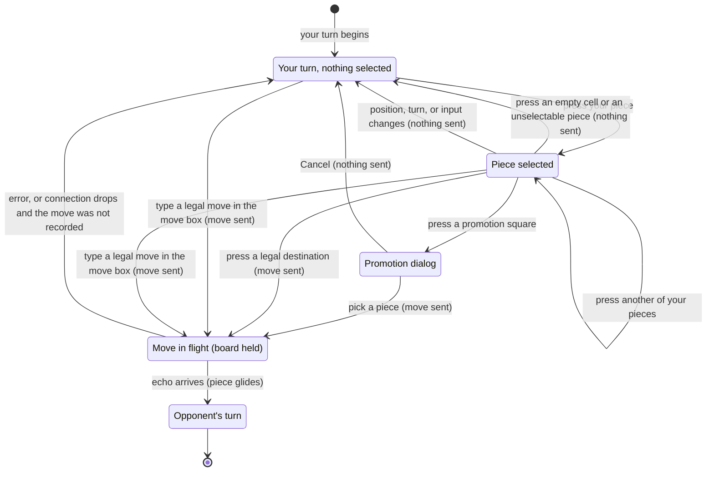

# Making a move

## Summary

Making a move is how a player plays: press one of their own pieces to select it, see where it can go, and press one of those cells, or type the move into the [move box](../glossary.md#the-interface) instead. The move is sent to the server at once, the board holds still until the server returns it, and then the piece glides to its new cell on both players' boards at the same moment. It lives on the [board screen](../glossary.md#the-product-and-its-screens) and uses [presses](../glossary.md#input) on the 3D board, which act on the click (the release), or the move box at the bottom left: there is no dragging of pieces, no confirmation step, and no undo. It is available only on the player's own turn, and only while [the board takes input](../foundations/input-model.md#when-the-board-takes-input); a signal that it is available is the turn indicator naming the player's own color.

This document owns the player's own turn: nothing selected, a piece selected, pressing a destination or typing a move, the move in flight, and its echo arriving. Promotion has [its own document](promotion.md); what the opponent's turn looks like is in [the opponent's move](the-opponents-move.md).

## The simple case

It is the player's turn: they are White and the turn indicator reads "White to move". They click one of their pawns. A gold ring appears on the floor of its cell and the pawn glows faintly amber. Each cell it can move to gets a faint amber tint, with an amber dot in the middle of an empty cell or a red ring around an opponent's piece it can capture.

The player clicks one of the dots. The markers vanish at once. For a moment, usually too short to notice, nothing else changes. Then the pawn glides to the new cell, lifted slightly on the way; a captured piece shrinks and fades under it. The two cells of the move turn teal, the turn indicator changes to "Black to move", and the move appears at the bottom of the move list. The opponent sees exactly the same glide at the same moment.

Instead of clicking, the player could have typed `Ab2-Ab3` into the move box at the bottom left and pressed Enter (or clicked "Move"): the same move is sent, and the same glide follows.

The board now belongs to the opponent's turn: none of the player's pieces can be selected, and the move box's "Move" button stays disabled, until the opponent's move arrives.

## The interaction, event by event

### Begin

The player's turn begins when the opponent's move lands on this board (or, for White, when the game starts). From then on, a [press](../glossary.md#input) on one of the player's own pieces selects it, as long as the board takes input. A press is a click: the primary mouse button, a finger, or a pen going down and coming back up within 6 pixels, on the same piece or cell. Nothing happens while the button is held down; the press acts on the release. It is resolved by [what takes a press](../foundations/input-model.md#what-takes-a-press): the first piece or legal destination on the line from the camera through the pointer.

At the instant of selection the browser works out every [legal move](../glossary.md#moves-and-the-rules) of that piece in the current position, leaving out any that would leave the player's own King attacked, and draws the [markers](../foundations/the-view.md#markers-and-colors): the gold selection ring and faint amber glow on the piece, and for each legal destination a faint amber fill plus either a dot (empty cell) or a red capture ring (opponent's piece). A promotion square is marked once. The markers belong to this position; they are never updated in place, only cleared.

A piece with no legal move can still be selected: it gets its ring and glow and no destinations. That is how a player learns that a piece is blocked or pinned, or, in check, that it cannot help.

Pressing another of the player's own pieces moves the selection to it, with its own markers. Pressing the selected piece again keeps it selected. Selecting is private: nothing is sent, and the opponent sees nothing.

A drag never selects, clears, or moves anything. A pointer that travels more than 6 pixels between going down and coming up, the right or middle mouse button, the wheel, and a pinch or two-finger drag only [turn the view](../foundations/the-view.md#turning-the-view), wherever they start.

**The move box.** A move can also begin in the [move box](../glossary.md#the-interface), the dark panel at the bottom left of the board screen: a label "Type a move (e.g. Ab2-Ab3)", a text field, and a "Move" button. The field can be clicked or reached with Tab, and typed into at any time, but the "Move" button is enabled only while the player may move (it is their turn, the board takes input, and the game is not over) and the field is not empty. Typing does not select anything on the board; a selection already on the board stays until the move is sent.

The move is typed as two cells in the move list's notation: level, file, rank, then level, file, rank. Upper or lower case both work, and the two cells may be separated by "-", "–", "x", spaces, or nothing: `Ab2-Ab3`, `ab2 ab3`, and `Ab2Ab3` are the same move. A promotion adds "=" and a letter; see [promotion](promotion.md#send).

### End without sending

A selection ends without a move in any of these ways. In every case nothing is sent, nothing is recorded, and the player is back to having nothing selected:

- **A press on an empty part of the board.** Any press whose line enters a cell that is not a legal destination before reaching a piece or destination clears the selection, and so does a press that passes through the board and meets nothing. That includes a press on an opponent's piece that cannot be captured, and on any piece while it is not selectable.
- **The position, the turn, or the board's input changes.** A new position from the server (a snapshot after a reconnect, even one with the same moves), the turn changing, or the board stopping taking input (a drop, a replacement, a frozen record, or a move sent from the move box) clears the selection automatically.
- **A promotion square is pressed** and the promotion dialog is then cancelled. The selection was cleared when the square was pressed and does not come back; see [promotion](promotion.md).

A press on the background outside the cube does not clear the selection, and no drag, right or middle click, wheel turn, or pinch does either. Escape does not clear it.

**A typed move that cannot be played.** When the "Move" button is clicked or Enter is pressed in the field, the browser reads the text against the current position. If it is not a legal move of the player's, nothing is sent: the text stays in the field, the field is marked invalid for screen readers, and one line under it says why:

| What was typed | The line under the field |
| --- | --- |
| Not two cells | "Type a move as two cells, like Ab2-Ab3." |
| A first cell without one of the player's pieces | "You have no piece on Ab2." |
| A destination the piece cannot reach legally | "The piece on Ab2 cannot move to Ab5." |
| A promotion letter on a move that is not a promotion | "Ab2-Ab3 is not a promotion." |
| A promotion without a letter | "Say which piece to promote to: add =Q, =R, =B, =N or =U." |

The cells in these lines are the ones typed, written in `Ab2` form whatever the case typed. The line is a status region that screen readers announce, and it disappears as soon as the text is edited. Pressing Enter with the field empty, or while the player may not move, does nothing at all.

### Send

Pressing a legal destination sends the move. The destination is whichever legal destination is first on the line from the camera through the pointer; for a capture, pressing the opponent's piece itself counts, because the piece stands inside its highlighted cell. A promotion square does not send; it opens the [promotion dialog](promotion.md), which sends when a piece is picked.

A legal move typed in the move box is sent in exactly the same way when "Move" is clicked or Enter is pressed; the field is emptied. A typed promotion is sent directly, without the dialog.

At that instant:

- the move (origin, destination, and promotion piece if any) leaves the browser;
- the selection and every marker disappear;
- the board becomes [held](../glossary.md#selection-and-board-state): it takes no input until the answer arrives, and the move box's "Move" button is disabled;
- the piece does **not** move. The browser never moves a piece until the server returns the move; see [the connection model](../foundations/connection-and-seat.md#a-move-is-shown-only-when-the-server-returns-it).

The server, on receiving it, checks that this connection holds a seat in a game whose two seats are both taken, and that it is that seat's turn. It does not check that the move is legal; the browser only ever offers or accepts legal ones. It then appends the move to the [move record](../glossary.md#games-and-seats) and sends the [echo](../glossary.md#requests) to both players, whichever of them are connected. From the moment the server records it, the move is permanent.

### While in flight

The board is held. Presses on pieces and cells do nothing: nothing can be selected, and pressing another destination sends nothing. The move box's field can be typed into, but "Move" is disabled and Enter does nothing. The hold takes effect a few tens of milliseconds after the click, though: a second click on the same destination inside that moment (a very fast double-click) sends the move again, and the server refuses the copy with "Error: Not your turn" in the error banner. An ordinary double-click is slower than that and sends one move. The view can still be turned. The turn indicator still names the player, the piece still stands on its origin, and the move list is unchanged. Nothing on screen says that a move is on its way: no spinner, no dimming, no text. On an ordinary connection the wait is a fraction of a second; on a slow one, the board simply does not respond until the echo comes.

### The answer arrives

**The echo.** The browser replays the record with the new move and draws the new position:

- the piece [glides](../foundations/the-view.md#motion) from its origin to its destination in 300 ms, and a captured piece fades out under it; if the system asks for reduced motion, the piece is simply drawn on its new cell and the captured piece disappears, with no glide or fade;
- the teal [last-move trace](../glossary.md#selection-and-board-state) moves to the move's two cells;
- the turn indicator changes to the opponent's color;
- the move is added to the [move list](../game-page/move-list.md): a new numbered row if White moved, the second half of the last row if Black moved;
- if the move puts the opponent in check, the opponent's King [glows red](check-and-game-end.md) and the turn indicator adds " — in check"; if it is checkmate or stalemate, the [end-game dialog](check-and-game-end.md) appears over the board;
- the board takes input again, but it is now the opponent's turn, so there is nothing to select and "Move" stays disabled. What the player sees next is in [the opponent's move](the-opponents-move.md).

The opponent's board shows the same glide at the same moment, from the same echo.

**An error.** The server refused the move. The board is released, the move is not shown, and the [error banner](../game-page/error-banner.md) shows "Error: " and the server's message. The position is unchanged and nothing is selected; the player selects again. A correct client should never be refused, but "Not your turn" is possible in the rare case described in the edge cases. The possible messages are in [error messages](../cross-cutting/error-messages.md).

**No answer (the connection dropped).** The board stops taking input as the connection drops, and stays that way after a new connection opens, until the page's rejoin is answered with a snapshot of the record. The snapshot settles the move: if the server recorded it, the piece glides in (the move is new to this board) and it is the opponent's turn; if not, the position is unchanged and it is still the player's turn. Only then does the board take input again, so no move can be made against the position from before the drop. See [connection loss](../session/connection-loss.md).

## Modifiers

| Modifier | At the start | Changes while in flight |
| --- | --- | --- |
| Your color | Decides which pieces can be selected and typed and how the board is [oriented](../foundations/the-view.md#orientation). White moves first. | Cannot change. |
| Whose turn it is | Only on the player's turn can a piece be selected or a typed move be sent. On the opponent's turn a press on the player's own piece does nothing except clear (there is nothing to clear), and "Move" is disabled. | The turn changes only when this move's echo arrives. |
| How you reached the page | No difference once the board screen shows: creator, joiner, and returning player make moves the same way. A reload or return never restores a selection or typed text. After a page load the board takes no input until the rejoin's snapshot arrives. | Not applicable. |
| Connection state | Connected, with this connection's rejoin answered: as described. Connecting, reconnecting, replaced, or connected but still waiting for the snapshot: the board does not take input and "Move" is disabled; the view still turns. | A drop keeps the board from taking input until the next snapshot arrives; see "The connection drops" below. |
| Game state | In progress: as described. In check: only moves that end the check are offered or accepted, and pieces that cannot help show no destinations. Over: the end-game dialog covers the board and "Move" is disabled. Frozen: the board does not take input and "Move" is disabled. | Only this move's own echo can end the game or put the opponent in check. |
| Shift, Ctrl, or Cmd held | No effect on a press. They change only whether a drag orbits or pans. | No effect. |
| Input device | Mouse: only a left click selects or plays; right and middle buttons and the wheel only turn the view. Touch: a tap is a press; a one-finger drag, pinch, or two-finger drag only turns the view. Keyboard: the board cannot be operated, but Tab reaches the move box, and a typed move plays exactly as a pressed one. | No effect; the board is held. |

The variants that matter are decided at the press or the submit: whose turn it is and whether the board takes input. Nothing the player holds or changes afterwards alters a move once it is sent.

## Cancel and interrupt

"Before sending" is while a piece is selected or a move is being typed; "while in flight" is while the board is held.

| Event | Before sending | While in flight |
| --- | --- | --- |
| Escape or Cancel | No effect. Escape does not clear a selection or the move box, and there is no Cancel control. | No effect. A sent move cannot be taken back. |
| Pressing elsewhere or turning the view | Resolved by [what takes a press](../foundations/input-model.md#what-takes-a-press): another own piece moves the selection, an empty cell or unselectable piece clears it, a legal destination sends, the background outside the cube does nothing. Dragging, right or middle clicks, the wheel, and pinches only turn the view and keep the selection. Clicking into the move box keeps it too. | Presses on the board do nothing. The view can be turned freely. |
| Leaving the game page within the app | The selection and any typed text are lost; nothing was sent. | The move is already on its way; if the server received it, it is recorded and the opponent sees it land. This page resets its connection and never sees the echo; returning to the game shows the move in place, without a glide. |
| The game ends | Cannot happen: the game ends only when a move lands, and none can land during the player's own turn. | This move's echo can end the game; the end-game dialog appears as the piece glides. |
| The server answers with an error | Not applicable: nothing sent. A typed move that cannot be played is explained under the move box, not by the server. | The board is released, the error banner shows the message, nothing is selected, and the position is unchanged. |
| The connection drops | The selection is cleared as the board stops taking input; "Reconnecting…" appears. Typed text stays in the field, but "Move" is disabled until the snapshot after reconnecting arrives. | The board stays unusable until the snapshot after reconnecting arrives; it shows whether the move was recorded (it glides in) or not (still the player's turn). |
| The window loses focus or the tab is hidden | No effect; the selection and typed text stay. | No effect on the move. The echo is handled in the background; the glide plays when the player returns to the tab. |
| Reload or closing the tab | The selection and typed text are lost; nothing recorded. | The answer is lost. The move is recorded if the server received it; after a reload the snapshot shows it in place, without a glide. |
| The opponent acts | The opponent cannot move during the player's turn. Their presence changing ("Opponent: offline") does not touch the selection. | Same. A move made while the opponent is offline is recorded; they see it when they return. |
| Another tab takes the seat | The selection is cleared and the replaced dialog appears; the move box is out of reach behind it. | The echo goes to the tab that now holds the seat, not this one. This tab learns of the move from the snapshot after "Play here". |
| A second touch point or a cancelled touch | A second finger turns a touch into a pinch or two-finger drag: it only turns the view, and the selection stays. A cancelled touch does nothing. | No effect; the board is held. |

After an interrupt before sending, the player is always back to having nothing selected (or a different piece selected, or the same selection kept), with nothing sent. After an interrupt in flight, the move's fate is the server's: the player learns it from the echo or the next snapshot.

## Interactions with other systems

**Seat and turn.** Only the player's own color, and only on the player's turn, on the board and in the move box alike. The server enforces the turn as well, so a move from the wrong seat or out of turn is refused.

**The game record.** Each move is appended to the record the moment the server receives it and can never be removed. There is no undo, no takeback, and no confirmation step; the press on a destination, or the submit in the move box, is final.

**Connection.** A move is sent only on an open connection whose rejoin has been answered, and never queued. A move that is sent just as the connection drops is either recorded or lost; the next snapshot says which. See [connection loss](../session/connection-loss.md).

**The opponent.** The opponent sees nothing of the selection, the markers, or the move box. They see the move land at the same moment the player does, from the same echo. A player may move while the opponent is offline.

**Other tabs and devices.** Only the tab that holds the seat can move. A replaced tab, including one whose connection came back to find the seat [in use](../glossary.md#the-connection) by another tab, shows its dialog and cannot select or submit anything.

**Game over.** A move can deliver checkmate or stalemate; the end-game dialog appears on both boards as the move lands. Nothing can be moved after that: the board is behind the dialog and "Move" is disabled.

**Stored seat.** No role in making a move, beyond deciding which color the page plays after a reload.

**Keyboard, touch, and screen size.** The 3D board cannot be operated from the keyboard, but every move, promotion included, can be typed in the move box, which Tab reaches. On a touch screen a tap selects and a tap plays; a drag or a two-finger gesture only turns the view. In a small window the cells, and so the targets, are smaller, but the whole cube is always in frame. See [accessibility](../cross-cutting/accessibility.md) and [screen sizes and touch](../cross-cutting/screen-sizes-and-touch.md).

## Edge cases

- **A hidden destination.** A destination behind one of the player's own pieces cannot be pressed from that angle: the press selects the piece in front. Behind an opponent's piece, the press does nothing but clear the selection. The player turns the view, which keeps the selection, and presses again; or types the move.
- **A drag that ends where it started.** A pointer that moves out and back, ending within 6 pixels of where it went down, is still a press, and the view turns slightly while it moves. A drag that ends more than 6 pixels away never acts, however short it felt.
- **Capturing.** Pressing the opponent's piece in a highlighted cell captures it. The capture ring sits at the piece's foot, but any part of the highlighted cell takes the press.
- **In check.** The King glows red and the turn indicator reads, for example, "White to move — in check"; selecting the King shows its escapes, and its glow stays red rather than amber. Pieces that cannot block or capture the checking piece show no destinations, and a typed move that does not answer the check is refused under the move box with "The piece on … cannot move to …".
- **Just after reconnecting.** Between a new connection opening and the rejoin's snapshot arriving (at most one round trip), "Reconnecting…" has gone but the board still takes no input and "Move" stays disabled. A press in that moment does nothing. See [connection loss](../session/connection-loss.md).
- **The same position, a new board.** A snapshot identical to what the board already showed still clears the selection.
- **A press on the turn indicator.** It lets presses through to the board. The seat label, the "Reconnecting…" banner, the move box, the error banner, and the move list do not: a destination behind them cannot be pressed until the view is turned. The gaps between those panels let presses through.
- **A very fast double click.** Two clicks on a destination within a few tens of milliseconds both send the move; the first is recorded and the second is refused with "Error: Not your turn". The game is unaffected, but the error banner appears. See [`bug-triage.md`](../bug-triage.md) B-14.
- **Right and middle buttons.** A right click or middle click on a destination or a piece does nothing to the board; a right or middle drag pans or zooms the view.
- **Typing while waiting.** The move box's field accepts text during the opponent's turn or while a move is in flight, so a player can type their next move early; it can be sent only once "Move" is enabled, and it is read against the position at that moment.

## Open questions and verification

- A second click within a few tens of milliseconds of the first sends the move twice; the copy is refused with "Not your turn" (`client/src/three/Board.tsx:193-208` and `client/src/screens/GameScreen.tsx:188-193` read the selection and the hold from the last render, which has not happened yet). Harmless to the game but shows an error; low priority; triage B-14, not fixed. The rerun of the scripted pass against this build still sent two moves at a 0 ms gap and one at 100 ms.
- There is no visible sign that a move is in flight. On a slow connection the board silently ignores presses until the echo arrives; the only change is that "Move" is disabled. Whether an indicator is wanted is a product call.
- There is no undo or takeback of any kind, by design.
- The move box's last message, "A pawn cannot promote to that piece." (`client/src/game/typedMove.ts:47`), cannot appear: the field only accepts the five promotion letters, and every promotion square offers all five.
- Selection, markers, the click threshold and button filter, the promotion hand-off, and the held board are covered by `client/src/three/Board.test.tsx` and `client/src/App.test.tsx` (including the board held until the rejoin is answered, and the move box's send, error line, and turn gating); the full loop by `client/e2e/playMove.spec.ts`. Touch taps and two-finger gestures on a real device, and presses through the turn indicator, were not tried by hand.

Verified against 3D Chess commit `90142a3`
