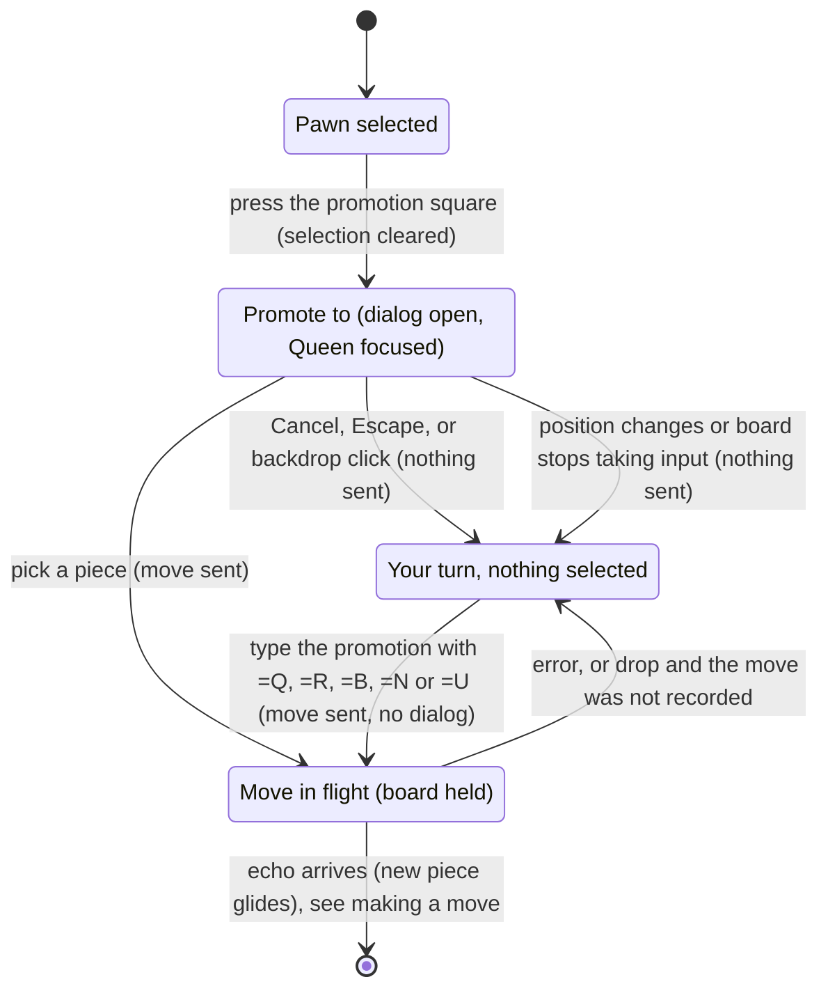

# Promotion

## Summary

Promotion is the choice a player makes when one of their pawns reaches a [promotion square](../foundations/game-rules.md#promotion): which piece it becomes. Pressing a promotion square as a pawn's destination opens a small dialog, "Promote to", with one button per piece and keyboard focus on "Queen"; the move is sent only when the player picks one, and can be abandoned with Cancel, Escape, or a click outside the dialog. A promotion can also be typed in the [move box](../glossary.md#the-interface) with the piece's letter, which sends it without the dialog. The dialog lives on the board screen, over the board, and appears only on the player's own turn while [the board takes input](../foundations/input-model.md#when-the-board-takes-input). This document owns the dialog, from pressing the promotion square to picking or cancelling, and the typed form; once a piece is picked, the move is in flight exactly as in [making a move](making-a-move.md).

## The simple case

The player's pawn is one step from its promotion square, and they select it. The promotion square is marked like any other destination: one dot, or one capture ring if an opponent's piece stands there. The player clicks it.

The board darkens behind a white dialog titled "Promote to", with five buttons, "Queen", "Rook", "Bishop", "Knight", and "Unicorn", and a smaller gray "Cancel" below them. "Queen" has keyboard focus. Nothing has been sent yet, and the pawn has not moved; the turn indicator, behind the darkened backdrop, still names the player.

The player clicks "Unicorn". The dialog closes and the move is sent. A moment later, on both boards, a Unicorn glides from the pawn's cell to the promotion square (the pawn does not travel and then change; the new piece travels), the teal trace marks the two cells, the move list shows the move with "=U" after it, for example `Da4–Ea5=U`, and the turn passes to the opponent.

## The interaction, event by event

### Begin

The dialog opens when the player presses a promotion square that is a legal destination of their selected pawn, reached by a quiet step or by a capture. Like every [press](../glossary.md#input), it acts on the click: the primary button or a finger coming back up within 6 pixels of where it went down. Five legal moves lead to that one cell, one per piece; the browser hands all five to the dialog. They are always all five, because which piece a pawn becomes can never make a move legal or illegal.

At the same instant the board clears the selection and its markers, exactly as it does when sending an ordinary move, and the dialog appears:

- a translucent dark backdrop over the whole window, HUD included;
- a white panel with the heading "Promote to";
- five buttons in a row, in the order Queen, Rook, Bishop, Knight, Unicorn, which wrap onto a second line if the window is narrow;
- a plain gray "Cancel" button below them.

Keyboard focus goes to "Queen". Because the dialog opens on the click, after the browser has finished handling the button going down, the focus stays there: Enter or Space promotes to a Queen at once, Escape cancels, and Tab moves to "Rook" and on through the buttons. Everything behind the dialog, the board and every HUD panel, is made inert: it cannot be clicked, focused, or read by assistive technology, so Tab moves only among the dialog's buttons (and, past "Cancel", through the browser's own toolbar before coming back to "Queen"). Screen readers announce it as a dialog named "Promote to". Nothing has been sent, and the board shows the pawn where it was.

The piece buttons and "Cancel" are drawn as plain words, with no border or background ("Cancel" in gray), and "Promote to" is ordinary-sized text; only the white panel and the darkened backdrop mark it as a dialog.

**Typing a promotion.** In the [move box](making-a-move.md#begin), a promotion is typed as the pawn's move followed by "=" and a letter, Q for Queen, R for Rook, B for Bishop, N for Knight, U for Unicorn: `Da4-Ea5=U`. The "=" may be left out and the letter may be lower case. The dialog does not open for a typed move.

### End without sending

The dialog closes without sending in any of these ways:

- **Cancel**: clicking "Cancel", or pressing Enter or Space on it.
- **Escape**: pressing Escape while keyboard focus is on one of the dialog's buttons, which it is from the moment the dialog opens. Clicking the white panel between buttons takes focus off the buttons; Escape then does nothing until Tab brings focus back.
- **The backdrop**: clicking the darkened area outside the white panel, including over a HUD panel such as the move list or an error banner, which are behind the backdrop. A click on the panel itself, between buttons, does nothing.
- **The position changes**: a new position arrives from the server (a snapshot after a reconnect).
- **The board stops taking input**: the connection drops, another tab takes the seat, or the record freezes. The dialog does not come back when the board takes input again.

In every case nothing is sent and nothing is recorded. The player is back on their own turn with nothing selected: the pawn is not reselected, and the player must press it again to promote (or to move something else instead).

**A typed promotion that cannot be played** sends nothing and is explained under the move box, like any typed move (see [making a move](making-a-move.md#end-without-sending)). Two lines are particular to promotion: a pawn move onto the promotion square without a letter gives "Say which piece to promote to: add =Q, =R, =B, =N or =U.", and a letter on a move that is not a promotion gives, for example, "Ab2-Ab3 is not a promotion."

### Send

Clicking one of the five piece buttons (or pressing Enter or Space on it) closes the dialog and sends the move with that piece. A typed promotion is sent when "Move" is clicked or Enter is pressed in the move box. From here it is an ordinary move in flight: the board is [held](../glossary.md#selection-and-board-state) and the pawn stays where it is until the server returns the move. See [making a move](making-a-move.md#send).

The server checks the promotion only for its form: it must be one of the five letters Q, R, B, N, and U. It records the move, promotion included, and echoes it to both players.

### While in flight

As in [making a move](making-a-move.md#while-in-flight): the board ignores presses, "Move" is disabled, the view can be turned, and nothing on screen shows the wait. The dialog does not reappear.

### The answer arrives

On the echo, both boards replay the record with the promotion: the chosen piece [glides](../foundations/the-view.md#motion) from the pawn's cell to the promotion square, a captured piece fades under it (or, under reduced motion, the new piece is simply drawn there), the teal trace moves, and the turn passes to the opponent. The [move list](../game-page/move-list.md) shows the move with "=" and the piece's letter: Q for Queen, R for Rook, B for Bishop, N for Knight, U for Unicorn. The new piece is from then on an ordinary piece of its kind. If the promotion gives check or ends the game, that follows as for any move.

An error or a drop is handled as in [making a move](making-a-move.md#the-answer-arrives): an error releases the board with the message in the error banner and the pawn still on its cell; a drop is settled by the next snapshot.

## Modifiers

| Modifier | At the start | Changes while in flight |
| --- | --- | --- |
| Your color | White promotes on rank 5 of level E, Black on rank 1 of level A. The dialog and the typed form are the same for both. | Cannot change. |
| Whose turn it is | Only on the player's turn; the dialog cannot open, and "Move" is disabled, otherwise. | The turn changes only when the echo arrives. |
| How you reached the page | No difference. An open dialog never survives a reload or return. | Not applicable. |
| Connection state | The dialog appears only while connected and after this connection's rejoin has been answered. If the connection drops while it is open, it closes without sending. | A drop is handled as for any move. |
| Game state | In progress or in check: as described (a promotion that does not answer a check is never offered or accepted). Over or frozen: no promotion is possible. | Only this move's echo can end the game. |
| Shift, Ctrl, or Cmd held | No effect on the press that opens the dialog, or on the buttons. | No effect. |
| Input device | Mouse or touch: click or tap a button. Keyboard: the dialog opens with "Queen" focused, so Enter or Space picks it at once, Tab moves between the buttons, and Escape cancels. The pawn and the square cannot be pressed from the keyboard, but the whole promotion can be typed in the move box (`Da4-Ea5=Q`). | No effect. |

## Cancel and interrupt

"Before sending" is while the dialog is open (or a promotion is being typed); "while in flight" is after a piece has been picked or the typed move submitted.

| Event | Before sending | While in flight |
| --- | --- | --- |
| Escape or Cancel | Closes the dialog; nothing sent; nothing selected. Escape works while keyboard focus is on one of the dialog's buttons, as it is when the dialog opens. A click on the backdrop does the same as Cancel. | No effect. The promotion cannot be taken back. |
| Pressing elsewhere or turning the view | The board, the view, and every HUD panel are out of reach: the backdrop covers the whole window, the page behind it is inert, and clicking anywhere outside the white panel cancels. | As in making a move: presses do nothing, the view turns. |
| Leaving the game page within the app | The dialog is lost with the page; nothing sent. | The move is recorded if the server received it; returning shows it in place. |
| The game ends | Cannot happen: nothing can land during the player's own turn. | This move's echo can end the game. |
| The server answers with an error | Not applicable. An error banner already showing stays behind the backdrop and cannot be dismissed until the dialog closes. | The board is released and the error shown; the pawn is still on its cell and nothing is selected. |
| The connection drops | The dialog closes without sending and does not come back. "Reconnecting…" appears. | Settled by the next snapshot, as in making a move. |
| The window loses focus or the tab is hidden | No effect; the dialog stays open, and focus returns to it with the window. | No effect. |
| Reload or closing the tab | The dialog is lost; nothing sent. | The move is recorded if the server received it. |
| The opponent acts | The opponent cannot move during the player's turn. Presence changes do not close the dialog. | Same. |
| Another tab takes the seat | The dialog closes without sending, and the replaced dialog appears. | The echo goes to the other tab; this one learns of the move after "Play here". |
| A second touch point or a cancelled touch | A tap on the backdrop cancels, on a button picks; a cancelled touch does nothing. | No effect. |

## Interactions with other systems

**Seat and turn.** Only the side to move can promote, and only its own pawns.

**The game record.** The promotion is recorded as part of the move (a letter after the destination) and cannot be changed afterwards. Cancelling records nothing.

**Connection.** The dialog exists only while the board takes input; a drop closes it and the choice has to be made again.

**The opponent.** Sees nothing until the move lands, then the new piece gliding in, and the "=" letter in their move list.

**Other tabs and devices.** A replaced tab loses its dialog. The dialog is not shared between tabs.

**Game over.** A promotion can deliver checkmate or stalemate like any move.

**Stored seat.** No role.

**Keyboard, touch, and screen size.** The dialog opens with focus on "Queen", so Enter promotes to a Queen and Escape cancels without any Tab first. The page behind is inert, so Tab stays among the dialog's buttons apart from the browser's own toolbar. A keyboard player who cannot press the square types the promotion instead. On a narrow window the five buttons wrap onto two lines.

## Edge cases

- **Every pressed promotion shows the dialog.** There is no automatic Queen and no remembered choice; each promotion made on the board asks. Only a typed promotion skips the dialog, and it must name its piece.
- **Capturing onto the promotion square.** Pressing the opponent's piece on the promotion square opens the dialog like a quiet promotion; the captured piece fades when the move lands.
- **Enter right after opening.** Because "Queen" has focus, pressing Enter (or Space) as soon as the dialog appears promotes to a Queen. A player who presses Enter out of habit gets a Queen, not a pause.
- **A click inside the panel.** Clicking the white panel between buttons does nothing, but it takes keyboard focus off the buttons, after which Escape does nothing until Tab brings focus back to a button.
- **An error banner behind the dialog.** An error from before the dialog opened stays visible, darkened, behind the backdrop. Clicking it cancels the promotion instead of dismissing the error.
- **Promoting to a Knight.** Recorded with the letter N, not K; typed with N too.
- **Several pawns on promotion squares.** Each promotion is its own move with its own dialog; there is no batch.

## Open questions and verification

- The dialog has no focus trap of its own. Tab stays within it only because the page behind is inert; past "Cancel", Tab goes to the browser's toolbar before returning to "Queen". Read from code (`client/src/screens/GameScreen.tsx:332-335`); not tried with a screen reader.
- Clicking an error banner behind the backdrop cancels the promotion. Read from the drawing order and the inert page (`client/src/screens/GameScreen.tsx:335`, `client/src/screens/PromotionPicker.tsx:30-40`); not confirmed by hand.
- The dialog, its cancel paths, the send, the automatic close on a drop or a new position, and the "=U" in the move list are covered by `client/src/App.test.tsx`, `client/src/three/Board.test.tsx`, and `client/e2e/promotion.spec.ts`; the typed form's parsing by `client/src/game/typedMove.test.ts`. The focus on "Queen" after a real click was confirmed by the rerun of the scripted pass against this build (PROMO-02, PROMO-04, PROMO-08 no longer reproduce the lost focus); see [`bug-triage.md`](../bug-triage.md) B-07, fixed.

Verified against 3D Chess commit `4e18386`
