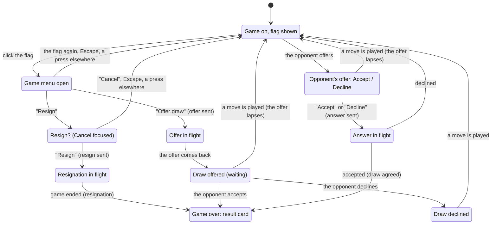

# Resigning and draws

## Summary

Besides the endings the board decides by itself ([check and the end of the game](check-and-game-end.md)), the players can end a game themselves: either may **resign** at any moment, on their move or not, and the opponent wins; or either may **offer a draw**, which the opponent accepts or declines. Both live behind the [game menu](../glossary.md#the-interface), a flag in a circle at the top right of the board screen, under "How to play", shown for as long as the game is on. Resigning asks once more ("Resign?", with the focus on "Cancel") so that a stray click never ends a game. A draw can be offered once a move, by either side: an offer stands until the opponent answers it or until either side plays a move, which lets it lapse without a word. While it stands, the offering player sees "Draw offered" under the flag and the opponent sees "Draw offered" with "Accept" and "Decline"; a declined offer leaves "Draw declined" under the offerer's flag until the next move. Each of these is a request to the server, which records it in the game, tells both players, and refuses any move, resignation, or offer after the game has ended this way. A resignation ends the game as "White resigned" (or "Black resigned"), an accepted offer as "Draw agreed"; the result card and "Play again" follow as for any other ending. Against the computer, resigning works the same, the computer never offers a draw, and offered one it weighs up the position and accepts only when it stands clearly worse. This document owns the game menu, resigning, the draw offer and its answers. The result card and what follows it belong to [check and the end of the game](check-and-game-end.md).

## The simple case

The player is White, two pawns down in a game against a friend, and it is their move. They click the flag at the top right of the window, under "How to play". A small glass menu opens under it with two items, "Offer draw" and "Resign". They click "Offer draw". The menu closes, and a moment later, when the server has passed the offer on, a glass line under the flag reads "Draw offered" with a small breathing dot. On the opponent's screen, under their flag, a glass pill appears with "Draw offered" and two buttons, a bright "Accept" and a plain "Decline"; nothing takes the focus from what they were doing, and a screen reader hears "Your opponent offers a draw."

The opponent clicks "Decline". The pill goes from their screen, and under White's flag "Draw offered" gives way to "Draw declined". The game goes on; White cannot offer again until a move has been played. White plays a move, and "Draw declined" goes.

A few moves later White's position is lost. They click the flag and "Resign". The menu turns into a question, "Resign?", with "Cancel" (focused) and a red "Resign" beside it. They click "Resign". The menu closes; a moment later both turn pills give the result, "White resigned · you lose" on White's and "White resigned · you win" on Black's, the flag goes from both screens, and about 0.6 seconds later the result card appears: "You lose" (Black's: "You win"), "White resigned" under it, and "Play again". Nothing happens on the board: no King falls.

## The interaction, event by event

### Begin

The game menu is a round button, 36 pixels across (40 on a touch screen), with a white flag on it, at the top right of the board screen, 60 pixels from the top: under "How to play", below the HUD's band, in the room beside the tower at every window shape. It appears with the board, fading in with the turn pill at the end of the [entrance](../foundations/the-view.md#the-entrance), and stays while the game is on, on either player's turn. It goes for good the moment the game ends, by any ending. Screen readers and its tooltip name it "Resign or offer a draw".

A click on the flag opens the menu, a small glass panel under it holding two items:

- **"Offer draw"**, greyed out and doing nothing whenever a draw has already been offered since the last move, by either side (while the player's own offer stands it reads "Draw offered");
- **"Resign"**.

The menu takes no focus of its own; a keyboard player reaches its items with Tab. A click on "Resign" turns the menu into a question: "Resign?", with "Cancel" and a red "Resign" beside it. "Cancel" takes the focus, so Enter at that moment cancels. A second click on "Resign" that comes within 0.35 seconds of the first (a double click that ran on) is ignored, so the game can only be resigned by a deliberate second click.

The opponent's offer begins on the other side: when it arrives, a glass pill hangs under the flag, "Draw offered" with "Accept" and "Decline". It takes no focus and covers nothing of the board; a screen reader hears "Your opponent offers a draw." It stays until it is answered or a move is played.

### End without sending

The menu closes without sending anything when the player clicks the flag again, presses Escape (the focus goes back to the flag), or presses anywhere outside the menu, on the board or elsewhere. "Cancel" under "Resign?" does the same and returns the focus to the flag. Nothing is recorded, the opponent learns nothing, and the menu opens fresh next time, at its two items.

An opponent's offer that the player leaves alone ends without sending when either side plays a move: the offer lapses, its pill goes, and nothing is said. Playing a move is therefore a way of declining, and the opponent sees only that "Draw offered" has gone from under their flag.

### Send

Each of four clicks sends a request at once on the open connection and closes the menu:

- **"Resign"** in the question sends a resignation;
- **"Offer draw"** sends an offer;
- **"Accept"** and **"Decline"** answer the opponent's standing offer.

Nothing changes on screen at the click beyond the menu closing; everything that follows waits for the server. None of these is ever [queued](../glossary.md#requests): while the connection is down, or before a new connection's rejoin has been answered, the flag is greyed out and does nothing, "Accept" and "Decline" are greyed out, and the menu, if it was open, closes. A request that was nonetheless waiting to be sent when the connection dropped is thrown away, like a move, because the game may have moved on by the time a new connection opens.

The server checks only that the sender holds a seat in a started game that has not already been ended by a resignation or an agreement; that, for an offer, no draw has yet been offered since the last move; and that, for an answer, the opponent's offer stands. It does not check whose turn it is. It records the request in the game, so that a reload or a rejoin finds it, and tells both players.

### While in flight

For the round trip, nothing shows that anything was sent: there is no spinner and no "Resigning…". The board still takes input, the turn pill is unchanged, and the player can still move on their turn. An offer's "Draw offered" appears only when the offer comes back from the server. On an ordinary connection the wait is a fraction of a second.

### The answer arrives

The server's announcements reach both players at the same moment, and each page reads them as it reads the moves (event-sourced from the same log):

- **A resignation.** Both turn pills give the result, "White resigned · you lose" and "White resigned · you win", with the winner's stone lit; the flag, its menu, and any offer go; the board takes no more input, so a selection is dropped and an open promotion dialog closes; a screen reader hears "White resigned. You lose." (or "You win."). About 0.6 seconds later the [result card](check-and-game-end.md#the-four-endings) appears, "You win" or "You lose" with "White resigned" under it, and "Play again". Nothing plays out on the board.
- **An offer.** The offering player sees "Draw offered" under the flag, with a breathing dot, and their menu now shows "Draw offered", greyed out; a screen reader hears "Draw offered." The opponent sees the offer with "Accept" and "Decline", as described under Begin.
- **An acceptance.** Both pills read "Draw agreed", with each player's own stone lit; the flag and the offer go; the board takes no more input; a screen reader hears "Draw agreed." About 0.6 seconds later the card says "Draw", "by agreement".
- **A refusal of the offer.** The offerer's "Draw offered" becomes "Draw declined", and a screen reader hears "Draw declined."; the decliner's pill simply goes. "Offer draw" stays greyed out for both players until the next move, and "Draw declined" stays until then too.

A request the server refuses leaves the game as it was and shows the server's message in the [error banner](../game-page/error-banner.md): "The game is over" after a resignation or agreement, "A draw was already offered this move" for an offer made in the same instant as the opponent's, "No draw offer to answer" for an answer to an offer that a move made lapse in the same instant, and "Both players must have joined" or "Not in a game" if the page holds no seat in a started game. See [error messages](../cross-cutting/error-messages.md#refusals-from-the-server).

#### Against the computer

The game menu is the same. A resignation is answered at once by the browser's [stand-in](../computer/playing-the-computer.md), with the same pill, the same card and no wait for a server. The computer never offers a draw, so the opponent's pill never appears. Offered a draw, the computer drops any move it was thinking over and weighs the position up (a plain look of up to 0.4 seconds, as the Hard level sees it, without any level's deliberate mistakes), and answers 0.9 seconds after the offer, its thinking included: it accepts only when it stands clearly worse, by about a minor piece and a half or more by its own reckoning, the same at every level; otherwise, or if it could not weigh the position up, it declines, "Draw declined" shows, and it goes on to play its move. A move the player makes before the answer cancels the offer.

## Modifiers

| Modifier | At the start | Changes while in flight |
| --- | --- | --- |
| Your color | No effect on what can be done. The result names the side that resigned ("White resigned", "Black resigned"); the verdict is said to each player from their side. | Cannot change. |
| Whose turn it is | No effect: either player may resign or offer a draw on either turn, and answer an offer whenever it stands. A draw can be offered only once between two moves, by either side. | A move landing while an offer is in flight lapses it; the server may then refuse a crossing offer or answer (see the edge cases). |
| How you reached the page | The same for a creator, a joiner, or a returning player. A page opened on a game already ended by resignation or agreement shows the result card at once, without the 0.6-second wait. A page opened while an offer stands shows it, to either side. | Not applicable. |
| Connection state | Connected, with the rejoin answered: as described. Connecting or reconnecting: the flag, "Accept" and "Decline" are greyed out and do nothing, and an open menu closes. Replaced: the same, behind the replaced dialog. | A drop loses the answer; the request may or may not have been recorded, and the snapshot after the rejoin shows which. A request still waiting to be sent is dropped. |
| Game state | In progress or in check: as described. Over (any ending): the flag is gone. Frozen: the flag stays and works; the server will record a resignation or an agreement, and the card follows. | An ending by a move can land before the request; the server then refuses a resignation or offer only if the game was ended by the players. After a mate or a draw on the board the server, which does not judge the board, would still accept them; the flag is already gone from the app. |
| Shift, Ctrl, or Cmd held | No effect. | No effect. |
| Input device | Mouse, touch, and keyboard alike: the flag, the menu items, and the offer's buttons are ordinary buttons. A keyboard player reaches the flag with Tab after the move box and "How to play". | No effect. |

## Cancel and interrupt

| Event | Before sending | While in flight |
| --- | --- | --- |
| Escape or Cancel | Escape closes the menu (or the question) and returns the focus to the flag. "Cancel" under "Resign?" does the same. Neither touches an opponent's offer. | Nothing can be taken back once sent. |
| Pressing elsewhere or turning the view | A press anywhere outside the menu closes it without sending; the press itself goes on to do what it does there. The opponent's offer stays while the player turns the view or selects a piece. | No effect on the request. |
| Leaving the game page within the app | The menu is gone with the page; nothing is sent. Against a friend the connection resets; an offer the player made stands on the server until a move or an answer, and the opponent can still accept it. | The request may or may not have been recorded; reopening the game shows which. |
| The game ends | The flag, the menu, and any offer go the moment a mate or a draw lands on the board, or the opponent resigns or accepts. | The server refuses a resignation or an offer that arrives after the game was ended by the players, with "The game is over" (shown under the result card's veil). |
| The server answers with an error | Not applicable. | The game is unchanged and the error shows in the banner; see "The answer arrives". |
| The connection drops | The flag and the offer's buttons are greyed out until the page is back in its game; an open menu closes. An offer standing on either side survives and shows again after the rejoin. | The answer is lost; the snapshot after the rejoin shows whether the request was recorded (the result, or the offer standing). |
| The window loses focus or the tab is hidden | No effect; the menu stays open. An offer that arrives in a hidden tab is waiting when the player returns; nothing signals it in the tab's title. | The answer is handled in the background; a resignation or agreement shows the card when the player returns. |
| Reload or closing the tab | Nothing is sent. After a reload the menu is closed; a standing offer, either side's, shows again, and a declined one still reads "Draw declined" until the next move. | The request may or may not have been recorded; the reload shows which. |
| The opponent acts | The opponent's move lapses any standing offer, the player's or their own, and lets either side offer again. The opponent's own offer shows under the flag; their resignation or acceptance ends the game. | If the opponent moves in the same instant as the player offers, the offer may be recorded before or after the move; either way, it stands only if no move has been played since it was made. If the opponent resigns in the same instant, the player's request is refused with "The game is over". |
| Another tab takes the seat | The replaced dialog covers the page; the menu closes. The tab that holds the seat shows the same offers. | The request may have been recorded; the other tab shows the result. |
| A second touch point or a cancelled touch | The menu and its buttons are HTML: a second finger does nothing to them. | No effect. |

## Interactions with other systems

**Seat and turn.** Either seated player may resign or offer at any time, on either turn; the server checks only that the sender holds a seat. The draw offer is tied to the number of moves played when it was made, not to whose turn it is.

**The game record.** The server keeps, beside the moves, the game's ending once the players have ended it, and the latest draw offer with whether it was declined. Both come back in every snapshot, so a reload, a rejoin, or another device sees the game as it stands: ended, or with an offer waiting. A lapsed offer is not deleted, simply no longer standing.

**Connection.** Each action needs the connection and the page's seat on it; none is queued. The server tells both players at once; a player who is offline learns of it from the snapshot when they return.

**The opponent.** Sees the player's offer the moment it is recorded, and the player's resignation as the end of the game ("Black resigned · you win"). A player who leaves the game's page after offering leaves the offer standing.

**Other tabs and devices.** The ending and the offer are part of the game, so every tab or device that opens it shows them; only the tab that holds the seat can act.

**Game over.** A resignation and an agreed draw are endings like the board's own, with the same result card, "Play again", and the board taking no more input. An ending on the board comes first: once a mate or a draw has landed, the flag is gone and nothing more can be done. A game ended by the players stays ended on the server: it refuses any further move, resignation, or offer.

**Stored seat.** Not affected. The link to a resigned or agreed game leads back to its result until the game expires.

**Keyboard, touch, and screen size.** The flag is the next Tab stop after "How to play"; the menu's items, and the offer's "Accept" and "Decline", are reached with Tab and pressed with Enter or Space; Escape closes the menu. Nothing here ever takes the focus by itself except "Cancel" under "Resign?". A polite live region says "Your opponent offers a draw.", "Draw offered.", and "Draw declined."; the move announcement says the result. On a phone on its side the offer's buttons stand under its words. See [accessibility](../cross-cutting/accessibility.md) and [screen sizes and touch](../cross-cutting/screen-sizes-and-touch.md).

## Edge cases

- **Resigning on the opponent's turn**, or while the opponent's offer stands, is allowed and ends the game at once.
- **Both offering at once.** Two offers made in the same instant between the same two moves: the first the server handles stands, and the second is refused with "A draw was already offered this move".
- **An answer to a lapsed offer.** Clicking "Accept" just as a move lands: the offer had lapsed, and the server refuses the answer with "No draw offer to answer". The game goes on.
- **A declined offer blocks both sides.** After a refusal, neither player can offer again until a move is played, and the offerer's "Draw declined" stays until then.
- **A draw offer on a frozen board** can still be made and accepted, and a frozen game can be resigned: the server records it and the result card follows, which is the only way to end such a game from the app.
- **Leaving after an offer.** The offer stands on the server while the player is away; the opponent can accept it, ending the game as "Draw agreed", which the player finds on their return.
- **The computer and a lost position.** Offered a draw in a position where it is clearly winning, the computer always declines; in one where it is clearly lost, it accepts at every level, Easy included.
- **Nothing falls.** A resignation or an agreement plays nothing out on the board: the pieces stay where they are, and the card follows after 0.6 seconds.

## Open questions and verification

- Read from `client/src/screens/GameActions.tsx` (the menu, "Resign?", the 0.35-second guard, the offer's pill, the live region), `client/src/game/ending.ts` (the ending and the standing offer, by the number of moves), `client/src/screens/GameScreen.tsx` and `GameView.tsx` (when the flag shows and is greyed out, the board closed at game over), `client/src/game/announce.ts` and `TurnPill.tsx` (the words), `client/src/screens/EndGameModal.tsx` and `useEndCard.ts` (the card after 0.6 seconds), `client/src/hooks/useGameSocket.ts` (never queued), `client/src/index.css` (`.hud-game`), `server/modal_app.py` (`resign`, `offer_draw`, `accept_draw`, `decline_draw`, `_live_record`) and `server/schema.json`, and for the computer `client/src/game/computerGame.ts` (`answerDrawOffer`, `ACCEPTS_DRAW_AT`), `client/src/hooks/useComputerGame.ts` (`DRAW_ANSWER_MS`) and `client/src/ai/choose.ts` (`assessPosition`, `ASSESS_MS`). Covered by `client/src/screens/GameScreen.resign.test.tsx`, `client/src/game/ending.test.ts`, `client/src/game/computerGame.test.ts`, `client/src/hooks/useComputerGame.test.ts`, and `server/tests/test_local_ws.py`. Not tried in the running app.
- An offer the opponent has not answered gives no sign in the tab's title or icon; a player in another tab learns of it only by looking. Whether it should is a product call.
- There is no rematch, no clock, and no way to claim a win from an opponent who has left for good: such a game can only be resigned or left. See [bug triage](../bug-triage.md) B-20.
- Whether the 0.35-second guard on the second "Resign" is long enough on a touch screen's double tap was not tried.

Drafted against 3D Chess commit `b325641`
