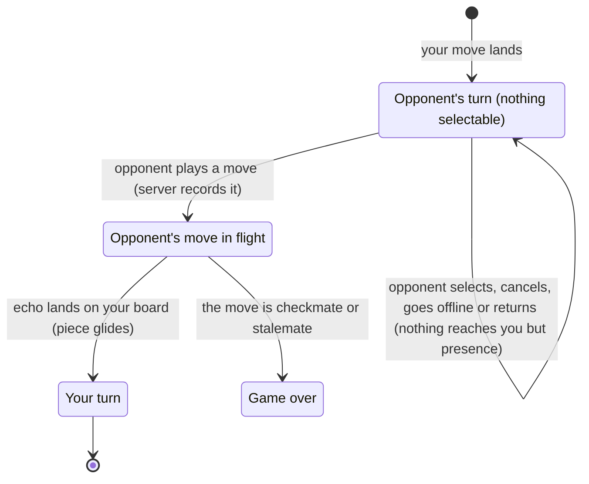

# The opponent's move

## Summary

Half of every game is waiting: after a player's move lands, the turn passes to the opponent, and the player can only watch until the opponent's move arrives and lands on their board. This document describes the opponent's turn as the player sees it: what the board allows while it is not their turn, what (little) they learn about the opponent meanwhile, and what happens on their board when the opponent's move arrives, including when it arrives while they are away, disconnected, or in another tab. It lives on the board screen and needs nothing from the player. It owns the opponent's turn up to the moment the player's own turn begins; the player's turn is [making a move](making-a-move.md).

## The simple case

The player has just moved; the turn indicator reads the opponent's color, for example "Black to move" for a White player. None of the player's pieces respond to a press. The player can turn the view, read the move list, and look at the position. Under the seat label, "Opponent: online" says the opponent is connected; nothing says whether they are thinking, selecting, or away from the keyboard.

Then, with no warning, the opponent's piece glides to its new cell. If it captured one of the player's pieces, that piece shrinks and fades. The teal trace moves to the opponent's two cells, the move list gains the move, and the turn indicator changes to the player's color. If the move put the player in check, the player's King glows red. It is now the player's turn.

## The interaction, event by event

### Begin

The opponent's turn begins on the player's board the moment the player's own move lands (or, for a player seated as Black, the moment the board screen first appears). From then on:

- the turn indicator names the opponent's color;
- none of the player's pieces can be selected, and a press on any piece or cell does nothing (there is no selection to clear);
- the board still [takes input](../foundations/input-model.md#when-the-board-takes-input) in the technical sense, so nothing about it looks disabled; there is simply nothing the player is allowed to pick up;
- the view can be turned, the move list scrolled, and an error dismissed.

There is no way to prepare a move in advance: no pre-move, no drawing arrows, no marking cells.

### End without sending

Everything the opponent does before playing a move stays on their side. Selecting a piece, changing their mind, cancelling a promotion, turning their view: none of it reaches the server, and the player sees nothing.

The one thing the player can learn is [presence](../foundations/connection-and-seat.md#presence): if the opponent's connection drops, or they reload, close the tab, or leave for the start screen, the line under the seat label changes to "Opponent: offline"; when they come back it changes to "Opponent: online". The game itself does not change. It stays the opponent's turn for as long as it takes: there is no clock, no time limit, no way for the player to claim the game, and no end short of the game expiring about 30 days after the last move.

### Send

The opponent plays a move by pressing a destination (or picking a piece in the [promotion dialog](promotion.md)). The server checks that it is the opponent's turn, records the move, and sends its echo to both players at the same moment. The move is permanent from the moment it is recorded, whether or not the player is connected to see it.

### While in flight

From the player's side, the move is in flight only for the time the echo takes to cross the network, a fraction of a second. There is no sign of it: the board, the turn indicator, and the move list do not change until the echo arrives.

If the player is not connected at this moment (reconnecting, replaced, or away from the game), the echo is not sent to them at all. The move waits in the record and reaches them in the snapshot the next time the page rejoins.

### The answer arrives

When the echo arrives, the player's board replays the record with the new move and draws the result, exactly as it does for the player's own moves:

- the opponent's piece [glides](../foundations/the-view.md#motion) from its origin to its destination in 300 ms, and a captured piece of the player's fades out under it; a promoting pawn arrives as its new piece;
- the teal [last-move trace](../glossary.md#selection-and-board-state) moves to the move's two cells;
- the [move list](../game-page/move-list.md) gains the move: a new row if the opponent is White, the second half of the last row if the opponent is Black;
- the turn indicator changes to the player's color, and the player's pieces become selectable: see [making a move](making-a-move.md);
- if the player is now in check, their King [glows red](check-and-game-end.md#check); if they are checkmated or stalemated, the [end-game dialog](check-and-game-end.md) appears.

There is no sound, no notification, and no change to the tab's title. A player looking elsewhere learns that it is their turn only by looking at the board.

How the move lands depends on when the player sees it:

| When the player sees the move | How it lands |
| --- | --- |
| Connected, tab visible | The echo arrives and the piece glides at once. |
| Connected, tab hidden | The echo arrives and the position updates, but nothing is drawn while the tab is hidden. When the player returns to the tab, the piece glides in from its origin. |
| Reconnecting when the move was made | The move arrives in the snapshot after the connection returns, and glides in, because this board had not shown it. |
| Replaced (another tab has the seat) | The move goes to the other tab. This tab sees it in the snapshot after "Play here", gliding in. |
| Away from the game (tab closed, reloaded, or on the start screen) | The move is simply in place when the player returns: the board is drawn with it, without a glide, with the teal trace on its cells. |

## Modifiers

"While in flight" here is the opponent's move on its way to the player.

| Modifier | At the start | Changes while in flight |
| --- | --- | --- |
| Your color | Decides the [orientation](../foundations/the-view.md#orientation): the opponent's pieces start at the top of the two farthest slices, and their moves come toward the player. A Black player starts the game waiting. | Cannot change. |
| Whose turn it is | The opponent's, by definition. The player cannot select anything. | Becomes the player's when the move lands. |
| How you reached the page | A player who returns to the game during the opponent's turn sees the same waiting board. A player who returns after the opponent moved finds it their turn, the move in place without a glide. | Not applicable. |
| Connection state | Connected: as described. Reconnecting or replaced: the player cannot see the move arrive; it comes in the next snapshot. | A drop just as the move is made: the move is recorded and comes in the snapshot. |
| Game state | In progress: as described. Frozen: the board no longer changes at all; see [the broken game record](../cross-cutting/broken-game-record.md). | The move can put the player in check, checkmate, or stalemate them. |
| Shift, Ctrl, or Cmd held | No effect. | No effect. |
| Input device | No effect: the player has nothing to do. | No effect. |

## Cancel and interrupt

"Before sending" is while the opponent is deciding; "while in flight" is while the opponent's move is on its way to the player's board.

| Event | Before sending | While in flight |
| --- | --- | --- |
| Escape or Cancel | No effect; there is nothing to cancel. | No effect. |
| Pressing elsewhere or turning the view | Presses on the board do nothing; the view turns freely. | The move lands in the view as it is, even mid-drag. |
| Leaving the game page within the app | The connection resets and the opponent sees "Opponent: offline". The opponent can still move; the player finds the move in place on returning. | Same; the echo is lost with the page, and the move is in the snapshot on return. |
| The game ends | Cannot happen before the opponent moves. | The opponent's move can checkmate or stalemate the player; the end-game dialog appears as the piece lands. |
| The server answers with an error | Errors answer only the player's own requests; none are pending during the opponent's turn. An error already showing stays. | No effect. |
| The connection drops | "Reconnecting…" appears; the presence line keeps showing its last value. A move the opponent makes meanwhile is recorded and arrives in the snapshot, gliding in. | Same: the echo is lost, and the move comes in the snapshot. |
| The window loses focus or the tab is hidden | No effect, and no notification when the move arrives. | The position updates in the background; the glide plays when the tab is shown again. |
| Reload or closing the tab | The opponent sees "Opponent: offline", and can still move. On return the player's board shows everything recorded meanwhile, without a glide. | Same. |
| The opponent acts | This row is the document's subject: presence changes appear under the seat label; the move itself lands as described above. | The move lands. |
| Another tab takes the seat | The other tab now receives the opponent's move; this tab shows the replaced dialog. | Same. |
| A second touch point or a cancelled touch | No effect; presses do nothing on the opponent's turn. | No effect. |

## Interactions with other systems

**Seat and turn.** The server refuses any move from the player while it is the opponent's turn, but the board never lets the player try.

**The game record.** The opponent's move is permanent once recorded, whether or not the player is watching. Every player's board is replayed from the same record, so the player always ends up with the same position, however and whenever the move reaches them.

**Connection.** The player needs no connection for the opponent to move; they need one to see the move. Moves missed while disconnected all arrive together in the next snapshot, and only the latest one glides.

**The opponent.** All the player learns about the opponent during their turn is presence, and presence says only whether a connection is open, not whether anyone is at the keyboard.

**Other tabs and devices.** Only the tab holding the player's seat receives the opponent's moves live.

**Game over.** The opponent's move can end the game. Otherwise the game has no way to end during the opponent's turn: no timeout, no abandonment, no resignation.

**Stored seat.** Lets the player close the tab during a long wait and come back to the game through the link.

**Keyboard, touch, and screen size.** Nothing to do from any device. On a small window the glide is small and easy to miss; the move list and the turn indicator are the lasting record.

## Edge cases

- **Several moves at once.** A player who returns after being disconnected across several moves (for example after leaving the tab reconnecting through an outage) receives them all in one snapshot; only the last one glides, and the others are simply in place.
- **A move landing on a hidden piece.** From the player's angle the moving piece or its destination may be hidden behind nearer pieces. The teal trace and the move list still show where the move went.
- **Moves in quick succession.** If the player's own move lands and the opponent answers within 300 ms, the second glide starts at once and the first piece jumps to its destination.
- **An opponent who never returns.** The game stays on the opponent's turn indefinitely. The player can only leave; the game expires about 30 days after it was last active.
- **The opponent's second tab.** If the opponent opens the game in another tab, the player sees "Opponent: online" again but never "offline"; the opponent's moves keep arriving from whichever tab holds the seat.
- **An illegal move from a modified client.** The server would record it. If the player's browser cannot replay it, the board freezes before it with a banner; if it can (an illegal but possible move), it is shown like any other. See [the broken game record](../cross-cutting/broken-game-record.md).

## Open questions and verification

- There is no notification of any kind (sound, title, browser notification) when the opponent moves; a player in another tab has no way to know. Whether one is wanted is a product call.
- An opponent who leaves for good leaves the game stuck on their turn with no way for the player to end it. By design (no resignation, no clock), but worth a product call.
- The glide on returning to a hidden tab is read from how the 3D scene pauses drawing and clamps a long frame; not observed in a real background tab.
- Moves while the opponent is disconnected, their arrival on rejoin, and presence are covered by `server/tests/test_local_ws.py` and `client/e2e/session.spec.ts`; animation on arrival versus on mount by `client/src/three/Board.test.tsx`.

Verified against 3D Chess commit `d94507b`
