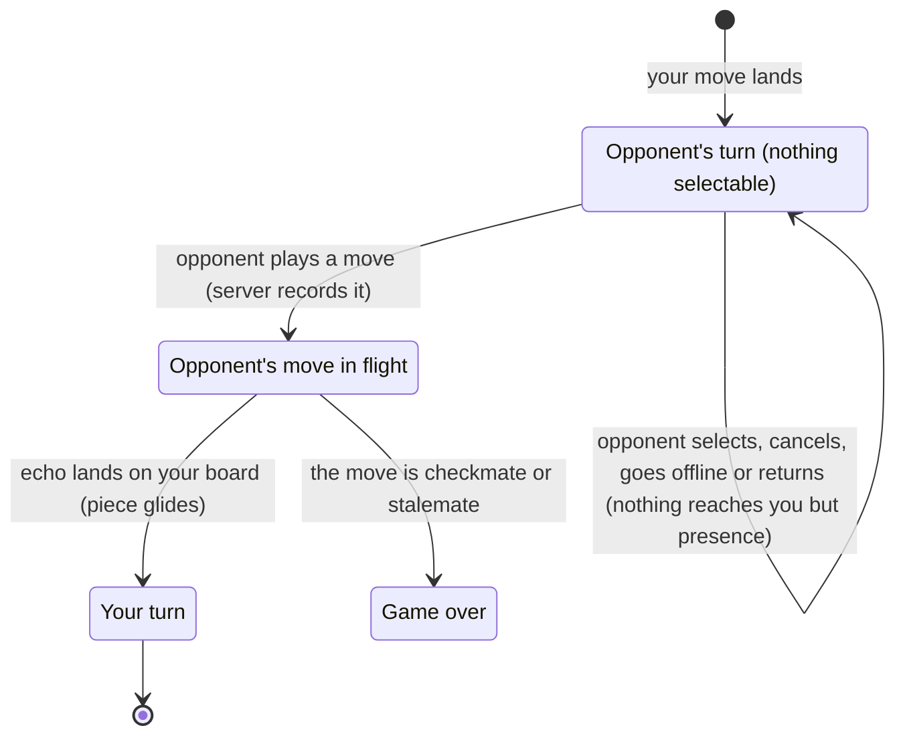

# The opponent's move

## Summary

Half of every game is waiting: after a player's move lands, the turn passes to the opponent, and the player can only watch until the opponent's move arrives and lands on their board. This document describes the opponent's turn as the player sees it: what the board allows while it is not their turn, what (little) they learn about the opponent meanwhile, and what happens on their board when the opponent's move arrives, including when it arrives while they are away, disconnected, or in another tab. It lives on the board screen and needs nothing from the player. It owns the opponent's turn up to the moment the player's own turn begins; the player's turn is [making a move](making-a-move.md).

## The simple case

The player has just moved; the turn pill lights the opponent's half, "Their move" beside their stone, and the player's half reads "You". None of the player's pieces respond to a press, and a move typed in the move box is answered "Wait for their move.". The player can turn the view, read the move list, and look at the position. While the opponent is connected the pill says nothing about it; nothing says whether they are thinking, selecting, or away from the keyboard.

Then, with no warning, the opponent's piece glides to its new cell. If it captured one of the player's pieces, that piece burns away as it arrives. The mint last-move line moves to the opponent's move, the move list gains the move (in the move card, if it is showing), and the light on the turn pill passes to the player's half: "Your move". If the move put the player in check, the player's King turns red and the pill rings the player's stone in red with "CHECK" beside it. It is now the player's turn.

## The interaction, event by event

```mermaid
stateDiagram-v2
    state "Opponent's turn (nothing selectable)" as waiting
    state "Opponent's move in flight" as flight
    state "Your turn" as yours
    state "Game over" as over
    [*] --> waiting : your move lands
    waiting --> waiting : opponent selects, cancels, goes offline or returns (nothing reaches you but presence)
    waiting --> flight : opponent plays a move (server records it)
    flight --> yours : echo lands on your board (piece glides)
    flight --> over : the move is checkmate or stalemate
    yours --> [*]
```

### Begin

The opponent's turn begins on the player's board the moment the player's own move lands (or, for a player seated as Black, the moment the board screen first appears). From then on:

- the turn pill lights the opponent's half, "Their move";
- none of the player's pieces can be selected, and a press on any piece or cell does nothing (there is no selection to clear);
- the board still [takes input](../foundations/input-model.md#when-the-board-takes-input) in the technical sense, so nothing about it looks disabled; there is simply nothing the player is allowed to pick up;
- the move box's field accepts text, but Enter or ↵ only answers "Wait for their move.";
- the view can be turned, the move list scrolled, and an error dismissed.

There is no way to prepare a move in advance: no pre-move, no drawing arrows, no marking cells. The nearest thing is typing a move into the move box's field; it is not sent, and is read against the position only when the player submits it on their own turn.

### End without sending

Everything the opponent does before playing a move stays on their side. Selecting a piece, changing their mind, cancelling a promotion, turning their view: none of it reaches the server, and the player sees nothing.

The one thing the player can learn is [presence](../foundations/connection-and-seat.md#presence): if the opponent's connection drops, or they reload, close the tab, or leave for the start screen, their stone on the turn pill becomes an outline and their half reads "Offline"; when they come back it returns to normal. The game itself does not change. It stays the opponent's turn for as long as it takes: there is no clock, no time limit, no way for the player to claim the game, and no end short of the game expiring about 30 days after the last move.

### Send

The opponent plays a move by pressing a destination, picking a piece in the [promotion dialog](promotion.md), or typing it in their move box. The server checks that it is the opponent's turn, records the move, and sends its echo to both players at the same moment. The move is permanent from the moment it is recorded, whether or not the player is connected to see it.

### While in flight

From the player's side, the move is in flight only for the time the echo takes to cross the network, a fraction of a second. There is no sign of it: the board, the turn indicator, and the move list do not change until the echo arrives.

If the player is not connected at this moment (reconnecting, replaced, or away from the game), the echo is not sent to them at all. The move waits in the record and reaches them in the snapshot the next time the page rejoins.

### The answer arrives

When the echo arrives, the player's board replays the record with the new move and draws the result, exactly as it does for the player's own moves:

- the opponent's piece [glides](../foundations/the-view.md#motion) from its origin to its destination in 460 ms, and a captured piece of the player's burns away as it arrives; a promoting pawn arrives as its new piece. If the player's system asks for reduced motion, there is no glide or fade: the position simply changes, and the teal trace shows what moved;
- the mint [last-move trace](../glossary.md#selection-and-board-state) moves to the new move;
- the [move list](../game-page/move-list.md) gains the move: a new row if the opponent is White, the second half of the last row if the opponent is Black;
- the light on the turn pill passes to the player's half ("Your move"), the player's pieces become selectable, and the move box can send: see [making a move](making-a-move.md);
- if the player is now in check, their King [turns red](check-and-game-end.md#check) and the turn pill shows "CHECK" beside their stone; if they are checkmated or stalemated, the end plays out on the board and the [end-game dialog](check-and-game-end.md) follows.

There is no sound, no notification, and no change to the tab's title. A player looking elsewhere learns that it is their turn only by looking at the board. A screen reader hears the move announcement: the move, then "Your move."

How the move lands depends on when the player sees it:

| When the player sees the move | How it lands |
| --- | --- |
| Connected, tab visible | The echo arrives and the piece glides at once (or, under reduced motion, simply appears on its new cell). |
| Connected, tab hidden | The echo arrives and the position updates, but nothing is drawn while the tab is hidden. When the player returns to the tab, the piece glides in from its origin. |
| Reconnecting when the move was made | The move arrives in the snapshot after the connection returns, and glides in, because this board had not shown it. The player's pieces become selectable only when that snapshot has arrived. |
| Replaced (another tab has the seat) | The move goes to the other tab. This tab sees it in the snapshot after "Play here", gliding in. A tab whose connection comes back while another tab holds the seat does not get the snapshot at all; it shows the replaced dialog. |
| Away from the game (tab closed, reloaded, or on the start screen) | The move is simply in place when the player returns: the board is drawn with it, without a glide, with the last-move line on it. |

## Modifiers

"While in flight" here is the opponent's move on its way to the player.

| Modifier | At the start | Changes while in flight |
| --- | --- | --- |
| Your color | Decides the [orientation](../foundations/the-view.md#orientation): the player's army starts in the two rows nearest them and the opponent's in the two farthest (White's at the bottom of the tower, Black's at the top), and the opponent's moves come toward the player. A Black player starts the game waiting. | Cannot change. |
| Whose turn it is | The opponent's, by definition. The player cannot select anything. | Becomes the player's when the move lands. |
| How you reached the page | A player who returns to the game during the opponent's turn sees the same waiting board. A player who returns after the opponent moved finds it their turn, the move in place without a glide. | Not applicable. |
| Connection state | Connected: as described. Reconnecting or replaced: the player cannot see the move arrive; it comes in the next snapshot (for a replaced tab, after "Play here"). | A drop just as the move is made: the move is recorded and comes in the snapshot. |
| Game state | In progress: as described. Frozen: the board no longer changes at all; see [the broken game record](../cross-cutting/broken-game-record.md). | The move can put the player in check, checkmate, or stalemate them. |
| Shift, Ctrl, or Cmd held | No effect. | No effect. |
| Input device | No effect: the player has nothing to do. With a keyboard, the player can type into the move box, but Enter only answers "Wait for their move.". | No effect. |

## Cancel and interrupt

"Before sending" is while the opponent is deciding; "while in flight" is while the opponent's move is on its way to the player's board.

| Event | Before sending | While in flight |
| --- | --- | --- |
| Escape or Cancel | No effect; there is nothing to cancel. | No effect. |
| Pressing elsewhere or turning the view | Presses on the board do nothing; the view turns freely. Text typed into the move box stays there and is not sent. | The move lands in the view as it is, even mid-drag. |
| Leaving the game page within the app | The connection resets and the opponent sees the player "Offline" on their turn pill. The opponent can still move; the player finds the move in place on returning. | Same; the echo is lost with the page, and the move is in the snapshot on return. |
| The game ends | Cannot happen before the opponent moves. | The opponent's move can checkmate or stalemate the player; the end-game dialog appears as the piece lands. |
| The server answers with an error | Errors answer only the player's own requests; none are pending during the opponent's turn. An error already showing stays. | No effect. |
| The connection drops | "Reconnecting…" appears; the turn pill keeps showing the opponent's last presence. A move the opponent makes meanwhile is recorded and arrives in the snapshot, gliding in. If the player has meanwhile opened the game in another tab, this tab does not take the seat back when its connection returns: it shows the replaced dialog, and the other tab receives the move. | Same: the echo is lost, and the move comes in the snapshot. |
| The window loses focus or the tab is hidden | No effect, and no notification when the move arrives. | The position updates in the background; the glide plays when the tab is shown again. |
| Reload or closing the tab | The opponent sees the player "Offline" on their turn pill, and can still move. On return the player's board shows everything recorded meanwhile, without a glide. | Same. |
| The opponent acts | This row is the document's subject: presence changes appear on the turn pill; the move itself lands as described above. | The move lands. |
| Another tab takes the seat | The other tab now receives the opponent's move; this tab shows the replaced dialog. | Same. |
| A second touch point or a cancelled touch | No effect; presses do nothing on the opponent's turn. | No effect. |

## Interactions with other systems

**Seat and turn.** The server refuses any move from the player while it is the opponent's turn, but the board never lets the player try.

**The game record.** The opponent's move is permanent once recorded, whether or not the player is watching. Every player's board is replayed from the same record, so the player always ends up with the same position, however and whenever the move reaches them.

**Connection.** The player needs no connection for the opponent to move; they need one to see the move. A move missed while disconnected arrives in the next snapshot and glides in; if several were missed (possible only for a replaced tab), only the latest glides.

**The opponent.** All the player learns about the opponent during their turn is presence, and presence says only whether a connection is open, not whether anyone is at the keyboard.

**Other tabs and devices.** Only the tab holding the player's seat receives the opponent's moves live. A tab that was offline when the player moved to another tab stays out of the game when its connection returns, and shows the replaced dialog instead of taking the seat back.

**Game over.** The opponent's move can end the game. Otherwise the game has no way to end during the opponent's turn: no timeout, no abandonment, no resignation.

**Stored seat.** Lets the player close the tab during a long wait and come back to the game through the link.

**Keyboard, touch, and screen size.** Nothing to do from any device. A screen reader hears the move announcement when the opponent's move lands. On a small window the glide is small and easy to miss; the move list (with Keyboard play on) and the turn pill are the lasting record.

## Edge cases

- **Several moves at once.** While a player is disconnected, at most one opponent move can be made (after it, it is the player's turn). Several can pile up only when this tab was [replaced](../session/second-tab.md) and the player went on playing in the other tab: after "Play here", this tab receives them all in one snapshot, the last one glides, and the others are simply in place.
- **A move landing on a hidden piece.** From the player's angle the moving piece or its destination may be hidden behind nearer pieces. The last-move line and the move list still show where the move went.
- **Moves in quick succession.** If the player's own move lands and the opponent answers within 460 ms, the second glide starts at once and the first piece jumps to its destination.
- **Reduced motion.** When the player's system asks for reduced motion, no move glides or burns away on their board; each move simply appears, with the last-move line on it. The setting is read each time the board is drawn, so changing it takes effect from the next move.
- **An opponent who never returns.** The game stays on the opponent's turn indefinitely. The player can only leave; the game expires about 30 days after it was last active.
- **The opponent's second tab.** If the opponent opens the game in another tab, the player never sees them go "Offline"; the opponent's moves keep arriving from whichever tab holds the seat.
- **An illegal move from a modified client.** The server would record it. If the player's browser cannot replay it, the board freezes before it with a banner; if it can (an illegal but possible move), it is shown like any other. See [the broken game record](../cross-cutting/broken-game-record.md).

## Open questions and verification

- There is no notification of any kind (sound, title, browser notification) when the opponent moves; a player in another tab has no way to know. Whether one is wanted is a product call.
- An opponent who leaves for good leaves the game stuck on their turn with no way for the player to end it. By design (no resignation, no clock), but worth a product call.
- The glide on returning to a hidden tab is read from how the 3D scene pauses drawing and clamps a long frame; not observed in a real background tab.
- Reduced motion is read from the system setting whenever the board is redrawn (`client/src/three/Board.tsx:131-132`, `client/src/three/motion.ts:22-25`), not watched for changes. Turning it on in the middle of a glide may end that glide early at the next redraw; not tried.
- Moves while the opponent is disconnected, their arrival on rejoin, and presence are covered by `server/tests/test_local_ws.py` and `client/e2e/session.spec.ts`; animation on arrival versus on mount, and its absence under reduced motion, by `client/src/three/Board.test.tsx`.

- The HUD wording in this document (the turn pill, presence as "Offline" on it, the move box behind Keyboard play or Tab, the dialogs as glass cards over a veil) was brought up to the new HUD from `client/src/screens/` and the [game page documents](../game-page/turn-indicator.md) at `bb16fed`, not checked in the running app, and needs re-verification.
- The board's look changed at `bb16fed` (the glass tower, the porcelain and charcoal pieces, the gold and red markers, the mint last-move line, the red King in check); this document's mentions of it were brought up to date from the code and [the view](../foundations/the-view.md), not checked in the running app, and need re-verification.

Verified against 3D Chess commit `4e18386`
