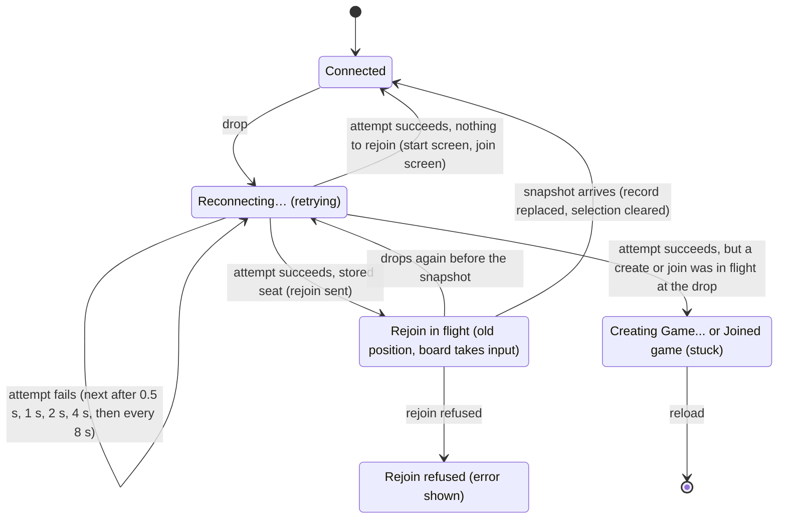

# Connection loss

## Summary

Connection loss is what the player experiences when the tab's [connection](../glossary.md#the-connection) to the server closes without the player asking, and how the page recovers by itself. Every cause looks the same on screen: the page shows "Reconnecting…" (or "Reconnecting to server…" on the start screen), the board stops taking input, everything else stays as it was, and the browser retries on its own, forever. When a retry succeeds, a page with a [stored seat](../foundations/connection-and-seat.md#the-stored-seat) sends a [rejoin](../glossary.md#the-connection), and the server's [snapshot](../glossary.md#requests) brings the page up to date, including anything the opponent did meanwhile. The request narrated here is that automatic reconnect-and-rejoin: it begins with the drop, is sent when a retry succeeds, and is answered by the snapshot. It happens on both pages and every screen, and the player takes no part in it. The model underneath (connection states, the [retry schedule](../foundations/connection-and-seat.md#connection-states), what is queued or dropped, rejoining, presence) is owned by [the connection and seat model](../foundations/connection-and-seat.md); this document describes what the player sees of it.

## The simple case

White has just played and is waiting for Black; the turn indicator reads "Black to move" and the line under the seat label reads "Opponent: online". White's Wi-Fi drops. An amber box reading "Reconnecting…" appears at the top right of the window. Nothing else changes: the pieces, the turn indicator, the move list, and "Opponent: online" all stay exactly as they were. Presses on the board do nothing, though the view still turns.

On Black's screen, once the server notices that White's connection is gone, the line under the seat label changes to "Opponent: offline". Black plays a move anyway. The server records it and sends the echo to Black alone.

A few seconds later White's network comes back. At the next attempt the amber box disappears, and a moment after that Black's move glides in on White's board: the teal trace moves to its cells, the move list gains it, and the turn indicator changes to "White to move". Black's screen changes to "Opponent: online". White never clicked anything, and nothing was lost.

## The interaction, event by event

### Begin

The request begins with the drop: the connection closes and the player did not close it. The causes are the network going away or changing, a laptop going to sleep, the server restarting or being redeployed, the [one-hour limit](../glossary.md#the-connection), and a fault on the server, which closes the connection with an internal-error code. The player cannot tell these apart, and neither can the page: all of them are handled identically.

One kind of close is not a drop. When another tab or window of the same browser takes the seat, the server closes this connection as [replaced](../glossary.md#events-that-end-or-interrupt-a-request); the page shows the replaced dialog and does not retry. That is described in [a second tab](second-tab.md). Returning to the start screen also closes the connection, on purpose; that is a [reset](../foundations/connection-and-seat.md#returning-to-the-start-screen), not a drop.

At the instant of the drop:

- the connection state becomes *reconnecting*, and the first attempt is scheduled for half a second later;
- anything the server was sending at that moment (an echo, a snapshot, an answer to a create or join) is lost, and the server never sends it again;
- nothing the page had already sent is sent again;
- [the board stops taking input](../foundations/input-model.md#when-the-board-takes-input): a selection is cleared with its markers, and an open [promotion dialog](../play/promotion.md) closes without sending and does not come back;
- a board that was [held](../glossary.md#selection-and-board-state) for a move in flight stays unable to take input, now for both reasons.

Nothing else on the page changes. The position, the turn indicator, the [move list](../game-page/move-list.md), the seat label, and the presence line keep their last values, and the move list can still be scrolled. The presence line may now be wrong, since nothing can update it until the page rejoins. An error in the [error banner](../game-page/error-banner.md) stays and can still be dismissed; the [frozen-board banner](../cross-cutting/broken-game-record.md) and the [end-game dialog](../play/check-and-game-end.md) stay too, with "Reconnecting…" drawn above the dialog. The view can be turned as usual.

What the player sees depends on the screen:

| Screen | During the drop | When an attempt succeeds |
| --- | --- | --- |
| Start screen | The gray line "Reconnecting to server…" under the button. The button still works; a click is [queued](../glossary.md#requests) and the button reads "Creating Game...". | The line disappears. A queued click is sent. There is no seat, so no rejoin. A create that was in flight at the drop leaves the button at "Creating Game..." for good; see [creating a game](../start/creating-a-game.md#cancel-and-interrupt). |
| Join screen | The amber "Reconnecting…" box at the top right. "Join Game" still works; a click is queued and the page shows "Joined game, waiting for start..." at once. | The box disappears. A queued join is sent. Nothing else: a visitor has nothing to rejoin. |
| Share-link screen | The amber box at the top right, with "Game created! Share this link with a friend:" unchanged. The link stays valid; the opponent can open it and join meanwhile. | The page rejoins. The snapshot keeps the share-link screen, or, if the opponent joined meanwhile, the board screen appears. |
| Joined screen | The amber box at the top right, with "Joined game, waiting for start..." unchanged. | If the server had confirmed the seat before the drop, the page rejoins and the board screen appears. If the join was still in flight, the page has no seat to rejoin with and stays on "Joined game, waiting for start..." for good; see [joining a game](../start/joining-a-game.md). |
| Board screen | The amber box at the top right; the board does not take input; everything else as it was. | The board takes input again at once; the page rejoins; the snapshot brings the position up to date. |

From here the browser retries on the [retry schedule](../foundations/connection-and-seat.md#connection-states): 0.5 s, 1 s, 2 s, 4 s, then 8 s between attempts, for as long as it takes. Each failed attempt looks like nothing at all; the banner simply stays. There is no attempt limit, no message saying the server seems to be down, and no button to retry sooner. Once the outage has lasted about seven and a half seconds, attempts come 8 s apart, so the page can take up to 8 s to notice that the network or the server is back.

On the server, the drop changes nothing that lasts: the seat stays taken and the [move record](../glossary.md#games-and-seats) is untouched. When the server notices that the connection is gone, it tells the opponent, whose presence line changes to "Opponent: offline". The opponent can go on playing; see [the opponent acts](#cancel-and-interrupt) below.

### End without sending

The recovery cannot be cancelled: there is no control for it and Escape does nothing. It ends without a rejoin in these cases:

- **There is no seat to rejoin with.** On the start screen, the join screen, and a joined screen whose join answer was lost, a successful attempt simply opens the connection. The status line or the amber box disappears, and nothing is sent except a queued create or join. On the start screen, "Reconnecting to server…" just clears.
- **The player leaves.** Browser Back or "Start new game" goes to the start screen, which resets the connection: the retry loop is abandoned and a fresh connection is attempted at once, so the start screen shows "Connecting to server…", then "Reconnecting to server…" if the network is still down. Reload, closing the tab, or typing another address ends the loop with the page; see [reloading and returning](reload-and-return.md).

In every case nothing is recorded. The drop itself records nothing on the server, and the stored seat is kept, so opening the game's link later rejoins as usual.

### Send

The request is sent when an attempt succeeds. At that instant:

- the connection state becomes *connected*, and the amber box (or the start screen's status line) disappears;
- the retry schedule starts over, so a later drop begins again at half a second;
- any create or join that was queued during the drop is sent, in order;
- a move that was still waiting to be sent is [dropped](../glossary.md#requests); this can only be a move made in the instant the connection was closing, and the board never showed it;
- a held board is released: the move it was waiting for was either recorded before the drop or lost, and waiting longer would not tell which.

Immediately after, the page sends one rejoin naming the game and the stored seat's color, provided the page has a stored seat and nothing on this connection has given it a seat yet. On a fresh connection nothing has, so every successful attempt on a game page with a stored seat sends exactly one rejoin; see [rejoining](../foundations/connection-and-seat.md#rejoining).

The server, on receiving it, checks that the game exists and that the color holds a seat, ties this connection to that seat, and answers with the snapshot. If the server still holds the player's old connection (it has not yet noticed that it died), the new one takes its place by [last connection wins](../foundations/connection-and-seat.md#last-connection-wins); the old connection is closed as replaced, which reaches nobody, since the page abandoned it at the drop. The server then tells this player whether the opponent is connected and tells the opponent that this player is online.

What happened to each request that was under way at the drop:

- **A move in flight** may or may not have been recorded. The board is released now, and the snapshot shows which.
- **A move not yet sent** is dropped, as above.
- **A create or join in flight** is not re-sent and its answer never comes: the screen is stuck until reload, as in the table above.
- **A queued create, join, or rejoin** is sent now.
- **A rejoin in flight** from an earlier attempt is replaced by this connection's own rejoin.

### While in flight

From sending the rejoin until the snapshot arrives, the page still shows everything as it was before the drop, and the amber box is already gone. Nothing on screen says that the page is still catching up. This lasts one round trip to the server, normally a fraction of a second.

On the board screen, the board takes input during this moment, against the position it showed before the drop. The player can select a piece; the snapshot will clear the selection. A promotion dialog opened now will be closed by the snapshot. A move pressed now is sent, and one of three things happens:

- If nothing was recorded during the drop, the position is the server's too, and the move is played normally.
- If the player's own move was in flight at the drop and the server recorded it, the new move is refused: the snapshot arrives first and the earlier move glides in, and then the error banner shows "Error: Not your turn".
- If the player's earlier move was recorded *and* the opponent answered it during the drop, it is the player's turn on the server too, and the new move is recorded, although it was chosen against a position two moves old. This looks like a bug; see the edge cases.

On the share-link and joined screens there is nothing to press.

If the new connection drops again before the snapshot arrives, the page is back in *reconnecting*, and the next successful attempt sends a fresh rejoin.

### The answer arrives

**The snapshot.** It replaces everything the page knew about the move record, so a move is never counted twice. What changes on screen depends on what happened during the drop:

- **Nothing new.** The position is redrawn identical, and nothing moves. A selection made while the rejoin was in flight is still cleared, and a promotion dialog opened then closes, because the board is replaced even when nothing changed. The move list is unchanged and keeps its scroll position.
- **New moves.** The position jumps to the latest one. The last move [glides](../foundations/the-view.md#motion) in, with any capture fading, because this board has not shown it; earlier moves missed during the drop are simply in place. The teal trace moves to the last move's cells, the move list gains the new moves and scrolls to the newest, the turn indicator updates, a king in check glows red, and if the game ended meanwhile the end-game dialog appears as the last piece lands.
- **The player's own move from before the drop.** If the server recorded it, it appears now: it glides in and it is the opponent's turn, or, if the opponent has already answered it, the answer glides and the player's own move is simply in place. If the server did not record it, the position is unchanged and it is still the player's turn; the player moves again.
- **Before the game started.** On the share-link screen, the snapshot says whether the opponent has joined. If not, the screen stays. If so, the board screen appears, with the position drawn as it is, without any glide, even if the opponent has already moved.

Right after the snapshot, the server's presence message arrives and the presence line shows the truth again: "Opponent: online" or "Opponent: offline". On the opponent's screen, "Opponent: online" appears at the same moment. An error that was showing before the drop is still showing; the snapshot neither clears nor adds errors.

**A refusal.** The server refuses a rejoin only if the game no longer exists ("Cannot rejoin") or the seat was never taken ("No such seat to rejoin"). A drop causes neither; after a drop, a refusal means the game has vanished from the server, for example by [expiry](../glossary.md#games-and-seats). The error banner shows it. After a mid-game drop the page has already had a snapshot or seen the game start, so the stored seat is kept and the page stays where it was; but the connection now holds no seat, so every move the player then makes is refused with "Error: Not in a game" until the page is reloaded. The messages are listed in [error messages](../cross-cutting/error-messages.md).

## Modifiers

"At the start" is the moment of the drop; "changes while in flight" covers anything that changes while the page is reconnecting or its rejoin is in flight.

| Modifier | At the start | Changes while in flight |
| --- | --- | --- |
| Your color | No effect. The rejoin names the stored seat's color; nothing about the drop depends on it. | Cannot change. |
| Whose turn it is | On the player's turn, a selection or promotion dialog is lost and a move in flight is settled by the snapshot. On the opponent's turn, the player loses nothing; the opponent can move meanwhile. | The opponent can move during the drop, or while the rejoin is in flight. Either the move is in the snapshot or its echo follows the snapshot; either way it glides in. |
| How you reached the page | Creator, joiner, and returning player all have a stored seat and rejoin after the drop. A visitor has nothing to rejoin; a queued join is sent. A creator arriving from the start screen rejoins too: the new connection does not carry the seat the old one had. | Not applicable. |
| Connection state | Connected: as described. Connecting: a first attempt that fails enters *reconnecting* exactly as a drop does (a page loaded during an outage is described in [reloading and returning](reload-and-return.md)). Replaced: no drop can happen, since the connection is already closed; a "Play here" whose attempt fails enters *reconnecting* like a drop. | A drop of the new connection before the snapshot returns to *reconnecting*; the next connection sends its own rejoin. |
| Game state | In progress or in check: as described. Over: the end-game dialog stays, "Reconnecting…" shows above it, and the snapshot changes nothing. Frozen: the board does not take input before, during, or after the drop, and the banner stays. | The game can end during the drop through the opponent's move; the snapshot shows the mating move gliding in and the end-game dialog. |
| Shift, Ctrl, or Cmd held | No effect. | No effect. |
| Input device | No effect. There is nothing to click, tap, or type: the recovery is automatic. | No effect. |

## Cancel and interrupt

"Before sending" is while the page is reconnecting, before the new connection's rejoin is sent; "while in flight" is while the rejoin awaits the snapshot.

| Event | Before sending | While in flight |
| --- | --- | --- |
| Escape or Cancel | No effect. There is nothing to cancel; the promotion dialog closed at the drop. | No effect on the rejoin. A promotion dialog opened in this moment can be cancelled as usual; the snapshot closes it anyway. |
| Pressing elsewhere or turning the view | Presses on the board do nothing; the view turns; the move list scrolls; an error can be dismissed. On the join screen, "Join Game" can be clicked and is queued. | The board takes input against the old position: a press can select, and a move can be sent (see [While in flight](#while-in-flight)). The snapshot clears any selection. |
| Leaving the game page within the app | Back or "Start new game" resets the connection: the retry loop is abandoned and the start screen tries a fresh connection at once. The opponent already sees, or will see, "Opponent: offline". Going Forward to the game again before a connection has opened sends the rejoin twice when one does, and the second is refused with "Error: Already in a game"; see the edge cases. | The same. If the server processed the rejoin, the opponent sees "Opponent: online" and then "Opponent: offline" again. |
| The game ends | Cannot end on this page while it is disconnected. The opponent's move can end it on the server; the page learns of it from the snapshot. | The snapshot shows the final move gliding in and the end-game dialog. |
| The server answers with an error | No request is pending. An error already showing stays. | The rejoin can be refused; see [The answer arrives](#the-answer-arrives). A move sent in this moment can be refused with "Not your turn". |
| The connection drops | This is the state being described. A failed attempt schedules the next; nothing changes on screen. | Back to "Reconnecting…"; the next connection sends a new rejoin. |
| The window loses focus or the tab is hidden | The retry loop goes on in the background. Browsers may run a hidden tab's timers late, so attempts there may come later than the schedule says. | The snapshot is handled in the background; a newly arrived last move glides in when the tab is shown again. |
| Reload or closing the tab | The loop ends with the page. A reload starts a fresh page that rejoins once its connection opens; closing leaves the seat unconnected until the player returns. The stored seat is kept. | The same. If the server processed the rejoin, the opponent sees "Opponent: online" and then "Opponent: offline" again. |
| The opponent acts | The opponent sees "Opponent: offline" once the server notices the drop. On their turn they can move; the move is recorded and reaches this page in the snapshot. They can also join a game whose share-link screen this page is showing. Their going offline or returning is not shown here until the page rejoins. | A move the opponent makes now is in the snapshot or follows it as an echo, and glides in either way. |
| Another tab takes the seat | This tab cannot be told: it has no connection. When its attempt succeeds it rejoins and takes the seat back, and the other tab shows the replaced dialog. See [a second tab](second-tab.md). | The same: whichever tab's rejoin reaches the server last holds the seat. |
| A second touch point or a cancelled touch | No effect; the board does not take input. | As for any press while the board takes input; see [the input model](../foundations/input-model.md#a-press-acts-at-once). |

After any interrupt the page is either reconnecting, caught up by a snapshot, or gone. Nothing the player does during the drop reaches the server except a queued create or join, which is sent when a connection opens.

## Interactions with other systems

**Seat and turn.** The seat stays taken while its player is disconnected, so nobody else can take it: a join only ever claims a free seat, and once both are taken it is refused with "Game full". The drop does not pass the turn and starts no clock. If it is the opponent's turn, they can move while the player is away; if it is the player's turn, the game simply waits.

**The game record.** Nothing is lost from the record and nothing is added by the drop. Every move recorded meanwhile arrives in the snapshot, which replaces the page's copy, so nothing is counted twice. A move in flight at the drop is either recorded or not, never both; the page never sends it again.

**Connection.** This document's subject. The states, the schedule, and the rules for queued and dropped requests are in [the connection and seat model](../foundations/connection-and-seat.md#connection-states).

**The opponent.** Sees "Opponent: offline" once the server notices the drop and "Opponent: online" when the player rejoins. Nothing tells them that the player is reconnecting rather than gone. If the server does not notice the drop before the player's new connection rejoins, the opponent sees no change at all. The opponent's own page is unaffected unless the cause (a server restart, say) drops them too.

**Other tabs and devices.** Each tab has its own connection and its own retry loop, so a drop in one tab does not touch another, though a network outage or server restart drops them all at once. Two tabs of the same browser on the same game both rejoin when they reconnect, and the later one holds the seat. Another browser or device has no stored seat and cannot take the seat.

**Game over.** A finished game drops and rejoins like any other; the end-game dialog stays throughout, with "Reconnecting…" above it, and the snapshot changes nothing. "Start new game" works while disconnected. A game can also end during the drop, in which case the snapshot shows it.

**Stored seat.** The rejoin is made from it. A mid-game drop never deletes it: it is deleted only when a rejoin is refused before this page has had any snapshot and before the game has started on it. After a drop that can only happen on a page that has never had either (a creator who came straight from the start screen and is still on the share-link screen, or a joiner whose start notice was lost to the drop), and only if the game has vanished from the server. The page then shows the join screen and the refusal.

**Keyboard, touch, and screen size.** There is nothing to do from any device: no retry control to reach. The amber box and the start screen's line are marked as status messages for assistive technology; see [accessibility](../cross-cutting/accessibility.md). On a phone-width window the amber box, at the top right, can overlap the centered turn indicator and is drawn over it; see [screen sizes and touch](../cross-cutting/screen-sizes-and-touch.md). What a phone or tablet does to the connection when the browser is sent to the background or the screen locks was not checked; see open questions.

## Edge cases

- **A server restart or redeploy.** Both players drop at the same moment and neither sees the other go offline. Whoever gets back first is told "Opponent: offline" until the other rejoins a moment later.
- **The one-hour limit.** Each connection has its own hour, counted from when it opened, so in a long game each player sees a brief "Reconnecting…", about half a second on a good network, at a different time. The opponent sees "Opponent: offline" and then "Opponent: online" in quick succession.
- **A server fault.** When the server hits an error it did not expect, it closes the connection with an internal-error code. The page retries it like any drop and rejoins. The request that caused the fault is not sent again; if it was a move, the snapshot shows whether it was recorded.
- **A fault that happens on every rejoin.** If the server fails each time it handles this player's rejoin (for example, while its game storage is failing), each attempt opens, rejoins, and is closed again. Because the schedule starts over whenever a connection opens, the page then retries every half second indefinitely: "Reconnecting…" flickers on and off, the board briefly takes input between attempts, and the opponent may see the player flap between online and offline. Read from code; see open questions.
- **Laptop sleep.** A sleeping computer runs nothing. After it wakes, the browser may still believe the old connection is open until it notices otherwise, and until then the page shows no "Reconnecting…" and the board takes input. A move made in that state is held until the browser reports the drop, and is then settled by the snapshot like any move in flight; if the connection was in fact dead, the server never received it and it is still the player's turn. How long the browser takes to notice was not determined.
- **A background tab.** A drop in a hidden tab is handled the same way, but the browser may run its retry timers late, so the tab may take longer to reconnect than the schedule says. Moves that arrived meanwhile glide in when the tab is shown.
- **Two moves missed.** At most two moves can be new to the board after a drop: the player's own move, recorded but not echoed, and the opponent's reply. Only the last one glides; the other is in place. The move list shows both.
- **The same position, a new board.** A snapshot identical to what the board showed still clears the selection and closes a promotion dialog opened after the connection returned.
- **A move chosen against an old position.** If the player's move was recorded but its echo was lost to the drop, and the opponent then answered during the drop, the board comes back (for one round trip, until the snapshot) showing the position before the player's own move, and it is the player's turn both on that board and on the server. A move pressed in that moment is recorded against a position two moves newer than the one the player chose it on. The server does not check legality, so both browsers then replay it against the real position: if its piece has moved away, the record can no longer be replayed and both boards [freeze](../cross-cutting/broken-game-record.md); if not, a move that may be illegal in the real position is played. It needs two presses within a round trip, so it is rare. This looks like a bug; see open questions.
- **A move sent before the snapshot, then the snapshot.** The snapshot also releases the hold on any move sent while the rejoin was in flight, a moment before that move's echo arrives.
- **The opponent joins during the drop.** A creator on the share-link screen sees the board appear when the snapshot arrives, with no glide even for a move the joiner has already made. The joiner saw "Opponent: offline" from the start and sees "Opponent: online" when the creator returns.
- **A lost join.** A join whose answer was lost to the drop leaves the joined screen up indefinitely. If the server had claimed the seat, the game has started without this page: the creator's board appears, with "Opponent: online" until the server notices the joiner's connection is gone and "Opponent: offline" after, and after a reload this browser has no stored seat, so "Join Game" is refused with "Game full". The seat is lost for good. See [joining a game](../start/joining-a-game.md).
- **Storage disabled.** A page that could not store its seat still rejoins after a drop once the server has confirmed the seat on this page (a joiner's seat confirmation, or the start announcement), because the page remembers it for as long as it is open. A creator whose game has not started yet has no such confirmation, so after a drop that page has nothing to rejoin with. See [creating a game](../start/creating-a-game.md#edge-cases).
- **Back and Forward during an outage.** A player who goes Back to the start screen while the network is down, and then Forward to the game before any connection has opened, gets the game page back with its rejoin queued. When a connection opens, the queued rejoin is sent and then the page sends that connection's own rejoin as well; the server answers the first with the snapshot and the second with "Error: Already in a game", which shows in the error banner over an otherwise normal game. See [waiting for an opponent](../start/waiting-for-an-opponent.md#open-questions-and-verification).
- **A second tab reconnecting.** If the player has two tabs on the same game and one is reconnecting while they click "Play here" in the other, the reconnecting tab rejoins as soon as its attempt succeeds and takes the seat back, and the tab they chose shows the replaced dialog again.

## Open questions and verification

- The board takes input as soon as the new connection opens, one round trip before the snapshot (`client/src/screens/GameScreen.tsx:72-81`: the hold is keyed to the connection and nothing waits for the snapshot). Combined with the server recording any in-turn move (`server/modal_app.py:160-178`) and the replay not checking legality (`client/src/engine/board.ts:152-180`), a move made in that moment after a lost echo and an opponent reply is recorded against a position the player never saw, and can freeze both boards or record an illegal move. This looks like a bug; keeping the board from taking input until the snapshot arrives would close it. Read from code; not reproduced.
- The retry schedule starts over whenever a connection opens (`client/src/hooks/useGameSocket.ts:110`), not when the page is back in its game. A server fault that recurs on every rejoin (`server/modal_app.py:409-418`) therefore retries every half second forever, flickering "Reconnecting…" and the opponent's presence line. May be worth treating as a bug. Read from code.
- A join in flight at the drop leaves "Joined game, waiting for start..." up for good (`client/src/screens/GameScreen.tsx:116-124` resets the joined screen only on "Cannot join" or "Game full", and `:95-101` rejoins only with a stored seat); if the server claimed the seat, the seat is lost. The create equivalent is in [creating a game](../start/creating-a-game.md#open-questions-and-verification) (`client/src/screens/StartScreen.tsx:28`). Both look like bugs.
- A rejoin the page sends while no connection is open is queued (`client/src/hooks/useGameSocket.ts:73-81`), and the next connection then gets both the queued rejoin and its own (`client/src/screens/GameScreen.tsx:95-101`, which checks only whether an answer has arrived yet); the second is refused with "Error: Already in a game". This happens on Back then Forward during an outage (the reset keeps the old connection's number, `useGameSocket.ts:89-98`, so the returning page sends at once), and, much less likely, when a new connection closes again in the instant between opening and the page's rejoin. The error is harmless but confusing. Read from code; not reproduced.
- The page has no heartbeat of its own: it learns of a drop only when the browser reports the connection closed. How long browsers take to notice a dead connection after a laptop wakes, or when a network silently stops passing traffic, was not measured; during that time the page shows nothing wrong. Likewise, how long the server takes to notice a vanished connection (and so when the opponent sees "Opponent: offline") is a property of the deployment and was not measured.
- How long a single failed attempt takes depends on the browser and the network, and the schedule counts from each failure, so real gaps can be longer than 0.5, 1, 2, 4, and 8 s. How much a browser delays retries in a hidden tab was not measured.
- Whether the one-hour limit closes the connection in a way that lets the server announce "Opponent: offline" (the server's clean-up running), and whether a redeploy closes every connection at once or lets connections on the previous server live on until they end (in which case two players could briefly be on different servers and not see each other's moves or presence until one reconnects), are properties of the deployment and were not determined.
- The reconnecting tab taking the seat back from a tab where the player just clicked "Play here" follows from last connection wins; whether that is the wanted behavior is a product call.
- Whether screen readers announce "Reconnecting…" when it appears was not checked; see accessibility. The overlap with the turn indicator on a narrow window is read from the layout, not seen. Whether a phone or tablet keeps the connection open when the browser goes to the background or the screen locks, or drops it and reconnects on return, was not tried.
- A local server keeps games in memory, so restarting it to imitate a server restart loses the game and the rejoin is refused with "Cannot rejoin". Production keeps games across restarts; verify the restart case against a server that keeps its games, or by stopping and starting the network instead.
- The retry, the dropped move, the session change, and the replaced exception are covered by `client/src/hooks/useGameSocket.test.ts`; the rejoin after a reconnect, the reconnecting notice, the released hold, the closed promotion dialog, and the snapshot not double-counting moves by `client/src/App.test.tsx`; presence on leaving and returning, moves while a player is away, and the internal-error close by `server/tests/test_local_ws.py`. No end-to-end test drops a connection mid-game; nothing in this document was tried in a browser.

Verified against 3D Chess commit `d94507b`
