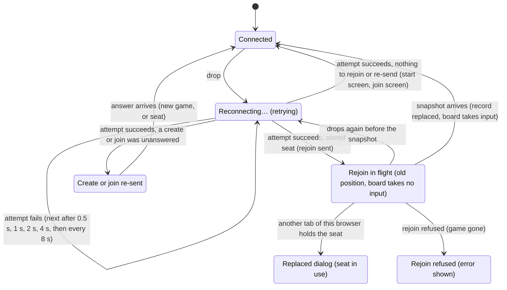

# Connection loss

## Summary

Connection loss is what the player experiences when the tab's [connection](../glossary.md#the-connection) to the server closes without the player asking, and how the page recovers by itself. Every cause looks the same on screen: the page shows "Reconnecting…" (or "Reconnecting to server…" on the start screen), the board stops taking input, everything else stays as it was, and the browser retries on its own, forever. When a retry succeeds, a page with a [stored seat](../foundations/connection-and-seat.md#the-stored-seat) sends a [rejoin](../glossary.md#the-connection), and the server's [snapshot](../glossary.md#requests) brings the page up to date, including anything the opponent did meanwhile; the board takes input again only once the snapshot has arrived. The rejoin does not [take over](../glossary.md#the-connection) the seat: if the player has moved to another tab of this browser in the meantime, the page shows the replaced dialog instead of taking the seat back. A create or join whose answer was lost is [re-sent](../glossary.md#requests). The request narrated here is that automatic reconnect-and-rejoin: it begins with the drop, is sent when a retry succeeds, and is answered by the snapshot. It happens on both pages and every screen, and the player takes no part in it. The model underneath (connection states, the [retry schedule](../foundations/connection-and-seat.md#connection-states), what is queued or dropped, rejoining, presence) is owned by [the connection and seat model](../foundations/connection-and-seat.md); this document describes what the player sees of it.

## The simple case

White has just played and is waiting for Black; the turn indicator reads "Black to move" and the line under the seat label reads "Opponent: online". White's Wi-Fi drops. An amber box reading "Reconnecting…" appears at the top right of the window. Nothing else changes: the pieces, the turn indicator, the move list, and "Opponent: online" all stay exactly as they were. Presses on the board do nothing, though the view still turns.

On Black's screen, once the server notices that White's connection is gone, the line under the seat label changes to "Opponent: offline". Black plays a move anyway. The server records it and sends the echo to Black alone.

A few seconds later White's network comes back. At the next attempt the amber box disappears, and a moment after that Black's move glides in on White's board: the teal trace moves to its cells, the move list gains it, and the turn indicator changes to "White to move". From that moment White's board takes input again. Black's screen changes to "Opponent: online". White never clicked anything, and nothing was lost.

## The interaction, event by event

### Begin

The request begins with the drop: the connection closes and the player did not close it. The causes are the network going away or changing, a laptop going to sleep, the server restarting or being redeployed, the [one-hour limit](../glossary.md#the-connection), and a fault on the server, which closes the connection with an internal-error code. The player cannot tell these apart, and neither can the page: all of them are handled identically.

One kind of close is not a drop. When another tab or window of the same browser takes the seat, the server closes this connection as [replaced](../glossary.md#events-that-end-or-interrupt-a-request); the page shows the replaced dialog and does not retry. That is described in [a second tab](second-tab.md). Returning to the start screen, or jumping through history to another game's page, also closes the connection, on purpose; that is a [reset](../foundations/connection-and-seat.md#returning-to-the-start-screen), not a drop.

At the instant of the drop:

- the connection state becomes *reconnecting*, and the first attempt is scheduled for half a second later;
- anything the server was sending at that moment (an echo, a snapshot, an answer to a create or join) is lost, and the server never sends it again;
- nothing the page had already sent is sent again yet; a create or join whose answer has not arrived will be re-sent when a connection opens;
- [the board stops taking input](../foundations/input-model.md#when-the-board-takes-input): a selection is cleared with its markers, an open [promotion dialog](../play/promotion.md) closes without sending and does not come back, and the move box's "Move" button is disabled;
- a board that was [held](../glossary.md#selection-and-board-state) for a move in flight stays unable to take input, now for both reasons.

Nothing else on the page changes. The position, the turn indicator, the [move list](../game-page/move-list.md), the seat label, and the presence line keep their last values, and the move list can still be scrolled. The presence line may now be wrong, since nothing can update it until the page rejoins. An error in the [error banner](../game-page/error-banner.md) stays and can still be dismissed; the [frozen-board banner](../cross-cutting/broken-game-record.md) and the [end-game dialog](../play/check-and-game-end.md) stay too. While the end-game dialog is up, the board and the whole HUD behind it, "Reconnecting…" included, are out of reach but still visible through its backdrop. The view can be turned as usual when no dialog covers it.

What the player sees depends on the screen:

| Screen | During the drop | When an attempt succeeds |
| --- | --- | --- |
| Start screen | The gray line "Reconnecting to server…" under the button. The button still works; a click is [queued](../glossary.md#requests) and the button reads "Creating Game...". | The line disappears. A queued click is sent. A create that was in flight at the drop is sent again, and its answer takes the player to the new game; see [creating a game](../start/creating-a-game.md#cancel-and-interrupt). There is no seat, so no rejoin. |
| Join screen | The amber "Reconnecting…" box at the top right. "Join Game" still works; a click is queued and the page shows "Joined game, waiting for start..." at once. | The box disappears. A queued join is sent. Nothing else: a visitor has nothing to rejoin. |
| Share-link screen | The amber box at the top right, with "Game created! Share this link with a friend:", the link, and "Copy link" unchanged. The link stays valid; the opponent can open it and join meanwhile. | The page rejoins. The snapshot keeps the share-link screen, or, if the opponent joined meanwhile, the board screen appears. |
| Joined screen | The amber box at the top right, with "Joined game, waiting for start..." unchanged. | If the server had confirmed the seat before the drop, the page rejoins and the board screen appears. If the join was still in flight, the page sends the join again; the server hands back the seat it had already claimed for this tab (or claims it now, if the first join never arrived), and the board screen appears. See [joining a game](../start/joining-a-game.md). |
| Board screen | The amber box at the top right; the board does not take input; everything else as it was. | The box disappears; the page rejoins; the board takes input again when the snapshot has brought the position up to date. |

From here the browser retries on the [retry schedule](../foundations/connection-and-seat.md#connection-states): 0.5 s, 1 s, 2 s, 4 s, then 8 s between attempts, for as long as it takes. Each failed attempt looks like nothing at all; the banner simply stays. There is no attempt limit, no message saying the server seems to be down, and no button to retry sooner. Once the outage has lasted about seven and a half seconds, attempts come 8 s apart, so the page can take up to 8 s to notice that the network or the server is back.

On the server, the drop changes nothing that lasts: the seat stays taken and the [move record](../glossary.md#games-and-seats) is untouched. When the server notices that the connection is gone, it tells the opponent, whose presence line changes to "Opponent: offline". The opponent can go on playing; see [the opponent acts](#cancel-and-interrupt) below.

### End without sending

The recovery cannot be cancelled: there is no control for it and Escape does nothing. It ends without a rejoin in these cases:

- **There is no seat to rejoin with.** On the start screen, the join screen, and a joined screen whose join answer was lost, a successful attempt simply opens the connection. The status line or the amber box disappears, and nothing is sent except a queued create or join, or a create or join re-sent because its answer was lost. On the start screen with nothing pending, "Reconnecting to server…" just clears.
- **The player leaves.** Browser Back or "Start new game" goes to the start screen, which resets the connection: the retry loop is abandoned and a fresh connection is attempted at once, so the start screen shows "Connecting to server…", then "Reconnecting to server…" if the network is still down. Reload, closing the tab, or typing another address ends the loop with the page; see [reloading and returning](reload-and-return.md).

In every case nothing is recorded by the rejoin that was not sent. The drop itself records nothing on the server, and the stored seat is kept, so opening the game's link later rejoins as usual.

### Send

The request is sent when an attempt succeeds. At that instant:

- the connection state becomes *connected*, and the amber box (or the start screen's status line) disappears;
- the retry schedule starts over, so a later drop begins again at half a second;
- any create or join that was queued during the drop is sent, in order;
- a create or join that had been sent before the drop and never answered is sent again;
- a move that was still waiting to be sent is [dropped](../glossary.md#requests); this can only be a move made in the instant the connection was closing, and the board never showed it;
- a held board is no longer held, but it still does not take input: it waits for the snapshot, which says whether the move it was waiting for was recorded.

Immediately after, the page sends one rejoin naming the game, the stored seat's color, and this tab's [client id](../glossary.md#requests), provided the page has a stored seat and nothing on this connection has given it a seat yet. On a fresh connection nothing has, so every successful attempt on a game page with a stored seat sends exactly one rejoin; see [rejoining](../foundations/connection-and-seat.md#rejoining). This rejoin does not take over the seat, because the page has already held it. (A page that has never had a rejoin answered, such as one whose first answer after loading was lost to this drop, still takes over; see [reloading and returning](reload-and-return.md#send).)

The server, on receiving it, checks that the game exists and that the color holds a seat. Then it looks at who holds the seat now:

- **Nobody.** The usual case once the server has noticed the drop. The server ties this connection to the seat.
- **This tab's own old connection**, which the server has not yet noticed is dead. The server recognizes the client id, gives the seat to the new connection, and closes the old one as replaced, which reaches nobody, since the page abandoned it at the drop.
- **Another tab's live connection**, because the player opened the game in another tab of this browser during the drop, or clicked "Play here" there. The server refuses with [seat in use](../glossary.md#the-connection), leaves the other tab's connection alone, and this tab shows the replaced dialog; see [the answer arrives](#the-answer-arrives).

In the first two cases it answers with the snapshot, then tells this player whether the opponent is connected and tells the opponent that this player is online.

What happened to each request that was under way at the drop:

- **A move in flight** may or may not have been recorded. The snapshot shows which.
- **A move not yet sent** is dropped, as above.
- **A create or join in flight** is sent again, and the answer arrives as if nothing had happened: a new game for a create, this tab's seat for a join.
- **A queued create, join, or rejoin** is sent now.
- **A rejoin in flight** from an earlier attempt is replaced by this connection's own rejoin.

### While in flight

From sending the rejoin until the snapshot arrives, the page still shows everything as it was before the drop, and the amber box is already gone. Nothing on screen says that the page is still catching up. This lasts one round trip to the server, normally a fraction of a second.

On the board screen, the board does not take input during this moment. Presses on pieces and cells do nothing, nothing can be selected, the promotion dialog cannot open, and the move box's "Move" button stays disabled. The view can be turned and the move list scrolled. The position on screen may be up to two moves behind the server's (the player's own move, recorded but not echoed, and the opponent's reply), and nothing can be played against it.

On the share-link and joined screens there is nothing to press.

If the new connection drops again before the snapshot arrives, the page is back in *reconnecting*, and the next successful attempt sends a fresh rejoin.

### The answer arrives

**The snapshot.** It replaces everything the page knew about the move record, so a move is never counted twice, and the board takes input again. What changes on screen depends on what happened during the drop:

- **Nothing new.** The position is redrawn identical, and nothing moves. The move list is unchanged and keeps its scroll position.
- **New moves.** The position jumps to the latest one. The last move [glides](../foundations/the-view.md#motion) in, with any capture fading, because this board has not shown it; earlier moves missed during the drop are simply in place. The teal trace moves to the last move's cells, the move list gains the new moves and scrolls to the newest, the turn indicator updates, a king in check glows red and the turn indicator adds " — in check", and if the game ended meanwhile the end-game dialog appears as the last piece lands.
- **The player's own move from before the drop.** If the server recorded it, it appears now: it glides in and it is the opponent's turn, or, if the opponent has already answered it, the answer glides and the player's own move is simply in place. If the server did not record it, the position is unchanged and it is still the player's turn; the player moves again.
- **Before the game started.** On the share-link screen, the snapshot says whether the opponent has joined. If not, the screen stays. If so, the board screen appears, with the position drawn as it is, without any glide, even if the opponent has already moved.

Right after the snapshot, the server's presence message arrives and the presence line shows the truth again: "Opponent: online" or "Opponent: offline". On the opponent's screen, "Opponent: online" appears at the same moment. An error that was showing before the drop is still showing; the snapshot neither clears nor adds errors.

**Seat in use.** If another tab of this browser holds the seat, no snapshot comes. The page shows the [replaced dialog](second-tab.md), "This game is open in another tab", with "Play here" focused, over the position it had before the drop; nothing appears in the error banner. The connection stays open but holds no seat, and the board does not take input. The other tab keeps playing, and the opponent notices nothing. If this connection drops in turn, the dialog gives way to "Reconnecting…" until the next connection is answered, and comes back if the other tab still holds the seat. "Play here" takes the seat back; see [a second tab](second-tab.md).

**A refusal.** The server refuses a rejoin only if the game no longer exists ("Cannot rejoin") or the seat was never taken ("No such seat to rejoin"). A drop causes neither; after a drop, a refusal means the game has vanished from the server, for example by [expiry](../glossary.md#games-and-seats). The error banner shows it. After a mid-game drop the page has already had a snapshot or seen the game start, so the stored seat is kept and the page stays where it was; but the connection now holds no seat, so the board goes on not taking input, and the move box stays disabled, until the page is reloaded. The messages are listed in [error messages](../cross-cutting/error-messages.md).

## Modifiers

"At the start" is the moment of the drop; "changes while in flight" covers anything that changes while the page is reconnecting or its rejoin is in flight.

| Modifier | At the start | Changes while in flight |
| --- | --- | --- |
| Your color | No effect. The rejoin names the stored seat's color; nothing about the drop depends on it. | Cannot change. |
| Whose turn it is | On the player's turn, a selection or promotion dialog is lost and a move in flight is settled by the snapshot. On the opponent's turn, the player loses nothing; the opponent can move meanwhile. | The opponent can move during the drop, or while the rejoin is in flight. Either the move is in the snapshot or its echo follows the snapshot; either way it glides in. |
| How you reached the page | Creator, joiner, and returning player all have a stored seat and rejoin after the drop. A visitor has nothing to rejoin; a queued join is sent. A joiner whose join was still unanswered sends it again. A creator arriving from the start screen rejoins too: the new connection does not carry the seat the old one had. | Not applicable. |
| Connection state | Connected: as described. Connecting: a first attempt that fails enters *reconnecting* exactly as a drop does (a page loaded during an outage is described in [reloading and returning](reload-and-return.md)). Replaced: no drop can happen, since the connection is already closed; a "Play here" whose attempt fails enters *reconnecting* like a drop, and its rejoin, when it goes out, still takes over. | A drop of the new connection before the snapshot returns to *reconnecting*; the next connection sends its own rejoin. |
| Game state | In progress or in check: as described. Over: the end-game dialog stays, with "Reconnecting…" visible but out of reach behind it, and the snapshot changes nothing. Frozen: the board does not take input before, during, or after the drop, and the banner stays. | The game can end during the drop through the opponent's move; the snapshot shows the mating move gliding in and the end-game dialog. |
| Shift, Ctrl, or Cmd held | No effect. | No effect. |
| Input device | No effect. There is nothing to click, tap, or type: the recovery is automatic. A move half-typed in the move box stays in the box; it cannot be submitted until the snapshot has arrived. | No effect. |

## Cancel and interrupt

"Before sending" is while the page is reconnecting, before the new connection's rejoin is sent; "while in flight" is while the rejoin awaits the snapshot.

| Event | Before sending | While in flight |
| --- | --- | --- |
| Escape or Cancel | No effect. There is nothing to cancel; the promotion dialog closed at the drop. | No effect. The promotion dialog cannot open before the snapshot. |
| Pressing elsewhere or turning the view | Presses on the board do nothing; the view turns; the move list scrolls; an error can be dismissed. On the join screen, "Join Game" can be clicked and is queued. | The same: presses on the board still do nothing until the snapshot arrives. |
| Leaving the game page within the app | Back or "Start new game" resets the connection: the retry loop is abandoned and the start screen tries a fresh connection at once. The opponent already sees, or will see, "Opponent: offline". Going Forward to the game again before the start screen's connection has opened sends one rejoin when it does. | The same. If the server processed the rejoin, the opponent sees "Opponent: online" and then "Opponent: offline" again. |
| The game ends | Cannot end on this page while it is disconnected. The opponent's move can end it on the server; the page learns of it from the snapshot. | The snapshot shows the final move gliding in and the end-game dialog. |
| The server answers with an error | No request is pending. An error already showing stays. | The rejoin can be refused, or answered with seat in use; see [The answer arrives](#the-answer-arrives). |
| The connection drops | This is the state being described. A failed attempt schedules the next; nothing changes on screen. | Back to "Reconnecting…"; the next connection sends a new rejoin. |
| The window loses focus or the tab is hidden | The retry loop goes on in the background. Browsers may run a hidden tab's timers late, so attempts there may come later than the schedule says. | The snapshot is handled in the background; a newly arrived last move glides in when the tab is shown again. |
| Reload or closing the tab | The loop ends with the page. A reload starts a fresh page that rejoins once its connection opens, taking over the seat; closing leaves the seat unconnected until the player returns. The stored seat is kept. | The same. If the server processed the rejoin, the opponent sees "Opponent: online" and then "Opponent: offline" again. |
| The opponent acts | The opponent sees "Opponent: offline" once the server notices the drop. On their turn they can move; the move is recorded and reaches this page in the snapshot. They can also join a game whose share-link screen this page is showing. Their going offline or returning is not shown here until the page rejoins. | A move the opponent makes now is in the snapshot or follows it as an echo, and glides in either way. |
| Another tab takes the seat | This tab cannot be told: it has no connection. When its attempt succeeds, its rejoin does not take the seat back: the server answers with seat in use, this tab shows the replaced dialog, and the other tab keeps playing. See [a second tab](second-tab.md). | If another tab takes the seat after this tab's rejoin was handled, this tab is replaced in the usual way and shows the dialog. |
| A second touch point or a cancelled touch | No effect; the board does not take input. | No effect; the board does not take input until the snapshot arrives. See [the input model](../foundations/input-model.md#the-interrupt-events). |

After any interrupt the page is either reconnecting, caught up by a snapshot, behind the replaced dialog, or gone. Nothing the player does during the drop reaches the server except a queued create or join, which is sent when a connection opens.

## Interactions with other systems

**Seat and turn.** The seat stays taken while its player is disconnected, so nobody else can take it: a join only ever claims a free seat (or hands the same tab back its own), and once both are taken it is refused with "Game full". The drop does not pass the turn and starts no clock. If it is the opponent's turn, they can move while the player is away; if it is the player's turn, the game simply waits.

**The game record.** Nothing is lost from the record and nothing is added by the drop. Every move recorded meanwhile arrives in the snapshot, which replaces the page's copy, so nothing is counted twice. A move in flight at the drop is either recorded or not, never both; the page never sends it again. Because the board takes no input until the snapshot, no move can be played against the position from before the drop.

**Connection.** This document's subject. The states, the schedule, and the rules for queued, re-sent, and dropped requests are in [the connection and seat model](../foundations/connection-and-seat.md#connection-states).

**The opponent.** Sees "Opponent: offline" once the server notices the drop and "Opponent: online" when the player rejoins. Nothing tells them that the player is reconnecting rather than gone. If the server does not notice the drop before the player's new connection rejoins, the opponent sees no change at all. The opponent's own page is unaffected unless the cause (a server restart, say) drops them too.

**Other tabs and devices.** Each tab has its own connection and its own retry loop, so a drop in one tab does not touch another, though a network outage or server restart drops them all at once. A tab's rejoin after a drop never takes the seat from another tab's live connection: if the player has the game open in two tabs and both drop together, whichever reconnects first gets the seat back, and the other shows the replaced dialog when it reconnects. Another browser or device has no stored seat and cannot take the seat.

**Game over.** A finished game drops and rejoins like any other; the end-game dialog stays throughout, with "Reconnecting…" behind it, and the snapshot changes nothing. "Start new game" works while disconnected. A game can also end during the drop, in which case the snapshot shows it.

**Stored seat.** The rejoin is made from it. A mid-game drop never deletes it: it is deleted only when a rejoin is refused before this page has had any snapshot and before the game has started on it. After a drop that can only happen on a page that has never had either (a creator who came straight from the start screen and is still on the share-link screen, or a joiner whose start notice was lost to the drop), and only if the game has vanished from the server. The page then shows the join screen and the refusal. A "seat in use" answer never deletes it.

**Keyboard, touch, and screen size.** There is nothing to do from any device: no retry control to reach. The amber box and the start screen's line are marked as status messages for assistive technology; see [accessibility](../cross-cutting/accessibility.md). In a window narrower than 640 pixels the turn indicator has the top row to itself and the amber box sits at the right of the row below it, so the two never overlap; see [screen sizes and touch](../cross-cutting/screen-sizes-and-touch.md). What a phone or tablet does to the connection when the browser is sent to the background or the screen locks was not checked; see open questions.

## Edge cases

- **A server restart or redeploy.** Both players drop at the same moment and neither sees the other go offline. Whoever gets back first is told "Opponent: offline" until the other rejoins a moment later.
- **The one-hour limit.** Each connection has its own hour, counted from when it opened, so in a long game each player sees a brief "Reconnecting…", about half a second on a good network, at a different time. The opponent sees "Opponent: offline" and then "Opponent: online" in quick succession. The board takes no input for that moment and the round trip after it.
- **A server fault.** When the server hits an error it did not expect, it closes the connection with an internal-error code. The page retries it like any drop and rejoins. The request that caused the fault is not sent again; if it was a move, the snapshot shows whether it was recorded.
- **A fault that happens on every rejoin.** If the server fails each time it handles this player's rejoin (for example, while its game storage is failing), each attempt opens, rejoins, and is closed again. Because the schedule starts over whenever a connection opens, the page then retries every half second indefinitely: "Reconnecting…" flickers on and off, and the opponent may see the player flap between online and offline. The board never takes input, since no snapshot arrives. Read from code; see open questions.
- **Laptop sleep.** A sleeping computer runs nothing. After it wakes, the browser may still believe the old connection is open until it notices otherwise, and until then the page shows no "Reconnecting…" and the board takes input. A move made in that state is held until the browser reports the drop, and is then settled by the snapshot like any move in flight; if the connection was in fact dead, the server never received it and it is still the player's turn. How long the browser takes to notice was not determined.
- **A background tab.** A drop in a hidden tab is handled the same way, but the browser may run its retry timers late, so the tab may take longer to reconnect than the schedule says. Moves that arrived meanwhile glide in when the tab is shown.
- **Two moves missed.** At most two moves can be new to the board after a drop: the player's own move, recorded but not echoed, and the opponent's reply. Only the last one glides; the other is in place. The move list shows both. Until the snapshot shows them, the board takes no input, so the stale position cannot be played on.
- **A move typed during the drop.** The move box keeps what was typed, but its "Move" button stays disabled until the snapshot has arrived, and the move is checked against the position as it then stands.
- **The opponent joins during the drop.** A creator on the share-link screen sees the board appear when the snapshot arrives, with no glide even for a move the joiner has already made. The joiner saw "Opponent: offline" from the start and sees "Opponent: online" when the creator returns.
- **A lost join.** A join whose answer was lost to the drop is sent again when the connection returns, and the board appears, with the seat this tab had already claimed, or the free seat if the first join never reached the server. Meanwhile the creator's board may already show the game started, with "Opponent: online" until the server notices the joiner's connection is gone, "Opponent: offline" after, and "Opponent: online" again when the join is re-sent. See [joining a game](../start/joining-a-game.md).
- **A lost create.** A create whose answer was lost is sent again when the connection returns, and the page moves to the new game. If the first request had reached the server, that game is left unused on the server. See [creating a game](../start/creating-a-game.md).
- **Storage disabled.** A page that could not store its seat still rejoins after a drop once the server has confirmed the seat on this page (a joiner's seat confirmation, or the start announcement), because the page remembers it for as long as it is open. A creator whose game has not started yet has no such confirmation, so after a drop that page has nothing to rejoin with. See [creating a game](../start/creating-a-game.md#edge-cases).
- **Back and Forward during an outage.** A player who goes Back to the start screen while the network is down, and then Forward to the game, gets the game page back with no rejoin sent yet; when a connection opens, it sends one, taking over. This holds whatever the start screen's connection did in between.
- **A second tab while reconnecting.** If the player has two tabs on the same game and uses the second while the first is reconnecting (opening it, or clicking "Play here" there), the first does not take the seat back when its attempt succeeds: it shows the replaced dialog, and the tab the player chose keeps the seat.

## Open questions and verification

- The retry schedule starts over whenever a connection opens (`client/src/hooks/useGameSocket.ts:121`), not when the page is back in its game. A server fault that recurs on every rejoin (`server/modal_app.py:480-489`) therefore retries every half second forever, flickering "Reconnecting…" and the opponent's presence line ([bug triage](../bug-triage.md) B-17). May be worth treating as a bug. Read from code.
- The board waits for the snapshot after every reconnect because it takes input only once this connection's rejoin has been answered (`client/src/screens/GameScreen.tsx:80`, `:108-109`); a move pressed before that is not sent (`:194-195`). This closes the stale-position move that [bug triage](../bug-triage.md) B-02 recorded as fixed. The scripted rerun after the fix confirmed that a press during a held-back rejoin sends nothing; the one-round-trip wait itself is too short to notice on an ordinary connection.
- The rejoin after a drop does not take over once the page has held its seat (`GameScreen.tsx:121-123`, `:131-146`), and the server answers "seat in use" only when another client id's live connection holds the seat (`server/modal_app.py:412-420`). If the server has not yet noticed that the player's own old connection died, the rejoin replaces it as before. A duplicated tab shares its original's client id, so between those two tabs a reconnect can still take the seat back; see [a second tab](second-tab.md#open-questions-and-verification).
- The page sends its rejoin only on an open connection (`client/src/screens/GameScreen.tsx:132`), so no rejoin is queued while the connection is down and none is sent twice when it returns; together with a return to the start screen setting the connection's number to 0 (`client/src/hooks/useGameSocket.ts:107`), this is the fix for [bug triage](../bug-triage.md) B-10. Read from code; not yet confirmed in the running product (WAIT-06, WAIT-12).
- The page has no heartbeat of its own: it learns of a drop only when the browser reports the connection closed. How long browsers take to notice a dead connection after a laptop wakes, or when a network silently stops passing traffic, was not measured; during that time the page shows nothing wrong. Likewise, how long the server takes to notice a vanished connection (and so when the opponent sees "Opponent: offline") is a property of the deployment and was not measured.
- How long a single failed attempt takes depends on the browser and the network, and the schedule counts from each failure, so real gaps can be longer than 0.5, 1, 2, 4, and 8 s. How much a browser delays retries in a hidden tab was not measured.
- Whether the one-hour limit closes the connection in a way that lets the server announce "Opponent: offline" (the server's clean-up running), and whether a redeploy closes every connection at once or lets connections on the previous server live on until they end (in which case two players could briefly be on different servers and not see each other's moves or presence until one reconnects), are properties of the deployment and were not determined.
- Whether screen readers announce "Reconnecting…" when it appears was not checked; see accessibility. The narrow-window layout of the amber box is read from the layout, not seen. Whether a phone or tablet keeps the connection open when the browser goes to the background or the screen locks, or drops it and reconnects on return, was not tried.
- A local server keeps games in memory, so restarting it to imitate a server restart loses the game and the rejoin is refused with "Cannot rejoin". Production keeps games across restarts; verify the restart case against a server that keeps its games, or by stopping and starting the network instead.
- The retry, the dropped move, the session change, and the replaced exception are covered by `client/src/hooks/useGameSocket.test.ts`; the rejoin after a reconnect (not taking over), the reconnecting notice, the board held until the snapshot, the closed promotion dialog, the create and join re-sent, "seat in use" shown as the replaced dialog, and the snapshot not double-counting moves by `client/src/App.test.tsx`; presence on leaving and returning, moves while a player is away, the internal-error close, a rejoin that does not take over being refused or replacing its own stale connection, and a repeated join by `server/tests/test_local_ws.py`. No end-to-end test drops a connection mid-game; the scripted harness does, and its rerun after the fix is summarized in [the verification protocol](../verification/README.md#results-so-far).

Verified against 3D Chess commit `90142a3`
