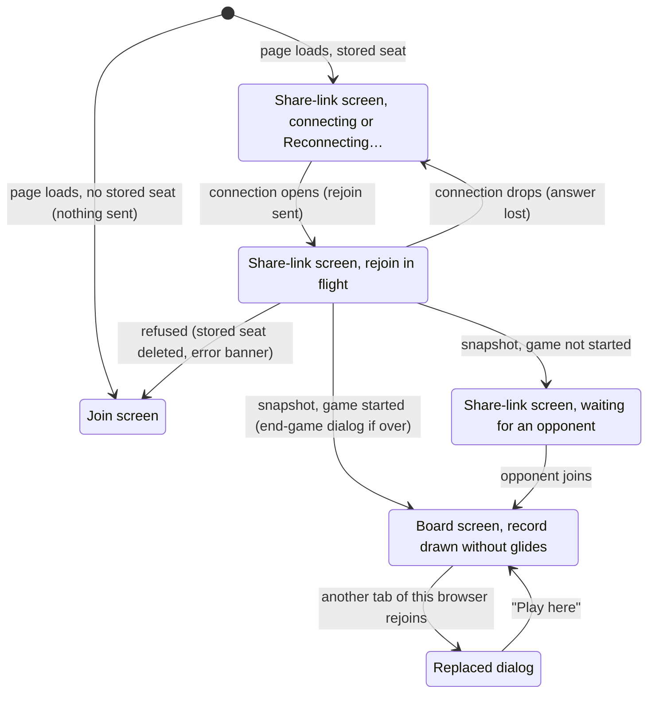

# Reloading and returning

## Summary

Reloading and returning covers every way a player comes back to a game page on a fresh page: reloading it, closing the tab and opening the link again later, opening a bookmark, going Back or Forward onto it, or coming back to it from the start screen or from another game's page. The fresh page knows nothing about the game except the id in its address and this browser's [stored seat](../foundations/connection-and-seat.md#the-stored-seat). With a stored seat it sends a [rejoin](../glossary.md#the-connection) by itself, shows the share-link screen while it waits, and then rebuilds the whole game from the server's [snapshot](../glossary.md#requests): the board screen with every recorded move already in place, or the share-link screen if nobody has joined yet. The player does nothing and chooses nothing. When the game no longer exists, the server refuses the rejoin, the browser forgets the stored seat, and the page falls back to the join screen. This document owns the rejoin as the player meets it on a fresh page. The rejoin that follows a drop on a page that stays open is [connection loss](connection-loss.md); the rules of rejoining themselves (when a rejoin is sent, what the server does with it, last connection wins) are in [the connection and seat model](../foundations/connection-and-seat.md#rejoining).

## The simple case

The player is White, in the middle of a game; they have just moved, and the turn indicator reads "Black to move". They press F5. The page goes blank and loads again. For a moment, usually too short to read, it shows the dark page with the title "3D Chess", "Game created! Share this link with a friend:", the game's link, and a "Copy link" button. Then the board screen appears: the camera back at the [default view](../foundations/the-view.md#the-default-view), every piece where the record puts it, the teal [last-move trace](../glossary.md#selection-and-board-state) on the player's own last move, "Black to move" at the top, and the whole [move list](../game-page/move-list.md) at the bottom right, scrolled to the newest move. Nothing glides. The seat label reads "You are playing as white.", and "Opponent: online" appears under it a moment later.

The opponent sees the line under their seat label change to "Opponent: offline" while the page reloads, and back to "Opponent: online" once it has rejoined. Their board, their turn, and their selection are untouched.

Closing the tab and opening the link days later works the same way. If the opponent moved in the meantime, the page opens on the player's turn with the opponent's move already in place, marked by the teal trace, and listed at the end of the move list.

## The interaction, event by event

### Begin

The request begins when a game page loads and reads the stored seat for the game id in its address. That one read decides everything the page does before the server answers: a stored seat means the page will rejoin as that color, and no stored seat means it will not. Nothing else carries over from any earlier visit. The page starts [before joining](../glossary.md#the-product-and-its-screens), with no position, no errors, no selection, and no presence.

Every way of coming back begins identically:

- reloading: F5, Ctrl+R or Cmd+R, the browser's reload button, or a hard reload that bypasses the cache;
- closing the tab or the browser and opening the link again, including the browser's "reopen closed tab" and session restore;
- opening a bookmark, or typing or pasting the link;
- browser Back or Forward onto a game page, from the start screen or, through the browser's history menu, straight from another game's page;
- reloading the [crash screen](../foundations/screens-and-navigation.md#the-crash-screen), as its text suggests.

They differ only in the connection the page starts with. Anything that loads the page from scratch opens a new connection, which starts [connecting](../foundations/connection-and-seat.md#connection-states). Back or Forward from the start screen, within the app, keeps the start screen's connection, which was [reset](../foundations/connection-and-seat.md#returning-to-the-start-screen) when that screen appeared and is usually already open. A jump from one game's page straight to another's resets the connection as the new page appears, exactly as arriving at the start screen does, and the new game's page is not drawn until the reset has happened, so it starts from nothing, as a fresh load would: nothing the previous game's page knew, sent, or was told carries over.

Two arrivals at a game page are not returns and send no rejoin: the creator arriving from "Start New Game" ([creating a game](../start/creating-a-game.md)), and the joiner right after clicking "Join Game" ([joining a game](../start/joining-a-game.md)). Both already hold the seat on the connection they have. A reload of either page is a return like any other.

### End without sending

With no stored seat, the page shows the [join screen](../start/joining-a-game.md), the title and a "Join Game" button, and sends nothing. The server is not told that anyone is looking, and the opponent sees no change. This is what a [visitor](../glossary.md#games-and-seats) sees, and it is also what a seated player sees on another browser or device, in a private window, after clearing the browser's site data, or with storage disabled. For them, "Join Game" is refused with "Game full" once both seats are taken; see [other tabs and devices](#interactions-with-other-systems) and the [edge cases](#edge-cases). The one exception is a tab whose own join lost its answer before any seat was stored: its "Join Game" gets that seat back (see [joining a game](../start/joining-a-game.md#cancel-and-interrupt)).

A page with a stored seat that is closed, reloaded, or left before its connection opens also ends without sending: nothing reached the server and nothing is recorded. The next load starts over.

### Send

The rejoin leaves the browser as soon as the page's connection is open: at once if it already is, otherwise the moment it opens. It names the game id from the address, the stored color, and this tab's [client id](../glossary.md#requests), and it [takes over](../glossary.md#the-connection) the seat: a fresh page, however it was reached, is the player choosing this tab. Nothing on screen marks this moment.

> Technical note: The page sends its rejoin only on an open connection that it has not yet rejoined on, and never through the connection's queue. So a page loaded from scratch, a history jump between two game pages, and a return from the start screen all send exactly one rejoin per connection, whatever that connection was doing when the page appeared.

The server, on receiving it:

- looks up the game, and refuses with "Cannot rejoin" if it does not exist;
- checks that the stored color's seat is taken, and refuses with "No such seat to rejoin" if it is not;
- ties this connection to the seat. If another live connection holds it, [last connection wins](../foundations/connection-and-seat.md#last-connection-wins): the older connection is closed with the signal that stops it retrying. When that is the reloaded page's own old connection, still lingering half-open, nobody sees it close; when it belongs to another open tab, that tab shows the [replaced dialog](second-tab.md);
- answers with the snapshot: the color, whether both seats are taken, and the entire [move record](../glossary.md#games-and-seats);
- tells the player whether the opponent is connected right now;
- tells the opponent, if connected, that the player is online.

The server checks nothing about who is asking, and records nothing: a rejoin only reads the game. A refused rejoin leaves the connection free, so the page can still join a game on it.

A fresh page goes on taking over until one of its rejoins is answered. If the first answer is lost to a drop, the rejoin the next connection sends takes over too. Only once the page has held the seat do its automatic rejoins stop taking over; see [connection loss](connection-loss.md).

### While in flight

From the moment the page loads until the answer arrives, a page with a stored seat shows the [share-link screen](../start/waiting-for-an-opponent.md): the title "3D Chess", "Game created! Share this link with a friend:", the link in a dark box, and "Copy link". It shows it to every returning player. For the creator of a game nobody has joined it is the right screen. For a joiner, for either player of a game in progress, and for either player of a finished game it is the wrong one, and on an ordinary connection it is a flash, gone before it can be read.

If the server cannot be reached, the flash becomes a wait. The first failed attempt adds the amber "Reconnecting…" box at the top right, the [retry schedule](../foundations/connection-and-seat.md#connection-states) runs, and the share-link screen stays up for as long as the outage lasts, telling a player in the middle of a game to share a link. When a connection finally opens, the rejoin goes out on it.

Nothing on the screen takes part in the rejoin. There is no board and no "Join Game" button; the link is plain text that can be selected, and "Copy link" copies it. The only other things that can appear are the [error banner](../game-page/error-banner.md), for a refusal, and the replaced dialog, if another tab of this browser rejoins the same game after this one.

### The answer arrives

**A snapshot of a started game.** The page takes the snapshot as everything it knows and switches to the [board screen](../glossary.md#the-product-and-its-screens):

- the camera starts at the default view, [oriented](../foundations/the-view.md#orientation) for the color in the snapshot, whatever angle the player had left it at before;
- the position is replayed from the whole record and drawn in place. No move in the record glides, not even the latest ([the view](../foundations/the-view.md#motion)); the teal last-move trace marks the latest move's two cells, and a King in check already glows red, with the turn indicator saying so;
- the turn indicator names the side to move, and the move list shows every move, scrolled to the newest (it stays hidden if no move has been played);
- the seat label reads "You are playing as white." or "You are playing as black."; the presence line under it, "Opponent: online" or "Opponent: offline", appears when the server's presence message arrives, which it sends right after the snapshot;
- [the board takes input](../foundations/input-model.md#when-the-board-takes-input) from this moment. On the player's turn their pieces can be selected, and the move box accepts a move, immediately ([making a move](../play/making-a-move.md)); on the opponent's turn nothing can be selected ([the opponent's move](../play/the-opponents-move.md));
- if the record ends in checkmate or stalemate, the [end-game dialog](../play/check-and-game-end.md) is over the board from the first moment, with no final glide;
- if the record holds a move this browser cannot replay, the board is [frozen](../cross-cutting/broken-game-record.md) at the last good position under the frozen-board banner, and no end-game dialog appears.

A move recorded after the server handled the rejoin is not in the snapshot; its [echo](../glossary.md#requests) arrives right after it and glides in like any arriving move.

**A snapshot of a game nobody has joined.** Only the creator can get this answer. The share-link screen stays, now correctly, and the player is back to [waiting for an opponent](../start/waiting-for-an-opponent.md). When someone joins, the server announces the start and the board screen appears.

In neither case is the stored seat written again: a snapshot hands back a seat, it does not assign one.

**The opponent.** Told that the player is online. What they see depends on how the player's old connection ended. A reload or a closed tab normally closes it cleanly, so the opponent saw "Opponent: offline" when the player left and now sees "Opponent: online". If the old connection was still lingering half-open, the rejoin replaces it without it ever counting as a departure, and the opponent sees no change at all.

**A refusal.** A refusal before the page has shown the game means the stored seat is stale. The server answers "No such seat to rejoin" or "Cannot rejoin"; the browser deletes the stored seat; the page switches from the share-link screen to the join screen; and the error banner shows "Error: No such seat to rejoin" or "Error: Cannot rejoin". Precisely, the stored seat is deleted only when all of these hold at once:

- the page holds a stored seat for this game;
- no snapshot of any kind has arrived on this page since it loaded (or since its connection was last reset), not even one saying the game has not started;
- the server has not announced the game's start on this page;
- the page has received "No such seat to rejoin" or "Cannot rejoin" at some point since it loaded. The check looks at every error the page has received, not only the latest one.

In practice that is one situation: the first rejoin after the page loaded was refused. A refusal of a later rejoin, on a page that has already shown the game, never deletes the stored seat (see the [edge cases](#edge-cases)), and no other error deletes it.

> Technical note: The check is on the kind of error, and "Cannot join" is the same kind as "Cannot rejoin". A page holding a stored seat has no "Join Game" button, so it cannot receive "Cannot join" while the stored seat exists.

"Cannot rejoin" means the game is gone, almost always because it [expired](../glossary.md#games-and-seats) about 30 days after it was last active. Clicking "Join Game" on the join screen that follows is refused with "Error: Cannot join". "No such seat to rejoin" means the game exists but nobody holds the stored color. Because the browser stores only seats the server assigned, and a seat is never given up, a real player meets it only if the stored seat was edited by hand, or an expired game's id was later drawn again for a new game.

"Already in a game" should never answer a rejoin, since the rejoin is the first request on a fresh connection. It does in one timing case, Back into a game page within the round trip of a create, described in the [edge cases](#edge-cases); it is shown in the banner and changes nothing else. "Seat in use" answers only an automatic rejoin after a drop, on a page that had already held its seat, and shows as the replaced dialog, not in the banner. Every text is catalogued in [error messages](../cross-cutting/error-messages.md).

**What survives.** The page is rebuilt from the record and the stored seat alone, so the rest of what the player had is gone:

| Before the reload | After it |
| --- | --- |
| The player's turn, with or without a piece selected | The player's turn, nothing selected. |
| The promotion dialog open | The player's turn, nothing selected. Nothing was sent. |
| A move typed in the move box but not submitted | Gone; the box is empty. |
| The player's move in flight (the board [held](../glossary.md#selection-and-board-state)) | If the server recorded it: the move in place, without a glide, and the opponent's turn. If not: still the player's turn, with no trace of the move. The snapshot is the only way to tell which. |
| The opponent's turn | Still the opponent's turn, nothing selectable. A move they made while the page was reloading is in place without a glide; one made after the rejoin glides in. |
| Away while the opponent moved | The opponent's move in place, with the trace on it, and the player's turn (or the end-game dialog). While the player is away the opponent can make only one move; more can pile up only if the player went on playing from another tab of this browser. |
| Game over | The end-game dialog again, without the final glide. |
| The record frozen | The frozen-board banner again, at the same move. |
| "Reconnecting…" | A fresh start, as on any load. |
| The replaced dialog (this was the replaced tab) | The seat back; the other tab now shows the replaced dialog. |
| An error in the banner, shown or dismissed | Gone. |
| The view turned, zoomed, or panned | The default view. |

## Modifiers

| Modifier | At the start | Changes while in flight |
| --- | --- | --- |
| Your color | The stored color is what the rejoin names, and the server hands that seat back without asking who is there. Nothing on screen shows the color until the board screen appears; the share-link screen does not say it. The snapshot's color sets the orientation. | Cannot change. The page reads the stored seat once, when it loads. |
| Whose turn it is | Unknown until the snapshot. Once it arrives, the player's turn means their pieces can be selected at once; the opponent's turn means nothing can be. | The opponent can move while the rejoin is in flight. A move recorded before the server handles the rejoin is in the snapshot, drawn in place; one recorded after arrives as an echo right after the snapshot and glides. |
| How you reached the page | Returning with a stored seat: this document, whatever the route. A visitor without one: the join screen, nothing sent. The creator arriving from "Start New Game" and the joiner right after "Join Game" already hold the seat and do not rejoin. Any route that loads the page from scratch starts a new connection; Back or Forward from the start screen reuses that screen's; a history jump from another game's page resets the connection first. | Leaving while in flight: see "Leaving the game page within the app" below. |
| Connection state | A page loaded from scratch always starts connecting; if the first attempt fails, "Reconnecting…" appears over the share-link screen and the rejoin waits for the retry schedule. From the start screen the connection is usually already open and the rejoin goes out at once; otherwise the rejoin waits until it opens. Replaced cannot be the state at the start: every return has a fresh connection. | A drop loses the answer, and the next connection sends the rejoin again, still taking over. Replaced: the replaced dialog appears over whichever screen is showing. |
| Game state | Unknown until the snapshot. Not started: the share-link screen stays. In progress: the board screen. In check: the King already glows red and the turn indicator adds " — in check". Over: the end-game dialog at once. Frozen: the frozen-board banner. Expired: the refusal and the join screen. | The opponent's move arriving right after the snapshot can put the player in check or end the game. |
| Shift, Ctrl, or Cmd held | No effect on the rejoin. A hard reload (Ctrl+Shift+R, Cmd+Shift+R, Shift+F5) bypasses the browser's cache, not the stored seat, and rejoins like any reload. Ctrl-click or Cmd-click on the game's link somewhere else opens a second tab of the game, which takes the seat; see [a second tab](second-tab.md). | No effect. |
| Input device | The keyboard shortcuts, the browser's buttons, a mouse's back and forward buttons, and a mobile browser's own reload and back controls all do the same thing. On the share-link screen only "Copy link" takes a click, a tap, or a key, and it does not affect the rejoin. | No effect. |

Nothing the player does changes the rejoin once the page has loaded: the stored seat has been read, and the answer depends only on what the server holds.

## Cancel and interrupt

"Before sending" is from the page loading until its connection opens; "while in flight" is from the rejoin leaving until the snapshot or the refusal arrives.

| Event | Before sending | While in flight |
| --- | --- | --- |
| Escape or Cancel | No effect. The rejoin is automatic and has no cancel; Escape is ignored. | No effect. A rejoin in flight cannot be recalled. |
| Pressing elsewhere or turning the view | There is no board yet. Clicks on the share-link screen do nothing except on "Copy link"; the link can be selected and copied as text. | Same. |
| Leaving the game page within the app | Nothing has been sent, so nothing happens on the server; the start screen appears as usual, or, after a history jump, the other game's page, which starts afresh. "Start new game" does not exist yet (the end-game dialog comes only with the answer), and "Back to start" exists only on the crash screen, which loads the start screen from scratch. | The server may already have handled the rejoin: it tied the connection to the seat and told the opponent the player was online. Arriving at the start screen, or jumping to another game's page, resets the connection, so the opponent then sees "Opponent: offline". The answer is ignored. The stored seat is kept. |
| The game ends | Cannot happen: the page knows nothing about the game yet. | The snapshot can show a game that already ended: the end-game dialog appears with the board screen. The opponent's move arriving right after the snapshot can also end it, with its glide. |
| The server answers with an error | Not applicable: nothing sent. | "No such seat to rejoin" or "Cannot rejoin": the stored seat is deleted, the join screen appears, and the error banner shows the message. "Already in a game", only in the timing case in the edge cases: shown in the banner; the game appears normally. |
| The connection drops | "Reconnecting…" appears over the share-link screen; the retry schedule runs; the rejoin goes out when a connection opens. | The answer is lost. The next connection sends the rejoin again by itself, still taking over, since this page has not yet held the seat. If the server handled the lost rejoin, the opponent saw the player come online and go offline again. |
| The window loses focus or the tab is hidden | No effect. A game link opened in a background tab rejoins in the background; the browser may slow the retry schedule while the tab is hidden. | No effect. The answer is handled in the background, and nothing glides when the tab is shown, because moves in the snapshot never glide. |
| Reload or closing the tab | Nothing was sent; the next load starts over. | The answer is lost. If the server handled the rejoin, the opponent sees "Opponent: online" and then "Opponent: offline". The next load rejoins again; reloading repeatedly is harmless, since each rejoin takes the seat from the connection before it. |
| The opponent acts | Everything the opponent does meanwhile is settled by the snapshot: their moves are in it, and if they joined a game that was waiting, it says the game has started, so the page goes from the share-link screen straight to the board screen. Their own connection coming and going changes nothing on this page yet. | A move recorded after the server handled the rejoin arrives as an echo right after the snapshot and glides; a join arrives as the start announcement and brings the board screen. The opponent's presence arrives right after the snapshot and fills in the presence line. |
| Another tab takes the seat | Nothing to take yet: this page holds no seat. When its own rejoin goes out, it takes the seat from whichever tab holds it, and that tab shows the replaced dialog. | If another tab's rejoin reaches the server after this one's, this page is replaced: the replaced dialog, "This game is open in another tab", appears over the share-link screen or the board screen, with "Play here" focused. "Play here" rejoins and takes the seat back. See [a second tab](second-tab.md). |
| A second touch point or a cancelled touch | No effect: nothing on the share-link screen but "Copy link" takes a touch, and a cancelled touch does not click it. | No effect. |

After any interrupt the page either lands on the screen the snapshot describes, falls back to the join screen after a refusal, shows the replaced dialog, or is gone. The stored seat survives every interrupt except the refusal.

## Interactions with other systems

**Seat and turn.** The rejoin names the stored color, and the server gives that seat back to whichever connection asks, checking only that the game exists and that the color's seat is taken. The seat label, the orientation, and which pieces can be selected all come from the snapshot. The turn is worked out from the record: White moves first, and the turn alternates with every recorded move.

**The game record.** The rejoin records nothing and changes nothing: the server only reads the game and sends the record whole. The page, which started from nothing, draws the position from the record, so the result is the same whether the player was away for a second or a month. Whether being read this way counts as activity for [expiry](../glossary.md#games-and-seats) is not known; see [the connection and seat model](../foundations/connection-and-seat.md#open-questions-and-verification).

**Connection.** Every return is a new connection as far as the server is concerned, even when it reuses the start screen's: the server knows nothing about the tab until the rejoin arrives. One rejoin is sent per new connection, and every one takes over until one is answered. The reloaded page's old connection either closes as the page unloads or lingers until the rejoin replaces it; either way the new page is unaffected.

**The opponent.** Sees "Opponent: offline" when the player's old connection closes (a reload, a closed tab, a return to the start screen, a jump to another game's page) and "Opponent: online" when the rejoin is handled; an old connection that lingered and was replaced never shows as offline. Nothing else reaches them: their board, turn, and selection are untouched, and they can go on moving while the player is away. Their moves are recorded and are in the player's snapshot. See [presence](../foundations/connection-and-seat.md#presence).

**Other tabs and devices.** The stored seat is shared by every tab and window of the same browser profile, so a return in any of them rejoins as the player, and the newest page's rejoin takes the seat: opening the game in a second tab puts the first behind the replaced dialog ([a second tab](second-tab.md)). Another browser, another profile, another device, or a private window has no stored seat for the game: the link shows the join screen there, and "Join Game" is refused with "Game full" once both seats are taken. A private window's own stored seats survive reloads in that window and are forgotten when the private session ends. With storage disabled nothing is ever stored, so every return is a visitor's.

**Game over.** A finished game can be reopened for as long as it exists. Its snapshot is still a snapshot, so the stored seat is kept, and every return shows the end-game dialog over the final position at once, with "Start new game" focused, the teal trace on the final move, and no glide. The only way on is "Start new game". Once the game expires, the next return is refused and the stored seat is deleted.

**Stored seat.** Read once when the page loads; it decides between rejoining and the join screen. A rejoin never writes it, because a snapshot returns a seat rather than assigning one. It is deleted only by a refusal before the page has shown the game, as set out under [the answer arrives](#the-answer-arrives). It has no expiry of its own: the browser keeps one entry per game ever played in it, and nothing lists or removes them except that refusal and clearing the browser's site data.

**Keyboard, touch, and screen size.** Reload, Back, and Forward work from the keyboard as usual, and a mobile browser's own controls work the same way. The share-link screen has only "Copy link" to focus, and the board screen that follows starts at the default view, which fits the whole cube at any window size; see [screen sizes and touch](../cross-cutting/screen-sizes-and-touch.md).

## Edge cases

- **Returning after the game expired.** The page shows the share-link screen for the moment the rejoin takes, then the join screen with "Error: Cannot rejoin". Nothing says in plain words that the game has expired. Clicking "Join Game" sends a join, which is refused with "Error: Cannot join"; the joined screen, "Joined game, waiting for start...", never appears in between, because the page counts the earlier "Cannot rejoin" as a failed join the moment the button is clicked, so the button stays on screen and each further click sends another join. The stored seat is gone, so every later visit to the link shows the plain join screen. This looks like a bug; see open questions.
- **Coming back into a game page while the start screen is still connecting.** Browser Back or Forward from the start screen onto a game page, while that screen still shows "Connecting to server…" or "Reconnecting to server…", sends one rejoin, when a connection opens. The easiest way to meet it is "Start new game" in the end-game dialog followed at once by Back, which leads straight to the finished game.
- **Jumping from one game page to another.** The browser's history menu (a long press or right-click on Back or Forward) can move from one game page straight to another without passing through the start screen. The page resets the connection as it arrives, as the start screen would: the previous game's opponent sees "Opponent: offline", and the new page starts afresh, showing nothing of the previous game, and rejoins the game in its address with that game's stored seat, taking over, or shows the join screen if there is none. The stored seats of both games are left as they were.
- **The same game open in two tabs.** Reloading either tab takes the seat for it, and the other shows the replaced dialog. Reloading the replaced tab therefore does the same as its "Play here" button.
- **A refusal after the page has shown the game.** A rejoin after a drop could in principle be refused too, if the game vanished while the page was open (it expired during a very long outage). The page has already shown the game, so the stored seat is kept: the page stays on the screen it had, with the error in the banner, and the board no longer takes input, because the connection holds no seat and the board waits for a snapshot that will not come. Reloading then deletes the stored seat as described above.
- **Clearing site data with the page open.** The open page keeps playing as long as it stays open, including through drops, because it read the stored seat when it loaded. The next load finds nothing and shows the join screen, where "Join Game" is refused with "Game full". Nothing in the app gets the seat back.
- **The creator opening the link on another device before anyone has joined.** That page is a visitor's, and its "Join Game" takes the free seat: the player now holds both seats, one in each browser, and the game starts against themselves. A friend who opens the link afterwards is refused with "Game full".
- **A mistyped or lower-case id.** The stored seat is kept under the exact id, so a link with a different id finds none and shows the join screen, where "Join Game" is refused with "Cannot join". See [addresses the app does not know](../foundations/screens-and-navigation.md#addresses-the-app-does-not-know).
- **Reloading the crash screen.** The crash screen says reloading is safe and will restore the current position; a reload does exactly the rejoin described here. Its "Back to start" link loads the start screen instead.
- **Back into a page left mid-create.** Pressing Back to an earlier game's page within the fraction of a second after clicking "Start New Game" leads to a rejoin refused with "Already in a game"; see [creating a game](../start/creating-a-game.md#edge-cases).
- **The page title** stays "3D Chess — Online Multiplayer" throughout, so a tab reloading in the background gives no sign of where the game stands.

## Open questions and verification

- The rejoin is sent once per connection, and only on an open one (`client/src/screens/GameScreen.tsx:131-146`), and a return to the start screen sets the session number to 0 (`client/src/hooks/useGameSocket.ts:107`), so no return sends it twice; [bug triage](../bug-triage.md) B-10 is fixed. A fresh page keeps taking over until a rejoin is answered (`GameScreen.tsx:121-123`). A history jump mounts the new game's page only after the reset (`client/src/App.tsx:15-25`, `:38-52`), so that page never sees the previous game's messages; this is read from code and `client/src/App.test.tsx`, and was not tried through a real browser's history menu.
- **Joined screen skipped after "Cannot rejoin" (suspected bug, minor).** The join-failure check looks at every error the page has ever received (`GameScreen.tsx:160-168`; [bug triage](../bug-triage.md) B-15), so the earlier "Cannot rejoin" ends the join the moment "Join Game" is clicked, before the server has answered. The join is refused anyway on an expired game, but the button stays clickable and each click sends another join. The same check means a second click after "Game full" also skips the joined screen; that belongs to [joining a game](../start/joining-a-game.md).
- The stale-seat check (`GameScreen.tsx:172-183`) also looks at every error received rather than the rejoin's own answer. Harmless in practice, for the reason in the technical note under [the answer arrives](#the-answer-arrives).
- The share-link screen's wording for a returning joiner or a started game is already listed in [the connection and seat model](../foundations/connection-and-seat.md#open-questions-and-verification); an outage during a return is when it is visible.
- An expired game is reported only as "Error: Cannot rejoin" and then "Error: Cannot join". Whether the player should be told plainly that the game is gone is a product call.
- Whether a rejoin, which only reads the game (`server/modal_app.py:167-174`), counts as activity for expiry is not known.
- Not measured: how long the share-link flash lasts on a cold server, and how long the opponent's "Opponent: offline" lasts during a reload.
- Not checked: whether a browser restores a game page from its back-forward cache on Back or Forward from another site instead of loading it (if so, it should recover through the ordinary retry and rejoin); whether pull-to-refresh works over the share-link screen or the board on a touch device.
- The history jump showing the target game under its own address was confirmed by the scripted rerun after the B-05 fix, jumping from a new game's share-link screen to a finished game.
- Everything else was read from `client/src/App.tsx`, `client/src/screens/GameScreen.tsx`, `client/src/game/session.ts`, `client/src/game/history.ts`, `client/src/lib/playerRole.ts`, `client/src/lib/clientId.ts`, `client/src/hooks/useGameSocket.ts`, `client/src/three/Board.tsx`, and `server/modal_app.py` (the rejoin at `:401-450`). The automatic rejoin (taking over on a fresh load), the restore from a snapshot, the not-started snapshot, the board held until the snapshot, and the stale seat being cleared are covered by `client/src/App.test.tsx`; drawing history without a glide by `client/src/three/Board.test.tsx`; every server answer to a rejoin (before the opponent joins, with history, after moves made while away, unknown game, unclaimed seat, a lingering connection replaced, presence) by `server/tests/test_local_ws.py`; and a reload restoring the seat and position, and a second tab taking the seat, by `client/e2e/session.spec.ts`.

Verified against 3D Chess commit `90142a3`
