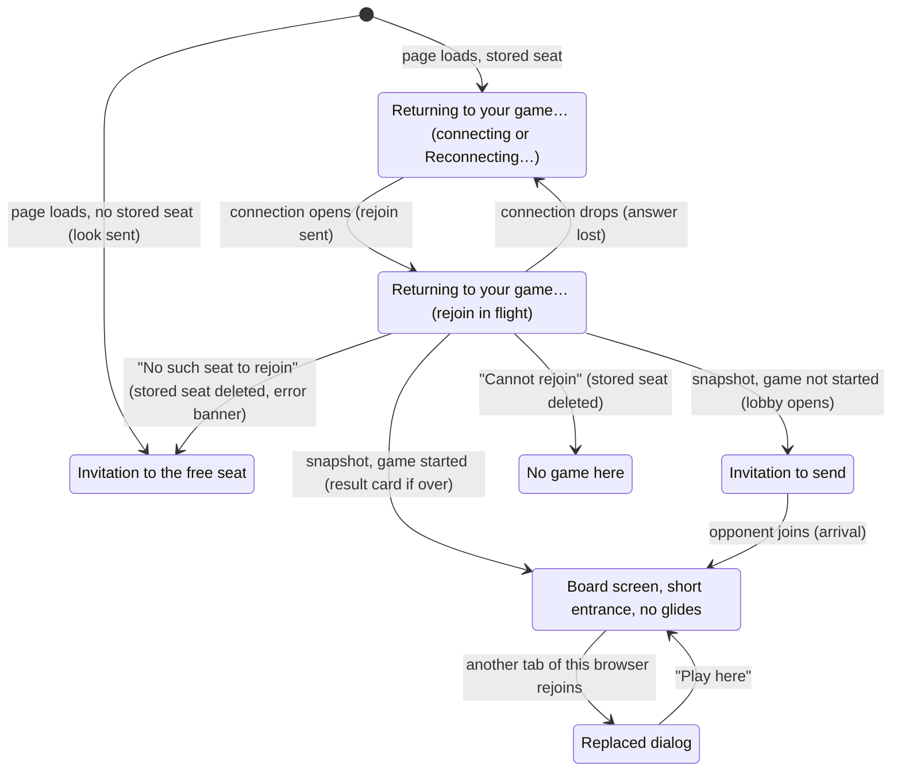

# Reloading and returning

## Summary

Reloading and returning covers every way a player comes back to a game page on a fresh page: reloading it, closing the tab and opening the link again later, opening a bookmark, going Back or Forward onto it, coming back from the tutorial with "← Game", or jumping to it from another game's page. The fresh page knows nothing about the game except the id in its address and this browser's [stored seat](../foundations/connection-and-seat.md#the-stored-seat). With a stored seat it sends a [rejoin](../glossary.md#the-connection) by itself, shows "Returning to your game…" while it waits, and then rebuilds the whole game from the server's [snapshot](../glossary.md#requests): the board screen with every recorded move already in place, or the [invitation to send](../start/waiting-for-an-opponent.md) if nobody has joined yet. The player does nothing and chooses nothing. When the game no longer exists, the server refuses the rejoin, the browser forgets the stored seat, and the page says "No game here". This document owns the rejoin as the player meets it on a fresh page. The rejoin that follows a drop on a page that stays open is [connection loss](connection-loss.md); the rules of rejoining themselves (when a rejoin is sent, what the server does with it, last connection wins) are in [the connection and seat model](../foundations/connection-and-seat.md#rejoining). A game against the computer comes back from the browser's own copy instead, with no server and no wait; see [playing the computer](../computer/playing-the-computer.md).

## The simple case

The player is White, in the middle of a game; they have just moved, and the turn pill lights Black's half, "Their move". They press F5. The page goes blank and loads again. For a moment, usually too short to read, it shows "Returning to your game…" on a dark page. Then the board screen appears with its short entrance (about 1.3 seconds: the tower draws itself level by level and the armies form, from near the default view): the camera at the [default view](../foundations/the-view.md#the-default-view), every piece where the record puts it, the mint [last-move trace](../glossary.md#selection-and-board-state) on the player's own last move, the turn pill fading in last with the player's porcelain stone and "You" and the opponent's half lit, "Their move". The whole [move list](../game-page/move-list.md) is in the page for screen readers. No move glides.

The opponent may see the player's half of their turn pill read "Offline" while the page reloads, and return to normal once it has rejoined. Their board, their turn, and their selection are untouched.

Closing the tab and opening the link days later works the same way. If the opponent moved in the meantime, the page opens on the player's turn with the opponent's move already in place, marked by the last-move line.

## The interaction, event by event

```mermaid
stateDiagram-v2
    state "Invitation to the free seat" as join
    state "Returning to your game… (connecting or Reconnecting…)" as connecting
    state "Returning to your game… (rejoin in flight)" as flight
    state "Invitation to send" as share
    state "Board screen, short entrance, no glides" as board
    state "No game here" as gone
    state "Replaced dialog" as replaced
    [*] --> join : page loads, no stored seat (look sent)
    [*] --> connecting : page loads, stored seat
    connecting --> flight : connection opens (rejoin sent)
    flight --> connecting : connection drops (answer lost)
    flight --> board : snapshot, game started (result card if over)
    flight --> share : snapshot, game not started (lobby opens)
    share --> board : opponent joins (arrival)
    flight --> gone : "Cannot rejoin" (stored seat deleted)
    flight --> join : "No such seat to rejoin" (stored seat deleted, error banner)
    board --> replaced : another tab of this browser rejoins
    replaced --> board : "Play here"
```

### Begin

The request begins when a game page loads and reads the stored seat for the game id in its address. That one read decides everything the page does before the server answers: a stored seat means the page will rejoin as that color, and no stored seat means it will not. Nothing else carries over from any earlier visit. The page starts [before joining](../glossary.md#the-product-and-its-screens), with no position, no errors, no selection, and no presence.

Every way of coming back begins identically:

- reloading: F5, Ctrl+R or Cmd+R, the browser's reload button, or a hard reload that bypasses the cache;
- closing the tab or the browser and opening the link again, including the browser's "reopen closed tab" and session restore;
- opening a bookmark, or typing or pasting the link;
- browser Back or Forward onto a game page, from any other page of the app or, through the browser's history menu, straight from another game's page;
- the tutorial's "← Game" or "Back to game", when it was opened from this game;
- reloading the [crash screen](../foundations/screens-and-navigation.md#the-crash-screen), as its text suggests.

They differ only in the connection the page starts with. Anything that loads the page from scratch opens a new connection, which starts [connecting](../foundations/connection-and-seat.md#connection-states). Coming back within the app keeps the tab's connection, which was [reset](../foundations/connection-and-seat.md#leaving-a-games-page) when the player left the game's page and is usually already open. A jump from one game's page straight to another's resets the connection as the new page appears, and the new game's page is not drawn until the reset has happened, so it starts from nothing, as a fresh load would.

Two arrivals at a game page are not returns and send no rejoin: the creator arriving from the side choice ([creating a game](../start/creating-a-game.md)), and the joiner right after clicking "Join game" ([joining a game](../start/joining-a-game.md)). Both already hold the seat on the connection they have. A reload of either page is a return like any other.

### End without sending

With no stored seat, the page asks the server only which seats are taken (a look, which binds nothing) and shows the [invitation to the free seat](../start/joining-a-game.md). This is what a [visitor](../glossary.md#games-and-seats) sees, and it is also what a seated player sees on another browser or device, in a private window, after clearing the browser's site data, or with storage disabled: once both seats are taken, "This game is taken", with nothing to click but "Play a friend". The one exception is a tab whose own join lost its answer before any seat was stored; see [joining a game](../start/joining-a-game.md#open-questions-and-verification).

A page with a stored seat that is closed, reloaded, or left before its connection opens also ends without sending: nothing reached the server and nothing is recorded. The next load starts over.

### Send

The rejoin leaves the browser as soon as the page's connection is open: at once if it already is, otherwise the moment it opens. It names the game id from the address, the stored color, and this tab's [client id](../glossary.md#requests), and it [takes over](../glossary.md#the-connection) the seat: a fresh page, however it was reached, is the player choosing this tab. Nothing on screen marks this moment.

> Technical note: The page sends its rejoin only on an open connection that it has not yet rejoined on, and never through the connection's queue. So every return sends exactly one rejoin per connection, whatever that connection was doing when the page appeared.

The server, on receiving it:

- looks up the game, and refuses with "Cannot rejoin" if it does not exist;
- checks that the stored color's seat is taken, and refuses with "No such seat to rejoin" if it is not;
- ties this connection to the seat. If another live connection holds it, [last connection wins](../foundations/connection-and-seat.md#last-connection-wins): the older connection is closed with the signal that stops it retrying. When that is the reloaded page's own old connection, still lingering half-open, nobody sees it close; when it belongs to another open tab, that tab shows the [replaced dialog](second-tab.md);
- answers with the snapshot: the color, whether both seats are taken, and the entire [move record](../glossary.md#games-and-seats);
- tells the player whether the opponent is connected right now, and tells the opponent, if connected, that the player is online.

The server checks nothing about who is asking, and records nothing: a rejoin only reads the game. A fresh page goes on taking over until one of its rejoins is answered. If the first answer is lost to a drop, the rejoin the next connection sends takes over too. Only once the page has held the seat do its automatic rejoins stop taking over; see [connection loss](connection-loss.md).

### While in flight

From the moment the page loads until the answer arrives, a page with a stored seat shows only "Returning to your game…", centered near the bottom of a dark page, with "← Home" at the top left: no scene, no card, no board. On an ordinary connection it is a flash.

If the server cannot be reached, the flash becomes a wait. The first failed attempt adds the "Reconnecting…" line at the top right, the [retry schedule](../foundations/connection-and-seat.md#connection-states) runs, and "Returning to your game…" stays up for as long as the outage lasts. When a connection finally opens, the rejoin goes out on it.

### The answer arrives

**A snapshot of a started game.** The page takes the snapshot as everything it knows and switches to the [board screen](../glossary.md#the-product-and-its-screens), with the short [entrance](../foundations/the-view.md#the-entrance):

- the camera arrives at the default view, [oriented](../foundations/the-view.md#orientation) for the color in the snapshot, whatever angle the player had left it at before;
- the position is replayed from the whole record and drawn in place. No move in the record glides, not even the latest; the last-move line marks the latest move, and a King in check is already red among his blades;
- the turn pill lights the side to move, and the move list (for screen readers) has every move; the opponent's half reads "Offline" if the server's presence message, which it sends right after the snapshot, says so;
- [the board takes input](../foundations/input-model.md#when-the-board-takes-input) once the entrance is over. On the player's turn their pieces can be selected, and the move box accepts a move ([making a move](../play/making-a-move.md)); on the opponent's turn nothing can be selected ([the opponent's move](../play/the-opponents-move.md));
- if the record ends the game, the [result card](../play/check-and-game-end.md) is over the board from the first moment, with no final glide (a mated King already lying down);
- if the record holds a move this browser cannot replay, the board is [frozen](../cross-cutting/broken-game-record.md) at the last good position under the frozen-board banner, and no result card appears.

A move recorded after the server handled the rejoin is not in the snapshot; its [echo](../glossary.md#requests) arrives right after it and glides in like any arriving move.

**A snapshot of a game nobody has joined.** Only the creator can get this answer. The lobby opens with its entrance (the glass drawing itself, the creator's king forming in its column of light, the free seat's outline coming up), under the heading "You play White" (or Black) and "Waiting for your friend…", with the invitation's card: the player is back to [waiting for an opponent](../start/waiting-for-an-opponent.md). When someone joins, the arrival plays and the board screen follows.

In neither case is the stored seat written again: a snapshot hands back a seat, it does not assign one.

**The opponent.** Told that the player is online. A reload or a closed tab normally closes the old connection cleanly, so the opponent saw the player go "Offline" when they left and now sees them back. If the old connection was still lingering half-open, the rejoin replaces it without it ever counting as a departure, and the opponent sees no change at all.

**A refusal.** A refusal before the page has shown the game means the stored seat is stale, and the browser deletes it:

- **"Cannot rejoin"**: the game is gone, almost always because it [expired](../glossary.md#games-and-seats) about 30 days after it was last active. The page shows the lobby's card "No game here" with "Play a friend". The error itself is not shown in the banner.
- **"No such seat to rejoin"**: the game exists but nobody holds the stored color. The error banner shows "Error: No such seat to rejoin", and the page, now a visitor's, asks which seats are taken and offers the free seat, or says "This game is taken". A real player meets this only if the stored seat was edited by hand, or an expired game's id was later drawn again for a new game.

Precisely, the stored seat is deleted only when the page holds one for this game, no snapshot has arrived on this page since it loaded (or since its connection was last reset), the server has not announced the game's start on this page, and the page has received one of those two refusals. In practice that is one situation: the first rejoin after the page loaded was refused. A refusal of a later rejoin, on a page that has already shown the game, never deletes the stored seat (see the [edge cases](#edge-cases)).

"Seat in use" answers only an automatic rejoin after a drop, on a page that had already held its seat, and shows as the replaced dialog. Every text is catalogued in [error messages](../cross-cutting/error-messages.md).

**What survives.** The page is rebuilt from the record and the stored seat alone, so the rest of what the player had is gone:

| Before the reload | After it |
| --- | --- |
| The player's turn, with or without a piece selected | The player's turn, nothing selected. |
| The promotion dialog open | The player's turn, nothing selected. Nothing was sent. |
| A move typed in the move box but not submitted | Gone; the box is empty. |
| The player's move in flight (the board [held](../glossary.md#selection-and-board-state)) | If the server recorded it: the move in place, without a glide, and the opponent's turn. If not: still the player's turn, with no trace of the move. |
| The opponent's turn | Still the opponent's turn. A move they made while the page was reloading is in place without a glide; one made after the rejoin glides in. |
| Away while the opponent moved | The opponent's move in place, with the trace on it, and the player's turn (or the result card). |
| Game over, card shown or closed | The result card again, without the final glide. |
| The record frozen | The frozen-board banner again, at the same move. |
| "Reconnecting…" | A fresh start, as on any load. |
| The replaced dialog (this was the replaced tab) | The seat back; the other tab now shows the replaced dialog. |
| An error in the banner, shown or dismissed | Gone. |
| The view turned or zoomed | The default view. |

## Modifiers

| Modifier | At the start | Changes while in flight |
| --- | --- | --- |
| Your color | The stored color is what the rejoin names, and the server hands that seat back without asking who is there. Nothing on screen shows the color until the board or the lobby appears. The snapshot's color sets the orientation. | Cannot change. The page reads the stored seat once, when it loads. |
| Whose turn it is | Unknown until the snapshot. | The opponent can move while the rejoin is in flight. A move recorded before the server handles the rejoin is in the snapshot, drawn in place; one recorded after arrives as an echo right after the snapshot and glides. |
| How you reached the page | Returning with a stored seat: this document, whatever the route. A visitor without one: the invitation to the free seat. The creator arriving from the side choice and the joiner right after "Join game" already hold the seat and do not rejoin. A computer game: no rejoin; the game comes back from the browser at once. | Leaving while in flight: see "Leaving the game page within the app" below. |
| Connection state | A page loaded from scratch always starts connecting; if the first attempt fails, "Reconnecting…" appears and the rejoin waits for the retry schedule. Within the app the connection is usually already open and the rejoin goes out at once. Replaced cannot be the state at the start: every return has a fresh connection. | A drop loses the answer, and the next connection sends the rejoin again, still taking over. Replaced: the replaced dialog appears over whichever screen is showing. |
| Game state | Unknown until the snapshot. Not started: the lobby with the invitation to send. In progress: the board screen. In check: the King already red. Over: the result card at once. Frozen: the frozen-board banner. Expired: "No game here". | The opponent's move arriving right after the snapshot can put the player in check or end the game. |
| Shift, Ctrl, or Cmd held | No effect on the rejoin. A hard reload bypasses the browser's cache, not the stored seat, and rejoins like any reload. Ctrl-click or Cmd-click on the game's link somewhere else opens a second tab of the game, which takes the seat; see [a second tab](second-tab.md). | No effect. |
| Input device | The keyboard shortcuts, the browser's buttons, a mouse's back and forward buttons, and a mobile browser's own reload and back controls all do the same thing. "Returning to your game…" has only "← Home" to click. | No effect. |

## Cancel and interrupt

"Before sending" is from the page loading until its connection opens; "while in flight" is from the rejoin leaving until the snapshot or the refusal arrives.

| Event | Before sending | While in flight |
| --- | --- | --- |
| Escape or Cancel | No effect. The rejoin is automatic and has no cancel. | No effect. A rejoin in flight cannot be recalled. |
| Pressing elsewhere or turning the view | There is no board yet; nothing on the page but "← Home" takes a click. | Same. |
| Leaving the game page within the app | Nothing has been sent, so nothing happens on the server. | The server may already have handled the rejoin and told the opponent the player was online. Leaving resets the connection, so the opponent then sees the player "Offline". The answer is ignored. The stored seat is kept. |
| The game ends | Cannot happen: the page knows nothing about the game yet. | The snapshot can show a game that already ended: the result card appears with the board screen. The opponent's move arriving right after the snapshot can also end it. |
| The server answers with an error | Not applicable: nothing sent. | "Cannot rejoin": "No game here". "No such seat to rejoin": the error banner and the invitation to the free seat. Both delete the stored seat. |
| The connection drops | "Reconnecting…" appears; the retry schedule runs; the rejoin goes out when a connection opens. | The answer is lost. The next connection sends the rejoin again by itself, still taking over. |
| The window loses focus or the tab is hidden | No effect. A game link opened in a background tab rejoins in the background; the browser may slow the retry schedule while the tab is hidden. | No effect. The answer is handled in the background; the entrance plays when the tab is shown. |
| Reload or closing the tab | Nothing was sent; the next load starts over. | The answer is lost. The next load rejoins again; reloading repeatedly is harmless, since each rejoin takes the seat from the connection before it. |
| The opponent acts | Everything the opponent does meanwhile is settled by the snapshot: their moves are in it, and if they joined a game that was waiting, it says the game has started, so the page goes straight to the board screen, with no lobby. | A move recorded after the server handled the rejoin arrives as an echo right after the snapshot and glides; a join arrives as the start announcement, and the arrival plays over the lobby. |
| Another tab takes the seat | Nothing to take yet: this page holds no seat. When its own rejoin goes out, it takes the seat from whichever tab holds it, and that tab shows the replaced dialog. | If another tab's rejoin reaches the server after this one's, this page is replaced: the replaced dialog appears, with "Play here" focused. See [a second tab](second-tab.md). |
| A second touch point or a cancelled touch | No effect. | No effect. |

After any interrupt the page either lands on the screen the snapshot describes, falls back to "No game here" or the invitation to the free seat after a refusal, shows the replaced dialog, or is gone. The stored seat survives every interrupt except the refusal.

## Interactions with other systems

**Seat and turn.** The rejoin names the stored color, and the server gives that seat back to whichever connection asks, checking only that the game exists and that the color's seat is taken. The player's stone on the turn pill, the orientation, and which pieces can be selected all come from the snapshot.

**The game record.** The rejoin records nothing and changes nothing: the server only reads the game and sends the record whole. Whether being read this way counts as activity for [expiry](../glossary.md#games-and-seats) is not known; see [the connection and seat model](../foundations/connection-and-seat.md#open-questions-and-verification).

**Connection.** Every return is a new connection as far as the server is concerned: the server knows nothing about the tab until the rejoin arrives. One rejoin is sent per new connection, and every one takes over until one is answered.

**The opponent.** Sees "Offline" when the player's old connection closes and back online when the rejoin is handled; an old connection that lingered and was replaced never shows as offline. Their moves made meanwhile are in the player's snapshot. See [presence](../foundations/connection-and-seat.md#presence).

**Other tabs and devices.** The stored seat is shared by every tab and window of the same browser profile, so a return in any of them rejoins as the player, and the newest page's rejoin takes the seat ([a second tab](second-tab.md)). Another browser, another profile, another device, or a private window has no stored seat for the game: the link shows the invitation to the free seat there, which says "This game is taken" once both seats are taken.

**Game over.** A finished game can be reopened for as long as it exists. Every return shows the result card over the final position at once, with "Play again" focused. Once the game expires, the next return is refused, the stored seat is deleted, and the page says "No game here".

**Stored seat.** Read once when the page loads. A rejoin never writes it. It is deleted only by a refusal before the page has shown the game. It has no expiry of its own: the browser keeps one entry per game ever played in it.

**Keyboard, touch, and screen size.** Reload, Back, and Forward work from the keyboard as usual. "Returning to your game…" is a status a screen reader announces; the board screen that follows starts at the default view, which fits the whole tower at any window size.

## Edge cases

- **Returning after the game expired.** "Returning to your game…", then "No game here" with "Play a friend". Nothing says in plain words that the game expired rather than never existed; the stored seat is gone, so later visits show the same card.
- **Jumping from one game page to another.** The browser's history menu can move from one game page straight to another. The page resets the connection as it arrives: the previous game's opponent sees the player "Offline", and the new page starts afresh and rejoins the game in its address with that game's stored seat.
- **The same game open in two tabs.** Reloading either tab takes the seat for it, and the other shows the replaced dialog. Reloading the replaced tab does the same as its "Play here" button.
- **A refusal after the page has shown the game.** A rejoin after a drop could be refused if the game vanished while the page was open (it expired during a very long outage). The stored seat is kept: the page stays on the screen it had, with the error in the banner, and the board no longer takes input, because the connection holds no seat. Reloading then deletes the stored seat as described above.
- **Clearing site data with the page open.** The open page keeps playing as long as it stays open, including through drops, because it read the stored seat when it loaded. The next load finds nothing and shows "This game is taken". Nothing in the app gets the seat back.
- **The creator opening the link on another device before anyone has joined.** That page is a visitor's, and its "Join game" takes the free seat: the player now holds both seats, one in each browser, and the game starts against themselves.
- **A mistyped or lower-case id.** The stored seat is kept under the exact id, so a link with a different id finds none and says "No game here". See [addresses the app does not know](../foundations/screens-and-navigation.md#addresses-the-app-does-not-know).
- **Back into a page left mid-create.** Pressing Back to an earlier game's page within the fraction of a second after a pick on the side choice leads to a rejoin refused with "Already in a game"; see [creating a game](../start/creating-a-game.md#edge-cases).
- **A computer game.** Reloading `/computer/{id}` reopens the game from the browser's copy at once, with the short entrance and no "Returning to your game…"; the computer thinks again if it was its turn. With storage refused, a reload says "No game here".
- **The page title** stays "3D Chess — Online Multiplayer" throughout.

## Open questions and verification

- The rejoin is sent once per connection, and only on an open one (`client/src/screens/GameScreen.tsx`, the rejoin effect), and a return within the app starts a fresh session (`client/src/hooks/useGameSocket.ts`, `reset`), so no return sends it twice ([bug triage](../bug-triage.md) B-10, fixed). A history jump mounts the new game's page only after the reset (`client/src/App.tsx`, `GameRoute`).
- "Returning to your game…" replaced the invitation to send that used to flash on every return ([bug triage](../bug-triage.md) B-12, fixed). Read from `GameScreen.tsx`; not checked in the running app at `24c650c`.
- The stale-seat check looks at every error received rather than the rejoin's own answer (`GameScreen.tsx`, the effect that calls `clearStoredRole`). Harmless in practice.
- An expired game is reported only as "No game here". Whether the player should be told plainly that the game is gone is a product call.
- Whether a rejoin, which only reads the game (`server/modal_app.py`, `find_seat`), counts as activity for expiry is not known.
- Not measured: how long "Returning to your game…" lasts on a cold server, and how long the opponent's "Offline" lasts during a reload. Not checked: a browser's back-forward cache; pull-to-refresh on a touch device.
- Covered by tests: `client/src/App.test.tsx` and `GameScreen.lobby.test.tsx` (the automatic rejoin, the restore from a snapshot, the not-started snapshot, the stale seat cleared), `client/src/three/Board.test.tsx` (history without a glide), `server/tests/test_local_ws.py` (every server answer to a rejoin), and `client/e2e/session.spec.ts` (a reload restoring the seat and position, a second tab taking the seat).

Drafted against 3D Chess commit `24c650c`
