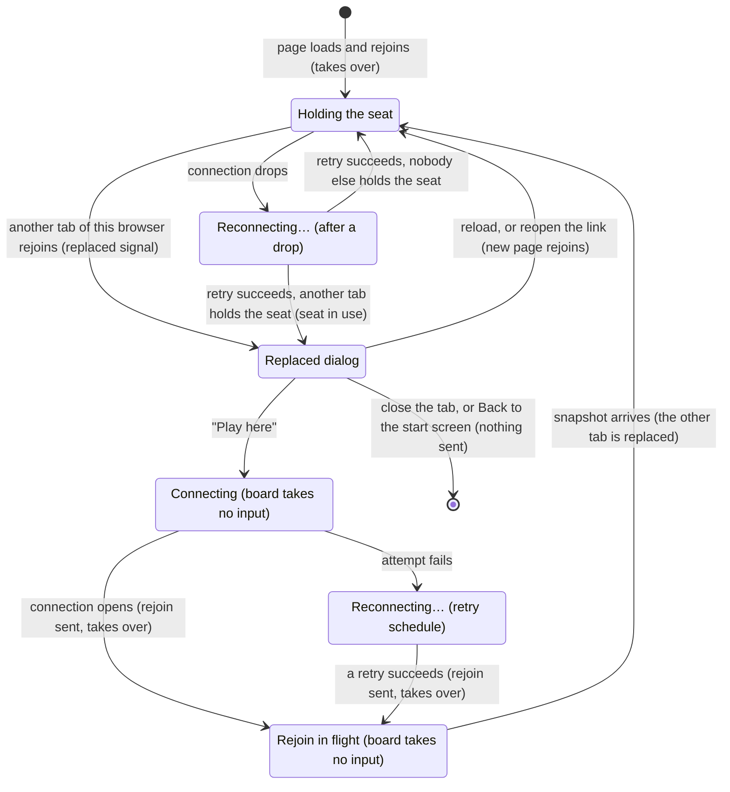

# A second tab

## Summary

A second tab is what happens when the same game is open in two tabs or windows of the same browser. Both share the game's [stored seat](../foundations/connection-and-seat.md#the-stored-seat), so both play the same color, and the server lets only one connection hold a seat. When a second tab opens the game, it [rejoins](../foundations/connection-and-seat.md#rejoining) and [takes over](../glossary.md#the-connection) the seat. The first tab's connection is closed with a signal that tells it not to retry, and it shows the [replaced dialog](../glossary.md#the-interface), "This game is open in another tab", over whatever it was showing. A tab whose connection was down at that moment learns the same thing differently: when its connection comes back, its automatic rejoin does not take over, the server answers that the seat is in use, and it shows the same dialog. The dialog's one button, "Play here", has keyboard focus; it opens a new connection that rejoins and takes the seat back, which in turn replaces the other tab. At any moment exactly one tab plays; every other tab of that game is a darkened, frozen picture of it with one button. This document owns the replaced dialog and "Play here". The rule behind them, [last connection wins](../foundations/connection-and-seat.md#last-connection-wins), belongs to the connection and seat model.

## The simple case

The player is White in a game in progress. They open the game's link again in a new tab of the same browser, perhaps by accident. The new tab shows the share-link screen for a moment, then the board screen at the default view, with "You are playing as white.", the full move list, and "Opponent: online". It is a working seat: the player can move from it.

At the same moment, the first tab darkens behind a white dialog. Its title is "This game is open in another tab", its text is "Your seat moved to the newer tab or window. Close this one, or take the game back here.", and below them is a "Play here" button, which has keyboard focus. Behind the dialog the board is exactly as it was, but nothing on the page can be reached, by pointer or by keyboard. The first tab stays like this for as long as it is open. It never tries to reconnect by itself.

The player can simply close the first tab. Or they can click "Play here" (or press Enter): the dialog disappears, and a moment later the first tab is live again. It shows any moves made in the meantime, with the latest one gliding in, and the view is still at the angle the player left it. Now the second tab shows the dialog. Throughout all of this the opponent sees only "Opponent: online"; they never see the player go offline.

## The interaction, event by event

The request narrated here is "Play here": taking the seat back from the tab that holds it. It begins with this tab being replaced, so the replacement itself is described first.

### Begin

#### How a tab is replaced

A tab is replaced when another tab or window of the same browser profile rejoins the same game and takes over the seat. That happens whenever a game page for the game loads there: the share link opened in a new tab, a bookmark, a duplicated tab, a restored browser session, or the other tab clicking "Play here". The newer page finds the stored seat and rejoins by itself, as every game page with a stored seat does; to that page this is an ordinary return to the game, described in [reloading and returning](reload-and-return.md). It shows the share-link screen until the snapshot arrives, then the screen the snapshot calls for, at the [default view](../foundations/the-view.md#the-default-view), with every move already in place and none gliding.

The server gives the seat to the newer connection at once. It then sends the newer tab its snapshot, tells it whether the opponent is connected, tells the opponent that the player is online, and finally closes the older tab's connection with the replaced signal.

> Technical note: The server closes the older connection with WebSocket close code 4001 and the reason `seat_replaced`. The browser treats that one code as "do not retry"; every other close, including one the tab detects by itself on a connection that died silently, starts the [retry schedule](../foundations/connection-and-seat.md#connection-states). The signal exists because the two tabs would otherwise take the seat from each other every half second forever.

In the older tab, the moment the signal arrives:

- the connection state becomes *replaced*, and the replaced dialog appears with no transition, with focus on "Play here";
- [the board stops taking input](../foundations/input-model.md#when-the-board-takes-input), so a selection is cleared and an open [promotion dialog](../play/promotion.md) closes without sending;
- a move of this tab's that was in flight gets no echo here; see the edge cases;
- nothing else changes: the position, the turn indicator, the move list, and the presence line stay exactly as they were, darkened behind the backdrop, and a drag of the view in progress runs on until release, as described in [the view](../foundations/the-view.md#cancel-and-interrupt).

#### A tab that was offline when the seat moved

The replaced signal can only reach a live connection. A tab whose connection had dropped, or had died without either side noticing, is *reconnecting* when the other tab takes the seat, and hears nothing. When its retry succeeds, it rejoins by itself as after any [drop](connection-loss.md), but that rejoin does not take over: the server finds the seat held by another tab's live connection and answers with [seat in use](../glossary.md#the-connection). The tab then shows the same replaced dialog, with focus on "Play here", over the picture it had before the drop. No error appears in the banner. The difference from a tab that got the signal is invisible except in one way: this tab's connection stays open, holding no seat, and it is still subject to drops; see "Leaving the dialog up" below.

The page does not say which tab or window took the seat, or when.

#### The replaced dialog

The dialog is a translucent dark backdrop over the whole window, slightly darker than the end-game dialog's, with a white panel in the middle, rounded, at most 420 px wide, with a margin around it on a narrow screen. The panel holds the heading "This game is open in another tab", the sentence "Your seat moved to the newer tab or window. Close this one, or take the game back here.", and a single "Play here" button in the browser's plain button style, larger than the text around it. Assistive technology is told it is a modal alert dialog, named by its heading and described by its sentence.

It is drawn above everything else on the game page: the [HUD](../glossary.md#input), the [end-game dialog](../play/check-and-game-end.md), the [error banner](../game-page/error-banner.md), and the [frozen-board banner](../cross-cutting/broken-game-record.md). Everything behind it is also made inert: it cannot be clicked, reached with Tab, or read by a screen reader. On the board screen that is the board, the whole HUD, and the end-game dialog if the game is over; on the share-link screen, the title, the link, "Copy link", and the error banner. So an error that was showing cannot be dismissed, and "Start new game" cannot be used, until the dialog goes. The dialog appears over whichever game page screen is showing: in practice the board screen, or the share-link screen of a creator whose game nobody has joined yet.

The dialog cannot be dismissed. There is no close button and no Cancel, Escape does nothing, and a click on the backdrop or on the panel does nothing. There is no timer, and nothing clears it on its own except, for a tab that met seat in use, a drop of its connection (see "Leaving the dialog up"). While it shows, the server treats the tab as holding no seat: the opponent's moves, presence changes, and everything else go to the tab that holds the seat.

#### The click

The click on "Play here", or Enter or Space on it, is the whole of the begin phase. The tab does not check whether another tab still holds the seat. It does not know, and it makes no difference: the request takes the seat from whichever connection holds it, or claims it if nobody does.

### End without sending

The request ends without sending in any of these ways. In none of them is anything sent or recorded.

- **Leaving the dialog up.** A tab that got the replaced signal stays replaced indefinitely. It does not reconnect when the other tab closes, when the window regains focus, when the network changes, or after any delay. If the newer tab is closed, the opponent sees "Opponent: offline", nobody holds the seat, and this tab goes on saying the game is open in another tab until the player clicks "Play here". A tab that met seat in use behaves the same way while its connection lasts; but if that connection drops (a network change, the [one-hour limit](../glossary.md#the-connection)), the dialog gives way to "Reconnecting…", and when a connection opens the tab asks again without taking over. If the other tab still holds the seat, the dialog comes back; if the other tab has gone, this tab quietly takes the seat and is live again.
- **Closing the tab.** Nothing reaches the server that affects the seat; the other tab keeps the seat, and the opponent notices nothing.
- **Browser Back to the start screen.** Arriving there [resets the connection](../foundations/connection-and-seat.md#returning-to-the-start-screen), which here means opening a fresh connection that belongs to no game. Nothing is sent about this game. Going Forward again, though, reopens the game page, and that page rejoins and takes the seat back.

A reload is not a way of ending without sending: the reloaded page rejoins by itself and takes the seat back, exactly as "Play here" does. The differences are those of any page load: the view starts again at the default view, and moves already in the record are drawn in place without a glide.

### Send

The click itself sends nothing. It opens a new connection, and the state becomes *connecting*. The rejoin is sent the instant that connection opens, automatically and once, and it takes over the seat, like a page load. It names the game and the color this page read from the stored seat when it loaded. The server, on receiving it:

- checks that the game exists and that the color is one of its taken seats;
- ties this connection to the seat, taking it from whichever connection held it;
- sends this tab the [snapshot](../glossary.md#requests): its color, whether both seats are taken, and the whole move record;
- tells this tab whether the opponent is connected, and tells the opponent that the player is online;
- closes the other tab's connection with the replaced signal, if another tab held the seat.

From here it cannot be taken back. The other tab has lost the seat whether or not this tab ever sees the answer.

### While in flight

The dialog disappears the moment "Play here" is clicked, whichever way the tab was replaced. The page under it is as it was: the same screen, position, move list, presence line, and view angle. Nothing says a connection is being opened. The "Reconnecting…" banner belongs to the *reconnecting* state, and this is *connecting*, so the page looks idle. The board does not take input, and the move box's "Move" button is disabled. The view can be turned, the move list scrolled, and a visible error dismissed.

If the connection cannot be opened (the network is down, or the server is restarting), the attempt fails and the tab moves to *reconnecting*: the amber "Reconnecting…" banner appears at the top right, and the [retry schedule](../glossary.md#the-connection) runs from its start, 0.5 s, then 1 s, 2 s, 4 s, and 8 s between attempts, until one succeeds. The rejoin goes out then, and it still takes over: the click's intent carries through the retries until a rejoin is answered. The replaced dialog does not come back unless that rejoin is refused again. See [connection loss](connection-loss.md).

Once the connection has opened and the rejoin is on its way, the board still does not take input: it waits for the snapshot, since the position it shows may be several moves out of date if play continued in the other tab.

### The answer arrives

**The snapshot.** This tab now holds the seat, and the page replaces what it knew with the snapshot.

- **On the board screen**, the position is redrawn from the full record. If the record has moves this board had not shown (played in the other tab, or by the opponent, since the replacement), the latest one [glides](../foundations/the-view.md#motion) in and a piece it captured fades; any earlier ones are simply in place. The last-move trace, the [move list](../game-page/move-list.md), the turn indicator, and the check glow follow the new position. If the game ended in the meantime, the [end-game dialog](../play/check-and-game-end.md) appears as the final move glides. If nothing was played in the meantime, nothing visibly changes.
- **The view is where the player left it.** The board screen was never taken down: a replaced tab keeps everything the server said on this page, so it stays in the playing phase throughout, with its camera untouched.
- **On the share-link screen**, the page stays there if nobody has joined yet. If the opponent joined while this tab was replaced, the board screen appears for the first time, at the default view, with the position drawn without a glide.
- **Presence** is updated from the server's fresh report: "Opponent: online" or "Opponent: offline" under the [seat label](../game-page/seat-and-opponent-status.md).
- **The board takes input.** If it is the player's turn, they can move from this tab; see [making a move](../play/making-a-move.md).

At the same moment the other tab is replaced: its dialog appears with focus on "Play here", its selection is cleared, and its promotion dialog, if open, closes. The opponent sees "Opponent: online" again.

**An error.** The only refusal a correct client can get here is "Cannot rejoin", when the game has expired (about 30 days without activity) while the tab sat replaced. The error banner shows it. A tab that had received a snapshot or seen the game start at any point keeps its stored seat and stays on its screen, connected but holding no seat, and its board does not take input. A tab that had done neither (a creator's original tab, still on the share-link screen it reached from the start screen) deletes the stored seat and falls back to the join screen. See [reloading and returning](reload-and-return.md) and [error messages](../cross-cutting/error-messages.md).

## Modifiers

| Modifier | At the start | Changes while in flight |
| --- | --- | --- |
| Your color | No effect. The dialog is the same for both colors, and the seat moves whole: every tab of the game plays the color in the stored seat. | Cannot change. |
| Whose turn it is | No effect on the dialog or on "Play here". On the player's turn, the game waits for a move from whichever tab holds the seat. | The other tab can move until the server moves the seat, and the opponent can move at any time; the snapshot, or an echo after it, shows either. |
| How you reached the page | No difference: a creator's original tab, a joiner's, and a returning player's tab are replaced and take the seat back in the same way. The newer tab is always a returning player, because it rejoins from the stored seat. A visitor can neither replace a tab nor be replaced. | Not applicable. |
| Connection state | A connected tab is replaced by the signal. A tab that is reconnecting when another tab takes the seat has no connection to close, so it gets no dialog then; when its own connection opens, its rejoin is answered with seat in use and the dialog appears. A tab that is connecting because its page has just loaded takes the seat instead: a page load takes over. After "Play here" the tab is connecting, then connected or reconnecting. | A failed attempt moves the tab to reconnecting with the "Reconnecting…" banner, and the rejoin, still taking over, is sent when a retry succeeds. A drop after the rejoin was sent loses the answer; the next connection rejoins again, still taking over, since no rejoin has been answered since the click. |
| Game state | In progress or in check: as described. Over: the replaced dialog sits above the end-game dialog, which is inert behind it, so "Start new game" can be neither clicked nor reached with Tab; after "Play here" the end-game dialog is still there. Frozen: the frozen-board banner is under the dialog, and after "Play here" the same record freezes at the same move again. | A move that ends the game can be recorded while the rejoin is in flight; the snapshot or the echo after it shows the end, and the end-game dialog appears. |
| Shift, Ctrl, or Cmd held | No effect. "Play here" is a button, not a link, so a modified click does not open a new tab. | No effect. |
| Input device | A mouse click, a tap, and Enter or Space all do the same thing. Focus is on "Play here" as soon as the dialog appears, so Enter alone answers it. | No effect; the button is gone once clicked. |

Nothing about the replacement depends on color, turn, or how the player arrived: the seat moves whole, and the game carries on in whichever tab holds it.

## Cancel and interrupt

"Before sending" is while the replaced dialog is showing; "while in flight" is from the click on "Play here" until the snapshot arrives, including the moment the connection is still opening.

| Event | Before sending | While in flight |
| --- | --- | --- |
| Escape or Cancel | No effect. There is no Cancel or close button, Escape does nothing, and a click on the backdrop does nothing. | No effect. The attempt cannot be called off from the page. |
| Pressing elsewhere or turning the view | The backdrop covers the whole window and sits above everything else, and the board and HUD behind it are inert, so no press or click reaches the board, the view, the HUD, the move list, or the error banner. The wheel does not zoom. | Once the dialog is gone, the view turns, the move list scrolls, and an error can be dismissed. Presses on the board do nothing until the snapshot arrives. |
| Leaving the game page within the app | Back to the start screen resets the connection to a fresh one with no game; nothing is sent, the other tab keeps the seat, and the opponent notices nothing. Forward again rejoins and takes the seat back. "Start new game" is inert under the dialog. | If the rejoin had not been sent yet, nothing happened. If it had, the seat moved here and the other tab shows the dialog; the reset then closes this tab's connection, so nobody holds the seat and the opponent sees "Opponent: offline". |
| The game ends | Not seen here: the final move goes to the tab that holds the seat. After "Play here" it glides in and the end-game dialog appears. A game that ended before the replacement keeps its end-game dialog under the replaced dialog. | The snapshot, or the echo after it, shows the final move; the end-game dialog appears. |
| The server answers with an error | Nothing is sent while the dialog is up, except by a tab that met seat in use and reconnects on its own (see "End without sending"); its repeated "seat in use" is not shown as an error. An error banner that was already showing stays under the backdrop and cannot be dismissed. | "Cannot rejoin" if the game has expired, in the error banner; see "The answer arrives". |
| The connection drops | A tab that got the replaced signal has no connection: network changes, sleep, a server restart, and the one-hour limit do nothing to it, and it never retries. A tab that met seat in use has one; a drop replaces the dialog with "Reconnecting…", and when a connection opens the tab asks again without taking over. | While connecting: the attempt fails, "Reconnecting…" appears, and the rejoin, still taking over, is sent when a retry succeeds. After the rejoin was sent: the answer is lost; the next connection rejoins again, still taking over. |
| The window loses focus or the tab is hidden | No effect. The dialog stays until clicked, and a replaced tab in the background gives no sign: the page title never changes. | No effect. The connection opens and the snapshot is handled in the background; a new move glides in when the tab is shown again. |
| Reload or closing the tab | Closing: nothing is sent and nothing changes elsewhere. Reload: the new page rejoins by itself and takes the seat back, at the default view and without a glide. | Closing: if the rejoin reached the server, this tab held the seat when it closed, so the opponent sees "Opponent: offline" and the other tab stays replaced. Reload: the new page rejoins again. |
| The opponent acts | Nothing reaches this tab. The opponent's moves, presence changes, and join go to the tab that holds the seat; the position and presence line behind the dialog go stale. | A move made before the server answers is in the snapshot; one made after arrives as an echo. Both land on this board. |
| Another tab takes the seat | No effect: this tab is already replaced. A third tab opening the game takes the seat from the second, and this one stays replaced. | If another tab takes over after this one's rejoin (a reload, a newly opened tab, or "Play here" there), this tab is replaced again and the dialog returns. A tab whose own dropped connection comes back does not take it: it meets seat in use instead. |
| A second touch point or a cancelled touch | A tap on the backdrop does nothing; a touch that is cancelled before it lifts does not click "Play here". | As on any board screen, see [the input model](../foundations/input-model.md#the-interrupt-events); the board does not take input until the snapshot arrives. |

After any interrupt the tab is in one of three places: still replaced (nothing was sent), holding the seat (the rejoin was answered), or gone (closed, reloaded, or on the start screen). A rejoin that reached the server has moved the seat, whatever happens to its answer.

## Interactions with other systems

**Seat and turn.** The seat moves between tabs whole: same game, same color, same turn. Replacing a tab never gives the player the other color, so a second tab of the same browser cannot be used to play both sides.

**The game record.** Neither a replacement nor "Play here" changes the record. Every rejoin reads the record in full, so the tab that takes the seat always starts from exactly the moves the other tab had. The one way the older tab can still affect the record is a move it sent at the very moment of the replacement; see the edge cases.

**Connection.** Replaced is the only [connection state](../foundations/connection-and-seat.md#connection-states) that is not retried, and a tab that got the replaced signal has no connection at all while in it. A tab that met seat in use is connected but holds no seat, and it is retried like any connection if that connection drops. "Play here" is the app's only manual way to reconnect. The connection it opens is new to the server, like any other, and rejoins like any other, except that its rejoin takes over.

**The opponent.** The opponent sees "Opponent: online" each time one of the player's tabs takes the seat, and never "offline" because of a replacement: the server does not count a replaced connection's closing as the player leaving, and a refused "seat in use" rejoin tells the opponent nothing. The opponent cannot tell which tab the player is in, or that there are two. They do see "Opponent: offline" when the tab that holds the seat closes, drops, or returns to the start screen, even if a replaced tab of the player is still open. The opponent's own second tab looks the same from this side; see [the opponent's move](../play/the-opponents-move.md#edge-cases).

**Other tabs and devices.** Only tabs and windows of the same browser profile share a stored seat, so only they replace each other. Each tab has its own [client id](../glossary.md#requests), which is how the server tells a tab's own stale connection (which an automatic rejoin may replace) from another tab's live one (which it may not). A second tab in a different browser, a different profile, or a private window has no stored seat for the game. It is a visitor: it shows the [join screen](../start/joining-a-game.md), and "Join Game" there is refused with "Game full" if both seats are taken, or claims the free seat as the opponent if one is still free. Tabs of different games never interfere. There is no way to move a seat to another browser or device.

**Game over.** The replaced dialog covers the end-game dialog. A finished game still has a seat to take: opening a finished game's link in a second tab replaces the first tab even though there is nothing left to play, and "Play here" brings back the same end-game dialog.

**Stored seat.** Shared by every tab of the browser profile, which is what makes a second tab a replacement instead of a visitor. A replacement, a "seat in use" answer, or "Play here" never writes or deletes it, except in the expired-game case above. "Play here" rejoins with the color the page read from storage when it loaded; it does not read storage again.

**Keyboard, touch, and screen size.** When the dialog appears, focus moves to "Play here", so Enter or Space answers it at once. Everything behind the dialog is inert, so Tab reaches nothing on the page but "Play here": not the error banner's "✕", the move box, "Copy link", or the end-game dialog's "Start new game". Focus is not trapped, though: Tab moves on from "Play here" to the browser's own controls. Escape does nothing. A tap works like a click. The panel is at most 420 px wide, with a margin around it, and its text wraps, so it fits a phone screen. See [accessibility](../cross-cutting/accessibility.md) and [screen sizes and touch](../cross-cutting/screen-sizes-and-touch.md).

## Edge cases

- **Checking your own share link.** The most common way to meet this dialog: a creator opens the share link in a new tab of the same browser to see whether it works. The new tab rejoins as the creator, not as the opponent, and the first tab shows the dialog over its share-link screen. When a real opponent joins, only the newer tab moves to the board screen; the first tab reaches it only after "Play here" or a reload. [Creating a game](../start/creating-a-game.md) says how to play both sides on one computer.
- **A reload is not a second tab.** A reloaded page is a new connection that rejoins, and if the server still has the old page's connection open, it closes that one with the replaced signal. The old connection belonged to the page that was reloaded, so there is nowhere for a dialog to appear. See [reloading and returning](reload-and-return.md).
- **The newer tab is closed.** A replaced tab stays replaced. It is not told, it does not take the seat over, and its dialog still says the game is open in another tab. The opponent sees "Opponent: offline" until the player clicks "Play here" or reloads, or, for a tab that met seat in use, until that tab's connection next drops and it reconnects into the free seat.
- **A tab that was reconnecting does not take the seat back.** A tab whose connection had dropped when the other tab took the seat shows the replaced dialog when its retry succeeds, instead of taking the seat. A typical case: the server is unreachable, the player opens the link in a new tab while the first tab shows "Reconnecting…", and when the server is back the first tab to reconnect keeps the seat and the other shows the dialog. If nobody holds the seat when a reconnecting tab gets through (the other tab was closed, or is itself reconnecting), it takes the seat quietly.
- **A duplicated tab.** Duplicating a tab copies its client id along with its page. The duplicate takes the seat when it loads, like any new tab, but if the original was reconnecting at that moment, the original's rejoin is taken for the same tab's stale connection and takes the seat back without a click; the duplicate then shows the dialog.
- **Two tabs opening together.** A restored browser session or two tabs loaded at once both rejoin and both take over; whichever rejoin the server handles last keeps the seat, and the other tab shows the dialog.
- **Two tabs after a server restart.** Both tabs drop at once. Neither takes over when it reconnects, so the first to get through holds the seat and the second shows the dialog, even if the player was using the second.
- **Three or more tabs.** The latest tab to take over holds the seat, and every other tab of the game shows the dialog. "Play here" in any of them takes the seat from whichever tab holds it.
- **A move sent at the moment of replacement.** A move the older tab sent just before it was replaced was either recorded or lost. If the server recorded it before handling the newer tab's rejoin, its echo reaches the older tab first: the piece glides, and then the dialog appears. If the server recorded it after moving the seat, the echo goes to the tab that now holds the seat and to the opponent, not to the tab that made it: the move glides in on the newer tab, which did not make it. If the server never handled it, it is lost. The older tab learns which from the snapshot after "Play here"; see [making a move](../play/making-a-move.md#cancel-and-interrupt).
- **The board waits after "Play here".** For the one round trip between the new connection opening and the snapshot arriving, the board shows the position this tab last saw, which can be several moves old, and takes no input; nothing can be played against it.
- **Two tabs on the join screen.** A visitor with the game open in two tabs clicks "Join Game" in one and takes the free seat. The other tab still shows the join screen, because it read storage when it loaded. Its "Join Game" is refused with "Game full"; reloading it rejoins from the stored seat that the first tab wrote, and replaces the first tab.
- **The picture behind the dialog is stale.** The darkened position, turn indicator, move list, and "Opponent: online" behind the dialog are from the moment of the replacement, or, after seat in use, from before the drop. The game may have moved on, and the opponent may have left.
- **A double click on "Play here".** The dialog is gone after the first click, so the second click lands on the page underneath, where the board does not take input yet.
- **The page title** stays "3D Chess — Online Multiplayer" in every tab, replaced or not, so the browser's tab strip does not show which tab holds the seat.

## Open questions and verification

- **A reconnecting tab no longer takes the seat back, except from a duplicate of itself.** An automatic rejoin sends `takeover: false` once the page has held its seat (`client/src/screens/GameScreen.tsx:121-123`, `:131-146`); "Play here" sets it back to true until the next answer (`:216-219`). A fresh page that has not yet had a rejoin answered keeps taking over. The server refuses a rejoin that does not take over with "seat in use" only when the live connection's client id differs (`server/modal_app.py:417-425`), and a duplicated tab copies its original's id (`client/src/lib/clientId.ts`), so between a tab and its duplicate the old behavior remains. [Bug triage](../bug-triage.md) B-06 records the decision that the tab the player chose keeps the seat. The scripted rerun after the fix confirmed that the reconnecting tab shows "Play here" instead of taking the seat back.
- **Focus is not trapped.** "Play here" takes focus when the dialog appears (`GameScreen.tsx:304`), and everything behind it is inert: the board and HUD (`:338`, `:341`), the end-game dialog (`:456-457`), and on the share-link screen the page content and the error banner (`:470-471`, `:500-502`). Tab can still leave the page for the browser's own controls. Read from code and `client/src/App.test.tsx`; the tab order was not checked by hand. See [accessibility](../cross-cutting/accessibility.md).
- **The seat-in-use dialog shows only while connected.** The page shows it while the current connection is open and has received "seat in use" and no seat (`GameScreen.tsx:83-86`). That is why it closes at once on "Play here", and why a drop of that tab's connection shows "Reconnecting…" instead until the next answer. Read from code; not observed.
- **The older connection stays in service for a moment.** The server moves the seat first (`server/modal_app.py:429-432`) and closes the older connection only after three awaited sends (`:449-455`). A move arriving from the older tab in that interval is handled with the older connection's seat, recorded if in turn, and echoed only to the newer tab and the opponent. Whether frames arriving after the close has been sent, but before the closing handshake completes, are still handled depends on the web server library; read from the library, not reproduced.
- **Nobody holds the seat after the newer tab closes**, while a tab that got the replaced signal still says the game is open in another tab and the opponent sees "Opponent: offline". Whether that tab should notice, or take the seat back by itself, is a product call.
- Whether two tabs of the same private window share storage with each other (and so replace each other like normal tabs) is browser behavior. It is expected in current browsers but was not checked.
- The expired-game path ("Cannot rejoin" after "Play here") is read from code and was not tried.
- That the view keeps its angle across "Play here" is read from `GameScreen.tsx`: the message log is kept, so the page never leaves the playing phase and the board screen is never rebuilt. That moves made in the other tab glide in on "Play here" is read from `client/src/three/Board.tsx`. Both were observed by the first scripted pass (TAB-01).
- The rest is covered by tests. `client/src/hooks/useGameSocket.test.ts` covers the tab staying down after the replaced signal and reconnecting only on request with its log kept. `client/src/App.test.tsx` covers the dialog, the absence of the "Reconnecting…" banner, "Play here", the dialog over the share-link screen, focus on "Play here" with the board behind it inert, and a reconnect answered with seat in use showing the dialog and no banner, then "Play here" taking over. `server/tests/test_local_ws.py` covers close code 4001 with reason `seat_replaced`, the opponent seeing online and never offline, the newer connection playing on (`test_rejoin_replaces_lingering_socket`), and a rejoin that does not take over being refused while another tab holds the seat, replacing its own stale connection, and taking a free seat (`test_automatic_rejoin_does_not_take_the_seat_from_another_tab`, `test_automatic_rejoin_replaces_its_own_stale_socket`, `test_automatic_rejoin_takes_a_free_seat`). `client/e2e/session.spec.ts` covers the takeover, stability over time, "Play here" restoring the full history, and the seat working again afterwards.

Verified against 3D Chess commit `4e18386`
