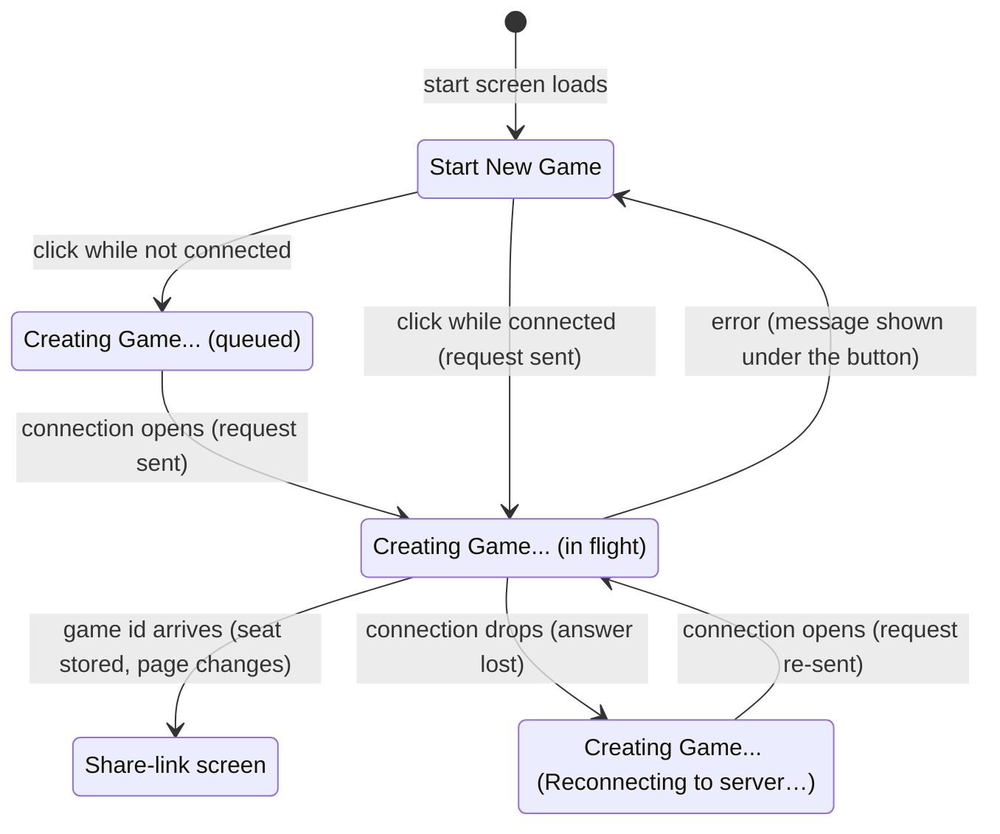

# Creating a game

## Summary

Creating a game turns one click on the start screen into a new game on the server, with this browser holding one of its two seats, and takes the player to that game's page to wait for an opponent. It lives on the [start screen](../glossary.md#the-product-and-its-screens) at `/`, the page every visit to the app's root address shows, and it is the only way a game comes into existence. The "Start New Game" button is the whole feature: there are no options, no name to enter, and no choice of color. The button works in every [connection state](../glossary.md#the-connection) the start screen can be in; a click made before the connection is open waits for it, and a request whose answer is lost to a drop is [re-sent](../glossary.md#requests) when the connection comes back.

## The simple case

The player opens the app's address. The start screen shows the title "3D Chess" and a white "Start New Game" button in the middle of a dark page. For a moment a gray line under the button says "Connecting to server…"; it disappears once the connection is open.

The player clicks "Start New Game". The button turns pale, stops responding, and reads "Creating Game...". Almost at once the address changes to `/game/{id}`, where `{id}` is the new [game id](../glossary.md#games-and-seats), and the page shows the [share-link screen](../start/waiting-for-an-opponent.md): "Game created! Share this link with a friend:", the link, and a "Copy link" button.

The player now holds one seat of the new game, white or black, chosen at random by the server. The page does not say which until an opponent joins and the board appears. The browser remembers the seat as the game's [stored seat](../foundations/connection-and-seat.md#the-stored-seat), so the player can close the tab and come back through the link.

## The interaction, event by event

### Begin

The start screen loads with the button enabled and nothing focused. The app opens its [connection](../foundations/connection-and-seat.md#connection-states) as it loads; until the connection is open, the gray status line reads "Connecting to server…", or "Reconnecting to server…" after the first failed attempt. The button does not wait for the connection: it is enabled from the first moment.

If the player arrived from a game (the [end-game dialog](../play/check-and-game-end.md)'s "Start new game", browser Back, or the crash screen's "Back to start"), the connection is [reset](../glossary.md#events-that-end-or-interrupt-a-request) as the start screen appears, and anything the server said about the old game is ignored from then on. Nothing on the start screen refers to earlier games: it does not list them and cannot resume one, even when the browser has stored seats for several.

The click is the whole of the begin phase. At that instant the start screen marks where its answer will start: only messages that arrive after the click count as the reply. An error still visible from an earlier attempt disappears at the same moment.

### End without sending

There is no way to end the request without sending it. The one exception is timing: a click made while the connection is not open is [queued](../glossary.md#requests), not sent. The button reads "Creating Game..." and is disabled exactly as if the request were in flight, and the status line goes on showing the connection state. Leaving the page (Back, reload, closing the tab) at this point discards the queued request; nothing reaches the server and nothing is recorded.

A player who opens the start screen and never clicks leaves no trace: no game is created and nothing is stored in the browser.

### Send

The request leaves the browser the instant the button is clicked on an open connection, or the instant the connection opens for a queued click. It carries this tab's [client id](../glossary.md#requests) and nothing else. From here it cannot be taken back. The server, on receiving it:

- picks a new game id that no existing game uses;
- picks white or black at random for the creator;
- records the game with that one seat taken, remembers the client id as the seat's claimant, and starts an empty [move record](../glossary.md#games-and-seats);
- ties this connection to the game and seat, so that everything else sent on the connection is on the creator's behalf;
- answers with the game id and the creator's color.

The game exists from this moment whether or not the answer ever reaches the player.

### While in flight

The button stays pale, disabled, and labeled "Creating Game...". A second click does nothing, so a double click creates one game, not two. The status line, if the connection is not open, stays visible beside it. Nothing else on the page changes and nothing else can be done on it; the player can only wait or leave. On an ordinary connection this lasts a fraction of a second.

If the connection drops before the answer arrives, the answer is lost with it. The button stays at "Creating Game...", "Reconnecting to server…" appears under it, and the browser retries on its [retry schedule](../glossary.md#the-connection). When a connection opens, the page sends the request again on it, and goes on doing so on every new connection until an answer arrives. The player does nothing and sees nothing but the status line coming and going.

> Technical note: The server forgets a connection the moment it drops, so the answer to a request sent on it can never arrive on the next one. Repeating the create is safe: if the first request had reached the server, it made a game whose id no browser ever learns. That game waits with one seat taken and is deleted by [expiry](../glossary.md#games-and-seats) about 30 days later, like any other unused game.

### The answer arrives

On success, two things happen in order: the browser writes the stored seat for the new game (key: the game id, value: the color), and then the page moves to `/game/{id}` as a new entry in the browser's history. The game page recognizes that this connection already holds the seat, so it does not rejoin; it shows the share-link screen straight away. What happens from there is described in [waiting for an opponent](waiting-for-an-opponent.md).

On an error, the start screen shows it in red under the button as "Error: " followed by the server's message, and the button returns to "Start New Game", enabled. Nothing is re-sent after an error. Clicking again sends a fresh request and clears the message. The only error the server can give a correct client here is "Already in a game", which cannot happen in practice because the connection is always fresh on the start screen; the client itself reports "Received a malformed message from the server" if the answer cannot be read. Both are listed in [error messages](../cross-cutting/error-messages.md).

## Modifiers

| Modifier | At the start | Changes while in flight |
| --- | --- | --- |
| Your color | Not decided yet. The server picks it at random when it creates the game, and the start screen never shows it. | No effect. A re-sent request makes a new game with its own random color. |
| Whose turn it is | No game yet. No effect. | No effect. |
| How you reached the page | The start screen looks and behaves the same whether the address was typed, opened from a bookmark, or reached from a game. Arriving from a game resets the connection first and ignores the old game's messages. | Leaving the start screen while in flight: see "Leaving the game page within the app" below. |
| Connection state | Connected: the request is sent on the click. Connecting or reconnecting: the click is queued and sent when the connection opens. Replaced cannot occur here: reaching the start screen resets the connection. | A drop while in flight loses the answer; the request is re-sent when a connection opens. See "The connection drops" below. |
| Game state | No game yet. No effect. | No effect. |
| Shift, Ctrl, or Cmd held | No effect. The button is a button, not a link, so Ctrl-click or Cmd-click does not open a new tab. | No effect. |
| Input device | A mouse click, a tap, and Enter or Space on the focused button all do the same thing. The button is reached by Tab; nothing is focused on arrival. | No effect; the button ignores input while in flight. |

Nothing the player can change mid-way alters the request: the color is the server's choice, and the request carries no options.

## Cancel and interrupt

| Event | Before sending | While in flight |
| --- | --- | --- |
| Escape or Cancel | No effect. There is no Cancel control and Escape is ignored. | No effect. The request cannot be cancelled; the button stays disabled until the answer. |
| Pressing elsewhere or turning the view | There is no board on this screen. Clicking the page around the button does nothing. | Same. |
| Leaving the game page within the app | Back or Forward leaves the start screen. A queued request is discarded; nothing was sent or recorded. | Back or Forward leaves the start screen before the answer. Nothing re-sends the request after that, and the answer, when it comes, is ignored: no seat is stored and the page does not move. The game still exists on the server, tied to this tab's connection. See the edge cases. |
| The game ends | Not applicable: no game yet. | Not applicable. |
| The server answers with an error | Not applicable: nothing sent yet. | "Error: {message}" in red under the button; the button returns to "Start New Game" and works again. |
| The connection drops | The status line appears ("Reconnecting to server…"). The button still works, and a click is queued. | The answer is lost. "Reconnecting to server…" appears and the button stays at "Creating Game...". When a connection opens, the request is sent again; its answer takes the player to the new game. If the first request had reached the server, that first game is left unused on the server. |
| The window loses focus or the tab is hidden | No effect. The connection stays open in a background tab. | No effect. The answer is handled when it arrives, and the page moves to the game even in a background tab. |
| Reload or closing the tab | Nothing is recorded; a queued request is discarded. After a reload the start screen is fresh. | The answer is lost, and nothing re-sends the request. If the server received it, a game exists with one seat taken whose id no browser knows; it is deleted after about 30 days. |
| The opponent acts | No opponent yet. | No opponent yet. |
| Another tab takes the seat | Not applicable. Each tab has its own connection and creates its own games; start screens in other tabs are unaffected. | Not applicable. |
| A second touch point or a cancelled touch | A touch that is cancelled before it lifts does not click the button. | No effect. |

After any interrupt the player stays on the start screen, or reaches the new game once a re-sent request is answered, except when the page itself went away. Nothing is saved in the browser until a successful answer, so an interrupted create never leaves a stored seat behind.

## Interactions with other systems

**Seat and turn.** The creator gets one seat at random and learns which only when the board appears. White always moves first, so a creator who got black starts by waiting for the joiner's move.

**The game record.** The server records the game with one seat taken and no moves, and remembers which client id claimed the seat. A game has no name, no settings, and no time limit; there is nothing else to record. A create re-sent after a drop can leave a second, unused game behind.

**Connection.** The request travels on the app's single connection. After a successful create, the server treats that connection as the creator's seat in the new game until it closes. A later connection (after a drop or a reload) has to [rejoin](../foundations/connection-and-seat.md#rejoining), which the game page does by itself. A drop before the answer is covered by re-sending the request, not by a rejoin: until the answer arrives, the browser does not know which game to rejoin.

**The opponent.** There is none yet. The game waits for someone to open the share link and click "Join Game"; see [joining a game](joining-a-game.md).

**Other tabs and devices.** Start screens in several tabs create separate games. The stored seat, however, is shared by every tab of the same browser: opening the new game's share link in another tab of the same browser rejoins as the creator and takes the seat from the first tab (see [a second tab](../session/second-tab.md)) instead of joining as the opponent. To play both sides on one computer, open the link in a different browser or a private window.

**Game over.** Not applicable.

**Stored seat.** Written the moment the answer arrives, before the page changes, so that even a tab closed right after the page changes can come back through the link. If the browser refuses to store it (storage disabled), the write fails silently; see the edge cases.

**Keyboard, touch, and screen size.** The button can be reached with Tab and pressed with Enter or Space; it shows a blue focus ring. A tap works like a click. The screen is a single centered column and fits any window width; see [screen sizes and touch](../cross-cutting/screen-sizes-and-touch.md).

## Edge cases

- **Coming back from a finished game.** "Start new game" in the end-game dialog lands on the start screen while the old game's messages are still in memory for a moment. The start screen ignores everything that arrived before its own click, so it does not mistake the old game for a new answer and bounce the player back into it.
- **A stale error.** An error that arrived before the click (for example from the previous page) is never shown on the start screen. An error from the previous attempt is cleared by the next click.
- **Every click is a new game.** There is no "resume" and no list of games, even when the browser holds stored seats. A player who wants an earlier game needs its link.
- **Game id collisions.** The server never reuses an id that is still stored; it draws again until the id is free.
- **A long outage mid-create.** The button stays at "Creating Game..." for as long as the server cannot be reached, with "Reconnecting to server…" under it, and the page moves to the new game on the first connection that gets an answer. Nothing tells the player that the request will be repeated; the only way to give up is to leave or reload.
- **Storage disabled.** When the browser will not store the seat, the create still succeeds and the page still moves to the game, but the game page, which reads the stored seat, finds none and shows the creator the [join screen](joining-a-game.md) instead of the share link. Clicking "Join Game" there shows "Joined game, waiting for start..." with "Error: Already in a game", because the connection already holds the creator's seat; the board still appears when the opponent joins, since the connection is the creator's. If the connection drops while that page shows "Joined game, waiting for start...", the join is re-sent on the next connection, and the server, recognizing the creator's client id, hands back the creator's own seat with a snapshot saying the game has not started: the page stays on "Joined game, waiting for start..." (the old error still in the banner), now holding the seat on the new connection, and the board appears when the opponent joins. A reload loses the seat: a browser that refuses storage cannot keep the tab's client id across a reload either, so the reloaded page is a new client, and its "Join Game" takes the other seat. This looks like a bug; see open questions.
- **Back within the round trip.** If the player presses Back in the fraction of a second between the click and the answer, and Back leads to an earlier game's page, that page opens on a connection the server has just tied to the new game. Its automatic rejoin is refused with "Error: Already in a game", and it shows the earlier game's share-link screen until reloaded. The new game is created but its id is never shown.
- **A malformed answer.** A reply the browser cannot read shows "Error: Received a malformed message from the server" and re-enables the button, like any error.
- **The page title** stays "3D Chess — Online Multiplayer" throughout.

## Open questions and verification

- A create re-sent after a drop can leave the first game orphaned on the server, with one seat taken and no browser that knows its id. It costs nothing visible and expires like any unused game; whether that is acceptable is a product call.
- With browser storage disabled, the creator lands on the join screen instead of the share-link screen, and a reload loses the seat ([bug triage](../bug-triage.md) B-11). Read from code: the game page reads the seat only from storage and does not count the creation answer as an assigned seat (`client/src/game/session.ts:35-50`, `client/src/screens/GameScreen.tsx:37-39`, `:149-155`). The re-sent join after a drop in that state is also read from code: the server hands a claimant its own seat back (`server/modal_app.py:152-156`) and answers with a snapshot of the record, which says the game has not started (`:374-389`). Neither was confirmed in a browser with storage disabled.
- The Back-within-the-round-trip case is read from code; it depends on a race of a few tens of milliseconds and was not reproduced.
- How long "Connecting to server…" lasts on a cold server (the first connection after the server has been idle or redeployed) is a property of the deployment and was not measured.
- Everything else was read from `client/src/screens/StartScreen.tsx` (the re-send at `:43-48`), `client/src/hooks/useResendOnReconnect.ts`, `client/src/hooks/useGameSocket.ts`, `client/src/lib/clientId.ts`, `server/modal_app.py` (`create_game` at `:121-137`), `client/src/App.test.tsx` (including the create re-sent after a drop), and `client/e2e/createGame.spec.ts` / `gameOver.spec.ts`; the simple case is exercised by the end-to-end suite.

Verified against 3D Chess commit `90142a3`
