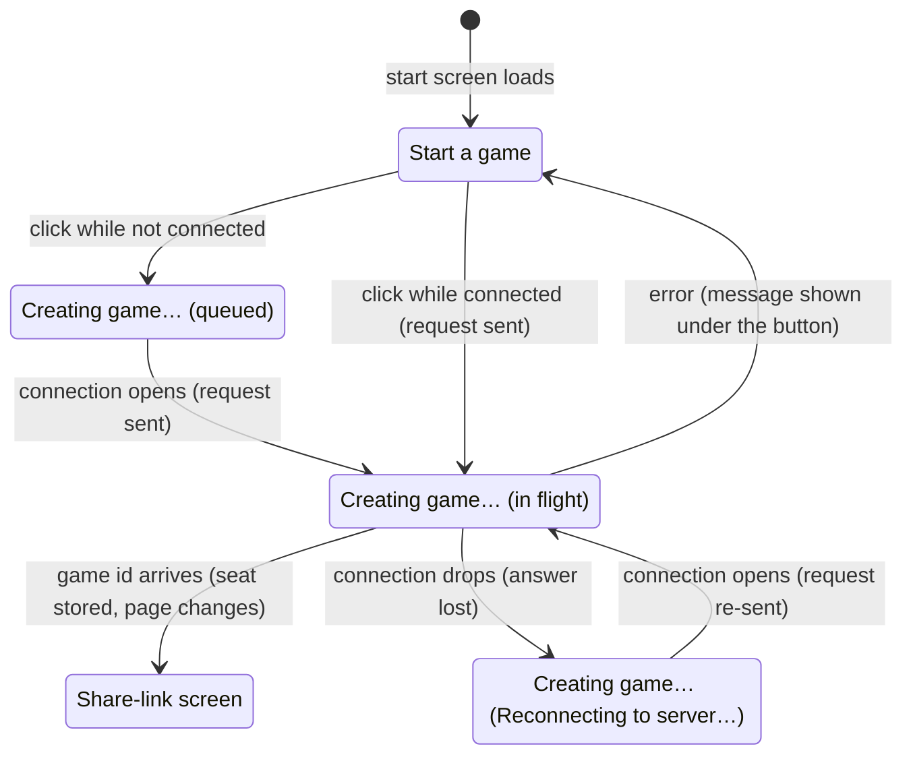

# Creating a game

## Summary

Creating a game turns one click on the start screen into a new game on the server, with this browser holding one of its two seats, and takes the player to that game's page to wait for an opponent. It lives on the [start screen](../glossary.md#the-product-and-its-screens) at `/`, the page every visit to the app's root address shows, and it is the only way a game comes into existence. The "Start a game" button is the whole feature: there are no options, no name to enter, and no choice of color. Behind it the page shows a [preview](#the-preview) of the game playing itself, which is decoration and takes no input. The button works in every [connection state](../glossary.md#the-connection) the start screen can be in; a click made before the connection is open waits for it, and a request whose answer is lost to a drop is [re-sent](../glossary.md#requests) when the connection comes back.

## The simple case

The player opens the app's address. The whole window is a night scene: the glass tower of the [board screen](../foundations/the-view.md#the-scene) stands in the middle of its garden, turning slowly, while a game plays itself on it. Above the tower stands the title "3D Chess"; below it, the "Start a game" button: a pale pill with a small charcoal knight before the words, ringed by a rim of the five levels' colors that turns slowly round it (a turn every 9 seconds), glowing cyan on its left and rose on its right. Under a hovering mouse it lifts a little and the knight hops. A round "Pause preview" button sits at the top right. There is nothing else: the page says nothing about the connection, which opens in the background, and the space under the button stays empty until there is [something to say there](#the-line-under-the-button).

The player clicks "Start a game". The pill turns dark, its rim spins fast, a breathing dot takes the knight's place, and it reads "Creating game…"; it no longer responds. Almost at once the address changes to `/game/{id}`, where `{id}` is the new [game id](../glossary.md#games-and-seats), and the page shows the [share-link screen](../start/waiting-for-an-opponent.md): "Game created! Share this link with a friend:", the link, and a "Copy link" button.

The player now holds one seat of the new game, white or black, chosen at random by the server. The page does not say which until an opponent joins and the board appears. The browser remembers the seat as the game's [stored seat](../foundations/connection-and-seat.md#the-stored-seat), so the player can close the tab and come back through the link.

### The preview

The game on the tower is always the same short game of 17 moves, ending in checkmate by White. Nothing about it is live: it is not a game on the server, and it is the same in every browser. The tower opens on the starting position, holds it for about 3 seconds, and then a move lands every 2.2 seconds, gliding, capturing, and checking exactly as on the board screen, with the last move's mint line and a king in check among the dark blades. At the mate the black king topples and the pulse spreads across his level, and a little over a second after the mating move "Checkmate · White wins" fades in under the button, in small capitals (if nothing more important is showing there, see [the line under the button](#the-line-under-the-button)). The finished game holds for 5 seconds, a black veil closes over the window in 0.7 seconds, the board is set up again under it, and the veil opens on the starting position in 0.9 seconds, which holds for 2 seconds before the first move; the result line goes as the veil shuts. A whole game takes about 44 seconds, and it repeats for as long as the page is open.

All the while the camera circles the tower at one height, a little above the board screen's opening view, a full turn every two games (about 90 seconds), so every game begins, and its mate lands, at one of the same two angles. The tower is framed alone, larger than on the board screen, between the title above and the button below: the preview draws no file, rank, or level labels. The preview belongs to neither player.

The preview takes nothing from the player: a click, drag, wheel turn, or touch on it does nothing, the view cannot be turned or zoomed by hand, and a screen reader skips it and reads instead "Preview: a sample game plays itself on the five-level tower and ends in checkmate by White." "Pause preview" stops it (see [modifiers](#modifiers)), and a player whose system asks for reduced motion sees it still.

### The line under the button

The space under the button holds one line at a time, the first of these that applies, or nothing:

1. An error answering this page's request: "Couldn't start a game: " and the server's message, in red. It is an alert, so a screen reader announces it.
2. The connection's state, only while the player's request is waiting for the connection: "Connecting to server…", or "Reconnecting to server…" after a failed attempt or a drop, beside a breathing dot. It is a status, which a screen reader announces politely. Before a click, and after an answer, the page never mentions the connection, whatever state it is in.
3. While the moving preview's mate stands on the board: "Checkmate · White wins". A screen reader does not read it. The still preview shown for reduced motion never shows it.
4. Otherwise nothing. The space stays reserved, so the button never moves when a line comes or goes.

Because it is one line, an error or the connection's state hides the preview's result. Each new line fades in.

## The interaction, event by event

```mermaid
stateDiagram-v2
    state "Start a game" as ready
    state "Creating game… (queued)" as queued
    state "Creating game… (in flight)" as creating
    state "Creating game… (Reconnecting to server…)" as retrying
    state "Share-link screen" as share
    [*] --> ready : start screen loads
    ready --> queued : click while not connected
    queued --> creating : connection opens (request sent)
    ready --> creating : click while connected (request sent)
    creating --> share : game id arrives (seat stored, page changes)
    creating --> ready : error (message shown under the button)
    creating --> retrying : connection drops (answer lost)
    retrying --> creating : connection opens (request re-sent)
```

### Begin

The start screen loads with the button enabled, nothing focused, and the preview playing from the start of its game. The app opens its [connection](../foundations/connection-and-seat.md#connection-states) as it loads, without a word on the page, even while the connection is still opening or retrying. The button does not wait for the connection: it is enabled from the first moment.

If the player arrived from a game (the [end-game dialog](../play/check-and-game-end.md)'s "Start new game", browser Back, or the crash screen's "Back to start"), the connection is [reset](../glossary.md#events-that-end-or-interrupt-a-request) as the start screen appears, and anything the server said about the old game is ignored from then on. Nothing on the start screen refers to earlier games: it does not list them and cannot resume one, even when the browser has stored seats for several.

The click is the whole of the begin phase. At that instant the start screen marks where its answer will start: only messages that arrive after the click count as the reply. An error still visible from an earlier attempt disappears at the same moment.

### End without sending

There is no way to end the request without sending it. The one exception is timing: a click made while the connection is not open is [queued](../glossary.md#requests), not sent. The button reads "Creating game…" and ignores presses exactly as if the request were in flight, and only now does the line under it show the connection's state, "Connecting to server…" or "Reconnecting to server…", until the connection opens and the request is sent. Leaving the page (Back, reload, closing the tab) at this point discards the queued request; nothing reaches the server and nothing is recorded.

A player who opens the start screen and never clicks leaves no trace: no game is created and nothing is stored in the browser.

### Send

The request leaves the browser the instant the button is clicked on an open connection, or the instant the connection opens for a queued click. It carries this tab's [client id](../glossary.md#requests) and nothing else. From here it cannot be taken back. The server, on receiving it:

- picks a new game id that no existing game uses;
- picks white or black at random for the creator;
- records the game with that one seat taken, remembers the client id as the seat's claimant, and starts an empty [move record](../glossary.md#games-and-seats);
- ties this connection to the game and seat, so that everything else sent on the connection is on the creator's behalf;
- answers with the game id and the creator's color.

The game exists from this moment whether or not the answer ever reaches the player.

### While in flight

The button stays dark, labeled "Creating game…", and does nothing when pressed, so a double click creates one game, not two. It keeps keyboard focus if it had it: Enter or Space on it again does nothing, and Tab moves on from it as before. The line under it shows the preview's result or nothing, as before the click, or the connection's state if the request was queued and the connection has not opened yet. The preview plays on and "Pause preview" still works; nothing else can be done on the page, and the player can only wait or leave. On an ordinary connection this lasts a fraction of a second.

If the connection drops before the answer arrives, the answer is lost with it. The button stays at "Creating game…", "Reconnecting to server…" appears under it, and the browser retries on its [retry schedule](../glossary.md#the-connection). When a connection opens, the page sends the request again on it, and goes on doing so on every new connection until an answer arrives. The player does nothing and sees nothing but the connection's state coming and going in the line under the button.

> Technical note: The server forgets a connection the moment it drops, so the answer to a request sent on it can never arrive on the next one. Repeating the create is safe: if the first request had reached the server, it made a game whose id no browser ever learns. That game waits with one seat taken and is deleted by [expiry](../glossary.md#games-and-seats) about 30 days later, like any other unused game.

### The answer arrives

On success, two things happen in order: the browser writes the stored seat for the new game (key: the game id, value: the color), and then the page moves to `/game/{id}` as a new entry in the browser's history. The game page recognizes that this connection already holds the seat, so it does not rejoin; it shows the share-link screen straight away. What happens from there is described in [waiting for an opponent](waiting-for-an-opponent.md).

On an error, the start screen shows it in red in the line under the button as "Couldn't start a game: " followed by the server's message, and the button returns to "Start a game", enabled. Nothing is re-sent after an error. Clicking again sends a fresh request and clears the message. The only error the server can give a correct client here is "Already in a game", which cannot happen in practice because the connection is always fresh on the start screen; the client itself reports "Received a malformed message from the server" if the answer cannot be read. Both are listed in [error messages](../cross-cutting/error-messages.md).

## Modifiers

| Modifier | At the start | Changes while in flight |
| --- | --- | --- |
| Your color | Not decided yet. The server picks it at random when it creates the game, and the start screen never shows it. | No effect. A re-sent request makes a new game with its own random color. |
| Whose turn it is | No game yet. No effect. | No effect. |
| How you reached the page | The start screen looks and behaves the same whether the address was typed, opened from a bookmark, or reached from a game. Arriving from a game resets the connection first and ignores the old game's messages. | Leaving the start screen while in flight: see "Leaving the game page within the app" below. |
| Connection state | Connected: the request is sent on the click. Connecting or reconnecting: the click is queued and sent when the connection opens. Replaced cannot occur here: reaching the start screen resets the connection. | A drop while in flight loses the answer; the request is re-sent when a connection opens. See "The connection drops" below. |
| Game state | No game yet. No effect. | No effect. |
| Shift, Ctrl, or Cmd held | No effect. The button is a button, not a link, so Ctrl-click or Cmd-click does not open a new tab. | No effect. |
| Input device | A mouse click, a tap, and Enter or Space on the focused button all do the same thing. The button is the first thing Tab reaches, and "Pause preview" the second; nothing is focused on arrival. | No effect; the button ignores input while in flight but keeps focus and stays in the Tab order. |

Nothing the player can change mid-way alters the request: the color is the server's choice, and the request carries no options.

Two settings change the preview, never the request:

- **"Pause preview"** stops the preview where it stands: the game, the camera's turn, the veil, and every glimmer on the board (the canvas stops drawing altogether). The button stays pressed (a screen reader hears "Pause preview, pressed") and shows a play triangle instead of its two bars; pressing it again carries on from the same moment. The line under the button keeps what it showed. If the window changes size while paused, the still preview is redrawn to fit.
- **Reduced motion.** When the player's system asks for less motion, the preview is a still picture of the game's final position: the mating move's line and the check showing, the black king still standing, the camera at its opening angle. Nothing turns, fades, or repeats, there is no "Pause preview" button, and the line under the button never says "Checkmate · White wins" (the still picture always shows the mate). The button's rim holds still and its knight does not hop. Changing the setting while the page is open takes effect at once: the preview switches between moving and still, starting its game again from the beginning when it starts moving.

## Cancel and interrupt

| Event | Before sending | While in flight |
| --- | --- | --- |
| Escape or Cancel | No effect. There is no Cancel control and Escape is ignored. | No effect. The request cannot be cancelled; the button ignores presses until the answer. |
| Pressing elsewhere or turning the view | The tower on this screen is only a preview. Clicking, dragging, or scrolling on it, or anywhere around the button, does nothing, and the view cannot be turned by hand. | Same. |
| Leaving the game page within the app | Back or Forward leaves the start screen. A queued request is discarded; nothing was sent or recorded. | Back or Forward leaves the start screen before the answer. Nothing re-sends the request after that, and the answer, when it comes, is ignored: no seat is stored and the page does not move. The game still exists on the server, tied to this tab's connection. See the edge cases. |
| The game ends | Not applicable: no game yet. | Not applicable. |
| The server answers with an error | Not applicable: nothing sent yet. | "Couldn't start a game: {message}" in red under the button; the button returns to "Start a game" and works again. |
| The connection drops | Nothing on the page changes: the line under the button goes on showing the preview's result, an error, or nothing. The button still works; a click is queued, and "Reconnecting to server…" then takes the line until the connection is back. | The answer is lost. "Reconnecting to server…" appears and the button stays at "Creating game…". When a connection opens, the request is sent again; its answer takes the player to the new game. If the first request had reached the server, that first game is left unused on the server. |
| The window loses focus or the tab is hidden | No effect on the request. The connection stays open in a background tab. The browser stops drawing a hidden tab, so the preview stands still there and carries on from the same moment when the tab is shown again, never jumping ahead. | No effect. The answer is handled when it arrives, and the page moves to the game even in a background tab. |
| Reload or closing the tab | Nothing is recorded; a queued request is discarded. After a reload the start screen is fresh. | The answer is lost, and nothing re-sends the request. If the server received it, a game exists with one seat taken whose id no browser knows; it is deleted after about 30 days. |
| The opponent acts | No opponent yet. | No opponent yet. |
| Another tab takes the seat | Not applicable. Each tab has its own connection and creates its own games; start screens in other tabs are unaffected. | Not applicable. |
| A second touch point or a cancelled touch | A touch that is cancelled before it lifts does not click the button. | No effect. |

After any interrupt the player stays on the start screen, or reaches the new game once a re-sent request is answered, except when the page itself went away. Nothing is saved in the browser until a successful answer, so an interrupted create never leaves a stored seat behind.

## Interactions with other systems

**Seat and turn.** The creator gets one seat at random and learns which only when the board appears. White always moves first, so a creator who got black starts by waiting for the joiner's move.

**The game record.** The server records the game with one seat taken and no moves, and remembers which client id claimed the seat. A game has no name, no settings, and no time limit; there is nothing else to record. A create re-sent after a drop can leave a second, unused game behind.

**Connection.** The request travels on the app's single connection. After a successful create, the server treats that connection as the creator's seat in the new game until it closes. A later connection (after a drop or a reload) has to [rejoin](../foundations/connection-and-seat.md#rejoining), which the game page does by itself. A drop before the answer is covered by re-sending the request, not by a rejoin: until the answer arrives, the browser does not know which game to rejoin.

**The opponent.** There is none yet. The game waits for someone to open the share link and click "Join Game"; see [joining a game](joining-a-game.md).

**Other tabs and devices.** Start screens in several tabs create separate games. The stored seat, however, is shared by every tab of the same browser: opening the new game's share link in another tab of the same browser rejoins as the creator and takes the seat from the first tab (see [a second tab](../session/second-tab.md)) instead of joining as the opponent. To play both sides on one computer, open the link in a different browser or a private window.

**Game over.** Not applicable.

**Stored seat.** Written the moment the answer arrives, before the page changes, so that even a tab closed right after the page changes can come back through the link. If the browser refuses to store it (storage disabled), the write fails silently; see the edge cases.

**Keyboard, touch, and screen size.** The button is the first Tab stop and "Pause preview" the second; either is pressed with Enter or Space, and each shows a ring of light when focused from the keyboard. A tap works like a click. The preview fills the window at any size, with the title above the tower and the button below it; on a phone held upright the button spans the width, and in a window 480 pixels tall or less (a phone on its side) the text stands in a column at the left of the tower instead; see [screen sizes and touch](../cross-cutting/screen-sizes-and-touch.md).

## Edge cases

- **Coming back from a finished game.** "Start new game" in the end-game dialog lands on the start screen while the old game's messages are still in memory for a moment. The start screen ignores everything that arrived before its own click, so it does not mistake the old game for a new answer and bounce the player back into it.
- **A stale error.** An error that arrived before the click (for example from the previous page) is never shown on the start screen. An error from the previous attempt is cleared by the next click.
- **Every click is a new game.** There is no "resume" and no list of games, even when the browser holds stored seats. A player who wants an earlier game needs its link.
- **Game id collisions.** The server never reuses an id that is still stored; it draws again until the id is free.
- **A long outage mid-create.** The button stays at "Creating game…" for as long as the server cannot be reached, with "Reconnecting to server…" under it, and the page moves to the new game on the first connection that gets an answer. Nothing tells the player that the request will be repeated; the only way to give up is to leave or reload.
- **Storage disabled.** When the browser will not store the seat, the create still succeeds and the page still moves to the game, but the game page, which reads the stored seat, finds none and shows the creator the [join screen](joining-a-game.md) instead of the share link. Clicking "Join Game" there shows "Joined game, waiting for start..." with "Error: Already in a game", because the connection already holds the creator's seat; the board still appears when the opponent joins, since the connection is the creator's. If the connection drops while that page shows "Joined game, waiting for start...", the join is re-sent on the next connection, and the server, recognizing the creator's client id, hands back the creator's own seat with a snapshot saying the game has not started: the page stays on "Joined game, waiting for start..." (the old error still in the banner), now holding the seat on the new connection, and the board appears when the opponent joins. A reload loses the seat: a browser that refuses storage cannot keep the tab's client id across a reload either, so the reloaded page is a new client, and its "Join Game" takes the other seat. This looks like a bug; see open questions.
- **Back within the round trip.** If the player presses Back in the fraction of a second between the click and the answer, and Back leads to an earlier game's page, that page opens on a connection the server has just tied to the new game. Its automatic rejoin is refused with "Error: Already in a game", and it shows the earlier game's share-link screen until reloaded. The new game is created but its id is never shown.
- **A malformed answer.** A reply the browser cannot read shows "Couldn't start a game: Received a malformed message from the server" and re-enables the button, like any error.
- **An error, then a drop.** While an error shows in the line under the button, a drop does not replace it: the error stays until the next click, which clears it and, while the connection is still down, shows "Reconnecting to server…" in its place.
- **A connection that never opens.** A player who opens the start screen while the server cannot be reached sees nothing wrong until they click: the page looks exactly as it does when connected. The click is queued, and only then does "Connecting to server…" or "Reconnecting to server…" appear.
- **Coming back to the start screen.** The preview starts its game from the beginning every time the start screen appears, including after Back from a game.
- **The page title** stays "3D Chess — Online Multiplayer" throughout.

## Open questions and verification

- A create re-sent after a drop can leave the first game orphaned on the server, with one seat taken and no browser that knows its id. It costs nothing visible and expires like any unused game; whether that is acceptable is a product call.
- With browser storage disabled, the creator lands on the join screen instead of the share-link screen, and a reload loses the seat ([bug triage](../bug-triage.md) B-11). Read from code: the game page reads the seat only from storage and does not count the creation answer as an assigned seat (`client/src/game/session.ts:35-50`, `client/src/screens/GameScreen.tsx:37-39`, `:149-155`). The re-sent join after a drop in that state is also read from code: the server hands a claimant its own seat back (`server/modal_app.py:153-157`) and answers with a snapshot of the record, which says the game has not started (`:379-394`). Neither was confirmed in a browser with storage disabled.
- The Back-within-the-round-trip case is read from code; it depends on a race of a few tens of milliseconds and was not reproduced.
- The landing page (the preview, "Pause preview", the line under the button, and the new labels "Start a game", "Creating game…", and "Couldn't start a game: ") replaced the plain start screen after `4e18386`. This document was brought up to it from `client/src/screens/StartScreen.tsx`, `client/src/screens/LandingPreview.tsx`, `client/src/game/demo.ts`, `client/src/three/landingView.ts`, the `.landing` rules in `client/src/index.css`, and `client/src/screens/StartScreen.test.tsx`, not checked in the running app, and needs re-verification, including how the preview looks and how smoothly it plays on a slow machine.
- The preview needs WebGL, which the start screen did not before. What a browser without it shows at `/`, and whether it can still create a game there, was not tried.
- The breathing dot beside "Connecting to server…" and "Creating game…" keeps breathing when the system asks for reduced motion (the rule that stills the game page's HUD does not cover the start screen). Read from `client/src/index.css`; whether this is wanted is a design call.
- How long "Connecting to server…" lasts on a cold server (the first connection after the server has been idle or redeployed) is a property of the deployment and was not measured.
- Everything else was read from `client/src/screens/StartScreen.tsx` (the re-send at `:45`), `client/src/hooks/useResendOnReconnect.ts`, `client/src/hooks/useGameSocket.ts`, `client/src/lib/clientId.ts`, `server/modal_app.py` (`create_game` at `:122-138`), `client/src/App.test.tsx` (including the create re-sent after a drop), and `client/e2e/createGame.spec.ts` / `gameOver.spec.ts`; the simple case is exercised by the end-to-end suite.

Verified against 3D Chess commit `4e18386`
