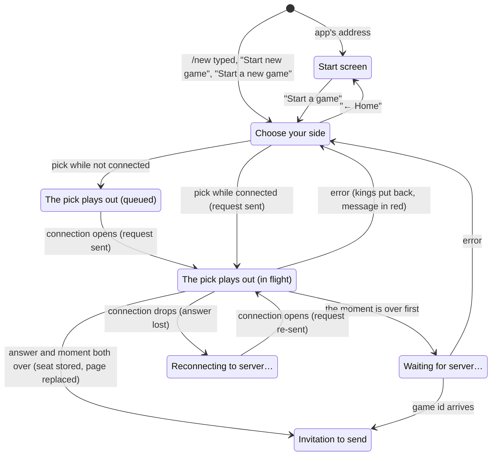

# Creating a game

## Summary

Creating a game turns a choice of side into a new game on the server, with this browser holding the seat the player chose, and takes the player to that game's page to invite an opponent. It begins on the [start screen](../glossary.md#the-product-and-its-screens) at `/`, whose "Start a game" button asks nothing of the server: it opens the [side choice](../glossary.md#the-product-and-its-screens) at `/new`, where three kings stand on a sheet of glass in the night garden and the player picks White, Black, or Random. The pick is the request. It is final the moment it is made: the game is asked for at once, while the pick plays out on the glass, and the page moves on to the new game's [invitation to send](waiting-for-an-opponent.md) once both the answer and the moment are over. The side choice is the only way a game comes into existence. A pick made before the connection is open waits for it, and a request whose answer is lost to a drop is [re-sent](../glossary.md#requests) when the connection comes back.

## The simple case

The player opens the app's address. The whole window is a night scene: the glass tower of the [board screen](../foundations/the-view.md#the-scene) stands in the middle of its garden, turning slowly, while a game plays itself on it (see [the preview](#the-preview)). Above the tower stands the title "3D Chess"; below it, the "Start a game" button: a pale pill with a small charcoal knight before the words, ringed by a rim of the five levels' colors that turns slowly round it (a turn every 9 seconds), glowing cyan on its left and rose on its right. Under a hovering mouse it lifts a little and the knight hops. The title and the button stand in bands of the same height, one above the tower and one below it, each at its band's edge nearest the tower, so they mirror each other about it. The button is the page's only control, and nothing is ever written under it.

The player clicks "Start a game". The address becomes `/new` and the page changes to the [lobby](../glossary.md#the-product-and-its-screens): the tower is gone, and one sheet of glass, the tower's bottom level with its cyan edge, draws itself in light in the same night garden. On it stand three large kings side by side: a porcelain king on the left, a king split down its middle, porcelain on its left half and charcoal on its right, in the middle, and a charcoal king on the right. Above them the page reads "Choose your side", and nothing more. Under each king is a dark glass button with one word on it: "White", "Random", and "Black". "← Home" sits at the top left.

Pointing at a king or its button with the mouse lifts that king a little, and the button under the mouse is rimmed in the levels' colors. The player clicks "White" (or the porcelain king itself). At once the heading reads "You play White", the other two buttons fade away and the chosen one stays lit. On the glass the charcoal king drains from the crown down until only its outline is left, drawn in neon like the giant pieces of the garden: an open seat. The split king drains away. The porcelain king rises into a column of cool light, as a piece does when it is picked up on the board. About a second later the address becomes `/game/{id}`, where `{id}` is the new [game id](../glossary.md#games-and-seats), and the page, without reloading its scene, shows the [invitation to send](waiting-for-an-opponent.md): the heading stays "You play White", now with "Waiting for your friend…" under it, and a card rises under the kings with "Invite a friend", the link, and a button to share or copy it.

The player now holds the chosen seat of the new game. The browser remembers it as the game's [stored seat](../foundations/connection-and-seat.md#the-stored-seat), so the player can close the tab and come back through the link.

### The preview

The game on the tower is always the same short game of 17 moves, ending in checkmate by White. Nothing about it is live: it is not a game on the server, and it is the same in every browser. The tower opens on the starting position, holds it for about 3 seconds, and then a move lands every 2.2 seconds, gliding, capturing, and checking exactly as on the board screen, with the last move's mint line and a king in check among the dark blades. At the mate the black king topples and the pulse spreads across his level; nothing on the page names the result. The finished game holds for 5 seconds, a black veil closes over the window in 0.7 seconds, the board is set up again under it, and the veil opens on the starting position in 0.9 seconds, which holds for 2 seconds before the first move. A whole game takes about 44 seconds, and it repeats for as long as the page is open.

All the while the camera circles the tower at one height, a little above the board screen's opening view, a full turn every two games (about 90 seconds). The tower is framed alone, larger than on the board screen, between the title above and the button below: the preview draws no file, rank, or level labels. The preview belongs to neither player.

The preview takes nothing from the player: a click, drag, wheel turn, or touch on it does nothing, the view cannot be turned or zoomed by hand, and a screen reader skips it and reads instead "Preview: a sample game plays itself on the five-level tower and ends in checkmate by White." It cannot be paused: it always plays, and only a player whose system asks for reduced motion sees it still (see [modifiers](#modifiers)).

### Under the button

Nothing is written under "Start a game", ever, and the button's label never changes: the start screen says nothing about the connection and shows no errors, because it sends nothing.

### The side choice

The page at `/new` is where the request is made. It can be reached by "Start a game", by the [end-game dialog](../play/check-and-game-end.md)'s "Start new game", by the "Start a new game" button of an invitation that leads nowhere (see [joining a game](joining-a-game.md#the-answer-arrives)), or by typing the address.

- **The kings.** White's seat is on the left and Black's on the right, the split king between them for Random, on the glass's middle row, each king on the middle of its own square, one square apart at every window size; the camera looks at them from a little above, from White's side, and a narrower window draws the camera back rather than pushing the kings apart. In a window narrower than it is tall (an aspect under 9:10, a phone held upright) the kings stand smaller and a little lower, near the middle of the window. Each button stands under its king at every size, sized with the space between the kings: in a wide window a pill 160 pixels wide with a 16-pixel word, on a phone one just round its word (14 pixels), so neighbours never crowd, down to a 280-pixel window.
- **Hover and focus.** The king under the pointer, or the king whose button is under the mouse or has keyboard focus, lifts a little; chosen, it goes on up from there to its selected height, without dropping first. A button under the mouse or focused from the keyboard gets the levels' rim; the chosen one keeps it. A tap on a touch screen leaves no hover behind: nothing stays lit where the finger was. Clicking or tapping a king picks it exactly as its button does.
- **The line at the bottom.** A line at the bottom center speaks of the connection only once a wait has lasted 1.5 seconds: "Connecting to server…" while the connection has not opened, "Reconnecting to server…" while it is retrying, and "Waiting for server…" when the pick has played out and the answer is late. A usual load or pick says nothing. A refusal shows there in red: "Couldn't start a game: " and the server's message. It is a status, which a screen reader announces politely.

## The interaction, event by event

```mermaid
stateDiagram-v2
    state "Start screen" as start
    state "Choose your side" as choose
    state "The pick plays out (queued)" as queued
    state "The pick plays out (in flight)" as flight
    state "Waiting for server…" as waiting
    state "Reconnecting to server…" as retrying
    state "Invitation to send" as invite
    [*] --> start : app's address
    [*] --> choose : /new typed, "Start new game", "Start a new game"
    start --> choose : "Start a game"
    choose --> start : "← Home"
    choose --> queued : pick while not connected
    queued --> flight : connection opens (request sent)
    choose --> flight : pick while connected (request sent)
    flight --> waiting : the moment is over first
    flight --> invite : answer and moment both over (seat stored, page replaced)
    waiting --> invite : game id arrives
    flight --> choose : error (kings put back, message in red)
    waiting --> choose : error
    flight --> retrying : connection drops (answer lost)
    retrying --> flight : connection opens (request re-sent)
```

### Begin

The side choice opens with all three kings standing in their material, the glass drawing itself in under a second, nothing focused, and all three buttons enabled, whatever the connection is doing. If the player arrived from a game (the end-game dialog's "Start new game", or browser Back or Forward), the connection is [reset](../glossary.md#events-that-end-or-interrupt-a-request) as the page appears, and anything the server said about the old game is ignored from then on. Nothing on the page refers to earlier games.

The pick is the whole of the begin phase: a click or tap on a button or a king, or Enter or Space on a focused button. At that instant the page decides the side. For White or Black it is that side. For Random the page tosses its own coin, there and then, before anything is sent: the side is fixed from this moment, and the split king's flight only shows it. The page also marks where its answer will start: only messages that arrive after the pick count as the reply.

### End without sending

Until the player picks, nothing is sent and nothing is recorded: a player who opens the side choice and leaves ("← Home", Back, closing the tab) leaves no trace.

A pick made while the connection is not open is [queued](../glossary.md#requests), not sent. The page plays the pick out exactly as if the request were in flight; "Connecting to server…" goes away at the pick, but "Reconnecting to server…" stays while the connection retries. Leaving the page now (Back, "← Home", reload, closing the tab) discards the queued request; nothing reaches the server and nothing is recorded.

There is no way to take a pick back on the page: the buttons are disabled from the pick on, and the kings no longer answer the pointer.

### Send

The request leaves the browser the instant of the pick on an open connection, or the instant the connection opens for a queued pick. It carries the chosen side and this tab's [client id](../glossary.md#requests). From here it cannot be taken back. The server, on receiving it:

- picks a new game id that no existing game uses;
- gives the creator the side asked for (a request with no side, which this client never sends, gets one at random);
- records the game with that one seat taken, remembers the client id as the seat's claimant, and starts an empty [move record](../glossary.md#games-and-seats);
- ties this connection to the game and seat, so that everything else sent on the connection is on the creator's behalf;
- answers with the game id and the creator's color.

The game exists from this moment whether or not the answer ever reaches the player.

### While in flight

The pick plays out on the glass, and it has its own length, independent of the answer:

- **White or Black.** The heading reads "You play White" (or "You play Black"); the chosen button stays, pressed and rimmed, and the other two fade out. The other side's king drains from the crown down to its neon outline, the split king drains away, and the chosen king rises into the column of light. The moment is over about 1.2 seconds after the pick.
- **Random.** The heading reads "Leaving it to chance…"; the Random button stays, pressed and rimmed, and the other two fade out. Both side kings drain to their outlines, and the split king is thrown up, spinning like a coin about its upright axis, two turns and a little more, slowing as it falls, until it lands showing one face to the camera, porcelain or charcoal. It holds for a moment, then hops over to that side's seat in one arc, coming down into the lifted place of the player's king, where it becomes that king as the column of light comes on. The Random button goes with it: it fades out as soon as the coin sets off from the middle toward its seat. The moment is over about 2.9 seconds after the pick. The page does not name the side in words until the invitation to send, whose heading reads "You play Black".

On an ordinary connection the answer arrives long before the moment is over, and the page moves on as soon as the moment ends. If the moment ends first, "Waiting for server…" appears at the bottom until the answer comes.

If the connection drops before the answer arrives, the answer is lost with it. "Reconnecting to server…" appears at the bottom, the scene stays as the pick left it, and the browser retries on its [retry schedule](../glossary.md#the-connection). When a connection opens, the page sends the request again on it, with the same side, and goes on doing so on every new connection until an answer arrives.

> Technical note: The server forgets a connection the moment it drops, so the answer to a request sent on it can never arrive on the next one. Repeating the create is safe: if the first request had reached the server, it made a game whose id no browser ever learns. That game waits with one seat taken and is deleted by [expiry](../glossary.md#games-and-seats) about 30 days later, like any other unused game.

### The answer arrives

On success, the browser writes the stored seat for the new game (key: the game id, value: the color) at once. When the moment is also over, the page moves to `/game/{id}`, replacing `/new` in the browser's history, so Back from the new game's page leads to the page before the side choice (usually the start screen), not to the side choice. The glass, the garden, and the kings stay as they are across the move: the lobby's scene is one and the same on both addresses. The game page recognizes that this connection already holds the seat, so it does not rejoin; it shows the invitation to send straight away. The heading does not rise again: "You play White" simply stays, and "Waiting for your friend…" appears under it. What happens from there is described in [waiting for an opponent](waiting-for-an-opponent.md).

On an error, "Couldn't start a game: " and the server's message appear in red at the bottom, the kings are put back (the drained ones fill again from the foot up, the split king returns), the heading returns to "Choose your side", and the buttons are enabled again. Nothing is re-sent after an error. A new pick sends a fresh request and clears the message. The only error the server can give a correct client here is "Already in a game", which cannot happen in practice because the connection is always fresh on the side choice; the client itself reports "Received a malformed message from the server" if the answer cannot be read. Both are listed in [error messages](../cross-cutting/error-messages.md).

## Modifiers

| Modifier | At the start | Changes while in flight |
| --- | --- | --- |
| Your color | The player chooses it: White, Black, or Random, which the page decides with its own coin at the pick. | Cannot change. A re-sent request asks for the same side. |
| Whose turn it is | No game yet. No effect. | No effect. |
| How you reached the page | The start screen looks and behaves the same however it was reached. The side choice is the same from "Start a game", "Start new game", "Start a new game", or a typed address; arriving from a game resets the connection first and ignores the old game's messages. | Leaving while in flight: see "Leaving the game page within the app" below. |
| Connection state | The start screen sends nothing, so its connection state never matters there. On the side choice: connected, the request is sent at the pick; connecting or reconnecting, the pick is queued and sent when the connection opens. Replaced cannot occur: reaching the side choice from a game resets the connection. | A drop while in flight loses the answer; the request is re-sent when a connection opens. See "The connection drops" below. |
| Game state | No game yet. No effect. | No effect. |
| Shift, Ctrl, or Cmd held | No effect. "Start a game" and the side buttons are buttons, not links, so Ctrl-click or Cmd-click does not open a new tab. | No effect. |
| Input device | A mouse click, a tap, and Enter or Space on a focused button all do the same thing; a click or tap on a king picks it too. On the start screen "Start a game" is the only Tab stop. On the side choice Tab reaches "← Home", then "White", "Random", and "Black"; nothing is focused on arrival, and a focused button lifts its king. | No effect; the buttons are disabled and the kings take no pointer. |

One setting changes the start screen's preview, never the request, and there is no way to pause it:

- **Reduced motion.** When the player's system asks for less motion, the preview is a still picture of the game's final position: the mating move's line and the check showing, the black king still standing, the camera at its opening angle; nothing turns, fades, or repeats, and the start button's rim holds still and its knight does not hop. Changing the setting while the page is open takes effect at once. On the side choice the kings' filling and draining take a fraction of a second, the split king lands on its seat without its flight (and the Random button fades at once), the headings do not rise into place, and the page moves on about 0.2 seconds after the pick (once the answer is in).

## Cancel and interrupt

| Event | Before sending | While in flight |
| --- | --- | --- |
| Escape or Cancel | No effect. There is no Cancel control and Escape is ignored. | No effect. The pick cannot be taken back. |
| Pressing elsewhere or turning the view | The start screen's tower is only a preview and takes no input. On the side choice, clicking the glass or the garden around the kings does nothing, and the view cannot be turned. | Same. |
| Leaving the game page within the app | "← Home", Back, or Forward leaves the side choice. A queued request is discarded; nothing was sent or recorded. | "← Home", Back, or Forward leaves before the answer. Nothing re-sends the request after that, and the answer, when it comes, is ignored: no seat is stored and the page does not move. Arriving at the start screen resets the connection. If the server received the request, the game exists, unused and unreachable. |
| The game ends | Not applicable: no game yet. | Not applicable. |
| The server answers with an error | Not applicable: nothing sent yet. | "Couldn't start a game: {message}" in red at the bottom; the kings are put back and the player can pick again. |
| The connection drops | "Reconnecting to server…" appears at the bottom. A pick is still possible and is queued. | The answer is lost. "Reconnecting to server…" appears; the scene stays as the pick left it. When a connection opens, the request is sent again; its answer takes the player to the new game. If the first request had reached the server, that first game is left unused on the server. |
| The window loses focus or the tab is hidden | No effect on the request. The connection stays open in a background tab. The browser stops drawing a hidden tab, so the preview and the kings stand still there and carry on from the same moment when the tab is shown again. | The answer is stored when it arrives, but the page moves on only when the pick's moment is over, and the moment runs only while the tab is drawn: a pick left in a hidden tab finishes, and the page moves to the game, when the tab is shown again. |
| Reload or closing the tab | Nothing is recorded; a queued request is discarded. A reload of `/new` shows the side choice afresh. | The answer is lost, and nothing re-sends the request. If the server received it, a game exists with one seat taken whose id no browser knows; it is deleted after about 30 days. |
| The opponent acts | No opponent yet. | No opponent yet. |
| Another tab takes the seat | Not applicable. Each tab has its own connection and creates its own games; side choices in other tabs are unaffected. | Not applicable. |
| A second touch point or a cancelled touch | A touch that is cancelled before it lifts does not press a button or pick a king. | No effect. |

After any interrupt the player stays on the side choice (or the start screen), or reaches the new game once a re-sent request is answered, except when the page itself went away. Nothing is saved in the browser until a successful answer, so an interrupted create never leaves a stored seat behind.

## Interactions with other systems

**Seat and turn.** The creator chooses the seat; with Random the page chooses it at the pick. White always moves first, so a creator who chose Black starts by waiting for the joiner's move.

**The game record.** The server records the game with one seat taken and no moves, and remembers which client id claimed the seat. A game has no name, no settings, and no time limit; there is nothing else to record. A create re-sent after a drop can leave a second, unused game behind.

**Connection.** The request travels on the app's single connection, which opens as the app loads on any page and is kept from the start screen to the side choice and on to the new game's page. After a successful create, the server treats that connection as the creator's seat in the new game until it closes. A later connection (after a drop or a reload) has to [rejoin](../foundations/connection-and-seat.md#rejoining), which the game page does by itself. A drop before the answer is covered by re-sending the request, not by a rejoin: until the answer arrives, the browser does not know which game to rejoin.

**The opponent.** There is none yet. The game waits for someone to open the link and take the other seat; see [waiting for an opponent](waiting-for-an-opponent.md) and [joining a game](joining-a-game.md).

**Other tabs and devices.** Side choices in several tabs create separate games. The stored seat, however, is shared by every tab of the same browser: opening the new game's link in another tab of the same browser rejoins as the creator and takes the seat from the first tab (see [a second tab](../session/second-tab.md)) instead of offering the other seat. To play both sides on one computer, open the link in a different browser or a private window.

**Game over.** Not applicable. The end-game dialog of a finished game leads here with "Start new game".

**Stored seat.** Written the moment the answer arrives, before the page changes, so that even a tab closed right after the page changes can come back through the link. If the browser refuses to store it (storage disabled), the write fails silently; see the edge cases.

**Keyboard, touch, and screen size.** On the start screen "Start a game" is the only Tab stop; on the side choice, "← Home" then the three side buttons. Each shows a ring or the levels' rim when focused from the keyboard. A tap works like a click, on a button or on a king. The start screen's title stands in a band above the tower and its button in a band of the same height below it (124 pixels each, 140 in a window 860 pixels tall or more), each 16 pixels from its band's edge nearest the tower; on a phone held upright the button spans the width, and in a window 480 pixels tall or less the text stands in a column at the left of the tower instead. On the side choice each button stands under its king at every size, smaller as the kings stand closer. The lobby's scene is decoration to a screen reader: the headings and buttons say everything. See [screen sizes and touch](../cross-cutting/screen-sizes-and-touch.md).

## Edge cases

- **Coming back from a finished game.** "Start new game" in the end-game dialog lands on the side choice while the old game's messages are still in memory for a moment. The side choice ignores everything that arrived before its own pick, so it does not mistake the old game for a new answer and move the player back into it.
- **The server gives another side.** The page shows whatever side the answer names, even if it is not the one asked for. A correct server always gives the side asked for.
- **Every pick is a new game.** There is no "resume" and no list of games, even when the browser holds stored seats. A player who wants an earlier game needs its link.
- **Game id collisions.** The server never reuses an id that is still stored; it draws again until the id is free.
- **A long outage mid-create.** The scene stays as the pick left it for as long as the server cannot be reached, with "Reconnecting to server…" at the bottom, and the page moves to the new game on the first connection that gets an answer. Nothing tells the player that the request will be repeated; the only way to give up is to leave or reload.
- **Storage disabled.** When the browser will not store the seat, the create still succeeds and the page still moves to the game, but the game page, which reads the stored seat, finds none and treats the creator as a guest: it asks which seats are taken and offers the creator the other seat of their own game ("You're invited to play Black" for a creator who chose White). "Join game" there is refused with "Error: Already in a game", because the connection already holds the creator's seat. See the open questions.
- **Back within the round trip.** If the player presses Back in the fraction of a second between the pick and the answer, the answer is ignored and the new game's id is never shown.
- **A malformed answer.** A reply the browser cannot read shows "Couldn't start a game: Received a malformed message from the server" and puts the kings back, like any error.
- **Coming back to the start screen.** The preview starts its game from the beginning every time the start screen appears, including after Back from a game.
- **The page title** stays "3D Chess — Online Multiplayer" throughout.

## Open questions and verification

- This document was rewritten for the side choice (`/new`) from the code at `1928567` and brought up to `f38fcdb` (a hover rim for the mouse only, the glass drawn in 0.7 s, the heading that carries on into the invitation to send): `client/src/App.tsx`, `client/src/screens/StartScreen.tsx`, `client/src/screens/lobby/ChooseSide.tsx`, `client/src/screens/lobby/LobbyLayout.tsx`, `client/src/three/lobby/LobbyScene.tsx`, `client/src/three/lobby/LobbyKing.tsx`, `client/src/three/lobby/lobbyMotion.ts` (the timings: a fill of 0.9 s, a toss of 1.05 s plus 0.22 s held and a 0.45 s glide, 0.7 s for the light to rise), the `.lobby` rules in `client/src/index.css`, `client/src/screens/lobby/ChooseSide.test.tsx`, `server/modal_app.py` (`create_game`), and `client/e2e/createGame.spec.ts`. It was not checked in the running app. The durations quoted ("about 1.2 seconds", "about 2.9 seconds") are sums of those timings, not measurements.
- With browser storage disabled, the creator is offered the other seat of their own game ([bug triage](../bug-triage.md) B-11, in a new form). Read from code: the game page reads the seat only from storage (`client/src/screens/GameScreen.tsx`, `storedRole`), so a creator without one counts as a guest and sends a look. Not tried.
- A create re-sent after a drop can leave the first game orphaned on the server, with one seat taken and no browser that knows its id. It costs nothing visible and expires like any unused game; whether that is acceptable is a product call.
- Whether a button keeps keyboard focus after the pick disables it depends on the browser; where focus goes then was not tried.
- The lobby needs WebGL, like the preview. What a browser without it shows at `/new`, and whether a game can still be created there, was not tried.
- How long "Connecting to server…" lasts on a cold server is a property of the deployment and was not measured.
- The start screen as merged from main (no "Pause preview", nothing under the button, the title and the button in bands of one height, 124 px or 140 in a window 860 px tall or more, each at its band's edge nearest the tower) was read from `client/src/screens/StartScreen.tsx`, `client/src/three/landingView.ts` (`LANDING_BAND_PX`) and `client/src/index.css` (`--landing-band`, `--landing-hug`), not checked in the running app, apart from the positions measured on main (title center 85 px from the top and button center 82 px from the bottom at 1280 × 720; 95 and 95 at 1440 × 900; CREATE-29).

Verified against 3D Chess commit `f38fcdb`
