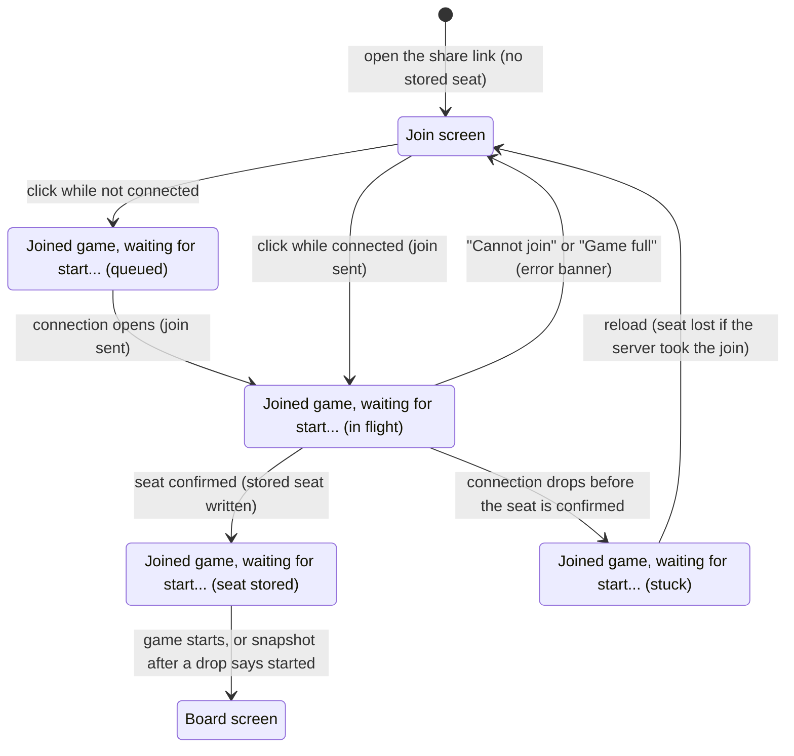

# Joining a game

## Summary

Joining a game turns one click on a shared link into the second seat of someone else's game, and starts it. It lives on the [join screen](../glossary.md#the-product-and-its-screens), which is what the game page at `/game/{id}` shows a [visitor](../glossary.md#games-and-seats): a browser with no stored seat for that game. The "Join Game" button is the whole feature: there is no name to enter and no choice of color, and nothing on the screen says whose game it is, whether it exists, or whether it is already full; the server is asked only when the button is clicked. A successful join takes the seat the creator did not get, and the game starts at once on both players' pages. A refused join ("Cannot join" or "Game full") returns the page to the join screen with the error.

## The simple case

The player receives a share link from a friend and opens it. The page shows the title "3D Chess" and a white "Join Game" button on a dark background, and nothing else.

The player clicks "Join Game". The button disappears at once and the page reads "Joined game, waiting for start...", before the server has answered. Almost at once the page switches to the [board screen](../glossary.md#the-product-and-its-screens): the 3D board fills the window, the seat label at the top left says "You are playing as black." (or "You are playing as white.": whichever color the creator did not get), the turn indicator reads "White to move", and "Opponent: online" appears under the seat label, to the eye at the same moment. On the friend's page, the share link has been replaced by the board at the same time (see [waiting for an opponent](waiting-for-an-opponent.md)).

The browser remembers the seat as the game's [stored seat](../foundations/connection-and-seat.md#the-stored-seat), so the player can close the tab and come back through the same link.

## The interaction, event by event

### Begin

The page opens from the link like any fresh page: it opens its [connection](../foundations/connection-and-seat.md#connection-states), finds no stored seat for the game, and shows the join screen. It sends nothing on its own. The page does not check the id in the address: a mistyped, lower-case, expired, or made-up id shows the same join screen as a real one, and so does a game with both seats taken. Which of these it is comes out only when the button is clicked.

The button is enabled from the first moment, whatever the connection is doing. The game page shows nothing while the connection is still opening; if the first attempt fails, the amber "Reconnecting…" box appears at the top right.

The click is the whole of the begin phase. At that instant the page treats itself as joined: the button disappears and the page shows the [joined screen](../glossary.md#the-product-and-its-screens), "Joined game, waiting for start...", before any answer has come back and whether or not the join could be sent yet. An error banner still showing from an earlier attempt stays; the click does not clear it.

### End without sending

A visitor who opens the link and never clicks leaves no trace: nothing is sent, nothing is stored in the browser, and the creator's screen does not change. The creator cannot tell that anyone looked.

A click made while the connection is not open is [queued](../glossary.md#requests), not sent. The page shows the joined screen exactly as if the join were in flight, with "Reconnecting…" at the top right if the connection has already failed once. Leaving the page (Back, reload, closing the tab) at this point discards the queued join; nothing reaches the server and nothing is recorded. When the connection opens, the join is sent.

### Send

The join leaves the browser the instant the button is clicked on an open connection, or the instant the connection opens for a queued click. From here it cannot be taken back. The server, on receiving it:

- refuses with "Already in a game" if this connection already holds a seat (in practice, only a creator whose browser does not store the seat; see the edge cases);
- refuses with "Cannot join" if no game has this id: a mistyped, lower-case, made-up, or expired id;
- refuses with "Game full" if both seats are taken, whether or not either player is connected;
- otherwise records the free seat as taken, for the life of the game;
- ties this connection to the game and the seat, so that everything else sent on it is on the joiner's behalf;
- confirms the seat to the joiner, with its color;
- sends the [start notice](../glossary.md#requests) to every player connected to the game, White first: the joiner, and the creator if the creator's page is connected;
- tells the creator the joiner is online, and tells the joiner whether the creator is connected.

The seat is taken from this moment whether or not any answer reaches the joiner. A refused join changes nothing on the server and leaves the connection free.

### While in flight

The page shows "Joined game, waiting for start..." under the title, on the dark background. There is nothing to click and nothing to cancel; the player can only wait or leave. On an ordinary connection this lasts a fraction of a second.

If the connection drops now, before the seat confirmation arrives, the page stays on "Joined game, waiting for start..." for good, even after the connection comes back. See "The connection drops" under [cancel and interrupt](#cancel-and-interrupt), and the open questions.

### The answer arrives

On success, three messages arrive in quick succession, and the page reacts to each:

1. **The seat confirmation**, carrying the joiner's color. The browser writes the stored seat for the game (key: the game id, value: the color). Nothing visible changes. From here on, a drop or a reload is recoverable: the page [rejoins](../foundations/connection-and-seat.md#rejoining) with the stored seat and the snapshot shows the started game.
2. **The start notice.** The page switches to the board screen and stays in the playing phase for as long as it is open: "You are playing as white." or "You are playing as black." at the top left, "White to move" at the top center, the board in the [default view](../foundations/the-view.md#the-default-view), [oriented](../foundations/the-view.md#orientation) for the joiner's color, and no [move list](../game-page/move-list.md) until the first move. The stored seat is written again with the same color, which changes nothing.
3. **The creator's presence**, immediately after. "Opponent: online" appears under the seat label, or "Opponent: offline" if the creator's page is not connected at that moment (see [seat and opponent status](../game-page/seat-and-opponent-status.md)).

A joiner seated as White can move at once, even if the creator is offline ([making a move](../play/making-a-move.md)); a joiner seated as Black waits for the creator's first move ([the opponent's move](../play/the-opponents-move.md)).

On a refusal of "Cannot join" or "Game full", the page returns to the join screen with "Error: Cannot join" or "Error: Game full" in the [error banner](../game-page/error-banner.md) at the bottom center. Nothing is stored. Clicking "Join Game" again sends a fresh join, which is refused the same way, because an unknown id stays unknown and a full game stays full. On "Already in a game", the page stays on the joined screen with "Error: Already in a game" in the banner. All of these are listed in [error messages](../cross-cutting/error-messages.md).

## Modifiers

| Modifier | At the start | Changes while in flight |
| --- | --- | --- |
| Your color | Unknown. It is whichever seat the creator did not get, and the creator's color was drawn at random; nothing on the join screen says which is free. | Cannot change. The board shows it for the first time. |
| Whose turn it is | No game shown yet. No effect. | No effect. The game starts with White to move. |
| How you reached the page | A visitor from a share link: as described. A third person: "Game full". The creator in another browser or a private window: joins as the opponent (see the edge cases). A player who cleared site data or changed browser: "Game full", and the old seat cannot be recovered. A player with a stored seat never sees the join screen; see [reloading and returning](../session/reload-and-return.md). A creator whose browser does not store the seat sees it, and a click is refused with "Already in a game". | No effect. |
| Connection state | Connected: the join is sent on the click. Connecting or reconnecting: the click is queued and sent when the connection opens; the joined screen shows at once. Replaced cannot occur: a visitor holds no seat to be replaced. | A drop before the seat confirmation leaves the page stuck; a drop after it is recovered by a rejoin. See "The connection drops" below. |
| Game state | Waiting for an opponent, full, or unknown to the server; the join screen looks the same for all three. In check, over, and frozen cannot occur. | The game starts with the answer. |
| Shift, Ctrl, or Cmd held | No effect. The button is a button, not a link, so Ctrl-click or Cmd-click does not open a new tab. | No effect. |
| Input device | A mouse click, a tap, and Enter or Space on the focused button all do the same thing. The button is reached by Tab and shows a blue focus ring; nothing is focused on arrival. | No effect; the button is gone. |

Nothing the player can change mid-way alters the request: the color is decided by the creator's seat, and the join carries nothing but the game id from the address.

## Cancel and interrupt

| Event | Before sending | While in flight |
| --- | --- | --- |
| Escape or Cancel | No effect. There is no Cancel control and Escape is ignored. | No effect. The join cannot be withdrawn, and once recorded the seat is the joiner's for the life of the game. |
| Pressing elsewhere or turning the view | There is no board on this screen. Clicking the page around the button does nothing. | Same. |
| Leaving the game page within the app | Back or Forward to the start screen [resets](../foundations/connection-and-seat.md#returning-to-the-start-screen) the connection and discards a queued join; nothing was sent. A page opened from a link usually has no page of the app before it, so Back leaves the app instead: see "Reload or closing the tab". | The answer is lost with the page. If the seat confirmation had already arrived, the link or Forward rejoins and shows the board. If not, and the server received the join, the seat is taken but this browser never stored it, as in "The connection drops". |
| The game ends | Not applicable: the game has not started. | Not applicable. |
| The server answers with an error | Not applicable: nothing sent yet. | "Cannot join" or "Game full": back to the join screen, with the error banner. "Already in a game": the joined screen stays, with the error banner. |
| The connection drops | "Reconnecting…" appears at the top right. The button still works, and a click is queued. | If the seat confirmation had arrived, the page rejoins when a connection opens and the snapshot brings the board. If not, the answer is lost, and nothing re-sends the join or rejoins: "Joined game, waiting for start..." stays on screen for good, even after the connection returns. If the join reached the server, the seat is taken and this browser cannot reclaim it. This looks like a bug; see open questions. |
| The window loses focus or the tab is hidden | No effect. | No effect. The answer is handled in the background tab, and the board is waiting when the player returns. |
| Reload or closing the tab | Nothing is recorded; a queued join is discarded. After a reload the join screen is fresh. | If the seat confirmation had arrived, a reload rejoins and shows the board. If not, the answer is lost: if the server received the join, the seat is taken, the reloaded page shows the join screen, and joining again is refused with "Game full". |
| The opponent acts | The creator may come and go; the join works whether or not the creator is connected. Another visitor whose join reaches the server first takes the seat, and this join is refused with "Game full". | Whether the creator's page is connected at the moment of the join decides whether the board first shows "Opponent: online" or "Opponent: offline". |
| Another tab takes the seat | Not applicable: a visitor holds no seat. A second tab of the same browser on the join screen is simply another visitor; see the edge cases. | Once the seat confirmation has stored the seat, the same link opened in another tab of this browser rejoins and takes the seat; this tab shows the [replaced dialog](../session/second-tab.md). |
| A second touch point or a cancelled touch | A touch that is cancelled before it lifts does not click the button. | No effect. |

After any interrupt before the seat confirmation, this browser holds no stored seat. Whether the player can try again depends only on whether the server received the join: if it did not, the seat is still free and a reload brings back a working join screen; if it did, the seat is gone.

## Interactions with other systems

**Seat and turn.** The joiner takes the one free seat, so the joiner's color is decided by the creator's random draw. White moves first, so a joiner seated as White is to move as soon as the board appears, whether or not the creator is there.

**The game record.** The join adds the second seat and nothing else: no moves, no names. It is permanent. There is no leaving a game, so a full game stays full for its whole life, including while both players are away (see [seats](../foundations/connection-and-seat.md#seats)).

**Connection.** The join travels on the page's single connection, and the server treats that connection as the joiner's seat until it closes. Every later connection has to rejoin, which the page does by itself only once the seat confirmation has stored the seat. A connection can hold only one game, which is what "Already in a game" guards.

**The opponent.** The creator's share-link screen is replaced by the board at the same moment, and the creator is told "Opponent: online"; see [waiting for an opponent](waiting-for-an-opponent.md). The joiner is told whether the creator is connected. Neither ever sees the other's join screen or "Joined game, waiting for start...".

**Other tabs and devices.** Each tab and browser that opens the link without a stored seat is a separate visitor, and the first join to reach the server wins. After joining, the stored seat is shared by every tab of this browser: opening the link again in another tab rejoins as the joiner and takes the seat (see [a second tab](../session/second-tab.md)). It is not shared with another browser or device, where the link shows the join screen and a click is refused with "Game full".

**Game over.** Not applicable.

**Stored seat.** Written the moment the seat confirmation arrives, before the start notice, so that a drop between the two is recovered by a rejoin. Nothing is written before that, so a join whose confirmation never arrives leaves nothing in the browser. If the browser refuses to store it (storage disabled), the write fails silently; the page still remembers the seat for as long as it is open and rejoins after a drop, but a reload shows the join screen, and joining again is refused with "Game full".

**Keyboard, touch, and screen size.** The button can be reached with Tab and pressed with Enter or Space. A tap works like a click. After the click the button is gone and nothing is focused. The screen is a single centered column and fits any window width; see [screen sizes and touch](../cross-cutting/screen-sizes-and-touch.md) and [accessibility](../cross-cutting/accessibility.md).

## Edge cases

- **Joining your own game.** A creator who opens the share link in another browser, a private window, or on another device is a visitor there. Clicking "Join Game" takes the second seat, and both of the creator's pages switch to the board: the creator plays both sides, one per browser. Opened in another tab of the same browser instead, the link rejoins as the creator and never shows the join screen.
- **A third person.** Anyone who opens the link after both seats are taken sees the join screen, and a click is refused with "Game full". There is no spectating: nobody without a seat can watch a game.
- **Two tabs of one browser on the join screen.** If a visitor has the link open in two tabs and joins in one, the other still shows the join screen: it read the stored seat only when it loaded. Clicking "Join Game" there is refused with "Game full". Reloading that tab rejoins with the stored seat and takes the seat from the first tab.
- **A double click.** Sends one join. The button disappears on the first click, and the page ignores a join once it has shown the joined screen.
- **Trying again after a refusal.** Clicking "Join Game" again sends another join, but the page goes back to the join screen at once, without waiting for the answer, because it still counts the earlier refusal. The answer is the same refusal, so the banner shows the same message again.
- **A stale error.** The error banner is not cleared by clicking "Join Game", so an error from an earlier attempt, or "Error: Cannot rejoin" left by a refused rejoin that deleted the stored seat, stays on screen during the next join until it is dismissed or replaced.
- **A creator whose browser does not store the seat.** With storage disabled, the creator arrives from "Start New Game" on the join screen instead of the share-link screen. Clicking "Join Game" shows "Joined game, waiting for start..." with "Error: Already in a game", because the connection already holds the creator's seat. The board still appears when an opponent joins. See [creating a game](creating-a-game.md#edge-cases).
- **The creator is away.** The join works while the creator's page is closed or disconnected: the joiner's board appears with "Opponent: offline", and a joiner seated as White can play the first move. The creator sees it when they return.
- **A lower-case or mistyped id.** Ids are case-sensitive, so `/game/k7q2zd` is refused with "Cannot join" even when `/game/K7Q2ZD` exists. The join screen gives no hint before the click.
- **A returning joiner.** Reopening the link after joining shows the share-link screen's "Game created! Share this link with a friend:" until the snapshot arrives, then the board. See [the connection and seat model](../foundations/connection-and-seat.md#rejoining).
- **A malformed answer.** A reply the browser cannot read shows "Error: Received a malformed message from the server". Unlike a refusal, it does not return the page to the join screen.
- **The page title** stays "3D Chess — Online Multiplayer" throughout.

## Open questions and verification

- **Suspected bug: a drop before the seat confirmation strands the joiner and can lose the seat for good.** The page counts itself as joined from the click (`client/src/screens/GameScreen.tsx:158-162`, phase at `:141-145`) and leaves that state only on a "Cannot join" or "Game full" refusal (`:116-124`). A new connection rejoins only when the browser has a stored seat (`:96`), and the stored seat is written only when the seat confirmation arrives (`:105-111`); a join that was already sent is not kept for re-sending (`client/src/hooks/useGameSocket.ts:73-81`, `:121`). So if the connection drops after the join is sent and before the confirmation arrives, the page shows "Joined game, waiting for start..." forever, even after "Reconnecting…" goes away. Meanwhile the server may have recorded the seat before answering (`server/modal_app.py:318-331`): the creator's page switches to the board and shows "Opponent: online" and then "Opponent: offline" as the dead connection is noticed (`:423-425`). After a reload the joiner sees the join screen, and joining is refused with "Game full" (`:143-144`). The seat is lost, and the game can never be played: the creator can make at most one move (if White) and then waits for good. Leaving or reloading within the round trip has the same effect. Read from code; not reproduced.
- Trying again after a refusal returns the page to the join screen before the answer, because the check looks at every refusal on the page, not only the answer to the latest click (`client/src/screens/GameScreen.tsx:116-124`). Harmless while every retry is refused again, which is always the case today.
- The join screen says nothing about the game before the click: not whether it exists, whether it is full, or whose it is. Whether a visitor should learn that before clicking is a product call.
- A second tab of the same browser on the join screen is not told that the first tab has joined, and its own click is refused with "Game full". Read from code (the stored seat is read only when the page loads); not tried.
- The "Already in a game" case for a creator whose browser does not store the seat is read from code; not confirmed in a browser with storage disabled.
- Everything else was read from `client/src/screens/GameScreen.tsx`, `client/src/game/session.ts`, `client/src/hooks/useGameSocket.ts`, `client/src/lib/playerRole.ts`, `server/modal_app.py`, `client/src/App.test.tsx` (the join button without a stored seat, the joined screen shown before the answer, the seat stored from the confirmation, a refused join returning to the button), `client/src/hooks/useGameSocket.test.ts` (requests queued before the connection opens, or while it is reconnecting, are sent when it opens), and `server/tests/test_local_ws.py` (`test_join_unknown_game`, `test_third_player_cannot_join_full_game`, `test_game_stays_full_while_a_player_is_disconnected`, `test_creator_cannot_join_own_game`, `test_presence_follows_connections`, `test_game_joined_alone_is_enough_to_rejoin`). The simple case is exercised by every end-to-end game (`client/e2e/helpers/game.ts`).

Verified against 3D Chess commit `d94507b`
