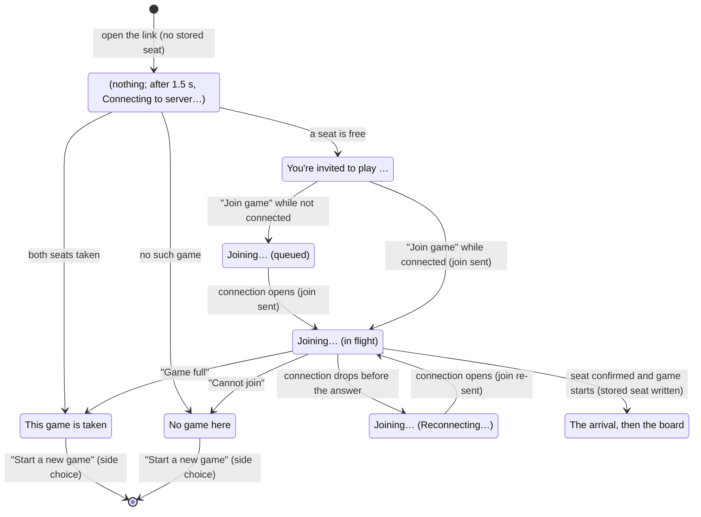

# Joining a game

## Summary

Joining a game turns a shared link into the second seat of someone else's game, and starts it. It lives on the [invitation to the free seat](../glossary.md#the-product-and-its-screens), which is what the game page at `/game/{id}` shows a [visitor](../glossary.md#games-and-seats): a browser with no stored seat for that game. Before the visitor does anything, the page asks the server which seats are taken, a question that binds nothing, and tells the visitor what the link holds: the side they are invited to play, or that the game is taken, or that there is no game there. "Join game" is the request. The seat fills on the glass at once, before the server answers; a successful join starts the game on both players' pages, and each plays the [arrival](../glossary.md#the-product-and-its-screens) and the board's entrance. A refused join ("This game is taken", "No game here") offers a new game instead. A join whose answer is lost to a drop is [re-sent](../glossary.md#requests) when the connection comes back, and the server, recognizing the tab, hands back the seat it already gave it.

## The simple case

The player receives a link from a friend and opens it. The page is the [lobby](../glossary.md#the-product-and-its-screens): a sheet of glass edged in cyan draws itself in light in a night garden, with two kings on it drawn only as neon outlines, and nothing else. Almost at once the king on the host's side fills with its material from the foot up (porcelain on the left for a host playing White), while the other seat stays an outline, slowly breathing. Labels settle in under them: "Opponent" under the host's king and "You" under the player's own outline. At the top of the page a heading rises, "You're invited to play" with a small charcoal stone and "Black", and a single pale "Join game" button appears docked under the scene, with no card and no text around it; it has keyboard focus. "← Home" sits at the top left.

The player clicks "Join game". At once the outline on their side fills with charcoal from the foot up, and the king stays standing on the glass; the label under it stays "You", and the button reads "Joining…". A moment later a ring of light spreads out across the glass from their king, both kings rise together into columns of cool light of their own, level, so the two stand alike, and in the heading's place a single line rises, "You play Black". Then both rise on together, each in its own column of light, and are taken up into it from the foot, and the camera pulls back and turns until the picture is exactly the [board screen](../glossary.md#the-product-and-its-screens)'s first: the glass, which stays, is the tower's bottom level. The lobby's picture gives way to the board's without a visible change, and the game's entrance plays: the tower builds itself on up from that glass, level by level, while the camera closes in and the armies form on it. The turn pill fades in last, with the player's charcoal stone and White's half lit. On the friend's page the same arrival has played (see [waiting for an opponent](waiting-for-an-opponent.md#the-answer-arrives)).

The browser remembers the seat as the game's [stored seat](../foundations/connection-and-seat.md#the-stored-seat), so the player can close the tab and come back through the same link.

## The interaction, event by event

```mermaid
stateDiagram-v2
    state "(nothing; after 1.5 s, Connecting to server…)" as opening
    state "You're invited to play …" as open
    state "This game is taken" as full
    state "No game here" as gone
    state "Joining… (queued)" as queued
    state "Joining… (in flight)" as flight
    state "Joining… (Reconnecting…)" as recon
    state "The arrival, then the board" as board
    [*] --> opening : open the link (no stored seat)
    opening --> open : a seat is free
    opening --> full : both seats taken
    opening --> gone : no such game
    open --> queued : "Join game" while not connected
    queued --> flight : connection opens (join sent)
    open --> flight : "Join game" while connected (join sent)
    flight --> board : seat confirmed and game starts (stored seat written)
    flight --> full : "Game full"
    flight --> gone : "Cannot join"
    flight --> recon : connection drops before the answer
    recon --> flight : connection opens (join re-sent)
    full --> [*] : "Start a new game" (side choice)
    gone --> [*] : "Start a new game" (side choice)
```

### Begin

The page opens from the link like any fresh page: it opens its [connection](../foundations/connection-and-seat.md#connection-states), finds no stored seat for the game, and shows the lobby with both seats in neon and no words at all; only if no answer has come 1.5 seconds later does a line at the bottom say "Connecting to server…" (or "Reconnecting to server…" while the connection is retrying). As soon as the connection is open, it asks the server which seats of the game are taken. This question binds nothing: the server does not tie the connection to the game, and the host is not told. It is asked once per connection until it is answered; if the connection drops first, it is asked again on the next one. The answer decides the invitation:

- **One seat taken.** The host's king fills with its material, the free seat stays in neon and breathes, "Opponent" and "You" appear under them, the page's heading says "You're invited to play" with the free side's stone and name, and the card gives way to the "Join game" button alone, docked under the scene and focused.
- **Both seats taken.** Both kings stay outlines, and a card reads "This game is taken", with "Start a new game", focused, and nothing else.
- **No such game** (a mistyped, lower-case, made-up, or expired id). Both kings stay outlines, and a card reads "No game here", with "Start a new game", focused, and nothing else: the page does not say whether the link was mistyped or the game expired.

Both of the last two are announced as alerts. "Start a new game" leads to the [side choice](creating-a-game.md#the-side-choice), where the visitor can create a game of their own.

The click on "Join game" (or Enter or Space on it) is the begin phase of the join. At that instant the page treats the seat as taken: the player's king fills from the foot up, but stays on the glass, with no column of light (it rises only at the arrival, with the host's), the label under it becomes "You", and the button reads "Joining…", before any answer has come back and whether or not the join could be sent yet.

### End without sending

A visitor who opens the link and never takes the seat leaves no trace in the game: the look is recorded nowhere, nothing is stored in the browser, and the host's page does not change. The host cannot tell that anyone looked.

A click made while the connection is not open is [queued](../glossary.md#requests), not sent. The page shows the seat taken exactly as if the join were in flight, with "Reconnecting…" at the top right if the connection has already failed once. (Before the look has been answered there is no button to click.) Leaving the page (Back, "← Home", reload, closing the tab) at this point discards the queued join; nothing reaches the server and nothing is recorded. When the connection opens, the join is sent, once.

### Send

The join leaves the browser the instant "Join game" is clicked on an open connection, or the instant the connection opens for a queued click. It carries the game id from the address and this tab's [client id](../glossary.md#requests); it does not carry the side the card named. From here it cannot be taken back. The server, on receiving it:

- refuses with "Already in a game" if this connection already holds a seat (in practice, only a creator whose browser does not store the seat; see the edge cases);
- refuses with "Cannot join" if no game has this id (it expired, say, since the look);
- if this client id already claimed one of the game's seats, hands that seat back without taking another. This is how a repeated join from the same tab gets its seat again; see "While in flight";
- refuses with "Game full" if both seats are taken (someone else took the seat since the look);
- otherwise records the free seat as taken, for the life of the game, with this client id as its claimant;
- ties this connection to the game and the seat;
- confirms the seat to the guest, with its color;
- for a new claim, sends the [start notice](../glossary.md#requests) to every player connected to the game: the guest, and the host if the host's page is connected. For a seat handed back to the same client id, sends the guest a [snapshot](../glossary.md#requests) instead, as a rejoin would; the host gets no second start notice;
- tells the host the guest is online, and tells the guest whether the host is connected.

The seat is taken from this moment whether or not any answer reaches the guest. A refused join changes nothing on the server and leaves the connection free.

### While in flight

The page shows the seat taken, the king filled and standing on the glass, and "Joining…" on the button, which keeps keyboard focus, is marked unavailable to a screen reader, and ignores further presses. There is nothing to cancel; the player can only wait or leave. On an ordinary connection this lasts a fraction of a second.

If the connection drops now, before the answer arrives, the answer is lost with it. The page keeps the seat taken and "Joining…", the "Reconnecting…" line appears at the top right, and the browser retries on its [retry schedule](../glossary.md#the-connection). When a connection opens, the page sends the join again on it, with the same client id, and goes on doing so on every new connection until an answer arrives. If the first join had claimed a seat, the server hands this tab that same seat back, with a snapshot of the game as it now stands; if the first join never arrived, the repeat is the first the server sees, and takes the free seat or is refused like any other.

> Technical note: The client id lives in the tab's session storage. A reload of the tab keeps it, another tab never shares it, and a duplicated tab copies it. If the browser refuses storage, the id lasts only until the page is reloaded.

### The answer arrives

On success, three messages arrive in quick succession:

1. **The seat confirmation**, carrying the guest's color. The browser writes the stored seat for the game. Nothing visible changes. From here on, a drop or a reload is recovered by a [rejoin](../foundations/connection-and-seat.md#rejoining).
2. **The start notice.** The arrival plays on the guest's page: a ring of light spreads across the glass from the guest's own king (filled since the click), both kings, each filled, start rising together into columns of light of their own and stand level, and the heading gives way to the arrival's single line, "You play Black" or "You play White", which a screen reader reads. The moment is held for about 1.7 seconds while the board screen is built underneath, held on its first frame. Then the lobby leaves: both kings rise together in their columns of light and are taken up from the foot, level A's glass stays, and the camera draws back to exactly the board's first-frame view from the guest's side; the lobby's picture fades out over that same picture, and then the board's entrance plays (about 3.6 seconds: levels B to E build on up from A, the armies form, the turn pill fades in last). The board takes no input until the entrance is over. [Waiting for an opponent](waiting-for-an-opponent.md#the-answer-arrives) describes the handover step by step; it is the same on both pages.
3. **The host's presence**, immediately after. Nothing shows if the host is connected; if the host's page is not connected at that moment, the host's stone on the turn pill is an outline with "Offline" (see [seat and opponent status](../game-page/seat-and-opponent-status.md)).

A guest playing White can move once the entrance is over, even if the host is offline ([making a move](../play/making-a-move.md)); a guest playing Black waits for the host's first move ([the opponent's move](../play/the-opponents-move.md)).

**A seat handed back.** When a join re-sent after a drop finds the seat this tab already claimed, the answer is the seat confirmation followed by a snapshot instead of the start notice, and then the host's presence. The arrival and the handover play the same way, and the board appears with every move the host has made meanwhile already in place, without a glide.

**A refusal.** "Game full" replaces the button with a card, "This game is taken", and "Cannot join" into "No game here", each with "Start a new game"; the player's king drains back to an outline with the other. Neither shows in the error banner, and nothing is stored or re-sent. "Already in a game" leaves the page at "Joining…", with "Error: Already in a game" in the [error banner](../game-page/error-banner.md) at the top of the window. All of these are listed in [error messages](../cross-cutting/error-messages.md).

## Modifiers

| Modifier | At the start | Changes while in flight |
| --- | --- | --- |
| Your color | The side the host did not choose, named in the heading before the click. | Cannot change. A re-sent join gets the same seat as the first. |
| Whose turn it is | No game shown yet. No effect. | No effect on a join answered at once: the game starts with White to move. A seat handed back after a drop shows the turn as it now stands; a host playing White may already have moved. |
| How you reached the page | A visitor from a link: as described. A third person: "This game is taken". The host in another browser or a private window: invited to the other seat of their own game (see the edge cases). A player who cleared site data or changed browser: "This game is taken", and the old seat cannot be recovered. A player whose join in this same tab was lost, and who reloaded: the invitation again, and "Join game" gets the same seat back. A player with a stored seat never sees the invitation; see [reloading and returning](../session/reload-and-return.md). | No effect. |
| Connection state | Connecting or reconnecting: nothing is said until the look has gone unanswered for 1.5 s, then "Connecting to server…" (or "Reconnecting to server…") at the bottom until it is answered. Connected: as described. Replaced cannot occur: a visitor holds no seat to be replaced. | A drop before the seat confirmation is recovered by re-sending the join; a drop after it, by a rejoin. See "The connection drops" below. |
| Game state | Waiting for an opponent, full, or unknown to the server; the page says which. In check, over, and frozen cannot occur. | The game starts with the answer. |
| Shift, Ctrl, or Cmd held | No effect. The page's controls are buttons, not links. | No effect. |
| Input device | "Join game" (or "Start a new game") has focus on arrival: Enter or Space presses it. A click or tap works the same. Tab reaches "← Home" too. | No effect; the button ignores presses while in flight but keeps focus. |

Reduced motion changes the lobby, not the request: the kings fill and lift in a fraction of a second (the lift in about 0.15 seconds), the free seat does not breathe, the arrival is held for about 0.2 seconds, the lobby leaves in about 0.15 seconds, and the board's entrance is a plain fade.

## Cancel and interrupt

| Event | Before sending | While in flight |
| --- | --- | --- |
| Escape or Cancel | No effect. There is no Cancel control and Escape is ignored. | No effect. The join cannot be withdrawn, and once recorded the seat is the guest's for the life of the game. |
| Pressing elsewhere or turning the view | Clicking the glass or the garden does nothing, and the view cannot be turned. | Same. |
| Leaving the game page within the app | "← Home" or Back to the start screen [resets](../foundations/connection-and-seat.md#returning-to-the-start-screen) the connection and discards a queued join; nothing was sent. A page opened from a link usually has no page of the app before it, so Back leaves the app instead: see "Reload or closing the tab". | The answer is lost with the page, and nothing re-sends the join once the page has gone. If the seat confirmation had already arrived, the link or Forward rejoins and shows the board. If not, coming back to the link in the same tab shows the invitation, and "Join game" gets the seat back if the server had recorded the first join. |
| The game ends | Not applicable: the game has not started. | Not applicable. |
| The server answers with an error | Not applicable to the join: nothing sent yet. The look can only be answered "No game here". | "Game full": "This game is taken". "Cannot join": "No game here". "Already in a game": "Joining…" stays, with the error banner. |
| The connection drops | "Reconnecting…" appears at the top right. The page stays as it is; "Join game" still works, and a click is queued. A look not yet answered is asked again on the next connection. | If the seat confirmation had arrived, the page rejoins when a connection opens and the snapshot brings the arrival. If not, "Joining…" stays with "Reconnecting…", and when a connection opens the join is sent again: the same seat if the first join had been recorded, otherwise the free seat, or "This game is taken" if someone else took it during the outage. |
| The window loses focus or the tab is hidden | No effect. The free seat's breathing stops while the tab is hidden. | The answer is handled in the background, but the arrival and the handover run only while the tab is drawn: they play when the player returns to the tab. |
| Reload or closing the tab | Nothing is recorded; a queued join is discarded. After a reload the invitation is asked for afresh. | If the seat confirmation had arrived, a reload rejoins and shows the board with its short entrance. If not, a reload shows the invitation, because nothing was stored; "Join game" there gets the seat back, since the reloaded tab keeps its client id (the look may already say "This game is taken", since both seats are recorded; see the open questions). Closing the tab loses the client id: a new tab is a new client. |
| The opponent acts | The host may come and go; the join works whether or not the host is connected. Another visitor whose join reaches the server first takes the seat, and this join is refused: "This game is taken". | Whether the host's page is connected at the moment of the join decides whether the board first shows the host online (nothing shown) or "Offline". |
| Another tab takes the seat | Not applicable: a visitor holds no seat. A second tab of the same browser on the invitation is simply another visitor; see the edge cases. | Once the seat confirmation has stored the seat, the same link opened in another tab of this browser rejoins and takes the seat; this tab shows the [replaced dialog](../session/second-tab.md). |
| A second touch point or a cancelled touch | A touch that is cancelled before it lifts does not press the button. | No effect. |

After any interrupt before the seat confirmation, this browser holds no stored seat, but the server may hold the seat for this tab's client id. As long as the same tab tries again, by itself on the next connection, it gets the seat back.

## Interactions with other systems

**Seat and turn.** The guest takes the one free seat, the side the host did not choose, and is told which before accepting. White moves first, so a guest playing White is to move as soon as the entrance is over, whether or not the host is there.

**The game record.** The look reads the record and writes nothing. The join adds the second seat and its claimant's client id, and nothing else. It is permanent: a full game stays full for its whole life, including while both players are away (see [seats](../foundations/connection-and-seat.md#seats)).

**Connection.** The look travels on the page's connection without tying it to the game, so the same connection can then join. The join ties it to the game and the seat until it closes. Every later connection has to rejoin, which the page does by itself once the seat confirmation has stored the seat; before that, the page re-sends the join instead.

**The opponent.** The host's page plays its own arrival at the same moment ("Opponent joined"), and the host is told the guest is online; see [waiting for an opponent](waiting-for-an-opponent.md). The guest is told whether the host is connected. Neither sees the other's card.

**Other tabs and devices.** Each tab and browser that opens the link without a stored seat is a separate visitor with its own client id, and the first join to reach the server wins. After joining, the stored seat is shared by every tab of this browser: opening the link again in another tab rejoins as the guest and takes the seat (see [a second tab](../session/second-tab.md)). It is not shared with another browser or device, where the link says "This game is taken".

**Game over.** Not applicable.

**Stored seat.** Written the moment the seat confirmation arrives, before the start notice, so that a drop between the two is recovered by a rejoin. Nothing is written in the browser before that. If the browser refuses to store the seat, the write fails silently; the page still remembers the seat for as long as it is open, but a reload finds nothing, and the client id does not survive the reload either.

**Keyboard, touch, and screen size.** The page's one button ("Join game", or a card's "Start a new game") has focus on arrival, so Enter takes the seat or starts a new game. The labels under the kings are not read aloud (the heading says the same); the page's heading and the arrival's line are. A tap works like a click. "Join game" stands alone near the bottom of the window, and the cards ("This game is taken", "No game here") sit at the bottom center, at most 440 pixels wide; on a phone held upright the kings stand smaller above them. See [screen sizes and touch](../cross-cutting/screen-sizes-and-touch.md) and [accessibility](../cross-cutting/accessibility.md).

## Edge cases

- **Joining your own game.** A host who opens the link in another browser, a private window, or on another device is a visitor there, invited to the other side. Taking the seat starts the game, and both pages play their arrival: the host plays both sides, one per browser. Opened in another tab of the same browser instead, the link rejoins as the host and never shows the invitation.
- **A third person.** Anyone who opens the link after both seats are taken is told "This game is taken" before clicking anything. There is no spectating.
- **Two tabs of one browser on the invitation.** If a visitor has the link open in two tabs and takes the seat in one, the other still offers it: it read the stored seat only when it loaded, and its look was answered before the join. "Join game" there is refused ("This game is taken"), because each tab is its own client. Reloading that tab rejoins with the stored seat and takes the seat from the first tab.
- **A double click.** Sends one join: the button ignores presses once the seat is taken.
- **A join lost during a long outage.** "Joining…" stays up with "Reconnecting…" for as long as the server cannot be reached, and the page reaches the arrival on the first connection that gets an answer.
- **A creator whose browser does not store the seat.** Arriving from the side choice, the creator is invited to the other seat of their own game, and "Join game" leaves "Joining…" up with "Error: Already in a game". See [creating a game](creating-a-game.md#edge-cases).
- **The host is away.** The join works while the host's page is closed or disconnected: the guest's arrival plays, and the board shows "Offline". A guest playing White can play the first move.
- **A lower-case or mistyped id.** Ids are case-sensitive, so `/game/k7q2zd` says "No game here" even when `/game/K7Q2ZD` exists.
- **A returning guest.** Reopening the link after joining shows "Returning to your game…" until the snapshot arrives, then the board with its short entrance; no lobby. See [reloading and returning](../session/reload-and-return.md).
- **The page title** stays "3D Chess — Online Multiplayer" throughout.

## Open questions and verification

- This document was rewritten for the lobby from the code at `1928567` and brought up to `f38fcdb` (the invitation's heading on the page, the labels "Opponent" and "You", the arrival's line, the handover over level A's glass and the `lobby` entrance): `client/src/screens/GameScreen.tsx` (the look, the join, the lobby views, the handover), `client/src/game/invitation.ts`, `client/src/screens/lobby/LobbyCards.tsx` (`InvitationCard`, `SeatLabels`), `client/src/three/lobby/`, `server/schema.json` (`look_game`, `game_info`), `server/modal_app.py` (`taken_seats`, `claim_seat`), `client/src/screens/GameScreen.lobby.test.tsx`, and `client/e2e/createGame.spec.ts`. It was not checked in the running app.
- A tab whose join was recorded but whose answer was lost, reloaded before any seat was stored, asks again which seats are taken; the answer lists both, so the card says "This game is taken" and offers no "Join game", although a join from this tab would get its seat back. Read from `client/src/game/invitation.ts` (both seats taken reads as full); not tried. Before the lobby, the join screen let such a tab recover by clicking "Join Game".
- Once a page has been told "Game full" or "Cannot join", it keeps saying so for as long as it is open: the invitation reads every refusal in the page's log, not only the latest answer. Harmless while every retry would be refused again.
- A join refused as "Already in a game" leaves "Joining…" up for as long as the page is open and is re-sent on every new connection. It only matters to a creator whose browser does not store the seat.
- Whether the browser's "reopen closed tab" restores the tab's session storage, and so its client id, is browser behavior and was not checked.

Verified against 3D Chess commit `f38fcdb`
