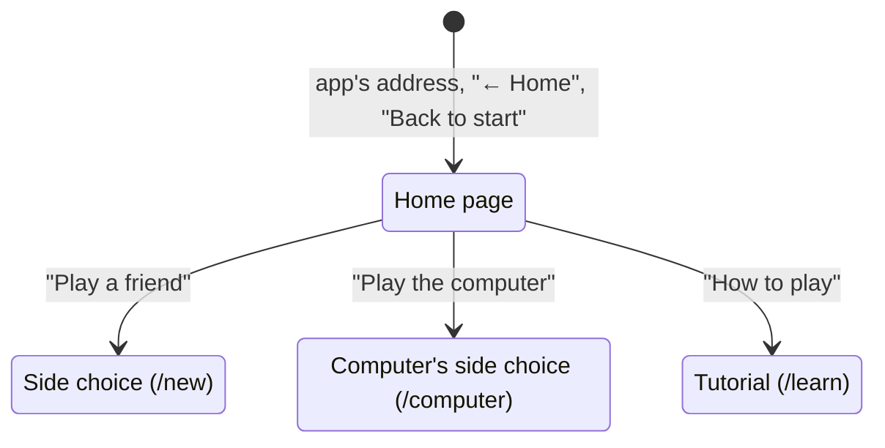

# The home page

## Summary

The home page at `/` is where the app opens: a live picture of the glass tower playing a sample game by itself fills the window, and a menu beside it offers the three ways on, "Play a friend", "Play the computer", and "How to play". It sends nothing and keeps nothing. Each choice opens another page: the [side choice](creating-a-game.md#the-side-choice) for a game against a friend, the side choice for a game [against the computer](../computer/playing-the-computer.md), or the [tutorial](../learn/the-tutorial.md). It is the only page with no "← Home": every other page leads back here.

## The simple case

The player opens the app's address. The whole window is a night scene: the glass tower of the [board screen](../foundations/the-view.md#the-scene) stands in its garden, turning slowly, while a game plays itself on it (see [the preview](#the-preview)). In a window wider than it is tall, a menu stands in a column at the left, set in from the window's edge, over a dark fade that clears just past the tower: the title on two lines, "3D" in a gradient of the five level colors over "Chess", with a short rule of the same colors under it; then two tiles side by side, "Play a friend" and "Play the computer"; and under them a quieter outlined button, "How to play". The tower stands in the room to the right of the column.

The two tiles are alike in weight: dark glass in a rim of the five level colors, washed on a diagonal from sky blue glowing at the top left to a warmer rose at the bottom right, each with two pieces facing each other in a small box of dark blue glass at the top (White's porcelain knight facing Black's charcoal knight, or facing the computer's robot in the same charcoal), the name at the bottom, and a small arrow at the top right. Under the mouse, or focused from the keyboard, a tile's rim turns, its glows brighten, a sheen sweeps across it once, and its arrow steps on. The name keeps to one line in all but the narrowest phones.

The player clicks "Play a friend", and the side choice opens at `/new` ([creating a game](creating-a-game.md)). "Play the computer" opens the side choice at `/computer` ([playing the computer](../computer/playing-the-computer.md)), and "How to play" the tutorial at `/learn` ([the tutorial](../learn/the-tutorial.md)).

### The preview

The game on the tower is always the same short game of 17 moves (nine by White, eight by Black), with captures both ways, checks, a queen trade, and a checkmate by White. Nothing about it is live: it is not a game on the server, and it is the same in every browser. The page opens on the starting position, which holds for 2 seconds; then a move lands every 2.2 seconds, gliding, capturing, and checking exactly as on the board screen, with the last move's mint line and a King in check among the dark blades. At the mate the black King is knocked over and the winners cheer; nothing on the page names the result. The finished game holds for 5 seconds, a black veil closes over the window in 0.7 seconds, the board is set up again under it, and the veil opens on the starting position in 0.9 seconds. A whole game takes about 44 seconds, and it repeats for as long as the page is open.

All the while the camera circles the tower at one height (22° above the horizon, a little above the board screen's opening view), a full turn every two games (about 88 seconds). The tower is framed alone, without file, rank, or level labels, in the room the menu leaves. The preview belongs to neither player.

The preview takes nothing from the player: a click, drag, wheel turn, or touch on it does nothing, and the view cannot be turned or zoomed by hand. A screen reader skips it and reads instead "Preview: a sample game plays itself on the five-level tower and ends in checkmate by White." It cannot be paused; only a player whose system asks for reduced motion sees it still (see [modifiers](#modifiers)).

## The interaction, event by event

### Begin

The page opens: by typing or following the app's address, by "← Home" on any other page, by browser Back, or by the crash screen's "Back to start". Its title and menu show at once; the preview appears behind them as soon as the 3D scene has loaded, and the page is usable before it does. Arriving here from a game's page against a friend [resets](../foundations/connection-and-seat.md#leaving-a-games-page) the connection.

### End without sending

Everything the home page does ends without sending. A click on a tile or on "How to play" opens its page; nothing is recorded, and nothing about the visit is kept.

### Send

Nothing is sent from the home page. The connection opens in the background as the app loads, and the page says nothing about it, ever: there is no error line, no connection state, and no label that changes.

### While in flight

Nothing is ever in flight on the home page. A click opens the next page at once, as a new entry in the browser's history.

### The answer arrives

There is no answer. The next page's documents take over.

## Modifiers

| Modifier | At the start | Changes while in flight |
| --- | --- | --- |
| Your color | No game yet. No effect. | Not applicable. |
| Whose turn it is | No game yet. No effect. | Not applicable. |
| How you reached the page | The page looks and behaves the same however it was reached; the preview starts its game from the beginning each time the page appears. Arriving from a game against a friend resets the connection. | Not applicable. |
| Connection state | Never shown and never matters here. | Not applicable. |
| Game state | No game. No effect. | Not applicable. |
| Shift, Ctrl, or Cmd held | No effect. The tiles and "How to play" are buttons, not links, so Ctrl-click or Cmd-click does not open a new tab. | Not applicable. |
| Input device | A click, a tap, or Enter or Space on a focused button all do the same thing. Tab reaches "Play a friend", "Play the computer", then "How to play". A tap leaves no hover behind. | Not applicable. |

One setting changes the preview, never the menu:

- **Reduced motion.** When the player's system asks for less motion, the preview is a still picture of the game's final position, the black King left standing, at the opening angle; nothing turns, fades, or repeats, and the tiles' rims hold still. Changing the setting while the page is open takes effect at once.

## Cancel and interrupt

| Event | Before sending | While in flight |
| --- | --- | --- |
| Escape or Cancel | No effect. | Not applicable. |
| Pressing elsewhere or turning the view | A press, drag, or wheel turn on the preview does nothing. | Not applicable. |
| Leaving the game page within the app | Each control, and browser Back or Forward, leaves the page; nothing is recorded. | Not applicable. |
| The game ends | Not applicable. | Not applicable. |
| The server answers with an error | Not applicable: nothing is sent. | Not applicable. |
| The connection drops | Nothing on the page changes; the connection retries on its own in the background. | Not applicable. |
| The window loses focus or the tab is hidden | The browser stops drawing a hidden tab; the preview stands still and carries on from the same moment when the tab is shown again. | Not applicable. |
| Reload or closing the tab | A reload shows the page afresh, the preview from its first move. | Not applicable. |
| The opponent acts | No opponent. | Not applicable. |
| Another tab takes the seat | Not applicable. | Not applicable. |
| A second touch point or a cancelled touch | No effect; a touch cancelled before it lifts presses nothing. | Not applicable. |

## Interactions with other systems

**Seat and turn.** None. The page knows nothing of any game; it does not list or resume games the browser holds seats in.

**The game record.** None. The preview's game is not on the server.

**Connection.** The app's one connection opens as the page loads and is kept on to the side choice; the page itself never uses it.

**The opponent.** None.

**Other tabs and devices.** Each tab's home page is independent.

**Game over.** "Play again" after a game leads to a side choice, not here; the home page is reached from a finished game only by browser Back.

**Stored seat.** Not read and not written.

**Keyboard, touch, and screen size.** Three Tab stops, each with a visible focus. In a window as tall as it is wide or taller, the title stands above the tower and the tiles and "How to play" under it (at most 480 pixels wide); in such a window 600 pixels wide or more (an upright tablet), the title and the larger tiles stand side by side in a band along the bottom, the title at the left. In a window 480 pixels tall or less (a phone on its side), everything is a size down in a narrower column. The tower is always framed in the room the menu leaves. See [screen sizes and touch](../cross-cutting/screen-sizes-and-touch.md).

## Edge cases

- **The preview fails to load.** If the 3D scene cannot be loaded, the page goes without it: the menu stands over the dark page, and the screen reader's sentence about the preview is left out. Everything still works.
- **Coming back.** The preview starts its game from the beginning every time the page appears, including after Back from a game.
- **No list of games.** A player who wants an earlier game needs its link; the home page offers nothing to resume.
- **The page title** stays "3D Chess — Online Multiplayer".

## Open questions and verification

- Read from `client/src/screens/StartScreen.tsx`, `LandingPreview.tsx`, `landingLayout.ts`, `client/src/game/demo.ts` (the pace: 2 s, 2.2 s, 5 s, 0.7 s, 0.9 s), `client/src/three/landingView.ts` (22°, two passes a turn), the `.landing` rules in `client/src/index.css`, and `ARCHITECTURE.md` ("Landing page") at `b325641`; not checked in the running app for this refresh.
- The preview needs WebGL. What a browser without it shows is not known beyond the chunk failing to load, which leaves the menu.
- The tiles' hover effects (the turning rim, the sheen) are described from the CSS, not watched.

Drafted against 3D Chess commit `b325641`
