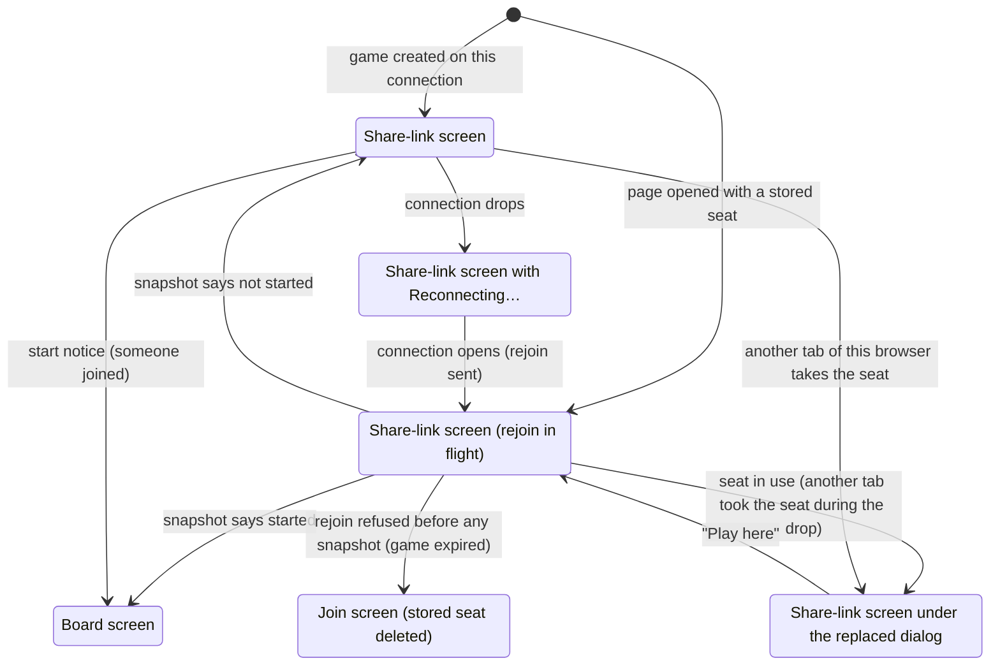

# Waiting for an opponent

## Summary

Waiting for an opponent is the stretch between a game existing and a game starting: the creator sits on the [share-link screen](../glossary.md#the-product-and-its-screens), holding one seat, until someone else opens the [share link](../glossary.md#games-and-seats) and clicks "Join Game". It lives on the game page at `/game/{id}` in the before-joining [phase](../foundations/screens-and-navigation.md#the-game-page-and-its-phases), for a browser that has a [stored seat](../foundations/connection-and-seat.md#the-stored-seat) for the game. The screen offers one thing to do, copy the link, and nothing else: no way to cancel the game, and no sign of who has seen the link. The request that ends the wait is not the creator's but the joiner's: the joiner's join reaching the server is what starts the game, and the server's [start notice](../glossary.md#requests), arriving on this page, is what replaces the screen with the board. This document describes the wait from the creator's side; the joiner's side is [joining a game](joining-a-game.md).

## The simple case

The player has just clicked "Start New Game" (see [creating a game](creating-a-game.md)). On the same dark page, under the title "3D Chess", the page now reads "Game created! Share this link with a friend:" above the share link, `{origin}/game/{id}` (for example `https://…/game/K7Q2ZD`), in large bold type in a dark gray box, and a white "Copy link" button under the box. The link itself is plain text, not clickable. The player clicks "Copy link"; the word "Copied" appears beside the button, and the link is on the clipboard. The address in the browser's address bar is the same link, so the player can also copy it from there, or select the text in the box and copy that.

The player sends the link to a friend by whatever means they like. Nothing on the screen changes while they wait. It does not say whether the friend has opened the link, and it does not say which color the player will play, although the server chose it when the game was created and this browser already knows it.

When the friend clicks "Join Game", the page switches at once to the [board screen](../glossary.md#the-product-and-its-screens): the 3D board fills the window, the seat label at the top left says "You are playing as white." or "You are playing as black.", and "Opponent: online" appears under it, to the eye at the same moment. The turn indicator reads "White to move". There is no sound, no notification, and the tab's title does not change.

## The interaction, event by event

### Begin

The wait begins when the share-link screen appears. There are two ways in:

- **From "Start New Game".** The page arrives already holding the seat on its connection (see [creating a game](creating-a-game.md#the-answer-arrives)). It sends nothing and shows the screen straight away.
- **Returning with a stored seat.** A reload, the share link opened again, a bookmark, browser Forward from the start screen, or any other fresh opening of the game page. The page chooses what to show from the stored seat alone, before the server has said anything: it shows the share-link screen at once and [rejoins](../foundations/connection-and-seat.md#rejoining) by itself as soon as the connection opens. The server answers with a snapshot. If the snapshot says the game has not started, the screen simply stays and nothing visibly happens. If it says the game has started (someone joined while the player was away), the board appears instead, and the wait is over before it began.

Because the screen is chosen from the stored seat alone, every player with a stored seat who opens the game page sees it while their rejoin is in flight, including a returning joiner and a player of a game that started long ago; for them it is a brief flash of the wrong wording, described in [the connection and seat model](../foundations/connection-and-seat.md#rejoining). A [visitor](../glossary.md#games-and-seats), whose browser has no stored seat for the game, never sees this screen; it gets the [join screen](joining-a-game.md).

At the instant the screen appears, nothing is decided that the player can see. The creator's color was fixed by the server when the game was created and is held in this browser as the stored seat, but the screen does not show it. Nothing is focused.

### End without sending

Most of the wait is spent here: nobody has joined yet. The screen's one control, "Copy link", only copies the link, so nothing the creator does can end the wait or send anything, and nothing the creator does is recorded. There is no timeout: the page waits for as long as it stays open, and the game waits on the server whether or not the page is open.

"Copy link" puts the share link, exactly as shown in the box, on the clipboard. A line beside the button then says "Copied", or "Could not copy; select the link instead" if the browser refused. The line keeps its text until the page changes; clicking again copies again. The button exists only where the browser offers the clipboard to pages, which is on a secure address: `https://`, or `localhost` during development. On a plain `http://` address, such as a development server opened from another device by its network address, the button is absent and the screen is as it was before the button existed: the link in its box and nothing else.

People who open the link and look at the join screen without clicking "Join Game" leave no trace. The server does not know they exist, and the creator's screen does not change. The creator cannot tell whether the link has been opened, by whom, or how many times.

If the creator leaves (closes the tab, reloads, goes Back to the start screen), the game stays on the server exactly as it was: one seat taken, no moves. A joiner can still join while the creator is away, and the creator can come back through the link at any time. A game nobody joins is deleted by [expiry](../glossary.md#games-and-seats) about 30 days after it was last active. After that, the creator's return is refused with "Cannot rejoin", the stored seat is deleted, and the page shows the join screen with the error (see [reloading and returning](../session/reload-and-return.md)); a would-be joiner's click is refused with "Cannot join".

### Send

The request that ends the wait is sent by someone else: another person clicks "Join Game" on the share link, and the join reaches the server (the joiner's side, including every way it can be refused, is in [joining a game](joining-a-game.md#send)). What the server does that concerns the creator:

- it records the second seat, whichever color the creator did not get, and remembers the joiner's [client id](../glossary.md#requests) as its claimant. The game is now full for good: any later join, including the creator's own from another browser, is refused with "Game full"; only the joiner's own tab, repeating a join whose answer it lost, gets the seat again;
- it tells every player connected to the game that the game has started, White first, the creator included if the creator's page is connected at that moment;
- it tells the creator the joiner is online, and tells the joiner whether the creator is connected.

The game has started from this moment, whether or not the creator's page ever hears about it, and nothing the creator does can undo it.

### While in flight

On the creator's side, the start notice is in flight only for the time it takes to cross the network, a fraction of a second, and there is no sign of it: the share-link screen does not change until it arrives. The creator never sees the joiner's join screen, the joiner's "Joined game, waiting for start...", or anything else the joiner does before the join reaches the server.

If the creator's page is not connected when the join is recorded (reconnecting after a drop, replaced by another tab, on the start screen, or closed), the start notice is not sent to it at all. The game has started anyway; the page learns so from the snapshot after its next rejoin.

### The answer arrives

The answer is the server's [start notice](../glossary.md#requests), carrying the creator's color. The page switches straight from the share-link screen to the board screen, with no transition, and stays in the playing phase for as long as it is open:

- the seat label at the top left reads "You are playing as white." or "You are playing as black."; this is the first time the page shows the color;
- the board is drawn in the [default view](../foundations/the-view.md#the-default-view), [oriented](../foundations/the-view.md#orientation) for the creator's color, with the starting position;
- the turn indicator reads "White to move", and the [move list](../game-page/move-list.md) stays hidden until the first move;
- the presence report follows immediately as a separate message, and "Opponent: online" appears under the seat label (see [seat and opponent status](../game-page/seat-and-opponent-status.md)).

The stored seat is written again with the same color, which changes nothing. A creator seated as White can move at once ([making a move](../play/making-a-move.md)); a creator seated as Black waits for the joiner's first move ([the opponent's move](../play/the-opponents-move.md)).

If the joiner's tab lost its answer and repeated its join, the server hands that tab its seat back without announcing the start again; this page only receives "Opponent: online" once more, and nothing else on screen changes.

When the page learns of the start from a snapshot instead (after a reload, a drop, "Play here", or a return), the result is the same board screen with two differences: any moves the joiner has made meanwhile are already in place, drawn without a glide, and the presence line says whether the joiner is connected now. A joiner seated as White may already have moved by the time the creator returns.

There is no sound, no browser notification, and no change to the tab's title. A creator waiting in another tab or application learns that the opponent has joined only by looking at the page.

## Modifiers

| Modifier | At the start | Changes while in flight |
| --- | --- | --- |
| Your color | Already decided at random when the game was created, and held by this browser as the stored seat, but not shown anywhere on this screen. | Cannot change. The board shows it for the first time. |
| Whose turn it is | No turn yet: there is no board, and nothing can be played until both seats are taken. | No effect. The game starts with White to move; a joiner seated as White can move before the creator's board appears if the creator is not connected. |
| How you reached the page | From "Start New Game": no rejoin, the screen at once. Returning with a stored seat: the screen at once, then a rejoin whose snapshot keeps it or replaces it with the board. A returning joiner, or any player of a started game, sees this screen only until the snapshot. A visitor sees the join screen instead. A creator whose browser does not store the seat sees the join screen too (see the edge cases). | No effect. |
| Connection state | Connecting (after a page load): the screen shows at once, with no indicator, and the rejoin goes out when the connection opens. Connected: as described. Reconnecting: the amber "Reconnecting…" box at the top right; the screen stays. Replaced: the [replaced dialog](../session/second-tab.md) covers the screen. | A drop at the moment the join is recorded loses the start notice; the snapshot after reconnecting says the game has started, and the board appears. |
| Game state | Not started: one seat taken, no moves. In check, over, and frozen cannot occur. | The game becomes in progress. |
| Shift, Ctrl, or Cmd held | No effect. The share link is text, not a link, so Ctrl-click or Cmd-click does not open it, and "Copy link" is a button. | No effect. |
| Input device | "Copy link" works with a click, a tap, or Enter or Space once Tab has reached it; nothing is focused on arrival. The link's text can also be selected with the mouse or a long press and copied. Tab reaches "Copy link" and, when they show, the error banner's "✕" and the replaced dialog's "Play here". | No effect. |

Nothing the creator can do changes what happens when someone joins: the color was fixed at creation, and the screen's only control copies the link.

## Cancel and interrupt

"Before sending" is the wait itself, before any join reaches the server; "while in flight" is the moment between the server recording a join and the start notice reaching this page.

| Event | Before sending | While in flight |
| --- | --- | --- |
| Escape or Cancel | No effect. There is no Cancel control and no way to withdraw or close the game; Escape is ignored. | No effect. |
| Pressing elsewhere or turning the view | There is no board on this screen. Clicking the page does nothing; dragging across the link selects its text. | Same. |
| Leaving the game page within the app | Back to the start screen [resets](../foundations/connection-and-seat.md#returning-to-the-start-screen) the connection. The game stays on the server, open to a joiner. Forward, or the link, returns through a rejoin: the share-link screen again, or the board if someone joined meanwhile. | The start notice is lost with the page. The game has started; the creator finds the board on returning. |
| The game ends | Not applicable: the game has not started. | Not applicable. |
| The server answers with an error | The creator's only request here is the automatic rejoin. If it is refused because the game has expired or the seat is unknown ("Cannot rejoin", "No such seat to rejoin") before the page has had any snapshot, the stored seat is deleted, the page shows the join screen, and the [error banner](../game-page/error-banner.md) shows the message. A page that has already had a snapshot keeps the stored seat and stays on the share-link screen, with the message in the banner. A rejoin after a drop that finds another tab of this browser holding the seat is answered with [seat in use](../glossary.md#the-connection): no banner, the replaced dialog instead. | Not applicable: the join has been accepted by this point, and a refused join is reported only to the joiner. |
| The connection drops | "Reconnecting…" appears at the top right and the screen stays. When a connection opens, the page rejoins; the snapshot keeps the screen if nobody has joined, or brings the board if someone joined during the outage. | The start notice is lost. The snapshot after reconnecting says the game has started, and the board appears. |
| The window loses focus or the tab is hidden | No effect. The connection stays open in a background tab. | The page switches to the board in the background. Nothing signals it; the player finds the board on returning to the tab. |
| Reload or closing the tab | Reload: the screen reappears at once and rejoins. Closing: the game waits on the server, and the link reopens it; the link is the only way back, since the start screen does not list games. | Reload: the snapshot says the game has started, and the board appears. Closing: the joiner's board shows "Opponent: offline", and the creator finds the game started on returning. |
| The opponent acts | This row is the document's subject: the only thing an opponent can do is join, and the first join to reach the server ends the wait. | The start notice arrives and the board appears. |
| Another tab takes the seat | Opening the share link in another tab or window of this browser rejoins as the creator there and takes the seat; this tab shows the replaced dialog over the share-link screen, and "Play here" takes the seat back. If this tab was reconnecting when the other took the seat, it does not take it back when its connection returns: its rejoin is answered with seat in use, and it shows the same dialog. | The start notice goes only to the tab holding the seat. The other tab learns the game has started from the snapshot after "Play here". |
| A second touch point or a cancelled touch | No effect. A touch cancelled before it lifts does not click "Copy link". | No effect. |

Nothing in this table changes the server's record except the join itself, and the stored seat survives every row except a rejoin refused before the page has had any snapshot.

## Interactions with other systems

**Seat and turn.** The creator already holds a seat, chosen at random by the server, and learns which only when the board appears. White always moves first, so a creator seated as Black starts the game by waiting for the joiner's move.

**The game record.** One seat taken and no moves, for as long as the wait lasts. Waiting writes nothing: the creator's rejoins only read the record. Whether reopening the page keeps an unjoined game from expiring is not known (see [the connection and seat model](../foundations/connection-and-seat.md#open-questions-and-verification)).

**Connection.** The page keeps its connection open for the whole wait, and the server treats it as the creator's seat. Every new connection (after a drop, the [one-hour limit](../glossary.md#the-connection), a reload, or "Play here") rejoins by itself; the page shows only a brief "Reconnecting…" and returns to the same screen. The rejoin after a drop does not [take over](../glossary.md#the-connection) the seat, so it succeeds unless another tab of this browser has taken the seat in the meantime.

**The opponent.** There is none until the join. Visitors who open the link are invisible, and the screen shows no presence line: the page does receive a report after each rejoin that no opponent is connected, but shows nothing until the board appears. The first join to reach the server ends the wait; see [joining a game](joining-a-game.md).

**Other tabs and devices.** The share link opened in another tab or window of the same browser rejoins as the creator and takes the seat (see [a second tab](../session/second-tab.md)). Opened in another browser, a private window, or on another device, it is a visitor's join screen: clicking "Join Game" there takes the other seat, so the creator plays both sides. A creator cannot move the wait to another device, because nothing but the stored seat, which stays in this browser, identifies the creator.

**Game over.** Not applicable: a game cannot end before it starts.

**Stored seat.** Written by the start screen before this screen first appears, and the only thing that makes the game page show this screen rather than the join screen. It is kept for as long as the browser keeps its site data, and deleted only if a rejoin is refused before the page has had any snapshot, which in practice means the game expired. With the site data cleared, the link shows the join screen and the creator's seat cannot be reclaimed; clicking "Join Game" takes the other seat instead, which starts a game whose original seat no browser can reach.

**Keyboard, touch, and screen size.** "Copy link" is the one control: Tab reaches it, Enter or Space copies, and the line beside it ("Copied", or "Could not copy; select the link instead") is announced to screen readers as a status. The link can also be selected and copied with the mouse or a long press on a touch screen. The screen is a single centered column: the title is a size smaller in a window narrower than 640 pixels, the link is set smaller there too, and the link breaks onto as many lines as it needs, anywhere in the address, so it never runs off a phone screen. See [screen sizes and touch](../cross-cutting/screen-sizes-and-touch.md) and [accessibility](../cross-cutting/accessibility.md).

## Edge cases

- **Opening your own link in another browser.** The other browser shows the join screen. Clicking "Join Game" takes the second seat, both pages switch to the board, and each sees "Opponent: online". The creator now plays both sides, one per browser, which is also the way to try the game alone.
- **Testing the link in a new tab.** A creator who opens the link in a new tab of the same browser, to check what the friend will see, does not see the join screen: the new tab rejoins as the creator, shows the share-link screen, and the original tab shows "This game is open in another tab".
- **Two friends with the same link.** The first join to reach the server takes the seat; the second is refused with "Game full" and stays on the join screen. The creator sees only the first.
- **The joiner arrives while the creator is away.** The joiner's board appears at once with "Opponent: offline". A joiner seated as White can play the first move before the creator returns; the creator then finds it in place, without a glide, and it is their turn.
- **"Copy link" where there is no clipboard.** On a plain `http://` address other than `localhost` the button is not shown at all; the link in the box and the address bar are the only sources.
- **"Copy link" refused.** If the browser refuses the copy (a permission setting, or a page that is not focused), the line says "Could not copy; select the link instead", and the link stays selectable in the box.
- **A long address.** The link breaks at any character when it does not fit, so a long origin can wrap mid-word; what is copied, by the button or by selecting the whole box, is still the single unbroken address.
- **A creator whose browser does not store the seat.** With storage disabled, the page finds no stored seat and shows the creator the join screen instead of this one; clicking "Join Game" there is refused with "Already in a game". The board still appears when an opponent joins, but before that a reload loses the seat. See [creating a game](creating-a-game.md#edge-cases).
- **A returning joiner.** A joiner reopening a started game sees "Game created! Share this link with a friend:", the link, and "Copy link" until the snapshot arrives, normally too briefly to read, and for as long as an outage lasts. See [the connection and seat model](../foundations/connection-and-seat.md#rejoining).
- **Waiting more than an hour.** The server ends every connection within an hour, so a long wait shows "Reconnecting…" for a moment about once an hour; the page rejoins and the screen stays.
- **A flash of "Opponent: offline".** A page that has rejoined at least once while waiting (after a reload or a drop) holds the report that no opponent was connected. When the game starts, the board can show "Opponent: offline" for an instant before the report that the joiner is online replaces it.
- **"Opponent: online" for an absent creator.** If the creator's connection has died without the server noticing yet (a laptop lid closed, a network that vanished), the joiner is told the creator is online, and the start notice meant for the creator is lost. The creator's page rejoins when it reconnects and shows the board.
- **Back, then Forward, quickly.** Going Back to the start screen and Forward again, however quickly and whatever the start screen's connection is doing, sends one rejoin: the page waits until a connection is open and has not yet been rejoined on, and the share-link screen comes back without an error. The seat is not affected.
- **Leaving to create another game.** Back to the start screen and "Start New Game" creates a second game; the first keeps waiting on the server, reachable only through its link.
- **The page title** stays "3D Chess — Online Multiplayer" throughout, including when the opponent joins.

## Open questions and verification

- There is no notification of any kind when the opponent joins (no sound, no title change, no browser notification), and the creator cannot tell whether anyone has opened the link. Whether either is wanted is a product call.
- The creator's color is known to this browser from the moment the game is created but is shown only when the game starts. Whether that is deliberate is not stated anywhere in the repository.
- "Copy link" is absent on a plain `http://` address other than `localhost`, because the page shows it only when the browser offers the clipboard (`client/src/screens/GameScreen.tsx:517`). That affects only development and testing on another device; production is served over `https://`. Read from code; not tried on a device.
- Back, then Forward sends exactly one rejoin (read from code; WAIT-06 and WAIT-12 check it). A return to the start screen sets the session number to 0 (`client/src/hooks/useGameSocket.ts:107`), and the game page rejoins only on an open connection with a nonzero number that it has not yet rejoined on (`client/src/screens/GameScreen.tsx:131-146`), so no rejoin is ever queued on a closed connection to be sent a second time. [Bug triage](../bug-triage.md) B-10 is fixed.
- The flash of "Opponent: offline" at the start, after a rejoin while waiting, is read from how the latest presence report is chosen; it lasts at most the gap between two messages and was not observed.
- Whether a creator who only ever reopens the waiting page keeps the game from expiring depends on whether a rejoin counts as activity for the storage provider; see [the connection and seat model](../foundations/connection-and-seat.md#open-questions-and-verification).
- Everything else was read from `client/src/screens/GameScreen.tsx` (the share-link screen and "Copy link" at `:483-492` and `:515-540`), `client/src/game/session.ts`, `client/src/hooks/useGameSocket.ts`, `client/src/lib/playerRole.ts`, `server/modal_app.py`, `client/src/App.test.tsx` (the share link with a stored seat, no rejoin when the connection created the game, a snapshot that says not started, the replaced dialog over the waiting screen), `server/tests/test_local_ws.py` (`test_rejoin_before_opponent_joins`, `test_presence_follows_connections`, `test_repeated_join_from_the_claimant_returns_its_seat`), and `client/e2e/createGame.spec.ts`; the switch from this screen to the board when an opponent joins is exercised by every end-to-end game (`client/e2e/helpers/game.ts`).

Verified against 3D Chess commit `90142a3`
