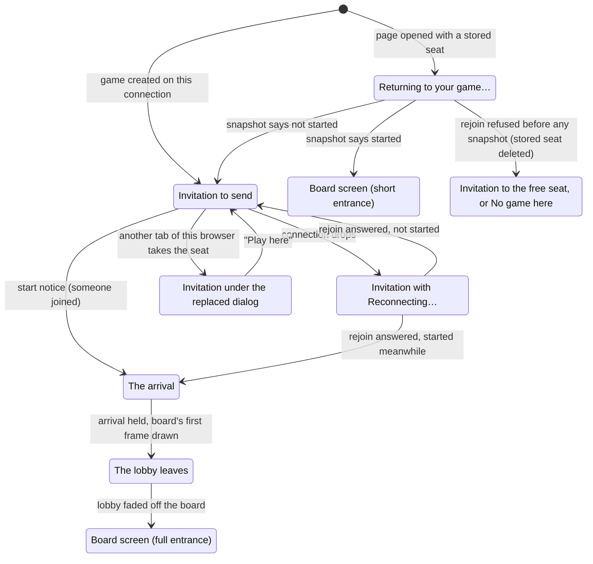

# Waiting for an opponent

## Summary

Waiting for an opponent is the stretch between a game existing and a game starting, from the creator's side: the creator (the *host*) sits on the [invitation to send](../glossary.md#the-product-and-its-screens), holding the seat they chose, until someone else opens the [share link](../glossary.md#games-and-seats) and takes the other seat. It lives on the game page at `/game/{id}` before the game starts, for a browser that has a [stored seat](../foundations/connection-and-seat.md#the-stored-seat) for the game, over the [lobby](../glossary.md#the-product-and-its-screens)'s scene: the two kings on the glass, the host's in its material, standing on the glass in its column of light however the side was chosen, and the free seat's drawn in neon. The page offers one thing to do, send the link, and nothing else: no way to cancel the game, and no sign of who has seen the link. The request that ends the wait is not the host's but the guest's: the guest's join reaching the server is what starts the game, and the server's [start notice](../glossary.md#requests), arriving on this page, is what plays the [arrival](../glossary.md#the-product-and-its-screens) and hands the lobby over to the board. This document describes the wait and the arrival from the host's side; the guest's side is [joining a game](joining-a-game.md).

## The simple case

The player has just chosen White on the side choice (see [creating a game](creating-a-game.md)). The address changes to `/game/{id}` without the scene reloading, 0.3 seconds after the pick, while the charcoal king and the split king are still fading away: the porcelain king stands on the glass in its column of light on the left, and the charcoal king's seat on the right, left empty by the pick, opens: 0.2 seconds in, a soft line of neon rises from its foot to its cross over 0.7 seconds, drawing its outline. (After a Random pick the outline is already there: the side kings crossed to their outlines as they faded.) The heading at the top stays as the side choice left it, "You play White", and the line under it becomes a breathing dot and "Waiting for your friend…". The camera eases up a little as a card of the home page's tile glass, in a rim of the level colors, rises into place under the kings. Nothing is written under the kings themselves.

The card holds only "Invite a friend", the link itself, without its `https://`, in plain muted text on one line in a box only as wide as the link, cut off at its end if it is too long; then one button, "Copy link", a pale pill of starlight in a slowly turning rim of the level colors. It already has keyboard focus. Nothing else is written on the card. "← Home" sits at the top left.

The player clicks "Copy link". The button reads "Copied ✓" for a couple of seconds, and nothing else on the card changes (a screen reader hears "Link copied"); the link is on the clipboard. The player sends it by whatever means they like. While they wait, the outline of the open seat breathes, slowly brightening and dimming, and the camera holds still.

When the friend takes the seat, the page tells the host at once. The open seat fills: the charcoal king forms from its foot up, behind a line of light, as the neon gives way, and a ring of light spreads out across the glass from it. In the heading's place a single line rises: "Opponent joined". Once filled, the charcoal king stands in a column of light of its own, and the two kings, both still on the glass, lift together into their columns, level, so the two stand alike. A moment later both rise on together, each in its own column of light, and are taken up into it from the foot, leaving the glass empty, while the camera pulls back and turns and the garden's sculptures brighten. The glass stays: it is the tower's bottom level, and the camera comes to rest exactly where the [board screen](../glossary.md#the-product-and-its-screens)'s camera begins, so when the lobby's picture gives way to the board's there is nothing to see change. From there the game's entrance plays: the tower builds itself on up from that glass, level by level in light, while the camera closes in and the two armies form. The turn pill fades in last, White's half lit.

## The interaction, event by event

```mermaid
stateDiagram-v2
    state "Returning to your game…" as returning
    state "Invitation to send" as invite
    state "Invitation with Reconnecting…" as recon
    state "Invitation under the replaced dialog" as replaced
    state "The arrival" as arrive
    state "The lobby leaves" as leave
    state "Board screen (full entrance)" as board
    state "Board screen (short entrance)" as boardshort
    state "Invitation to the free seat, or No game here" as guestview
    [*] --> invite : game created on this connection
    [*] --> returning : page opened with a stored seat
    returning --> invite : snapshot says not started
    returning --> boardshort : snapshot says started
    returning --> guestview : rejoin refused before any snapshot (stored seat deleted)
    invite --> arrive : start notice (someone joined)
    invite --> recon : connection drops
    recon --> invite : rejoin answered, not started
    recon --> arrive : rejoin answered, started meanwhile
    invite --> replaced : another tab of this browser takes the seat
    replaced --> invite : "Play here"
    arrive --> leave : arrival held, board's first frame drawn
    leave --> board : lobby faded off the board
```

### Begin

The wait begins when the invitation to send appears. There are two ways in:

- **From the side choice.** The page arrives already holding the seat on its connection (see [creating a game](creating-a-game.md#the-answer-arrives)). It sends nothing and shows the card straight away, over the same scene the side choice left, under the same heading. The host's king stands as the pick left it, on the glass in its column of light, whether the side was picked by name or left to chance, and it stays so for the whole wait. After a pick by name the open seat has no outline until the card comes; it is drawn up from the foot then (see [the simple case](#the-simple-case)).
- **Returning with a stored seat.** A reload, the share link opened again, a bookmark, browser Forward, or any other fresh opening of the game page. Until the server has said anything, the page shows only "Returning to your game…" at the bottom of a dark page, with no scene and no card, and [rejoins](../foundations/connection-and-seat.md#rejoining) by itself as soon as the connection opens. The server answers with a snapshot. If it says the game has not started, the lobby opens: the glass draws itself in light, the host's king forms in its material out of nothing, with no outline first, and stands on the glass in its column of light, the other seat's neon outline comes up, and the heading ("You play White", "Waiting for your friend…") and card as above. If it says the game has started (someone joined while the host was away), the board screen appears instead with its short entrance, and the wait is over before it began; no lobby is shown.

A [visitor](../glossary.md#games-and-seats), whose browser has no stored seat for the game, never sees the invitation to send; it gets the [invitation to the free seat](joining-a-game.md).

At the instant the card appears, the host's color is in the heading ("You play White" or "You play Black"), and "Copy link" (where there is one) has keyboard focus.

### End without sending

Most of the wait is spent here: nobody has joined yet. The card's buttons only send the link on its way, so nothing the host does can end the wait or send anything to the server, and nothing the host does is recorded. There is no timeout: the page waits for as long as it stays open, and the game waits on the server whether or not the page is open.

- **"Copy link"** puts the share link, the full address with its `https://`, on the clipboard. The button then reads "Copied ✓" for 1.8 seconds, then "Copy link" again; a screen reader hears "Link copied" from a status that is never shown. If the browser refuses, the button keeps "Copy link" and a small line appears under the buttons: "Couldn't copy. Select the link.", which is announced too. The heading's "Waiting for your friend…" never changes. The button exists only where the browser offers the clipboard to pages, which is on a secure address (`https://`, or `localhost` during development).
- There is no "Share" button: the system's share sheet is not offered, on phones either.
- Where the browser does not offer the clipboard (a plain `http://` address), the card shows the link alone; it can be selected and copied by hand, and the address bar holds the same address.

People who open the link and look at the invitation without taking the seat leave the host's page untouched: their page asks the server which seats are taken, which the host is never told. The host cannot tell whether the link has been opened, by whom, or how many times.

If the host leaves (closes the tab, reloads, "← Home" or Back to the home page), the game stays on the server exactly as it was: one seat taken, no moves. A guest can still join while the host is away, and the host can come back through the link at any time. A game nobody joins is deleted by [expiry](../glossary.md#games-and-seats) about 30 days after it was last active. After that, the host's return is refused, the stored seat is deleted, and the page shows "No game here" (see [reloading and returning](../session/reload-and-return.md)).

### Send

The request that ends the wait is sent by someone else: the guest clicks "Join game" and the join reaches the server (the guest's side, including every way it can be refused, is in [joining a game](joining-a-game.md#send)). What the server does that concerns the host:

- it records the second seat, the one the host did not choose, and remembers the guest's [client id](../glossary.md#requests) as its claimant. The game is now full for good;
- it tells every player connected to the game that the game has started, the host included if the host's page is connected at that moment;
- it tells the host the guest is online, and tells the guest whether the host is connected.

The game has started from this moment, whether or not the host's page ever hears about it, and nothing the host does can undo it.

### While in flight

On the host's side, the start notice is in flight only for the time it takes to cross the network, and there is no sign of it: the card does not change until it arrives. The host never sees the guest's invitation, the guest's seat filling on the guest's own page, or anything else the guest does before the join reaches the server.

If the host's page is not connected when the join is recorded (reconnecting after a drop, replaced by another tab, on another page, or closed), the start notice is not sent to it at all. The game has started anyway; the page learns so from the snapshot after its next rejoin.

### The answer arrives

The answer is the server's start notice. On a page that has been showing the lobby, it plays the arrival and then hands over to the board:

1. **The arrival.** The card and the heading go. The open seat fills: the other army's king forms from the foot up behind a line of light as its neon outline gives way, and a ring of light spreads out across the glass from its foot and fades. Once filled, the arriving king stands in a column of light of its own, beside the host's king, which has stood on the glass in its light since the wait. With both kings filled, the two lift together into their columns, to the height of a piece picked up on the board, and stand level and alike. The host's king never lifts before the arriving one, however the side was chosen, and the guest's page lifts its two kings at the same moment in the same way. In the heading's place a single line rises, "Opponent joined", whichever side the host plays; nothing says who moves first. A screen reader reads it. The moment is held for about 2 seconds from the seat starting to fill.
2. **The board is put together underneath.** At the same time the board screen is built under the lobby and held on its first frame: level A's glass alone in the garden, seen from well back along the board's opening line of sight. The lobby waits for that frame; if it never comes (a browser that has lost its 3D support, say), it goes on anyway 4 seconds after the arrival.
3. **The lobby leaves.** Both kings rise on together, each in its own column of light, and are taken up into it from the foot, in about 0.7 seconds. The glass stays. As they go, the garden and the arrival's line ease off to black together over about 0.8 seconds, under the glass and the kings. In one movement of about 2 seconds, starting 0.2 seconds into the kings' going, the camera draws back at an even pace while the glass, barely turning at first, gathers speed and spins half a turn into place, sliding down the picture to where the board's first picture has level A; in the dark the garden becomes the game's, laid out for the host's seat, and fades up already in place as the glass settles. The camera comes to rest exactly where the board's camera stands on its first frame, and over the last moment the lobby's picture fades off the board's, which is the same picture. The garden is never seen to turn.
4. **The game's entrance.** As the lobby's picture fades, the board's [entrance](../foundations/the-view.md#the-entrance) starts under it: level A already stands, nothing fades up, and the camera stands still; levels B to E build on up from A while the armies form, and the labels settle. It lasts about 3.1 seconds; the turn pill and the captured pieces fade in last, and the board takes no input until it is over.

From here the page shows the board screen for as long as it is open: the turn pill with the host's stone and White's half lit ("Your move" for White, "Their move" for Black), the board [oriented](../foundations/the-view.md#orientation) for the host's color, and the guest online. A host playing White can move once the entrance is over ([making a move](../play/making-a-move.md)); a host playing Black waits for the guest's first move ([the opponent's move](../play/the-opponents-move.md)).

When the page learns of the start from a snapshot instead:

- **After a drop, while the lobby was showing.** The arrival and the handover play just the same, from the snapshot, and any moves the guest has made meanwhile are already in place when the board appears.
- **On a fresh page load** (a reload, a return), there was no lobby: "Returning to your game…" gives way to the board screen with the short entrance (about 1.3 seconds), and the turn pill shows "Offline" if the guest is not connected now.

**A host in a background tab.** If the host's tab is hidden when the guest arrives, the tab's title changes to "● Opponent joined · 3D Chess", and the arrival waits: the browser draws nothing in a hidden tab, so the seat fills, "Opponent joined" shows, and the lobby leaves only once the host comes back to the tab. The title returns to "3D Chess — Online Multiplayer" as soon as the tab is shown. There is no sound and no browser notification.

## Modifiers

| Modifier | At the start | Changes while in flight |
| --- | --- | --- |
| Your color | Chosen on the side choice and shown in the heading ("You play White") and on the glass (the host's king in its material, on White's left or Black's right, standing on the glass in its column of light). | Cannot change. |
| Whose turn it is | No turn yet: there is no board, and nothing can be played until both seats are taken. | No effect. The game starts with White to move; a guest playing White can move before the host's board appears if the host is not connected. |
| How you reached the page | From the side choice: no rejoin, the card at once. Returning with a stored seat: "Returning to your game…", then a rejoin whose snapshot brings the card or the board. A visitor sees the invitation to the free seat instead. A host whose browser does not store the seat is treated as a visitor (see [creating a game](creating-a-game.md#edge-cases)). | No effect. |
| Connection state | Connecting (after a page load): "Returning to your game…", and the rejoin goes out when the connection opens. Connected: as described. Reconnecting: the "Reconnecting…" line at the top right; the card stays. Replaced: the [replaced dialog](../session/second-tab.md) covers the page. | A drop at the moment the join is recorded loses the start notice; the snapshot after reconnecting says the game has started, and the arrival plays. |
| Game state | Not started: one seat taken, no moves. In check, over, and frozen cannot occur. | The game becomes in progress. |
| Shift, Ctrl, or Cmd held | No effect. The link on the card is text, not a link, and the card's controls are buttons. | No effect. |
| Input device | "Copy link" has focus on arrival; Enter or Space presses it, and Tab reaches "← Home". A click or tap works the same. The link's text can be selected with the mouse or a long press. | No effect. The arrival and the handover take no input; the board takes none until its entrance is over. |

Reduced motion changes the lobby, not the wait: the open seat does not breathe, each beat (the fills, the fades, the arrival, the kings taken up, the camera's move) takes a fraction of a second, the headings and card do not rise into place, and the board's entrance is a short plain fade.

## Cancel and interrupt

"Before sending" is the wait itself, before any join reaches the server; "while in flight" is the moment between the server recording a join and the start notice reaching this page.

| Event | Before sending | While in flight |
| --- | --- | --- |
| Escape or Cancel | No effect. There is no Cancel control and no way to withdraw or close the game; Escape is ignored. | No effect. |
| Pressing elsewhere or turning the view | Clicking the glass or the garden does nothing, and the view cannot be turned: the camera holds still. Dragging across the link selects its text. | Same. |
| Leaving the game page within the app | "← Home" or Back to the home page (Back skips the side choice, which the game page replaced) [resets](../foundations/connection-and-seat.md#leaving-a-games-page) the connection. The game stays on the server, open to a guest. Forward, or the link, returns through a rejoin: the card again, or the board if someone joined meanwhile. | The start notice is lost with the page. The game has started; the host finds the board on returning. |
| The game ends | Not applicable: the game has not started. | Not applicable. |
| The server answers with an error | The host's only request here is the automatic rejoin. Refused before any snapshot because the game has expired, the stored seat is deleted and the page shows "No game here" with "Play a friend"; refused as "No such seat to rejoin", the stored seat is deleted, the message shows in the [error banner](../game-page/error-banner.md) at the top, and the page offers the free seat as to any visitor (or says "This game is taken"). A rejoin after a drop that finds another tab of this browser holding the seat is answered with [seat in use](../glossary.md#the-connection): the replaced dialog, no banner. | Not applicable: the join has been accepted by this point, and a refused join is reported only to the guest. |
| The connection drops | "Reconnecting…" appears at the top right and the card stays. When a connection opens, the page rejoins; the snapshot keeps the card if nobody has joined, or plays the arrival if someone joined during the outage. | The start notice is lost. The snapshot after reconnecting says the game has started, and the arrival plays. |
| The window loses focus or the tab is hidden | No effect. The connection stays open in a background tab; the breathing stops while the tab is hidden and carries on when it is shown. | The start notice is received in the background, the tab's title reads "● Opponent joined · 3D Chess", and the arrival waits until the tab is shown. |
| Reload or closing the tab | Reload: "Returning to your game…", then the card again. Closing: the game waits on the server, and the link reopens it; the link is the only way back, since the home page does not list games. | Reload: the snapshot says the game has started, and the board appears with its short entrance. Closing: the guest's board shows "Offline", and the host finds the game started on returning. |
| The opponent acts | This row is the document's subject: the only thing a guest can do is join, and the first join to reach the server ends the wait. | The start notice arrives and the arrival plays. |
| Another tab takes the seat | Opening the link in another tab or window of this browser rejoins as the host there and takes the seat; this tab shows the replaced dialog over the card, and "Play here" takes the seat back. If this tab was reconnecting when the other took the seat, it does not take it back when its connection returns: it is answered with seat in use and shows the same dialog. | The start notice goes only to the tab holding the seat. The other tab learns the game has started from the snapshot after "Play here". |
| A second touch point or a cancelled touch | No effect. A touch cancelled before it lifts does not press a button. | No effect. |

Nothing in this table changes the server's record except the join itself, and the stored seat survives every row except a rejoin refused before the page has had any snapshot.

## Interactions with other systems

**Seat and turn.** The host holds the seat they chose, shown in the heading from the first moment. White always moves first, so a host playing Black starts the game by waiting for the guest's move; the lobby does not say so, the turn pill does once the board is up.

**The game record.** One seat taken and no moves, for as long as the wait lasts. Waiting writes nothing: the host's rejoins, and visitors' looks, only read the record.

**Connection.** The page keeps its connection open for the whole wait, and the server treats it as the host's seat. Every new connection (after a drop, the [one-hour limit](../glossary.md#the-connection), a reload, or "Play here") rejoins by itself; after a drop the page shows only a brief "Reconnecting…" and keeps the card. The rejoin after a drop does not [take over](../glossary.md#the-connection) the seat, so it succeeds unless another tab of this browser has taken the seat in the meantime.

**The opponent.** There is none until the join. Visitors who open the link are invisible, and the page shows no presence: it does receive a report after each rejoin that no opponent is connected, but shows nothing until the board appears. The first join to reach the server ends the wait; see [joining a game](joining-a-game.md).

**Other tabs and devices.** The link opened in another tab or window of the same browser rejoins as the host and takes the seat (see [a second tab](../session/second-tab.md)). Opened in another browser, a private window, or on another device, it is a visitor's invitation to the free seat: taking it there makes the host play both sides. The host cannot move the wait to another device, because nothing but the stored seat, which stays in this browser, identifies the host.

**Game over.** Not applicable: a game cannot end before it starts.

**Stored seat.** Written by the side choice before the card first appears, and the only thing that makes the game page show the card rather than an invitation to the free seat. It is kept for as long as the browser keeps its site data, and deleted only if a rejoin is refused before the page has had any snapshot, which in practice means the game expired. With the site data cleared, the link shows the invitation to the free seat, and taking it makes this browser the guest of its own game.

**Keyboard, touch, and screen size.** "Copy link" has focus on arrival, so Enter copies at once; the copy result is announced as a status. The arrival's line is read aloud. The kings stand one square apart on the glass's middle row, each on the middle of its own square, at every window size: a narrower window draws the camera back rather than pushing them apart. The card sits at the bottom center of the window, at most 440 pixels wide and never closer than 16 pixels to either edge; on a phone held upright the kings stand smaller above it. In a short, wide window (at most 500 pixels tall and 13:10 or wider, a phone on its side) there is no room under the kings: the card docks at the bottom right, 320 pixels wide or 42% of the window's width if that is less, and the kings and the heading stand in the room left of it. The link stays on one line; one too long for the card is cut off at its end, with an ellipsis. See [screen sizes and touch](../cross-cutting/screen-sizes-and-touch.md) and [accessibility](../cross-cutting/accessibility.md).

## Edge cases

- **Opening your own link in another browser.** The other browser offers the free seat. Taking it starts the game, and both pages play their arrival: the host plays both sides, one per browser, which is also the way to try the game alone.
- **Testing the link in a new tab.** A host who opens the link in a new tab of the same browser, to check what the friend will see, does not see the invitation: the new tab rejoins as the host and shows the card, and the original tab shows "This game is open in another tab".
- **Two friends with the same link.** The first join to reach the server takes the seat; the second guest is told "This game is taken". The host sees only the first.
- **The guest arrives while the host is away.** The guest's board appears with "Offline". A guest playing White can play the first move before the host returns; the host then finds it in place, without a glide, and it is their turn. There is no arrival on the host's page in that case, since the page opens on a game under way.
- **Copied, then copied again.** Each click copies again and restarts the 1.8-second "Copied ✓".
- **A long address.** The link is cut off at its end, with an ellipsis, when it does not fit; what is copied or shared is still the whole address.
- **A creator whose browser does not store the seat.** Treated as a visitor of their own game; see [creating a game](creating-a-game.md#edge-cases).
- **Waiting more than an hour.** The server ends every connection within an hour, so a long wait shows "Reconnecting…" for a moment about once an hour; the page rejoins and the card stays.
- **The breath ends.** The camera holds still throughout the wait, and the open seat breathes for its first minute, calmer after the first half minute, then holds still: a page left waiting stops moving.
- **Leaving to create another game.** "← Home" and "Play a friend" create a second game; the first keeps waiting on the server, reachable only through its link.
- **The page title** stays "3D Chess — Online Multiplayer" throughout the wait, except in a background tab at the arrival; once the game is on, the [tab signal](../glossary.md#the-interface) marks the host's moves.

## Open questions and verification

- Brought up to `b325641` from `client/src/screens/GameScreen.tsx` (the lobby views, the handover, `FIRST_FRAME_WAIT_MS`, the background tab's title), `client/src/screens/lobby/LobbyCards.tsx` (`InviteCard`: one "Copy link", no share sheet, no seat labels), `client/src/screens/lobby/LobbyLayout.tsx`, `client/src/three/lobby/LobbyScene.tsx`, `LobbyKing.tsx`, `lobbyMotion.ts` (`LOBBY_TIMING`: the arrival's `arriveHold` 1.2 s, `arriveLight` 0.4 s, `arriveLift` 0.65 s; the leave's `leaveBurn` 0.7 s, `leaveSetOff` 0.2 s, `leaveMove` 2 s, `leaveFade` 0.2 s; `leavePose`, `leaveVeil`, `LEAVE_GLASS_TURN`, `cardBeside`), `client/src/three/intro/timeline.ts` (the `lobby` entrance), `client/src/screens/GameScreen.lobby.test.tsx`, `ARCHITECTURE.md` ("The lobby"), and `client/e2e/createGame.spec.ts`. Not checked in the running app, including how the handover looks on a slow machine. The durations quoted are sums of those timings, not measurements.
- Whether reopening an unjoined game keeps it from expiring depends on whether a rejoin counts as activity for the storage provider; see [the connection and seat model](../foundations/connection-and-seat.md#open-questions-and-verification).
- The background tab's title changes only if the tab is already hidden when the start notice arrives; a host who switches away during the arrival sees no title change. Read from code; whether that matters is a design call.
- There is no system share sheet any more; on a phone the host copies the link and pastes it into another app. Whether a "Share" button is wanted back on phones is a product call.

Drafted against 3D Chess commit `b325641`
